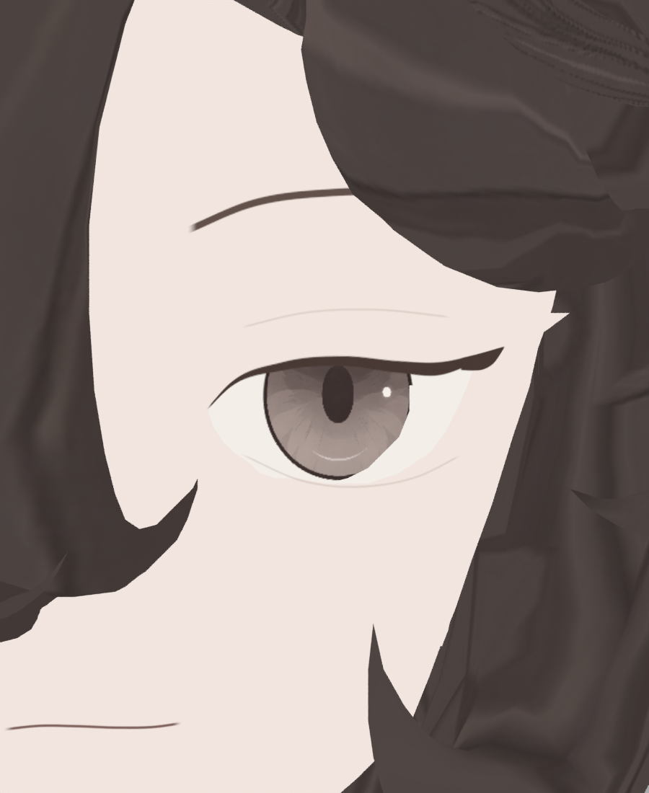
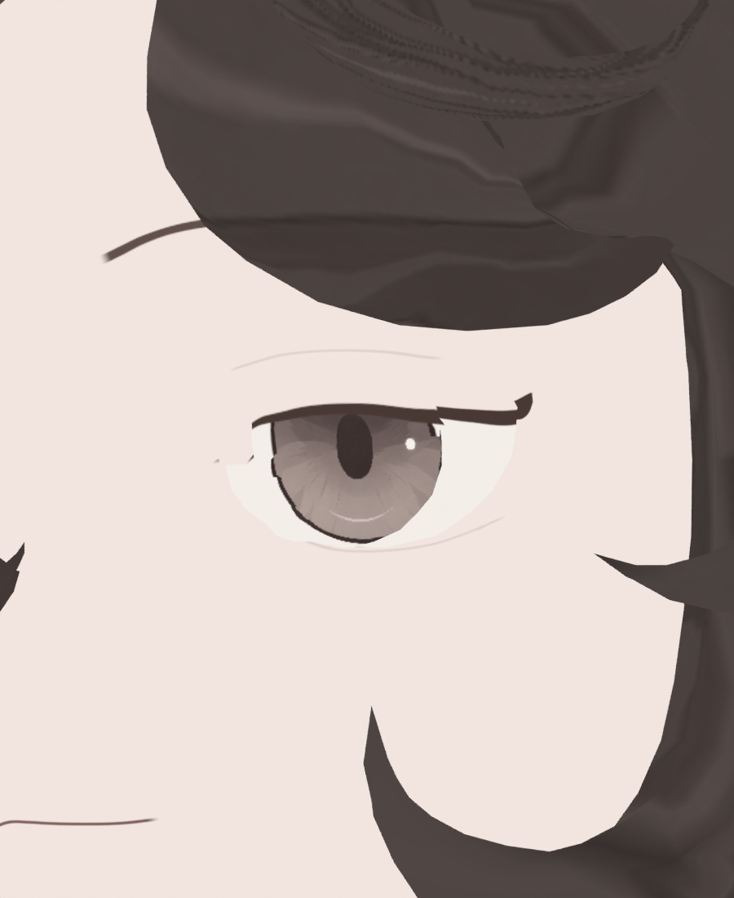
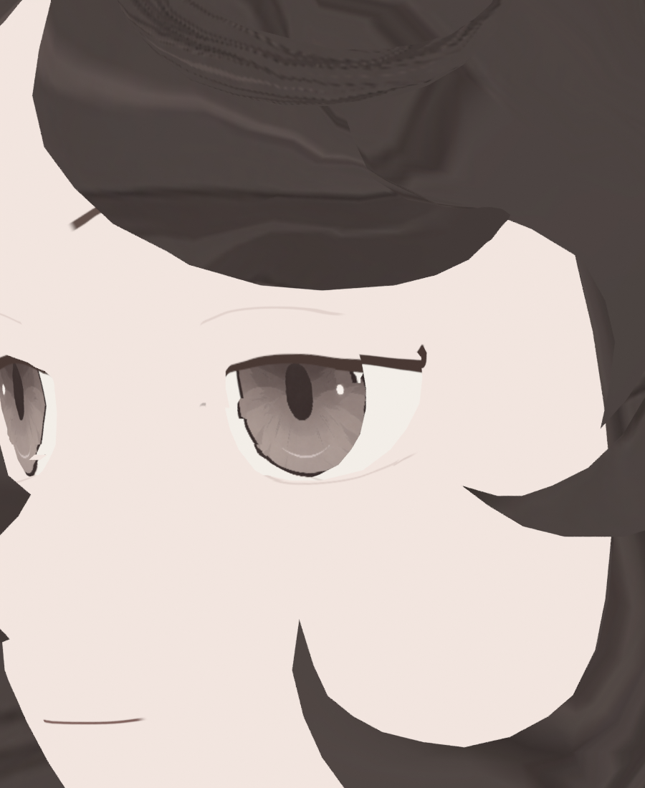

> **기록 시점 안내:** 아래는 해당 단계 당시의 보고서입니다. 후속 결정은 [최신 상태](../../../../STATUS.md)를 기준으로 읽어주세요. 모델·원본 텍스처·검증 원시 데이터는 이 문서 공유본에 포함하지 않습니다.

# v353 V5 눈 근접 검토 및 깊이 후보

> 용어 정정: C89/90/91/92/94/96은 원래 eye_detail 부품이며 순수 하이라이트 전용 기능은 확인되지 않았다. 아래 전면 눈 세부 조각이라는 표현은 해당 원래 부품을 뜻한다.
V5 정면의 사람형 타원 동공·얇은 애니메이션 눈매는 유지된다. 그러나 **35°/55°의 윗눈꺼풀 단차·눈꼬리 돌출과 내안각 절단이 남아 눈 최종 합격은 아니다.** 기존의 낮은 배율 사진에서 작아 보인 문제가 새 근접 촬영에서 분명히 드러났다.

| 정면 | 35° | 55° |
|---|---|---|
|  |  |  |

35°에서는 검정 윗선이 원판 끝에서 계단처럼 끊기며 바깥 끝이 위로 솟는다. 내안각의 피부 벽도 직각 경계처럼 보인다. 55°에서도 반복된다. 머리의 거친 선은 별도 미해결이며 이 보고에서 합격으로 판단하지 않는다.

-35°/-55°는 대부분 앞머리에 가려 실제 반대눈을 충분히 검증하지 못했다. JSON의 눈 관련 키·본 목록도 비어 있다. 이 결과는 중립 눈의 세 방향 근접 검토이고 눈깜박임·시선·얼굴 트래킹 지원 검증이 아니다.

## 색으로만 해결되지 않는 실제 구조

현재 CDE 좌표와 기존 면 자료를 대응하고 실제 촬영 카메라의 광선을 추적했다. **카메라 수치 정정:** 900×1100 세로 사진의 AUTO orthographic 픽셀 간격을 처음 .075/900으로 잘못 계산했으며, .075/1100으로 재계산했다. 아래 정확 픽셀/면 설명은 정정값이다. 실제 사진·기하/UV/키 보존 검사와 깊이 후보 변위 계산은 이 픽셀 간격과 독립적이다. `v353_V5_CLOSE_WALL_RAYS.json`이 원시 결과다.

35° (540,515)은 C92 전면 눈 세부 조각의 Y 약 −29.57mm를 보지만 (550,515)은 뒤 C79 면2417의 Y 약 −23.72mm를 본다. 별도 y505 표본에서도 (530,505)의 앞 C86 면12614 Y−29.40mm에서 (540,505)의 C79 면2417 Y−24.35mm로 바뀐다. 앞 원판의 끝에서 실제 표시 표면이 수mm 뒤로 바뀐다. 같은 XZ 방식으로 선을 그려도 사선에서는 서로 다른 X를 읽어 연결선이 어긋난다. 앞 C79 내안각 벽12388/12404와 안쪽 원판/흰자 사이에도 깊이 차가 있다. UV 패딩이나 단순 블러만의 문제로 볼 수 없다.

기존 C85/86 원판과 6개 전면 눈 세부 조각(C89/90/91/92/94/96)의 199개 좌표 대표점 모두, 같은 XZ의 실제 C79 cavity42면으로 투영된다. 전면 여유0.15mm를 남기도록 계산한 완전 정합 Y 이동은 원판2.31–6.75mm, 전면 눈 세부 조각 최대7.73mm다. 완전 정합을 바로 채택하면 깊이 인상이 바뀔 수 있어 **25%/50% 두 사본만 비교**한다.

| 후보 | 좌표 대표점 | 실제 영향 삼각형 | 최대 이동 | 면적비 최소–최대 | 뒤집힘 |
|---|---:|---:|---:|---:|---:|
| DEPTH25 | 199 | 243 | 1.933mm | .750–1.045 | 0 |
| DEPTH50 | 199 | 243 | 3.866mm | .500–1.113 | 0 |

이는 기존 실제 좌표를 사용한 **수치 사전검사**다. 아직 Blender 후보 실행/렌더 결과가 아니다. 실제 raw 수는 GUI의 원래 polygon→vertex 대응으로 다시 확정하며 겹친 동일좌표 분리점도 같은 변위를 적용한다. XZ·UV를 고정하고 Y만 움직여 정면 투영을 보호하지만 사선 인상·외벽과의 가림·동적 명암은 실제 사진으로 판단해야 한다.

`gui_eye_depth_trials.py`는 부모 Computer Use 실행용이다. 현재 CDE baseline과 정확히 맞는지 확인한 뒤 기존 mesh 사본2개에서 동일 delta를 모든 key에 적용하고 UV·XZ·면적·상대키 검사를 수행한다. 새 topology/새 눈 부품/전체얼굴 재설계는 없다. 각각 별도 blend·0/35/55 사진·정점별 JSON을 `depth_trials/`에 남긴 뒤 현재 원본 mesh와 카메라를 복원한다. 원래 생산 blend를 덮어쓰지 않는다. 후보는 제작 후 직접 검토할 때까지 미채택이다.
