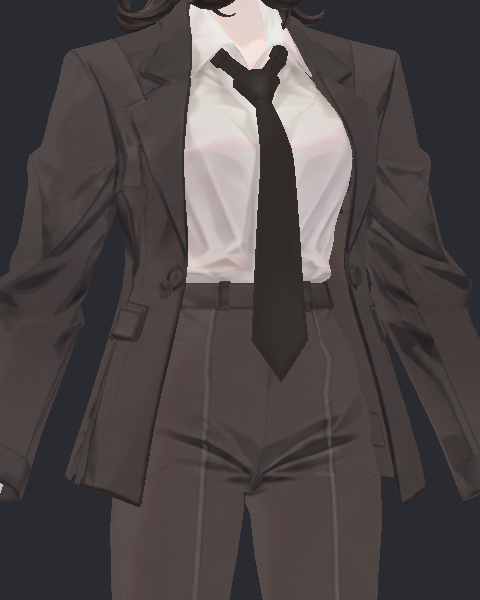
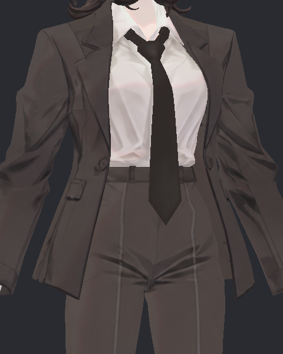
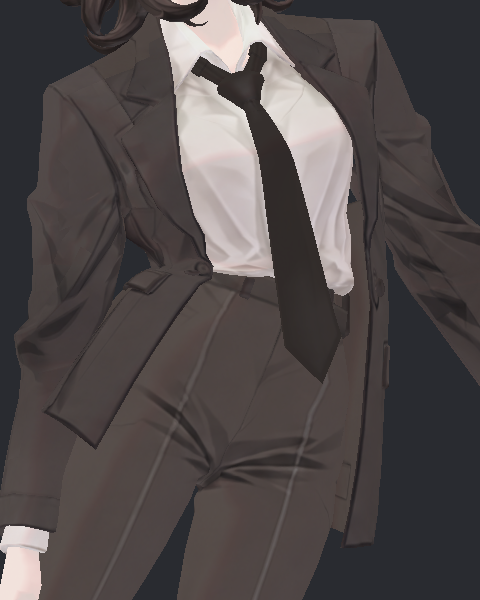
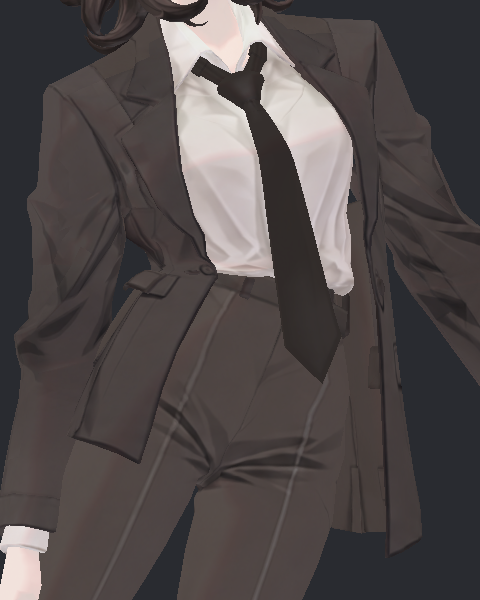
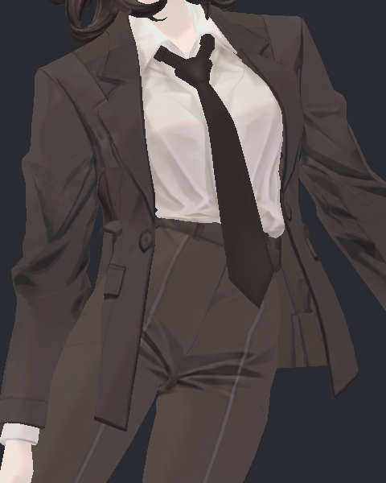
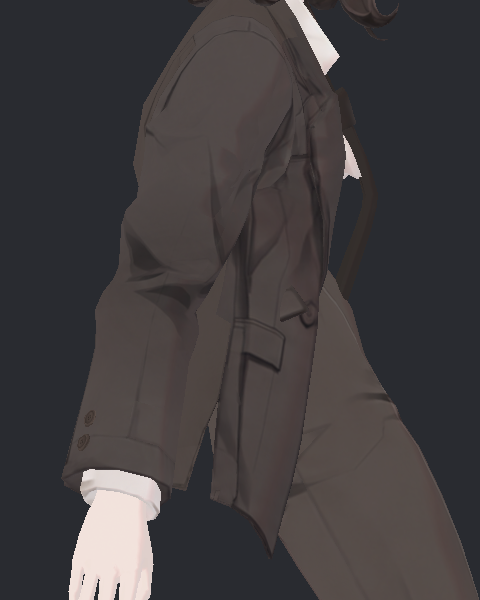
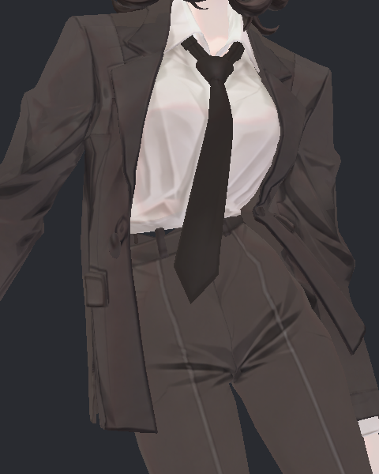
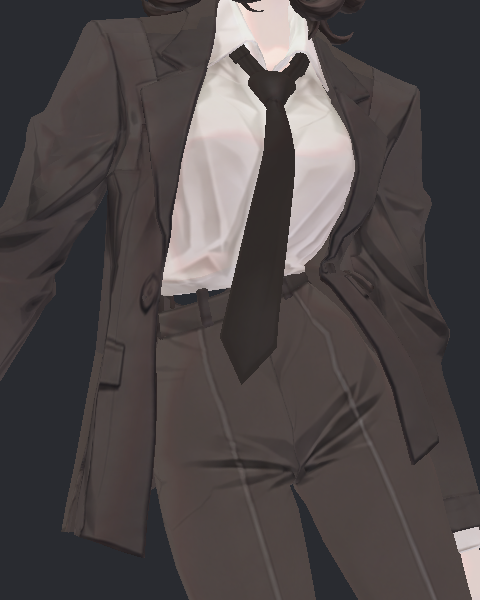

> **기록 시점 안내:** 아래는 해당 단계 당시의 보고서입니다. 후속 결정은 [최신 상태](../../../../STATUS.md)를 기준으로 읽어주세요. 모델·원본 텍스처·검증 원시 데이터는 이 문서 공유본에 포함하지 않습니다.

# v353 원래 몸판 지지와 충돌 반경 분리 — 실제 SDK 검토

**추가 자기교차 검사 후 판정: F16B12도 최종 채택 보류.** 바지 접촉과 하방 정렬은 개선됐지만 아래 추가 검사에서 소매·몸판 사이 및 몸판 내부의 새로운 교차 쌍이 확인됐다. 원래 접촉이 이동한 부분과 새 노출을 분리하는 후속 검토가 필요하다.

이번 네 후보 중 **ORIGINAL_SUPPORT_F16B12**는 바지 접촉과 드레이프를 비교할 후속 기준으로 남긴다. 원래 몸판 웨이트와 본 지지점을 유지하고, 기존 자락 체인에 중력과 실제 바지 표면을 고려한 충돌 범위를 적용했다. 새 코트 몸판–바지 교차 없이 자락의 하방 정렬이 개선됐다. 상부 허리 접힘까지 해결한 결과나 최종 채택 판정은 아니다.

## 실제 시험 범위

`physics_trials/gravity_refined/DONE.json`: BASE / 원래 지지 16·12mm / 원래 지지 20·16mm / 높은 가슴 지지 16·12mm / 높은 가슴 지지 20·16mm / BASERepeat, 6개 모두 성공. 각 1,800 SDK 프레임, 좌·우 기울임과 원래 v348 case176 자세를 각 4초 유지한 뒤 복귀했다. `LeanForward`라는 내부 이름의 case176은 사진에서 몸을 뒤로 젖힌 자세이므로 일상적인 앞으로 숙이기 검증으로 확대하지 않는다. 후보마다 실제 스킨 66개를 검사했다. 사진은 실제 실행 중 동일 카메라 캡처이며 캐시 재렌더가 아니다.

충돌은 비공면 교차선 0.05mm 이상을 계산했다. 숨은 면을 포함하고 공면·스윕·모든 자기교차를 완전히 판정하지 않는다. 원래 코트 렌더러에 포함된 소매가 바지와 겹치는 입력은 몸판과 분리했다. 몸판 범위는 원래 forearm/upperarm/cuff/hand 영향이 50%를 넘는 점이 있는 삼각형을 제외한 범위다.

## 수치 결과

| 후보 | 새 몸판–바지 접촉 표본 /66 | 몸판 최대 쌍 | 원래 소매·경계 최대 쌍 | 넥타이–셔츠 / 코트 |
|---|---:|---:|---:|---:|
| BASE / Repeat | 0 | 0 | 63 | 0 / 0 |
| 원래 지지 F16B12 | 0 | 0 | 63 | 0 / 0 |
| 원래 지지 F20B16 | 0 | 0 | 63 | 0 / 0 |
| 가슴 지지 F16B12 | 32 | 127 | 63 | 0 / 0 |
| 가슴 지지 F20B16 | 20 | 123 | 63 | 0 / 0 |

원래 지지 두 후보의 코트–바지 교차 쌍은 66개 모든 표본에서 BASE와 동일했다. 단순 최대값 일치만 확인한 것이 아니다. 가슴 지지 후보는 반경을 키워도 상부 몸판의 과도한 물리 분담에서 비롯된 변형과 접촉을 해결하지 못했다.

| 앞 왼쪽 체인 root→tip 하방 각도 | 왼 기울임 | 오른 기울임 | case176 |
|---|---:|---:|---:|
| BASE | 26.01° | 17.40° | 32.69° |
| 원래 지지 F16B12 | 20.71° | 7.61° | 20.15° |
| 원래 지지 F20B16 | 22.66° | 7.61° | 21.10° |
| 가슴 지지 F16B12 | 7.06° | 6.74° | 13.96° |
| 가슴 지지 F20B16 | 8.09° | 8.09° | 14.86° |

각도가 작을수록 그 체인은 세계 하방에 가깝다. 이 수치는 옷 전체의 드레이프·부피 점수가 아니다. 원래 지지 F16B12의 뒤 왼쪽 체인 case176도 20.73→7.82°로 개선됐다. 마지막 유지 구간의 끝점 움직임과 복귀 차이는 네 후보 모두 0.001mm 미만이다. 진동이 멈췄다고 접촉이 해결되는 것은 아니므로 별도 표면 검사를 사용했다.

## 직접 확인한 사진

총 14장 직접 열어 검토했다. 아래는 그중 동일 조건의 핵심 비교다.

### 중립: 원래 앞판의 형태를 유지하는지

| 원래 | 원래 지지 F16B12 | 원래 지지 F20B16 |
|---|---|---|
|  |  |  |

F16은 하단 변화가 작고, F20은 앞판이 조금 더 벌어진다. F20에서 접촉 개선이 추가되지 않았으므로 더 큰 반경을 선택할 근거가 없다. 원래 파일의 정점 좌표가 같아도 중립의 실제 물리 스킨은 달라진다. 최대 변위는 F16 11.24mm, F20 13.47mm다.

### 오른쪽 기울임: 몸판과 자락의 연결

| 원래 | 원래 지지 F16B12 | 가슴 지지 F20B16 |
|---|---|---|
|  |  |  |

원래 지지 F16은 자락이 아래로 향하면서 원래 허리 위 몸판의 지지가 유지된다. 가슴 지지는 앞판을 길게 당기고 허리 전이부에 강한 변형을 만든다. 원래 지지에도 기존 옆구리 접힘은 남아 있다.

### case176 측면: 실제 중력 효과

| 원래 | 원래 지지 F16B12 | 가슴 지지 F20B16 |
|---|---|---|
|  |  |  |

F16의 앞자락은 허벅지와 같은 방향으로 들린 원래 상태에서 아래로 내려온다. 허리와 주머니 위의 원래 지지 전이는 남는다. 가슴 지지는 더 수직이지만 그 한 지표로 채택하면 새 몸판 접촉과 당김을 놓친다.

### 반대쪽 기울임

| 원래 | 원래 지지 F16B12 |
|---|---|
|  |  |

좌우 모두 기존 단추·주머니·옷 선은 보존된다. 본 시험은 물리 비교이며 셰이더·텍스처 재제작 후보의 미관 점수를 판단한 자료가 아니다.

## 원인과 선택 이유

초기 G1은 중력을 강화해 체인을 아래로 돌렸지만, 본 중심과 실제 옷 표면 간격을 충돌 반경이 충분히 대표하지 못해 바지 접촉이 생겼다. 원래 몸판을 높은 새 지지점으로 80% 분담한 구조는 상부 고정 부분과 새 회전 부분 사이의 연속면을 과도하게 움직였다. 실제 UV 분리점의 벌어짐과 구분해야 한다.

이번 원래 지지 F16B12는 기존 구조를 유지한 상태에서 바지 표면 주변 세 개 국소 캡슐과 앞 16mm·뒤 12mm PhysBone 반경을 적용했다. 따라서 중력만 키운 G1에서 생긴 몸판 교차를 해소하면서 원래 상부 지지의 장점을 유지했다. PhysBone은 본 체인의 충돌 대리체이고 메시 전체의 천 시뮬레이션이 아니다. [VRChat PhysBones 공식 문서](https://creators.vrchat.com/common-components/physbones/)

원래 지지 두 후보는 SOURCE 정점 좌표·삼각형·본 순서·웨이트가 BASE와 정확히 같다. 최대 동작 스킨 변화는 F16 58.45mm, F20 59.17mm이며 의도한 자락 이동을 포함한다. BASE와 Repeat도 일부 과도 구간에서 코트 최대 1.08mm, BodyHair 최대 1.20mm 차이가 있다. 독립 순차 SDK 실행 차이를 후보의 미세 효과로 단정하지 않았다. 접촉 쌍 및 안정 후 비교를 우선했다.

## 후속 관문

F16B12를 다음 7단계 이동·회전·Wind 입력과 실제 관절 복합 자세의 기준 후보로 넘긴다. 새 상부 몸판 지지 실험은 F16을 안전 비교 기준으로 사용한다. 코트 자기교차와 소매–몸판 접촉, 넥타이 통합 후보의 Bend90 숨은 접촉은 별도 검사 대상이다. VRChat PC 클라이언트 실사용과 iPhone 얼굴 추적은 이 SDK 편집기 시험에 포함되지 않는다.

검증 원자료: 접촉 (공유본 미포함: `GRAVITY_REFINED_TIE_COAT_CONTACTS.json`), 몸판/소매 분리 (공유본 미포함: `COAT_BODY_VS_SLEEVE_CONTACT_SCOPE.json`), 동작과 복귀 (공유본 미포함: `GRAVITY_REFINED_MOTION_ANALYSIS.json`), 원형 및 실제 스킨 차이 (공유본 미포함: `GRAVITY_REFINED_PRESERVATION.json`). 코트 후보 적용 도우미: MacV353CoatBodyColliders.cs (공유본 미포함: `MacV353CoatBodyColliders.cs`).

## 추가 검수: 코트 내부 및 소매와의 교차

위 바지 접촉 결과를 확인한 뒤 BASE / BASERepeat / F16B12의 실제66스킨씩 코트 전체 자기교차를 추가했다. 정확히 같은 원래 위치의 공유 정점을 제외하고, 비공면 교차선0.05mm 이상을 검사했다.

| 범위 | BASERepeat 최대 쌍 | F16 최대 쌍 | F16 새 유일 쌍 / 해당 표본 | 새 교차선 최대 |
|---|---:|---:|---:|---:|
| 비팔 영역–팔/경계 영역 | 126 | 118 | 378 / 24 | 15.70mm |
| 비팔 영역–비팔 영역 | 68 | 68 | 12 / 22 | 5.72mm |
| 팔/경계 영역 내부 | 5 | 5 | 1 / 1 | 0.42mm |

분류는 실제해부학 면명 대신 원래 본 웨이트 기준이므로 `body_arm`에는 소매와 몸판의 전이 경계도 포함된다. 유일 쌍은 고유 삼각형 조합 수이며 물리적 접촉 부위 수가 아니다. 교차선 길이는 관통 깊이가 아니다. 기존에도 많은 접촉이 있고 최대 쌍 수는 증가하지 않았지만, **새 쌍이 있는 사실은 유지**한다. BASE 대 Repeat 자체 새 쌍 누적은 body_arm24/body_body3으로 F16누적1704/50보다 훨씬 작다.

대표 새 쌍은 LeanRight60의 실제삼각형569/633, LeanForward330의2229/2231이다. F16을 전체 접촉 합격으로 채택하지 않고 이 위치의 시각 노출과 원래 연결 주름을 추가 검토한다. 원자료: GRAVITY_REFINED_COAT_SELF.json (공유본 미포함: `GRAVITY_REFINED_COAT_SELF.json`).

## 겨드랑이의 작은 자락 본 영향 분리 실험 — 오프라인 미채택

F16의 새 상부 접촉 원인을 조사하려고 rest높이0.685m 이상, 기존coat PB합계0.20 이하,spine영향0.25 초과인79Unity점(41원래raw)의 작은coat영향을 이미 연결된spine으로 옮겨 보았다. 기존 좌표·UV·본을 바꾸지 않고 같은 실제SDK 본행렬로 계산한 **오프라인 예측**이다.

3자세의60·120·299 및복귀599, 총12표본에서 실제원래 스킨을 최대0.000603mm오차로 재구성해 입력의 정합성을 확인했다. 예측결과는 좌기울임 새8쌍(교차선최대6.28mm), 우기울임 새4쌍, case176 새5쌍으로 악화됐다. 작은 본 영향이라도 상부 연결을 유지하는 역할이 있으므로 일괄 제거를 채택하지 않는다. 최대예측점변화는9.79mm였다.

원래최악복귀330은 해당시점humanoid행렬을 정확히 재구성할 자료가 없어 근사값으로 시험하지 않았다. 새로운nativeSDK시험/프리팹/Blender수정은 없다. 상세 계산과 대상 (공유본 미포함: `COAT_UPPER_TRANSFER_DIAGNOSIS.json`), 재현 스크립트 (공유본 미포함: `analyze_coat_upper_transfer.py`).
