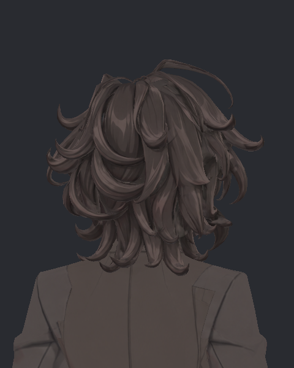

> **기록 시점 안내:** 아래는 해당 단계 당시의 보고서입니다. 후속 결정은 [최신 상태](../../../../STATUS.md)를 기준으로 읽어주세요. 모델·원본 텍스처·검증 원시 데이터는 이 문서 공유본에 포함하지 않습니다.

# v353 헤어 인접 콜라이더 실제 결과와 동작 경로 수정

**Neighbor1 / Neighbor3 모두 미채택.** 기존 알려진 가닥–코트 교차는 제거하지만, Wind150·180에 생긴 옆면 접촉은 그대로다. 콜라이더를 더 추가하는 것만으로 이 문제가 해결되지 않았다.

## 실제 실행 결과

`hair_neighbors/DONE.json`의 BASE / Neighbor1 / Neighbor3 / BASERepeat 4개 모두 성공. 각4,800프레임, 동일7단계 입력의167개 실제SDK 스킨을 검사했다. 모든 기록의 위치가 유한하고, 새 proxy의 복귀 잔차는0.000012mm 이하로 안정됐다. Wind는 기존 BiancaWind 입력 시험이며 VRChat 환경 바람 실사용 검증이 아니다.

후보와 BASERepeat를 비교하면 선택된16개Unity점 밖의 BodyHair 정점과 코트 전체는167표본에서 **정확히 동일**하다. 따라서 새 접촉을 다른 본 시뮬레이션의 차이로 설명할 수 없다.

| 동일 BASERepeat 대비 | Neighbor1 | Neighbor3 |
|---|---:|---:|
| 기존 알려진15703:3296 접촉 표본 | 0 /167 | 0 /167 |
| 새 접촉이 생긴 표본 | 3 | 3 |
| 새 삼각형 쌍의 표본 누적 | 20 | 20 |
| 새 교차선 최대 | 2.9785mm | 2.9785mm |
| 제거된 쌍의 표본 누적 | 1650 | 1650 |

삼각형 쌍 수는 실제 접촉 부위 수와 다르고 교차선 길이는 관통 깊이가 아니다. 숨은 면을 포함한 비공면0.05mm 기준이며 연속 스윕·공면·알파/컬링 전체 검증은 아니다.

Wind150의 coat3304 관련5새쌍(최대2.9785mm), Wind180의 같은5쌍(최대2.6864mm)은 이전 SURFACE40과 유지됐다. HeadNod90은 기존8새쌍에서10새쌍으로 위치가 바뀌었다. Neighbor3의 대표15983:3241은1.1943mm다. 전체최대쌍수도 원래93에서99로 늘었다.

## 실제 외형 확인

아래3장을 직접 열어 헤어 전체 부피·큰 윤곽을 확인했다. 새 접촉은 이 전신 후두부 사진에서 충분히 구분되지 않으므로 이 사진으로 국소 합격 판정을 하지 않는다. 실제17269삼각형 중심을 사용하는 별도24장 근접재생 도우미를 부모 작업에 전달했다.

| 원래 | Neighbor1 | Neighbor3 |
|---|---|---|
|  |  |  |

## 근본 원인과 다음 제한된 후보

HeadNod에서 새 proxy 끝점 진폭은 약6.1→5.44mm로 변해 콜라이더의 실제 영향이 확인됐다. 반면 Wind 동안 proxy는 head 기준0.00001mm 수준으로 정지한 채 원래 hair00 영향으로 해당 표면이 움직인다. 한 표면에 **별도 Wind 경로와 충돌제어 경로가 섞여 있는 구조**가 남았다.

다음 `P01_UNIFIED_GUIDE35 / 65`는 기존proxy 앞에 비스키닝guide 하나를 두고 head와 원래 animated hair_wind_00를 섞어 추종한다. 선택16점의 기존hair00 영향은 기존patch감쇠에 맞춰 proxy로 옮겨 같은 충돌제어 뒤에 표면 움직임이 나오도록 한다. 최고점은 대략proxy61%/head39%이며 단일본100% 고정으로 움직임을 없애는 방식이 아니다. guide35% Wind는 원래21% ÷ 새로운61%≈.34로 기존 진폭을 1차 근사하려는 후보값이고,65%는 운동량 비교용이다. 실제 진폭·접촉·실루엣 결과로 판단해야 한다.

새메시 기하를 생성하지 않고 원래 정점 좌표·노멀·UV·삼각형·키·bindpose를 보존한다. 도우미는 재로드 후guide부모,head/wind제약source참조/weight,PBroot,skinbone참조,내부collider참조와restworld위치/회전을 검증한다. SDK 도구에서 VRCParentConstraint source와offset을 설정하는 공식API를 사용하며 사용자 런타임스크립트를 추가하지 않는다. [VRChat Constraints API](https://creators.vrchat.com/common-components/constraints/constraints-api/)

현재 이 두안은 **도우미 구현 완료·실제SDK 미검증**이다. 원래 가닥 전체나 다른 캐릭터 부위에 자동 적용하지 않는다.

원자료: 동일반복 비교 (공유본 미포함: `HAIR_NEIGHBORS_MATCHED_REPEAT.json`), 전체444면 교차 (공유본 미포함: `HAIR_NEIGHBORS_HAIR_CONTACT_BATCH.json`), 동작과 복귀 (공유본 미포함: `HAIR_NEIGHBORS_SECONDARY_MOTION.json`). 구현 도우미 (공유본 미포함: `MacV353HairUnifiedGuide.cs`), 근접 재현 도우미 (공유본 미포함: `MacV353HairNeighborsCloseReplay.cs`).
