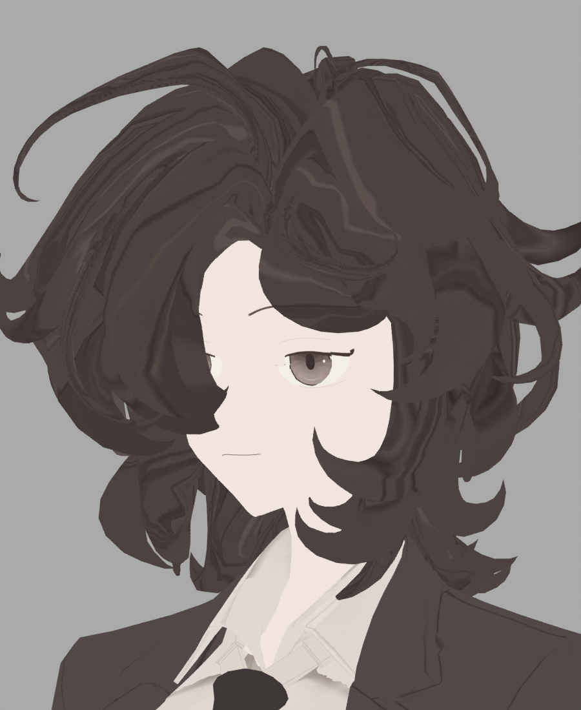
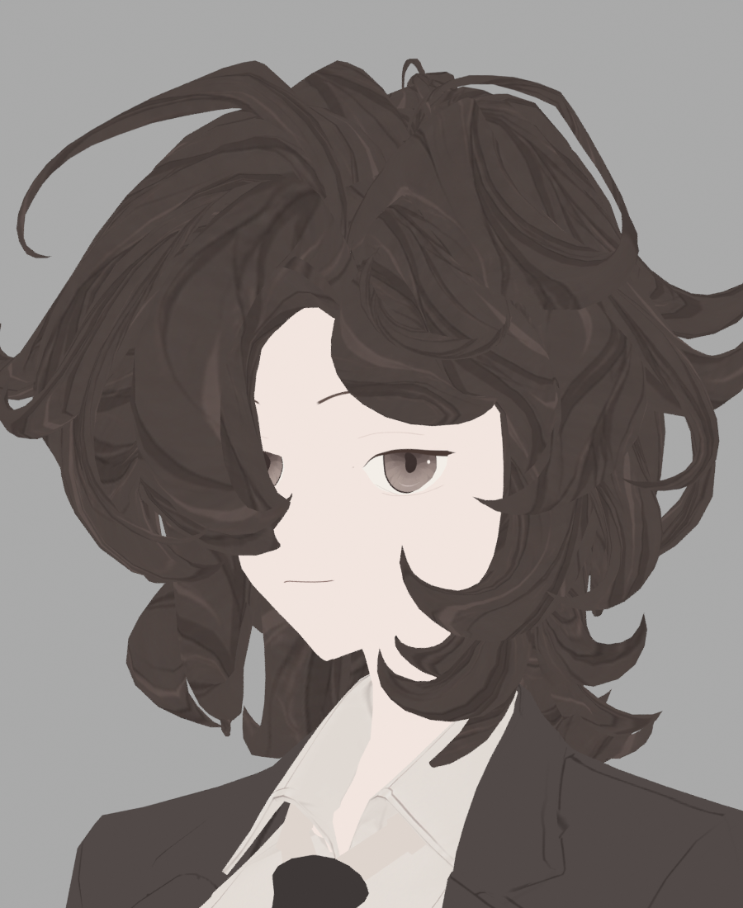

> **기록 시점 안내:** 아래는 해당 단계 당시의 보고서입니다. 후속 결정은 [최신 상태](../../../../../STATUS.md)를 기준으로 읽어주세요. 모델·원본 텍스처·검증 원시 데이터는 이 문서 공유본에 포함하지 않습니다.

# v353 지정 가닥 방향 비교의 첫 시각 검토

**기존 유효 UV에 지정 root/tip 방향을 적용한 후보는 V6 HARD_PATH보다 명확히 개선됐다. 아직 최종 채택이나 전부 해결 판정은 아니다.** 새 헤어 원화로 만든 실제 무조명 앞/뒤 렌더를 직접 열어 비교했다. 원래 UV/기하는 보존한 후보이며 이전 텍스처 픽셀을 복구한 작업은 아니다.

V6에서 정수리 앞쪽 큰 판상 민무늬와 가닥을 가로지르는 등고선이 눈에 띄었는데 새 후보에서는 길이 방향의 선이 더 읽힌다. 윗부분의 긴 얇은 가닥에 있던 점무늬도 줄었다. 다만 좌표 방향과 bake samples1→16을 함께 바꿨으므로 모든 선 품질 개선을16sample 효과라고 단정하지 않는다. 사진의 다른 부위(눈/셔츠)는 부모의 별도 작업이 포함될 수 있어 이 비교 판정은 헤어에 한정한다.

잔여는 뒤통수 아래쪽 중앙과 오른쪽 굵은 가닥이다. 넓은 밝은 선이 면 경계에서 각지거나 컬의 되돌아오는 부분을 비스듬히 가른다. 일부 닫힌 끝의 기존 UV는 fan 모양이므로 전체 가닥의 방향만 회전해도 끝의 흐름까지 자동으로 맞지는 않는다. 전체 평활화로 이런 선을 지우지 말고, 유효한 면 좌표를 유지하면서 끝의 흐름과 해당 원화 배치를 비교해야 한다.

후속 native 시험에서도 면 뒤집힘/붕괴 gate를 유지한다. DEFINED_SLIM31개 뒤집힌 면은 모두 pin 인접이며 실제 UV 성분 안의 Jacobian 반대여서 gate 오판이 아니었다. 무pin native 후 전체 방향 정렬과, 새 unwrap 없이 기존 UV만 Minimize Stretch하는 후보를 준비했다. 새로운 native 후보가 유효해도 이 사진보다 실제 가닥 방향·디테일이 좋아야 채택할 수 있다.

## 무pin SLIM 실제 사진 추가 독립 검토

검토자가 `images/v353_HAIR_SLIM_UNLIT_head.png`와 `images/v353_HAIR_SLIM_UNLIT_head_back.png`를 직접 열어 확인했다. 앞머리 큰 컬 내부에 두꺼운 선이 모발 길이 방향과 분리되어 돌아가며, 뒤쪽 큰가닥에는 끝을 가로막는 횡방향 띠·불규칙한 직선/삼각 경계가 반복된다. 기존 유효UV 방향정렬 비교본보다 선 흐름이 낫다고 판단할 수 없다. native collapse0/mixed0 및 작은 각왜곡 수치에도 **시각적 미채택**에 동의한다.

검토 범위는 머리의 새 채색 좌표다. 같은 이미지의 눈·의상 변경은 이 두 헤어 후보 사이의 UV 효과 판단 근거로 사용하지 않는다. 다음 Tutte는 아직 실제 사진 판정 전이다.

## 같은 유효UV + 신규 가닥원화V2 비교

`v353_HAIR_DEFINED_V2_0.png`, `_35.png`, `_180.png` 세 사진을 직접 확인하고 이전EXISTINGUV_DEFINED의35°/뒤사진도 다시 열어 비교했다. Tutte의 심한 닫힌등고선과 비교하면 원래유효UV 방향정렬이 더 안정적이다. 신규V2원화는 일부 좁은가닥의 선이 덜 꺾이게 보이지만, 전체를 깔끔한 일러스트 머리로 완성했다고 판단할 수준은 아니다.

구체적인 잔여는35° 앞 큰가닥 내부의 넓은 사선/갈색 덩어리, 이마위 돌아가는컬 안쪽의 반복된각진띠, 뒤 중간오른쪽 큰가닥의 사선밝은대와 아래끝의 삼각선이다. 외형 컬과 채색선의 방향이 항상 같은흐름으로 읽히지 않는다. 좁은영역을반복하는좌표·원화위상·가닥별실제곡률 정합은 계속 검토대상이다. 이사진만으로 새 기하·새 UV뒤집힘으로 분류하지 않는다.

새바지는 내부접힘선이 명확히 남고 외곽오염은 줄었다. 반면머리는 복잡한띠와큰색덩어리가여전히 눈에띄어, 같은 캐릭터 안에서 선의밀도·정돈수준이균일하지않다. 바지수정합격을머리완성으로확장하지 않는다. 현재눈/코트후속은별도실행중이므로 이검토에서그최신후보의합격을판정하지않는다.
