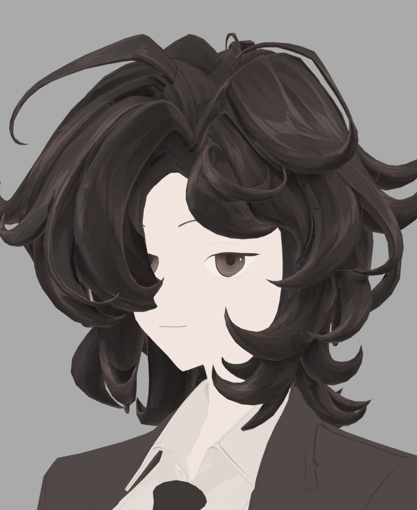
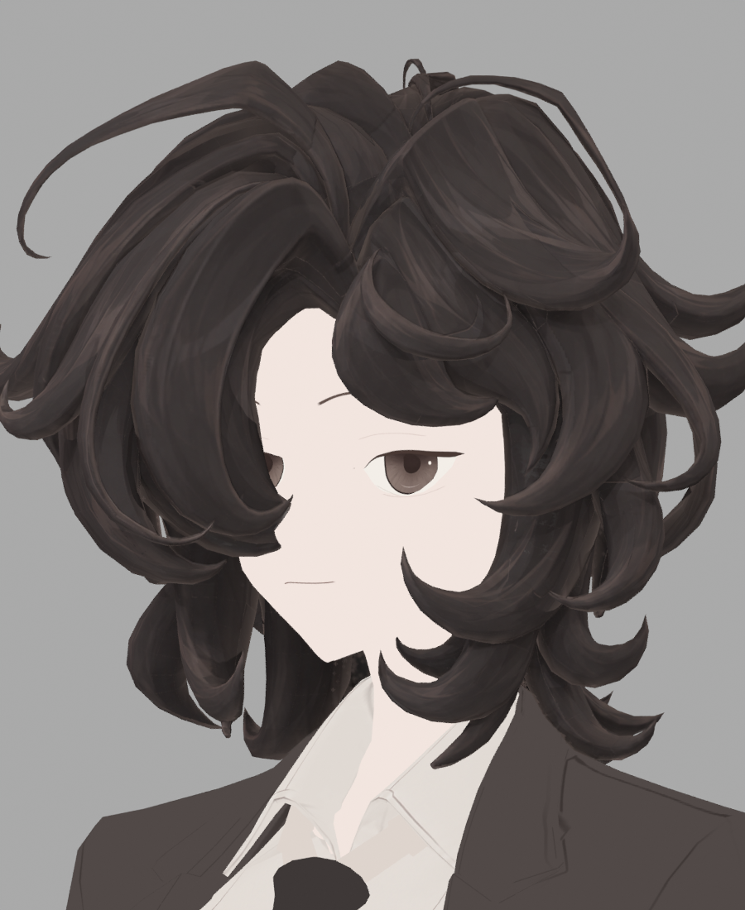
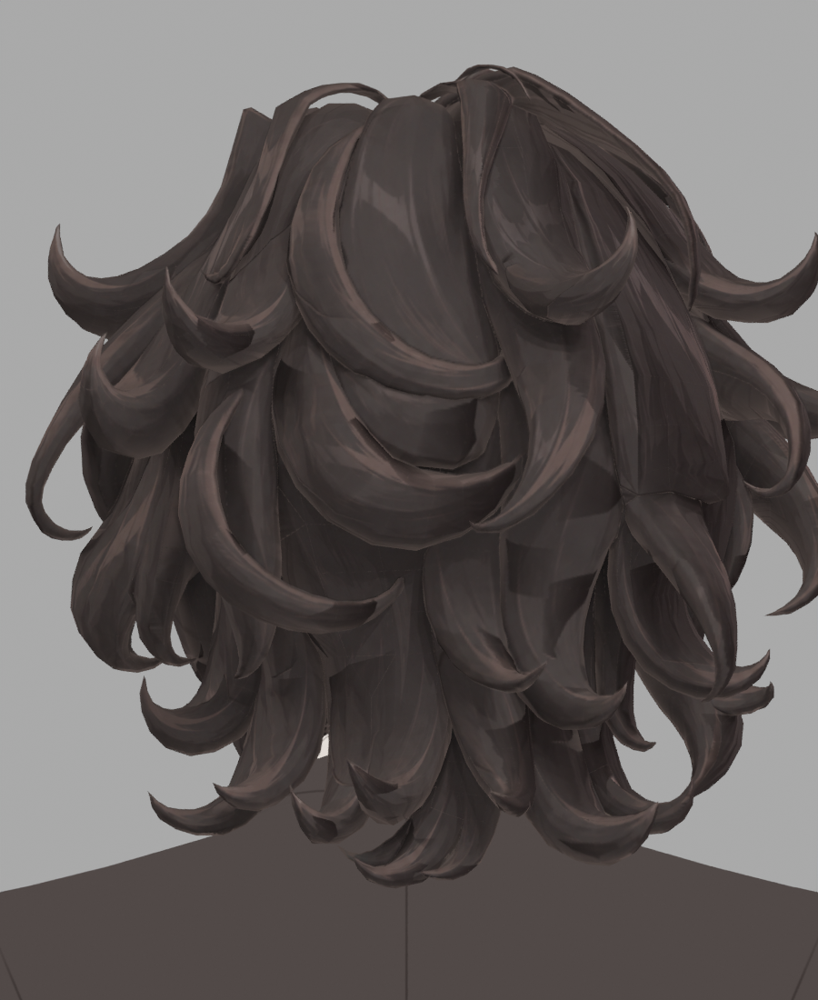
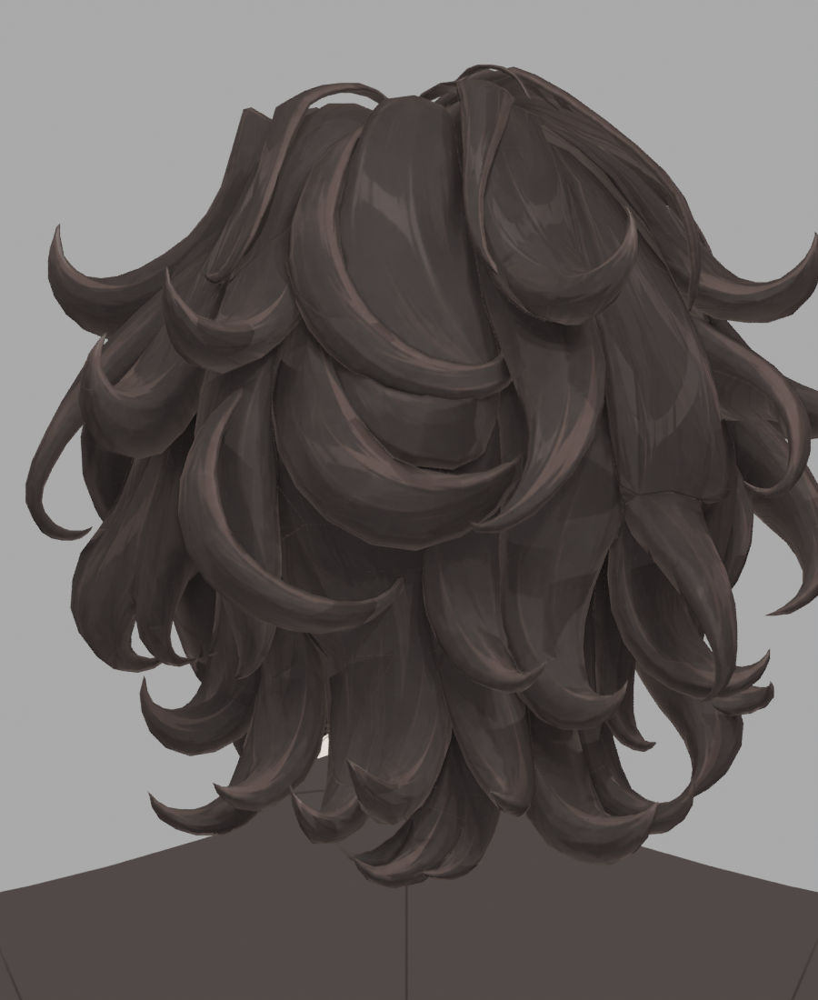

> **기록 시점 안내:** 아래는 해당 단계 당시의 보고서입니다. 후속 결정은 [최신 상태](../../../../../STATUS.md)를 기준으로 읽어주세요. 모델·원본 텍스처·검증 원시 데이터는 이 문서 공유본에 포함하지 않습니다.

# v353 헤어 다중 시점 전사 후속 검수

이 기록은 최종 채택이 아니다. 사용자의 2D 애니메이션/게임/일러스트 스타일과 기존 가닥 형태·실루엣을 기준으로, 새 v353 원화만 사용했다. Blender 작업은 Computer Use로 실제 GUI에서 실행했다.

| 후보 | 변경 | 직접 확인 | 판정 |
|---|---|---|---|
| V8 | 새 ±90도 원화까지 5시점 추가 | 0/35/±90 실제 모델 | 볼 옆 가닥에 회색 원화 가이드가 혼입되어 미채택 |
| V9 | 원화의 갈색 채색 영역과 실제 첫 가시 면/깊이를 함께 검사 | 실제 모델 8방향 | 회색 혼입 제거. 가닥을 가로지르는 띠와 삼각형 색 경계 잔여 |
| V10 | 삼각형별 상수 가중 대신 기존 코너 노멀을 보간한 투영 가중 | Blender 8방향 전부, Unity 48장 연락판 전체와 주요 원본 4장 확인 | 측면 개선 여지는 있으나 후두부·앞머리의 색 경계 잔여. 미채택 |
| V11 | 순서대로 덮는 대신 5시점 가중 합을 정규화, 최대 가중으로 새 기본 아틀라스와 합성 | Blender 0/35/−35/180 모두 확인 | 일부 경계는 완화되나 충분하지 않음. 가닥 선 겹침·뒤쪽 띠 잔여. 미채택 |

V11은 블러를 적용하지 않는다. 다만 서로 조금 다른 선이 겹치면 평균 합성 자체가 선명도를 낮출 수 있으므로, 숫자 합격으로 최종 선택하지 않았다. 원화 자체에도 NPR 하이라이트 띠가 있으며, 이를 투영 경계나 비정상 삼각 패치와 구분해야 한다. 광원과 무관한 큰 방향성 그림자를 추가하는 방향으로 합치지 않는다.

V10 정면 35도:

V11 같은 35도:

V10 후두부:

V11 같은 후두부:

투영되지 않은 픽셀은 새 기본 아틀라스와 정확히 같아야 한다. V9/V10/V11에서 원본 메시·UV·바인딩을 복원했고 새/대체 메시를 아바타에 추가하지 않았다. 원화 전사용 임시 정확 복사본은 실행 후 제거했다. 원래 초기 텍스처의 픽셀은 사용하지 않았다.

현재 Blender의 실제 원본 바인딩은 hair_defined_v2로 유지한다. V9 통합 표면 프리팹은 검수 사본이며, V10/V11도 자동 채택하지 않는다. 실제 Unity의 단추·눈·정수리·셔츠 노멀 통합 확인과 헤어 채색의 미관 판정은 구분한다.
