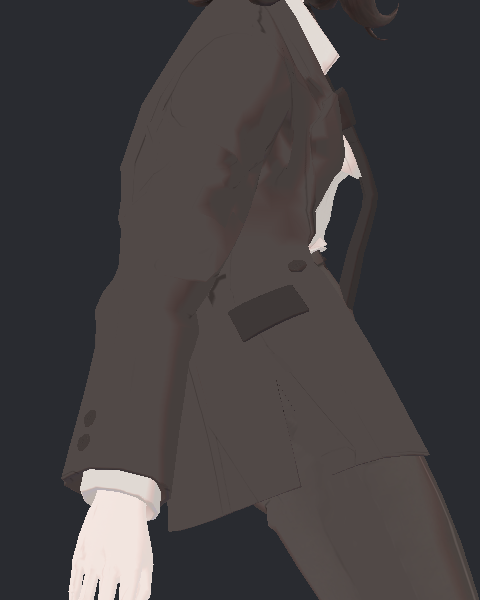
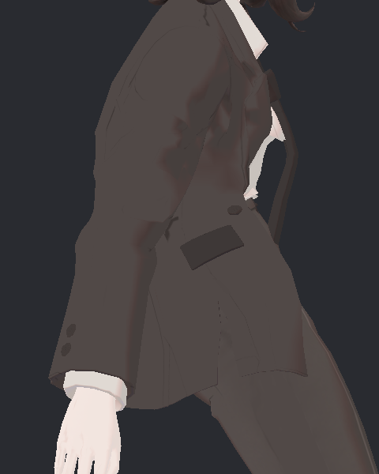
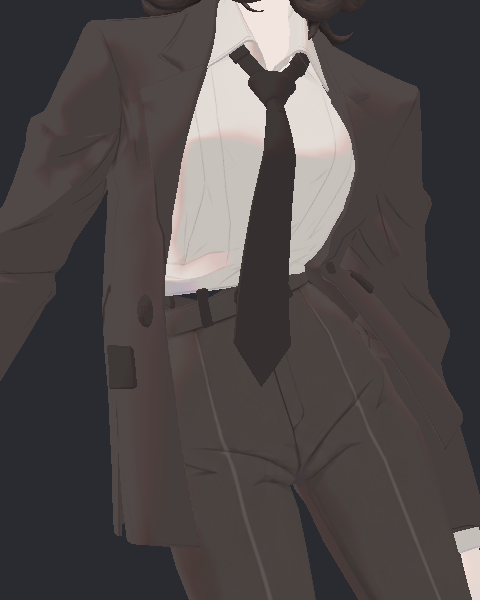
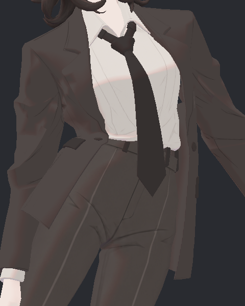

> **기록 시점 안내:** 아래는 해당 단계 당시의 보고서입니다. 후속 결정은 [최신 상태](../../../../../STATUS.md)를 기준으로 읽어주세요. 모델·원본 텍스처·검증 원시 데이터는 이 문서 공유본에 포함하지 않습니다.

# v353 코트 하부 중력 V1 — 상부 보존, 소매 접촉 잔여

**V1은 아직 미채택입니다.** 자락을 아래로 움직이면서 원래 상부 지지와 소매 좌표를 정확히 보존하는 데 성공했습니다. 그러나 좌·우로 몸을 기울일 때 내려온 자락이 전완 소매에 새로 닿습니다. 기존 코트 충돌체는 골반과 허벅지만 보호하므로 소매와의 충돌을 피하지 못한 것이 다음 수정 대상입니다.

## 실제 검사 결과

두 조건을 별도 Play의 첫 순서로 각각 1,800프레임 실행했습니다. 새 baseline의 코트66개 표면은 이전 source19 첫 순서 baseline의66개와 바이트까지 같았습니다. 원래 source19와 후보의 메시·UV·노멀·웨이트·키·본 rest·재질은 보존됐으며 양 실행 모두 완료/장면 복원이 통과했습니다.

| 범위 | 후보의 원래 대비 최대 실제 변위 |
|---|---:|
| 코트 PB 영향 없는 몸판 | 0 mm |
| 01 영향만 있는 상부·전이 | 0 mm |
| 팔/소매 우세 영역 | 0 mm |
| 02 영향 있는 하부 | 25.071 mm |
| 다른 BodyHair 메시 전체 | 0 mm |

66개 실제 스킨 표본과 전체1,800 본 기록을 비교했습니다. 01 본 위치 차이는0, 회전 차이는 부동소수점 각 계산 기준 약0.0000024도 이내입니다. 헤어·넥타이 본 위치 차이도0입니다. 낮은 부분에만 힘을 분배하려던 목표는 이 범위에서 확인됐습니다.

왼앞 root-tip 방향과 아래 방향 사이의 HOLD299 각도는 좌26.01→22.29도, 우17.40→13.81도, 앞32.69→26.52도로 작아졌습니다. 전체 체적 보존율이나 자연스러움 점수가 아니라 자락 방향 지표입니다. 복귀 마지막1초는 안정돼 있으며 코트 끝의 최초 중립 대비 차이는 최대 약0.000207 mm입니다. 후보의 중립 자체는 원래보다 최대 약8.36 mm 달라졌으므로, 복귀가 정확하다는 사실과 초기 외형 변경을 구분합니다.

## 실제 앞기울임 측면

| 원래 | V1 |
|---|---|
|  |  |

두 사진을 직접 열어 확인했습니다. 허리와 주머니 위는 유지되고 아래 자락이 내려옵니다. 이전 F16에서 주머니 아래 전체가 당겨지던 모습은 줄었습니다. 위쪽 옆구리의 원래 접힘은 남으며, 이번 하부 수정으로 해결됐다고 처리하지 않습니다.

## 좌·우 기울임의 새 접촉

| 조건 | 원래 | V1 |
|---|---|---|
| 왼 기울임299 |  |  |
| 오른 기울임299 |  |  |

이 네 사진도 직접 확인했지만 소매 뒤쪽 접촉은 보통 구도에서 작거나 가려져 있습니다. 사진의 자락 방향만으로 통과시킬 수 없었습니다. 실제 면 교차 검사에서는 새934쌍·표본 조합, **184개 유일 삼각형 쌍**이 확인됐고 모두 몸판/자락–팔·소매 분류입니다. 새 교차선 최대 길이는15.655 mm이며, 관통 깊이를 뜻하지 않습니다. 팔끼리·몸판끼리의 새 쌍은0입니다.

HOLD299의 대표 새 접촉은 왼쪽 하부 자락 삼각형1973↔전완 소매2481(11.448 mm), 오른쪽 자락532↔소매461(11.214 mm)입니다. 자락 면은 앞·뒤02 본에 약94~100%, 소매 면은 해당 forearm에 약96~100% 영향을 받습니다. 상부01 전이를 풀어서 생긴 과거 회귀와 원인이 다릅니다. 전완 소매에 맞춰 움직이는 충돌체가 현재 코트 목록에 없습니다.

코트–바지 접촉은 원래와 같은20/66표본·최대63쌍이고 넥타이–셔츠/코트는0/66입니다. 추가 대조에서66표본의 기존 교차쌍 ID·교차선 길이·양끝 좌표까지 정확히 같았으며, 입력 바이너리/소스/면 대응 SHA를 재확인했습니다. 이 수치만 보고 합격시키면 이번 새 소매 접촉을 놓치게 됩니다. 검사는 비공면 교차선0.05 mm 이상이며 같은 원래 위치의 공유 정점은 제외합니다. 공면 전체, 모든 프레임의 연속 교차 또는 PC 클라이언트 합격이 아닙니다.

## 다음 최소 수정

V1의 분리된 힘과 기존 지지를 유지하고, 실제 전완 소매 범위에 맞춘 국소 캡슐을 좌우 하나씩 추가해 코트 PhysBone 목록에만 연결합니다. 소매 본 아래에 두어 팔을 따라 움직이게 하며 소매/코트 메시와 웨이트는 변경하지 않습니다. 기존 바지 충돌체도 유지합니다.

추가 전 정지 여유, 실제 원본 면과 캡슐 축/반경 관계, 움직임 중 소매 추종을 확인하고 같은66표면에서 새 접촉과 자락 벌어짐을 다시 검사합니다. V1을 수정 완료본으로 게시하거나 강한 중력 전체 프로필로 되돌리지 않습니다. 정확한 접촉 위치를 보여주는 별도 확대 그림도 준비 중입니다.
