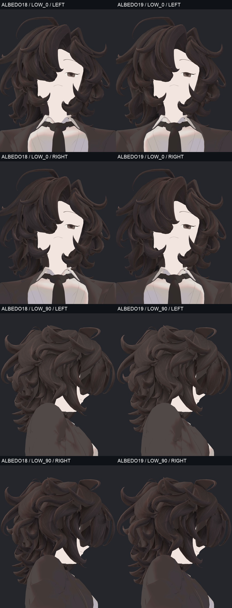
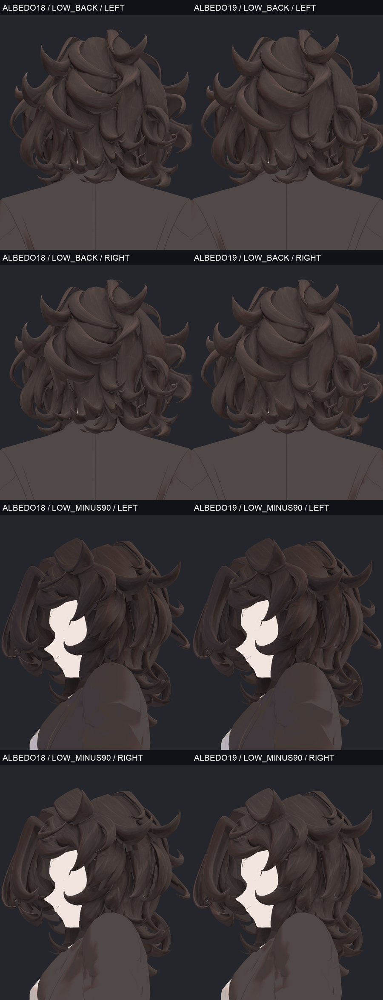
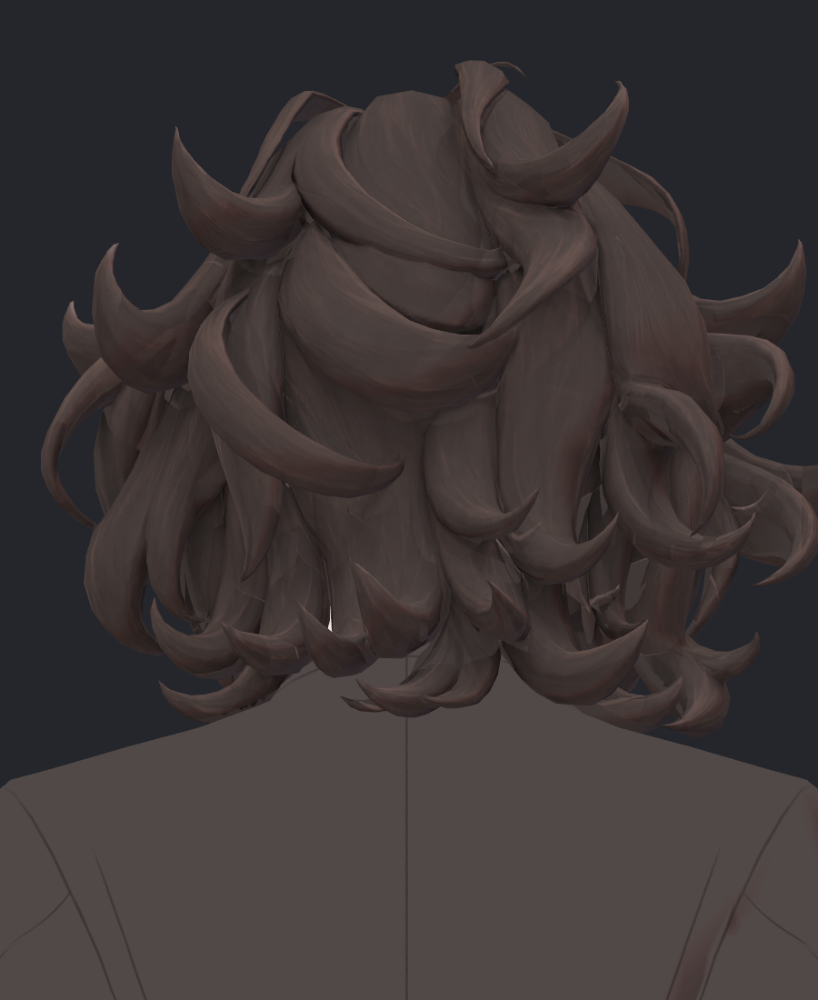

> **기록 시점 안내:** 아래는 해당 단계 당시의 보고서입니다. 후속 결정은 [최신 상태](../../../../../STATUS.md)를 기준으로 읽어주세요. 모델·원본 텍스처·검증 원시 데이터는 이 문서 공유본에 포함하지 않습니다.

# v353 헤어 V18 → V19 독립 시각 검토

2026-09-14 · integration_audit 읽기 전용 검토. 비교판 01~08의 **64사진, 32개 전후 쌍**을 실제로 열었다. 지정된 V19 LOW_0_LEFT / LOW_BACK_RIGHT와 같은 V18 원본, 양쪽 LOW_90_LEFT, V19 HEAD_BACK_RIGHT / TOP_0_RIGHT를 900×1100 원본으로 추가 확인했다. `avator_references/ref_char.png`의 실제 원화를 함께 보았다. 모델·텍스처 수정이나 Blender/Unity 조작은 하지 않았다.

## 판단

**V19는 V18보다 머리 안쪽의 넓은 단색 면이 줄었으며, 외부 가닥선 디테일도 유지한 개선 후보다. 하지만 내부 면·가닥 연결 경계의 미완성 부분이 남아 헤어 전체 완료로 판단하지 않는다.**

정면과 ±35도에서는 기존 큰 컬과 가는 선이 유지된다. 이번 수정 때문에 머리 전체가 평탄해지거나 디테일이 크게 줄어든 모습은 확인하지 못했다. LOW_0과 LOW_BACK에서 V18의 넓고 각진 무늬 없는 면 일부에 V19의 가닥 방향과 명암이 이어져, 내부를 봤을 때의 이질감은 줄었다. 전신 거리에서는 변화가 작으며 캐릭터 전체 색조와 실루엣을 크게 바꾸지 않는다.

원화와 같은 차분한 갈색 계열·큰 가닥 묶음의 NPR 방향은 유지된다. 다만 현재 모델에는 가닥 가장자리를 따라 도는 두꺼운 명암과 촘촘한 잔선이 많아, 원화의 간결한 면·선 구성보다 일부 컬이 입체적인 띠처럼 읽힌다. 이를 해결하려고 머리 전체 선을 지우면 이미 개선된 디테일이 다시 줄어든다. 잔여 내부 면과 과한 테두리 명암을 부위별로 다루는 편이 적합하다. 원화와 모델의 길이·형상 차이를 텍스처 결함으로 취급하지 않았다.

## 실제 좋아진 부분

LOW_0의 얼굴 양옆과 목 옆 가닥 사이에서 V18의 단색 조각이 눈에 띄었으나 V19에서는 여러 조각에 선이 이어지고 큰 색 끊김이 줄었다. 가장 앞의 큰 가닥을 덮어 흐리게 만든 수정은 아니다. LOW_90의 뒷머리 안쪽도 일부 단색 면이 줄었지만 아래의 회색 띠는 남았다.

LOW_BACK에서 하단의 말린 가닥 여러 개는 V18의 어두운 단색 뒷면보다 V19에서 길이 방향의 선과 명암이 더 이어진다. 전체 뒤머리를 같은 무늬로 뭉갠 모습은 아니다. 다만 오른쪽 안쪽의 얇고 밝은 조각들은 아직 별도 확인이 필요하다.

## 남은 핵심 위치

좌표는 아래 링크의 900×1100 원본 이미지 왼쪽 위를 기준으로 한 대략적인 화면 범위다. 원래 메시 면 번호나 UV 좌표가 아니며, 문제 면을 확정하기 위한 지목 범위다.

| 우선 확인 | 실제 위치·자료 | 보이는 현상 | V18 대비 및 판정 |
|---|---|---|---|
| 안쪽 큰 색면 | LOW_90_LEFT, x560~702 / y270~515 | 위쪽 컬 아래의 회색 가로 띠와 얼굴 앞 안쪽 대각 띠는 가닥선이 있는 주변과 확연히 다르게 읽힌다. | V18부터 보인다. V19의 주변 개선 후에도 남음. 내부 텍스처 완성으로 처리 금지. |
| 뒤쪽 얇은 면·경계 | LOW_BACK_RIGHT, x615~695 / y560~720 | 겹친 가닥 사이에 밝은 얇은 조각과 각진 단절이 보인다. 주변에는 페인팅된 선이 있다. | V18에도 존재하고 V19에서도 명확하다. 단색 안쪽 면·얇은 기하·명암 중 어느 원인인지 이 사진만으로 확정하지 않는다. |
| 뒤 중앙의 평평한 패널 | HEAD_BACK_RIGHT, x390~550 / y425~510 | 큰 U형 가닥 사이의 중앙 면은 잔선이 적고 면 경계가 단단해, 주변보다 평평한 조각으로 읽힌다. | V18부터 이어진 잔여. 실제 가닥의 겹침을 모두 없앨 문제가 아니며 면의 색/선 연결부터 확인해야 한다. |
| 앞가닥 국소 색 경계 | LOW_0_LEFT, x330~375 / y320~415 및 x615~725 / y565~620 | 큰 앞가닥의 어두운 세로 흔적과 오른 얼굴 옆 컬을 가로지르는 색 경계가 남아 있다. | V18에도 보이며 전면적인 새 얼룩 회귀는 아니다. V19에서 내부 전체가 완결됐다고 볼 근거도 아니다. |

위의 넓은 회색 대각 띠는 원본 크기에서 확실히 보인다. 그러나 이 자료만으로 텍스처 누락 또는 UV 오류라고 단정하지 않는다. 첫 보이는 면의 category/원래 polygon/재질을 확인하고 같은 구도 BaseColor와 셰이더 출력을 분리해야 한다. 머리카락 사이로 드러난 피부색이나 배경 자체를 누락 텍스처로 칠하는 방식은 피해야 한다.

아래 가닥 사이의 가는 흰 틈이나 TOP_0 중앙의 피부색 노출은 양 버전에서 보인다. 이를 이번 새 텍스처 회귀나 새 메시 구멍으로 확정하지 않았다. 실제 앞뒤 면의 가림 관계 확인 전에는 덮어 칠할 대상으로 삼지 않는다.

## 새 회귀와 스타일 경계

64사진에서 V19에만 새로 생긴 광범위한 얼룩, 대형 삼각 패치, 기존 외부 가닥 디테일의 큰 소실은 확인하지 못했다. 이것은 모든 미세 픽셀·밉·압축 회귀를 검사했다는 뜻이 아니다. 비교판은 축소 표시됐고 추가 원본 검수는 위에 명시한 구도에 한정한다.

정면은 V18과 상당히 비슷하고, 가장 분명한 개선은 낮은 시점의 내부다. 따라서 “헤어 전면 스타일이 새로 완성됐다”보다 “단색 안쪽 면을 추가로 채색해 연결을 개선했다”가 결과를 정확하게 설명한다. 기존의 두꺼운 컬 테두리와 뒤 중앙의 평평한 패널은 여전히 남는다.

현재 사진은 좌/우 조명 2조건의 실제 재질 출력이다. REVIEW 기록에서 hair shadow=1, unlit=0.25이므로 사진에 남은 모든 명암을 BaseColor에 그려진 그림자로 해석하지 않는다. 텍스처·노멀·셰이더 기여의 분리 검사는 이번 시각 검토에서 실행하지 않았다. 완전히 가려진 면, 전체 조명 범위, 움직이며 새로 노출되는 내부, PC VRChat 클라이언트는 별도 검증 대상이다.

## 비교판별 확인 기록

| 비교판 | 4개 전후 쌍 | 독립 시각 판정 |
|---|---|---|
| 01 | HEAD_0 / HEAD_35 × 좌·우 조명 | 정면 주요 선과 큰 컬 유지, 넓은 새 얼룩 식별 안 됨. |
| 02 | HEAD_MINUS35 / HEAD_90 × 좌·우 | 옆가닥 묶음·색조 유지, 외부의 큰 소실 식별 안 됨. |
| 03 | HEAD_MINUS90 / HEAD_BACK × 좌·우 | 뒷머리 선 유지, 뒤 중앙 패널의 평평한 느낌 잔여. |
| 04 | HEAD_135 / FULL × 좌·우 | 뒤 사선의 내부 경계 일부 잔여. 전신 변화는 작고 큰 색조 불일치 식별 안 됨. |
| 05 | TOP_0 / TOP_90 × 좌·우 | 정수리/가닥 시작 면의 선 유지. 중앙 피부 노출을 신규 텍스처 결함으로 단정 안 함. |
| 06 | TOP_BACK / TOP_MINUS90 × 좌·우 | 위에서 본 뒤쪽 방향 유지, 큰 조각별 명암 차이 잔여. |
| 07 | LOW_0 / LOW_90 × 좌·우 | 내부 단색 조각 개선이 분명하나 낮은 측면 회색 띠 미완성. |
| 08 | LOW_BACK / LOW_MINUS90 × 좌·우 | 하단 가닥 디테일 연결 개선, 뒤쪽 얇은 밝은 면·경계 잔여. |

REVIEW.json은 native_skinned=true인 실제64렌더와 completed/source_preserved/scene_preserved=true를 기록한다. 비교판8개의 메타데이터가 참조하는 원본64개의 SHA를 디스크에서 다시 계산했으며 전부 일치했다. 본 검토는 실제 저장 그림과 메타데이터 확인이며, Unity를 독립 재실행하거나 이미지의 품질을 수치로 자동 합격시킨 검사가 아니다.

## 다음 수정에 필요한 최소 확인

우선 LOW_90의 두 회색 띠와 LOW_BACK 오른쪽 내부의 얇은 조각을 실제 첫 보이는 면에 대응시킨다. 해당 면의 BaseColor가 비어 있다면 기존 외부 디테일을 보호하면서 그 면만 가닥 방향에 맞춰 채색하고, 기하 또는 명암 원인이면 별도 수정으로 구분한다. 같은 32구도의 전후 비교를 다시 확인해야 한다. 전체 헤어 선명도 강화나 전면 평활화로 이 국소 문제를 덮지 않는다.

이 문서는 독립 검토 의견이며 사용자 최종 채택을 대신하지 않는다. V19의 실제 개선은 인정하되 **내부까지 전부 완료**라고 보고할 단계는 아니다.
