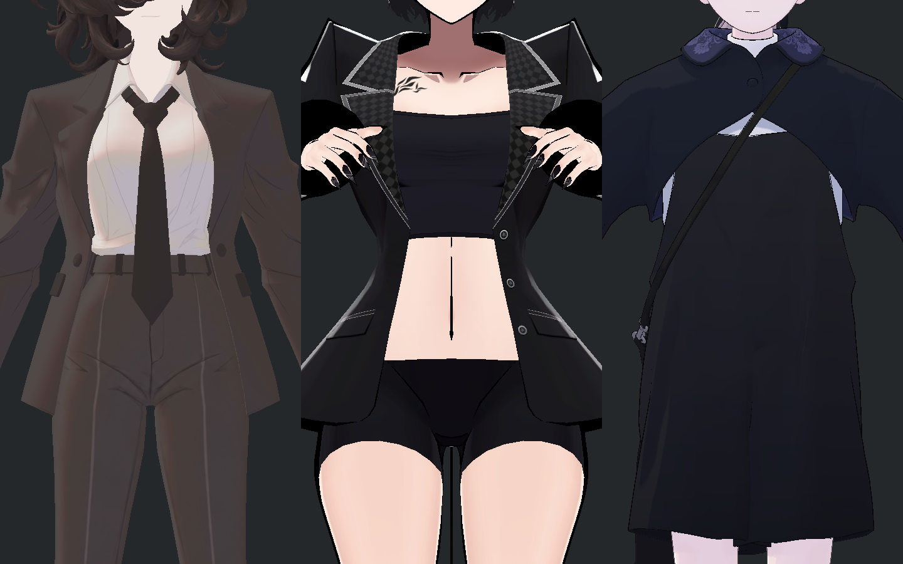
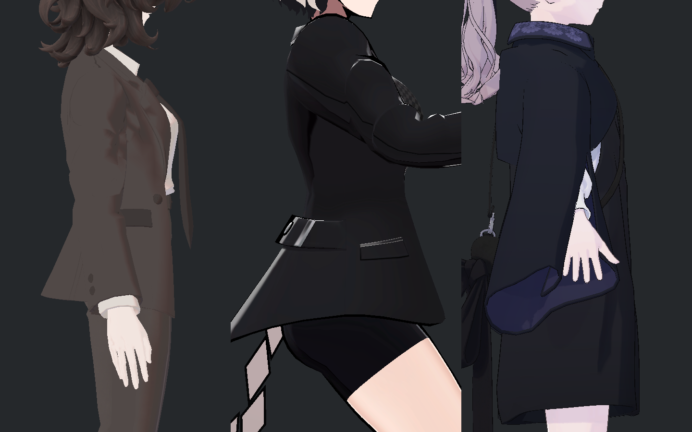
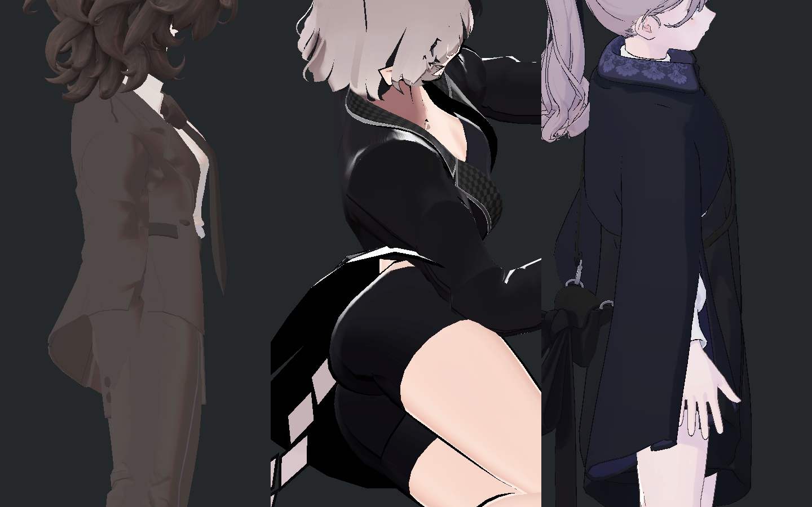
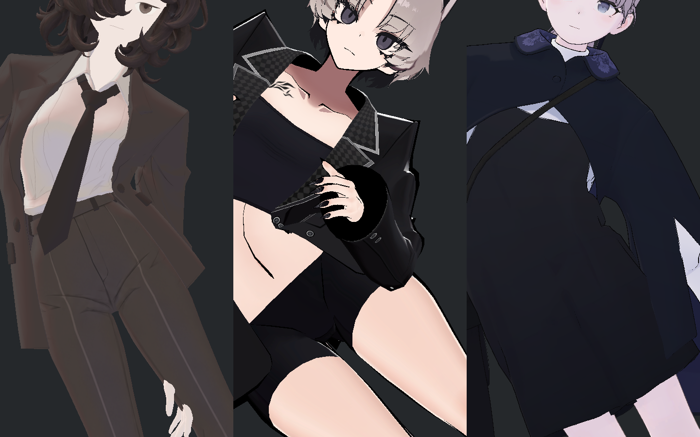
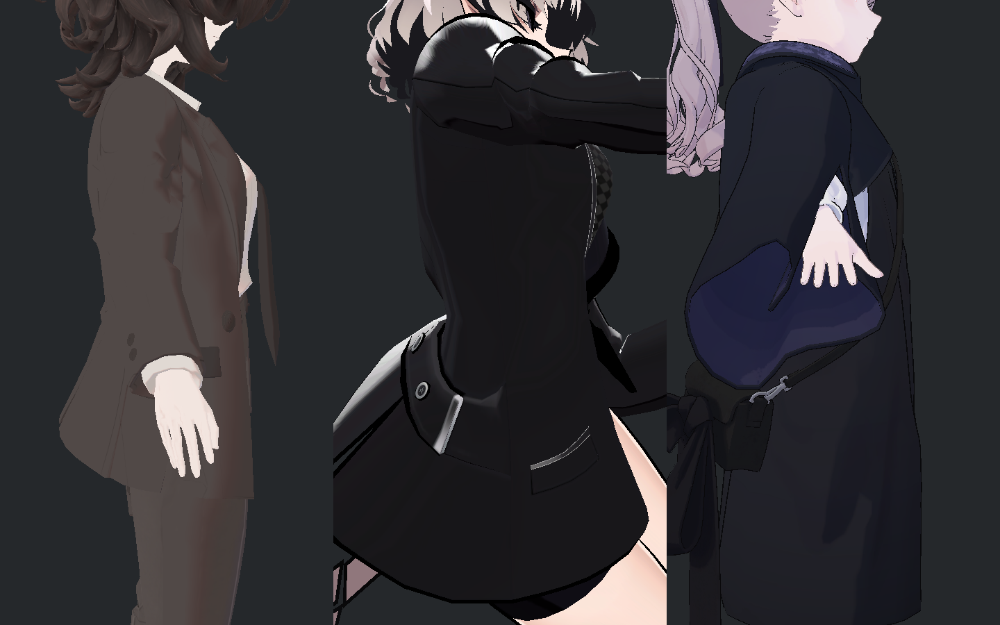

> **기록 시점 안내:** 아래는 해당 단계 당시의 보고서입니다. 후속 결정은 [최신 상태](../../../../../../STATUS.md)를 기준으로 읽어주세요. 모델·원본 텍스처·검증 원시 데이터는 이 문서 공유본에 포함하지 않습니다.

# v353 실제 블레이저 허리 비교 독립 검토

실제 6장과 사전 중립 1장을 직접 확인했다. **SiuSiu 블레이저도 몸통 기울임에 따라 몸판과 자락의 각도가 바뀐다. 다만 이 자료로 Bianca의 깊은 허리 접힘이나 중력 미완료를 허용·종결할 수는 없다.**

사진은 왼쪽 Bianca Surface19+PAD1, 가운데 SiuSiu 원래 블레이저, 오른쪽 Lapwing이다. 세 모델이 각각 제자리에 촬영되었으며 이전 빈 열/다른 모델이 들어간 카메라 실패는 없다. 원본 6장 SHA 재검산 불일치 0, source/scene exact 확인. 참고 자산은 읽기 전용이고 원래 메시·UV·재질·키·웨이트는 변경하지 않았다.

## 실제 조건과 비교 한계

원래 `SiuSiu_Costume_BlazerOnly` 의상 클립을 0초 샘플링한 상태이며 세 자세 모두 `Costume_Cloth2_Blazer`가 active/enabled다. 표면은 각 모델 원래 재질이므로 Siu의 강한 검정·흰 하이라이트와 Bianca의 낮은 대비를 같은 재질 품질 척도로 읽지 않는다. Lapwing은 몸통을 감싼 원피스와 짧은 어깨 겉옷 구조가 달라 동일 블레이저 변형 기준이 아니다.

|측정|Bianca|SiuSiu 블레이저|Lapwing|
|---|---:|---:|---:|
|옆굽힘 중심선 변화 절댓값|17.301°|17.301°|17.300°|
|중립 대비 chest–hips 상대 방향 변화의 회전 크기|41.306°|79.977°|48.146°|
|중립 위팔–몸통 각도 약|159.31°|126.36°|137.20°|

맞춘 값은 각 모델 중립 좌표계의 **가슴 중심–골반 중심 선분의 측면 기울기**다. 동일한 개별 관절 회전이 아니다. 실제 quaternion 기록을 각 모델의 중립과 합성해 비교하면 위처럼 회전 크기가 다르다. 이 값은 해부학적으로 보정된 옆굽힘각이나 개별 관절각이 아니다. SiuSiu 입력은 약 ±0.9997로 거의 입력 끝값이며 Bianca는 ±0.5163, Lapwing은 ±0.6033이다. 따라서 같은 17.3도라고 해서 동일한 일상 자세·관절 부담이나 동일 손/소매 위치로 일반화할 수 없다.

Physics OFF의 정적 네이티브 스키닝 사진이다. 의상이 몸을 따라가는 경향은 보이지만 실제 중력·바람·이동·복귀·옷 충돌을 증명하지 않는다. 전수 기하 교차 검사도 이번 사진 판정에 포함하지 않았다.

## 사진에서 실제로 보이는 차이

중립에서 SiuSiu는 잘록한 허리에서 자락으로 넓게 벌어지고 외곽이 매끈하다. Bianca는 더 긴 직선적인 몸판과 좁은 플레어이며 원래 디자인 차이가 있다. 이 플레어를 그대로 이식하는 것이 목표는 아니다.

좌·우 옆굽힘에서 SiuSiu도 몸판과 허리–자락 연결이 기울고, 짧아진 쪽 허리의 각도 변화가 있다. 그러나 보이는 외곽은 넓은 곡선으로 이어지는 편이다. Bianca는 접히는 쪽 단추 아래부터 포켓/자락으로 이어지는 전이가 더 좁은 구간에 집중되어 날카롭게 꺾여 보인다. 이는 이 사진의 시각 판단이며 깊이를 mm로 측정한 결과는 아니다. 팔과 몸 사이 어두운 공간 전체를 몸판 구멍이나 관통으로 표시하면 안 된다.

측면에서는 SiuSiu의 넓은 플레어가 유지되면서 몸판이 기울어지는 점이 보인다. 앞쪽으로 접힌 팔이 일부 허리를 가리므로 해당 부분의 접힘 부재나 접촉 무결함을 주장하지 않는다. Lapwing의 원피스는 큰 연속 면으로 기울며, 같은 자켓 패턴의 해법으로 읽을 수 없다.

## 이번 자료로 허용할 범위

일반적인 팔–몸 사이 공간, 몸을 따라 기울어지는 정적 의상 형태, 작은 디자인상 각도 변화를 모두 결함으로 세는 것은 적절하지 않다. 하지만 **Bianca 단추 아래 국소 inward 접힘은 이 비교로 자동 허용하지 않는다.** 준비 중인 Ribbon 후보는 동일 Bianca 전후·유사 자세·실제 동작으로 별도 검수해야 한다. 이번 보고는 해당 후보를 보거나 채택한 기록이 아니다.

원래 몸판·자락의 부피와 직선적인 디자인을 유지하면서 접힘이 한 곳에 집중되는지만 평가하는 후속 기준으로 활용할 수 있다. 실제 중력 개선과 공통 모델 한계의 최종 결정은 물리 ON 자료에서 별도로 해야 한다.

## 회전 지표 재확인

위 41.306°/79.977°/48.146°는 절대 자세를 identity와 비교한 값이 아니다. 각 모델의 실제 중립 상대 회전 `q0 = inverse(hips0) * chest0`와 자세 상대 회전 `q = inverse(hips) * chest`를 사용해 `delta = inverse(q0) * q`의 최단 회전 크기를 계산했다. 숫자 각도를 단순히 빼지 않았다. 원래 계산과 별도 quaternion 곱셈·atan2 재계산이 일치한다.

Lapwing의 중립 절대 상대 회전은 9.089744°, 기울임 절대 상대 회전은 49.078028°이나, 보고한 **중립 대비 합성 변화는 48.145980°**다. 따라서 중립 bone roll/rest orientation을 그대로 기울임 차이로 센 것은 아니다. 고정된 본 로컬 프레임을 바꾸면 delta가 좌표 변환되더라도 회전 크기는 보존된다.

다만 이 수치는 가슴 본과 골반 본의 상대 방향 변화 전체다. 해부학적 측면 축 성분·Spine/Chest별 회전 분배를 추출한 결과가 아니므로 ‘Siu의 실제 허리가 두 배 굽었다’고 표현하면 안 된다. 모델 간 공통 기준은 원래 맞춘 17.3° 중심선이고, 이 추가 값은 그 조건이 모든 본 방향까지 동일하게 만들지는 않았다는 제한만 설명한다.

원래 quaternion·중립·자세·delta 재검산 기록 (공유본 미포함: `ROTATION_METRIC_NEUTRAL_CHECK_V1.json`). 기존 실행 REVIEW와 첫 독립 판정 JSON은 그대로 보존했다.
