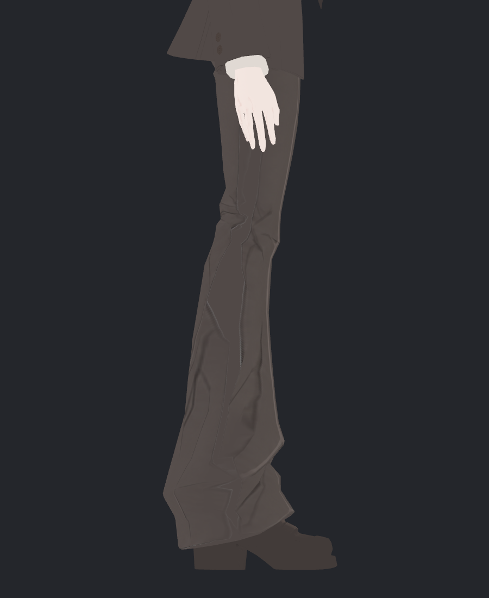
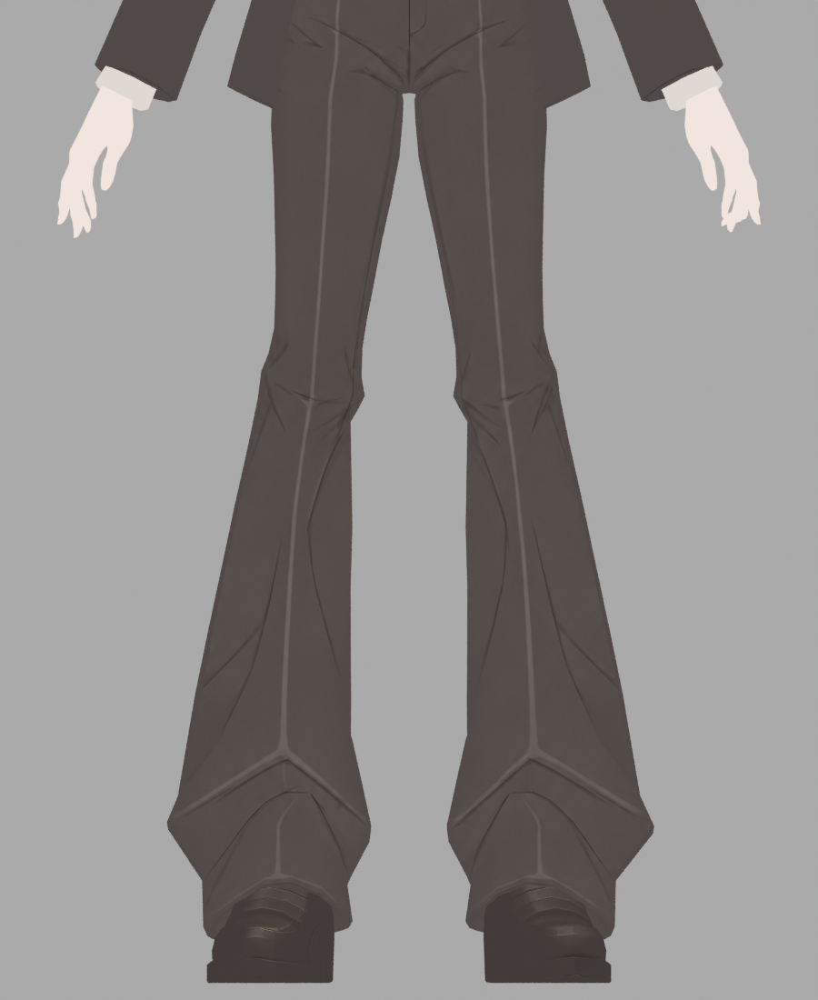
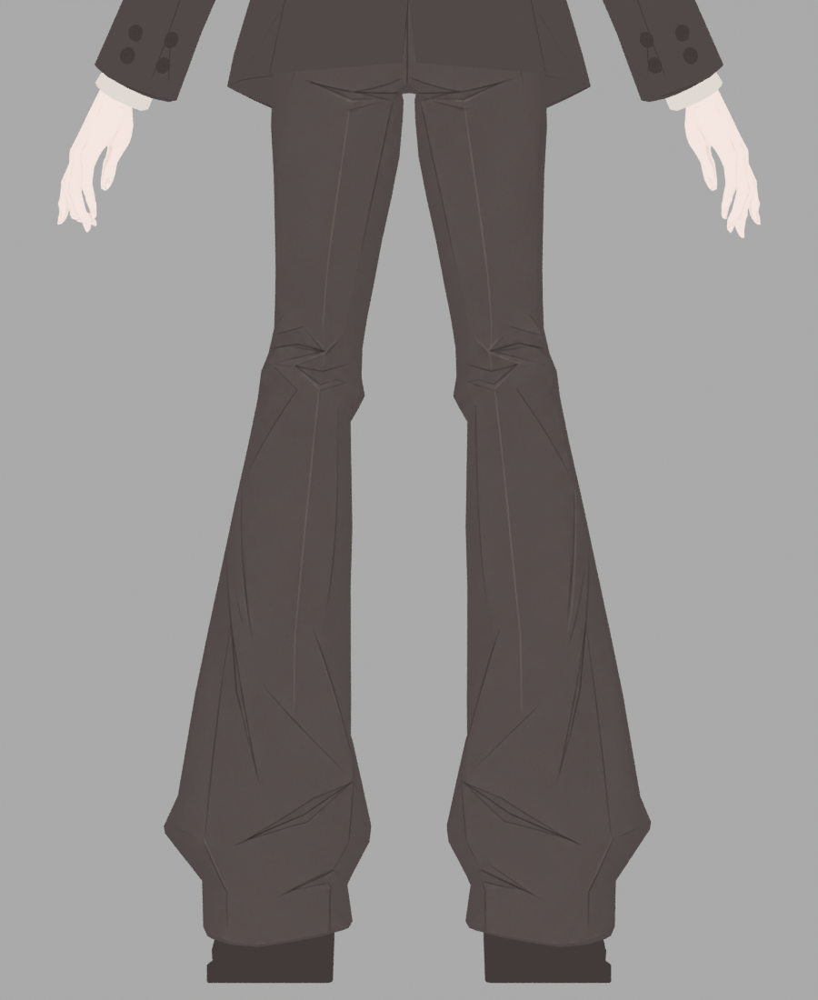

> **기록 시점 안내:** 아래는 해당 단계 당시의 보고서입니다. 후속 결정은 [최신 상태](../../../../../STATUS.md)를 기준으로 읽어주세요. 모델·원본 텍스처·검증 원시 데이터는 이 문서 공유본에 포함하지 않습니다.

# v353 옆바지 밝은 톱니선 원인 검토

새 `pants_v7` PNG 안에 밝은 톱니가 이미 들어 있다. 해당 부분은 셰이더 그림자를 끈 COLOR 사진과 DYNAMIC 사진에서 모두 보인다. 조사한 선은 UV 경계나 중복 면만으로 생긴 현상이 아니라, **신규 앞/뒤 원화의 흰 배경 가장자리 회색 픽셀이 의상색으로 전사된 현상**으로 판단한다.

## 실제 자료와 대응

기존 텍스처 픽셀은 사용하지 않았다. 원래 면·V351 UV와 부모가 Blender GUI에서 새로 덤프한 현재 평가면1,724삼각형, 신규 `pants_lines_front/back` 원화, `Bianca_v353_pants_v7.png`를 읽었다.

대표 원래 polygon4308/chart0의 baked PNG 위치(459,2272)는 UV섬 경계에서35.89texel 안쪽이다. 이 표본의 새 앞 원화 좌표는(367.48,693.93)픽셀, RGB 약(132.7,132.2,130.4)이며 선형휘도.2315다. 흰 배경 픽셀이1.49px 옆에 있는데 기존 shader graph의 `<.25` 이진 마스크를 통과한다. 바지 기본색은(81,73,71)이므로 이 회색은 밝은 테두리로 혼합된다.

추적한 밝은점59개 중55개에서 이 같은 수용된 회색 외곽 픽셀이 확인됐다.55개 전부2px 이내에 흰 배경이 있다. 해당 atlas 표본은 섬 경계에서 최대202.65texel 안쪽에 있어, UV 여백을 넓히는 것만으로 제거되지 않는다. 나머지4개를 같은 원인이라고 확대하지 않는다.

1,724원래 삼각형 중 위치3점이 모두 같은 정확 중복 삼각형은0이다. 이는 바지 모든 근접·교차면이 없다는 뜻은 아니다. 다만 이번 톱니가 새PNG 내부에 존재하므로 중복면 제거를 이번 선의 수정 방법으로 선택할 근거가 없다.

사진→면의 간이 side-ray 대응은 실제 Unity 카메라/스키닝의 완전 재생이 아니므로 픽셀 단위 정합 판정에는 쓰지 않았다. 현재 평가면과 V351 저장rest위치는 최대14.25mm 차이가 있어 초기rest재투영을 폐기하고 부모의 평가면 덤프를 사용했다. 이 차이를 새 기하 회귀라고 주장하지 않는다.

## 수정 후보

`gui_bake_pants_edge_guard.py`는 현재 평가면과 UV가 덤프와 일치하는지 먼저 확인한 뒤, 임시 Blender 전사 메시에서 새 원화만 다시 베이크한다. 기존UV·형상·주름선은 편집하지 않는다.

마스크는 중앙 픽셀의 밝기만 자르는 대신 원화2.5px 거리의8방향 이웃을 확인한다. 이웃에 흰 배경이 있으면 smoothstep으로 원화 기여를 줄이고 바지 기본색으로 연결한다. 내부의 밝은 주름선은 흰 배경에 붙어 있지 않으므로 유지한다. 전체 블러·밝은선 일괄삭제·이전 텍스처 복원은 하지 않는다. 원래4sample 대비16sample을 사용하되, 샘플 증가는 근본 원인 제거와 구분한다.

고정된55외곽표본의 node 수식 오프라인 시험에서는 배경혼입 기여가 모두0이 되었다. **실제 Blender 베이크·동일Unity사진 검토 전이며 채택 판정이 아니다.** 필요한 검수는 측면 톱니, 정면 바지 중앙의 밝은 접힘선, 무릎/밑단의 원래 새원화 디테일, 앞뒤 UV심의색 연결이다. 얇은 외곽 선을 보호하지 못한 경우 source 실루엣 마스크 범위를 재검토한다.

원시UV·새원화/atlas와 JSON 진단은 내부 검토 자료다. 공개 문서에는 위의 실제 모델 렌더와 선별한 원인 설명만 사용한다.

## 실제 후보 실행 후 독립 검토

부모가 Blender GUI에서 원화 재베이크·바인드를 실행했다. `Bianca_v353_pants_edgeguard.png`의 SHA256은 `1576681114680ad7384d5fe8db4c1c857cf31180c1fb69056efc03d8aeb19d22`이며16sample/원래1,724삼각형을 사용했다. 검토자는 정면·양측면·뒤의 전후8장을 모두 직접 열어 확인했다.

| 방향 | 실제 판정 |
|---|---|
| 정면0° | 긴 중앙 접힘선과 무릎의 검은주름선, 밑단Y형 밝은선 유지. 새 큰 번짐 없음 |
| 측면90° | 종아리의 밝은 톱니가 크게 감소. 길게 구부러진 원화 주름선은 유지 |
| 반대측면−90° | 같은 밝은 톱니와 허벅지→무릎 일부 밝은외곽선 감소. 약한 세로 톤 흔적은 남음 |
| 뒤180° | 무릎뒤 각진 접힘선과 밑단주름 유지. 흰배경 혼입에 해당하던 외곽 얇은띠 감소 |

원인조사 때 고정한55문제texel의 평균RGB는(102.16,98.64,97.36)→(81,73,71), 기본색초과 최대채널값50→0이다. 기본색보다5/255 초과한표본55→0. 이 수치는 그55개 원인표본에 한정되며 전체텍스처의 완성도나 모든아티팩트 해결률이 아니다.

정면 좌우 중앙선 내부ROI의 전후 최대채널차는1/255, 평균0.022/255이며 명암폭도 사실상 동일하다. 정면아래 접힘선 내부ROI 역시 최대1/255이다. 무릎ROI에는 배경과 외곽도 포함되므로 그 전체명암폭을 주름보존률로 쓰지 않았다. 실제8장에서도 내부주름을 뭉갠 회귀는 확인되지 않는다.4→16sample 차이에 따른 작은 차이는 완전히분리하지 않았다.

따라서 **이번 배경혼입 수정 후보는 채택에 긍정적**이다. 단 측면의 얕은 세로 톤 경계, 흐릿한 고정주름 일부는 남아 전체바지의 최종미관 합격을 뜻하지 않는다. 실제 동적조명·가까운 밉/압축·굴곡포즈에서의 최종검수는 통합단계로 남긴다.
