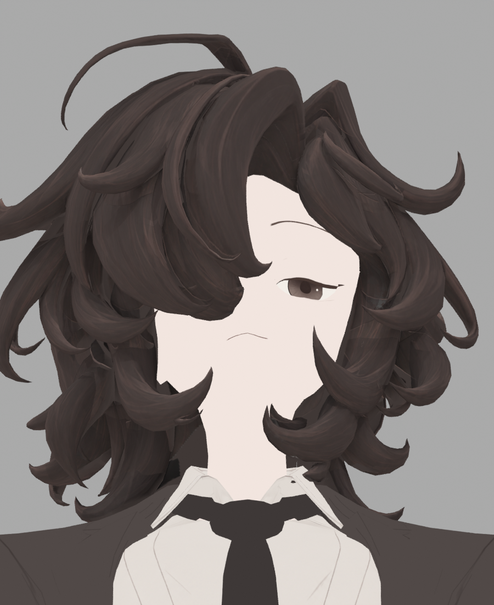

> **기록 시점 안내:** 아래는 해당 단계 당시의 보고서입니다. 후속 결정은 [최신 상태](../../../../STATUS.md)를 기준으로 읽어주세요. 모델·원본 텍스처·검증 원시 데이터는 이 문서 공유본에 포함하지 않습니다.

# v353 GAP22 — 생성 원화 배경 혼입 독립 검토

**판정: GAP22 미채택.** 목 왼쪽 안쪽의 평평한 단색 영역은 채워졌지만, 새 검은 톱니 테두리가 생겼다. 실제 아틀라스→원래 면→투영 원화 픽셀을 역추적하니 생성 원화의 거의 검정인 배경이 채색으로 인정된 사례가 확인됐다. 재질의 의도된 진한 머리 선으로 보기 어렵다.

이번 검토는 읽기 전용이다. Blender/Unity 실행, 모델·Assets·원화·아틀라스 수정, Python 이미지 편집은 하지 않았다. PNG 픽셀 계산과 기존 JSON의 UV/기하/카메라 행렬로 수치만 산출했다. 정면·−90° 전후 4장과 생성 원화 1장을 직접 확인했다. 모든 방향·최종 클라이언트 검수는 아니다.

## 직접 본 결과

수정 전 ALBEDO20. 목 왼쪽 가닥 안쪽에 넓은 단색 영역이 남아 있다.



GAP22. 위 단색 영역에 붓결이 들어갔지만, 채움 바깥에 새 검은 경계가 생겼다. −90°에서는 큰 외형 차이를 찾지 못했다. 이 제한된 측면 결과를 정면 결함의 허용 근거로 삼지 않는다.


## 실제 픽셀과 원래 면의 연결

아틀라스 좌표는 PNG 왼쪽 위 기준이며 4096²이다. 생성 원화 좌표는 1135×1386 원화의 왼쪽 위 기준이다. UV 중심을 원래 삼각형에 역매핑하고, 해당 삼각형의 실제 evaluated world와 검증된 30° 가이드 카메라로 투영했다. 기록된 16샘플 Cycles 내부 랜덤 표본을 재생한 것은 아니므로 중심 샘플과 베이크 평균은 구분한다.

| 원래 polygon | 아틀라스 x,y | ALBEDO20 / GAP21 | GAP22 | 새/기존 coverage | 원화 x,y 및 RGB | 의미 |
|---|---|---|---|---|---|---|
| 8390 | 1550,3240 | 64,56,54 | 82,62,55 | 179 / 0 | 447.03,1037.73 → 84,62,56 | 정상 새 채움 |
| 8429 | 1560,3243 | 64,56,54 | **1,0,0** | 75 / 0 | 466.50,1036.43 → **1,0,0** | 배경 혼입 확정 |
| 8390 | 1558,3247 | 64,56,54 | 19,15,14 | 56 / 0 | 465.83,1047.72 → **1,0,0** | 같은 문제의 부분 혼합 |
| 13940 | 3759,2176 | 64,56,54 | 64,56,54 | 0 / 0 | 667.30,1059.19 → 0,0,0 | 완전 검정은 차단되어 미채움 유지 |

즉 완전 검정은 막고, 거의 같은 검정인 `(1,0,0)`은 통과시키는 불연속이 있다. 8429 표본은 중심 및 ±2 원화 픽셀의 5개 warm 판정 모두 1이다. 기하학적 가이드가 정확해도 생성된 그림의 실루엣이 실제 머리 표면과 일치한다는 보장은 없으므로 기하 first-hit 마스크만으로 차단되지 않는다.

GAP21→22 변화는 158,642 텍셀, ALBEDO20→22는 250,397 텍셀이다. 기존 최대채널 ≥40에서 새 최대채널 <24가 된 텍셀은 178개다. 이 중 26개는 최대채널 ≤1까지 내려갔다. 이 178개는 전체 아틀라스 기준이며 모두 화면 노출 결함이라는 뜻은 아니다. 해당 텍셀의 coverage 중앙값은 76/255, 범위 54–198/255이다.

## 원인 1 — 저휘도에서 불안정한 색상 비율

현재 `gui_bake_chart_hair_paint_only_v17.py`는 선형 RGB에서 다음을 사용한다.

```
warm = (R-B) / max(R, 1e-6)
w = clamp((warm-.045)/.035, 0, 1) * (R >= G-1e-6)
```

원화 `(1,0,0)`은 선형 `(0.00030352698,0,0)`이다. warm=1이며 통과한다. 원화에 이 색이 72,649픽셀, `(1,1,0)`이 52,874픽셀 존재한다. 최대채널 ≤1인 928,007픽셀 중 125,523픽셀은 단점 gate=1, 827픽셀은 ±2 교차 erosion 이후에도 1이다. 따라서 현재 2픽셀 erosion만 넓히는 것은 근본 해법이 아니다.

최소 수정 후보는 원화에만 선형 밝기 support gate를 추가하는 것이다.

```
v = max(R,G,B)
bg_support = clamp((v - 0.002428215868) / (0.009134058702 - 0.002428215868), 0, 1)
```

이는 sRGB 최대채널 8→24 전이를 뜻한다. 기존 5개 샘플 각각의 warm gate에 곱하며, 색·명암 자체는 수정하지 않는다. 현재 확인한 `(1,0,0)`과 검정 배경 AA를 차단하면서, 최대채널 ≥24의 원화 색은 그대로 둔다. 원화의 일반적인 머리 바탕색은 `(78–82,63–67,57–60)` 부근이다.

**이 임계값도 디테일 무손실 확정은 아니다.** 내부의 정말 어두운 선은 같은 값 범위에 있을 수 있다. 최대채널 <24 영역 중 캔버스 가장자리와 4방향 연결된 픽셀은 937,679개, 닫힌 영역은 3,939개다. 닫힌 영역에는 가닥 사이 배경 구멍과 실제 어두운 선이 섞일 수 있으므로 이를 모두 디테일로 분류하지 않았다. 실제 선 끝과 가닥 내부 암선의 전후 확대 확인이 필요하다. 전역 밝기 올리기·블러·노이즈 제거로 대응하지 않는다.

## 원인 2 — 색과 coverage의 서로 다른 AA 평균

현재 첫 베이크는 `fac`를 쓰지 않고 `painttex.Color`만 EMIT한다. 두 번째 베이크에서만 `fac`를 저장한다. 따라서 색 결과에는 마스크 밖의 검정 배경 샘플이 섞이고, coverage는 별도로 평균된다. 이후 합성의 `min(coverage*4,1)`이 어두워진 색을 강하게 채택한다. 첫 원인을 고쳐도 이 구조는 경계 잔여를 만들 수 있다. 실제 각 샘플의 기여율은 재베이크 전까지 확정하지 않는다.

부모가 제안한 v23 수식은 이 문제를 직접 처리한다.

```
P = bake_average(fac * paint_linear_rgb)
C = bake_average(fac)
valid_color = P / max(C, epsilon)
alpha = 0 if C <= epsilon else confidence_alpha(C) * previous_gap_protection
result = mix(gap21, valid_color, alpha)
```

P와 C는 float32 선형 EXR로 저장·Non-Color로 읽는다. 같은 원본 UV, 동일 samples/seed·margin0·denoise off를 사용해야 한다. epsilon 이하에서는 alpha를 반드시 0으로 만들어 분모 보호만으로 생길 수 있는 색 폭증을 막는다. 이전 고신뢰 영역은 기존 14 coverage의 보호식으로 정확히 보존한다. P/C는 마스크에서 통과한 원화 샘플의 가중 평균이지, 선을 흐리거나 새 색을 만드는 처리와 다르다. 단 실제 GPU 샘플링 오차·UV 경계·새 마스크의 암선 선택 범위는 새 렌더에서 검증해야 한다.

### float coverage 전환 시 주의

기존 coverage는 기본 sRGB 이미지로 만든 PNG를 저장한 뒤 Non-Color로 읽는 코드다. 따라서 기존 `*4`가 실제 선형 coverage보다 감마 인코딩된 값에 적용됐을 가능성이 높다. 새 float C에 그대로 `*4`하면 이전과 채움 강도·범위가 같지 않을 수 있다. 실제 신뢰 높은 내부 텍셀에서 기존 PNG 값, sRGB 역변환 값, 새 EXR C를 비교하여 확인한다. 기존 14개 보호식은 그대로 보존하고, 새 confidence 응답만 의도적으로 결정해야 한다. **P/C의 분모 C에는 감마 변환 값을 사용하지 않는다.**

## v23 실행 뒤 필수 확인

1. 위 8429/8390 오염 좌표가 원화 배경을 채택하지 않는지, 8390 정상 채움은 유지되는지 확인.
2. 정면 목 왼쪽뿐 아니라 전체 아틀라스의 새 저휘도 텍셀과 ±90°/후면을 확인. 새로운 검은 fringe·밝은 seam·회색 누수·채움 공백을 분리.
3. 머리 내부 어두운 선의 확대 비교. 배경 차단 성공을 세부 보존 합격으로 대체하지 않음.
4. 기존 14 high-confidence 보호 영역과 비헤어 텍셀의 정확 일치. UV·형상·N/T·키·웨이트 불변.
5. 새 방법은 실제 베이크·재로드·렌더 후 판정. 이 문서는 GAP22 실패 진단이며 v23 합격을 뜻하지 않음.

수치 재현: 진단 스크립트 (공유본 미포함: `audit_gap22_art_domain.py`), 전체 표본 JSON (공유본 미포함: `HAIR_GAP22_ART_DOMAIN_AUDIT.json`), 어두운 영역 연결 통계 (공유본 미포함: `HAIR_GAP22_DARK_COMPONENTS.json`). 원본 생성 원화와 native bake/guide는 작업 저장소 내부에 보존하며 공개 범위는 별도로 결정한다.

## v23 실제 파일 검수 — 형식 관문 실패

v23가 실제 베이크·합성까지 생성되었으나, 독립 파일 헤더 검사에서 **`.exr` 확장자의 두 파일이 실제로는 16-bit PNG**임을 발견했다. PNG signature `89 50 4e 47 0d 0a 1a 0a`, IHDR 4096²·16-bit, PREMULT RGBA / COVERAGE RGB로 각각 확인했다. 따라서 metadata의 `premultiplied_linear_exr: true`와 float32 표기는 실제 전달파일을 증명하지 않는다. float image 생성 및 `file_format='OPEN_EXR'` 설정만으로 저장 결과를 보장하지 못한 사례다. v23는 float32 선형 검증 실패로 미채택이며 원본 증거는 보존한다.

부모는 v24 별도 출력에서 native `save_render`에 OPEN_EXR·32-bit·ZIP을 명시하고, **파일 magic + 실제 각 channel pixel_type=2(FLOAT32)** 관문을 추가하기로 했다. 이후 실제 texel 재검수 예정이다. 16-bit PNG가 반드시 시각적으로 실패한다거나 v23의 모든 계산이 무효라는 주장과는 구분한다. 여기서 실패한 것은 승인된 float32 선형 저장·계산 경로의 검증이다.

실제 형식 증거 (공유본 미포함: `HAIR_GAP23_EXR_HEADERS.json`). 이전 파일이나 metadata를 덮어쓰지 않았다.
