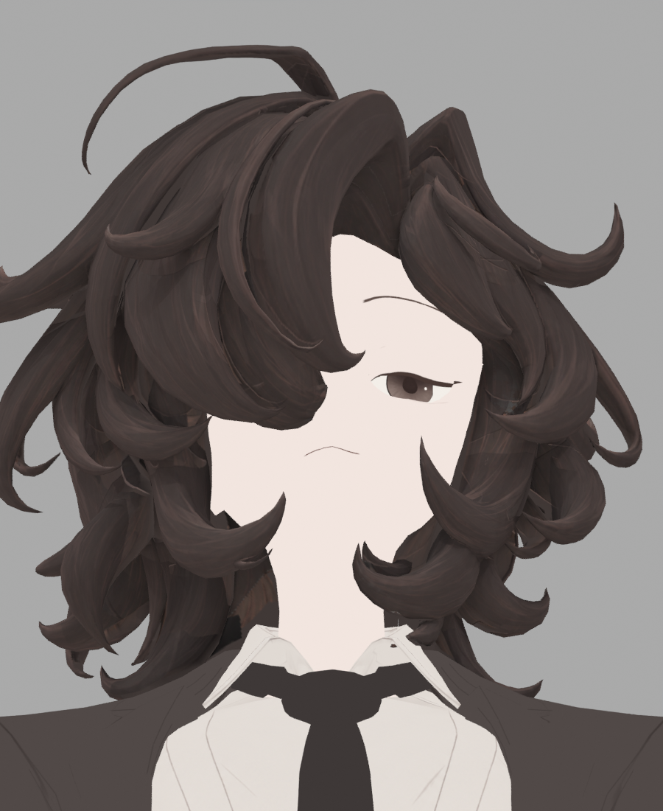

> **기록 시점 안내:** 아래는 해당 단계 당시의 보고서입니다. 후속 결정은 [최신 상태](../../../../STATUS.md)를 기준으로 읽어주세요. 모델·원본 텍스처·검증 원시 데이터는 이 문서 공유본에 포함하지 않습니다.

# v353 GAP24 — 배경 혼입 원인 수정의 독립 검증

**현재 판정: 배경 누수 수정은 실제 저장·픽셀·4방향 사진에서 확인. 정면 채움 경계는 미해결.** GAP22에서 확인한 배경 누수 178개 텍셀은 새 합성에서 모두 제거됐다. 정상 채움 표본은 유지된다. 이 결과를 헤어 전체 완료·최종 채택으로 확대하지 않는다.

## v23 실패를 수정했는가

v23는 `.exr`라는 이름과 다르게 실제 16-bit PNG로 저장되어 미채택했다. v24는 별도 파일에 native `save_render`로 저장했고, 독립 바이너리 파서에서 아래를 확인했다.

- OpenEXR magic `20000630`, 정상 scanline·ZIP 압축.
- PREMULT와 COVERAGE 모두 4096², R/G/B/A 네 채널 모두 pixel_type 2 = **FLOAT32**.
- 해석기는 기존 Blender first-hit export의 15,765개 RGB 부동소수 표본과 오차 **0**으로 먼저 검증했다. 외부 이미지 라이브러리 설치·Blender 재실행 없이 read-only ZIP 복호화와 수치 판독을 했다.

## 실제 float·합성 결과

| 확인 항목 | 결과 |
|---|---:|
| GAP22의 기존 저휘도 누수 178개 | 모두 실제 C=0, P=0 |
| 그중 거의 검정 ≤1인 26개 | 모두 차단 |
| GAP24에서 위 178개가 여전히 최대채널 <24 | 0 |
| GAP21 최대채널 ≥40 → GAP24 <24인 새 텍셀 | 전체 아틀라스에서 0 |
| 이전 14개 coverage 고신뢰 보호 영역 | 5,686,124 텍셀 중 변화 0 |
| GAP21→GAP24 실제 변화 | 56,281 텍셀 |
| 전체 float P/C 유한성 | 통과 |
| C 범위 | 0–0.9815148115 |
| C>1e-6 복원색이 원화 채널별 전역최대+1e-5를 초과 | 0 |

C≤1e-6의 극소 coverage에서는 P 최대 1.5385e-7이 있어도 합성 alpha=0으로 제외된다. **정확히 이전 누수 178점은 C와 P가 모두 정확히 0**이다. 두 조건을 혼동하지 않는다.

실제 원인 추적 표본:

| polygon / atlas x,y | GAP21 | GAP22 | GAP24 | 해석 |
|---|---|---|---|---|
| 8390 / 1550,3240 | 64,56,54 | 82,62,55 | **82,62,55** | 목 왼쪽 정상 채움 유지 |
| 8429 / 1560,3243 | 64,56,54 | 1,0,0 | **64,56,54** | 검정 배경 차단·이전 바탕 유지 |
| 8390 / 1558,3247 | 64,56,54 | 19,15,14 | **64,56,54** | 같은 경계 누수 차단 |
| 12076 / 1847,310 | 64,56,54 | 74,60,54 | **67,57,54** | 약한 방향 신뢰도에서 채움 강도가 낮아짐 |

마지막 표본은 선형 coverage C=.07595606에서 새 alpha=.303824가 되기 때문이다. 이전 raw PNG confidence 78/255에 *4를 하면 1이었으므로, 형식 수정과 함께 신뢰도 응답도 바뀌었다. 따라서 채움이 약해진 부분을 무조건 “디테일 보존”으로 설명하지 않는다. 실제 화면에서 새 공백·경계가 되는지 확인해야 한다.

## 수식 검토

실제 v24 경로는 유효 샘플의 `P=E(fac·paint)`와 `C=E(fac)`를 float 선형으로 저장하고, 합성에서 `P/max(C,1e-6)`를 사용한다. C≤1e-6이면 alpha=0이며 기존 14 coverage의 보호식은 기존과 동일하다. 원화 색 자체를 밝히거나 평탄화하지 않는다. 이 방식은 이전의 “무조건 평균한 PAINT + 별도 평균한 coverage” 경계 오염 구조를 처리한다.

8→24 sRGB에 해당하는 저휘도 support gate가 진한 원화 선까지 일부 제외할 가능성은 여전히 시각 검수 대상이다. 이 보고서의 저휘도 누수 정의는 이전 바탕≥40에서 새 값<24로 바뀐 텍셀에 한정되어 모든 아티팩트·흐림·선 손실을 대표하지 않는다.

수치 원본: HAIR_GAP24_NATIVE_RESULT.json (공유본 미포함: `HAIR_GAP24_NATIVE_RESULT.json`). 재현: audit_gap24_native_result.py (공유본 미포함: `audit_gap24_native_result.py`), 독립 EXR 판독기 (공유본 미포함: `inspect_native_exr.py`), 판독기 자체검증 (공유본 미포함: `EXR_READER_SELFCHECK.json`). 이전 원인 분석: [GAP22 검토](v353_GAP22_ART_DOMAIN_REVIEW.md).

## 실제 4방향 사진 검토

새 GAP24 정면·±90°·180° 사진과 ALBEDO20 대응 사진을 직접 확인했다. 정면 목 왼쪽 GAP22의 새 검정 톱니 테두리는 제거됐다. 그러나 새 갈색 붓결 영역과 남은 단색 바탕 사이의 경계가 계속 보인다. 배경 누수는 수정했지만 불완전 채움의 시각 단차까지 해결한 후보는 아니다.

±90°와 후면에서는 큰 새 변화가 두드러지지 않는다. 두께·실루엣 보존은 이 4개 구도에서의 관찰이며 전 회전·물리 변형 검수는 아니다. ALBEDO20 대비 채널 차이>8인 화면 픽셀은 정면2596, +90°38, 후면73, −90°47개다. 수치에는 새 채움 자체도 포함되어 결함 개수로 해석하지 않는다.

다음 검토는 source polygon8390/8429가 속한 기존 chart114 전체의 격리 가이드다. 다른 가닥·몸에 가려져 전체 그림의 작은 조각으로만 드러나는 영역을 한 번에 자연스럽게 채색하는 방향이며, 기존 기하·UV를 교체하거나 새 가닥 메시를 생성하는 제안이 아니다.
