> **기록 시점 안내:** 아래는 해당 단계 당시의 보고서입니다. 후속 결정은 [최신 상태](../../STATUS.md)를 기준으로 읽어주세요. 모델·원본 텍스처·검증 원시 데이터는 이 문서 공유본에 포함하지 않습니다.

# v353 — 신규 헤어 알베도와 관절·물리 원인 검토

전체 작업은 진행 중이다. 이 문서는 실제 제작·실행한 후속 실험을 기록하며, 아바타 전체 완료나 PC VRChat 클라이언트 검수 통과를 뜻하지 않는다. 최종 기준은 Unity 게임/PC VRChat에서 조명·포즈·물리가 변해도 원화의 NPR 인상과 디테일이 유지되는 것이다.

## 헤어: 고정 조명 띠와 전사 경계를 분리

기존 초기 아바타 텍스처를 새 채색 원본으로 사용하지 않았다. 승인된 2D 캐릭터 일러스트를 스타일 기준으로 삼고, 이번 작업에서 만든 투영 원화의 가로 하이라이트와 넓은 방향성 그림자를 줄인 새 알베도 원화를 앞·양옆·뒤 다섯 시점으로 제작했다. 가닥을 따라 흐르는 선, 컬 끝과 겹침의 얇은 구분선은 남겼다. 과도하게 어두운 접점이나 시점별 색 차이까지 모두 해결됐다는 뜻은 아니다.

Blender는 Computer Use로 조작했다. 기존 두 메시를 임시 복사해 데이터 패스와 전사를 계산한 뒤 제거했고, 원본 메시·UV·본과 재질 바인딩을 복원했다. 새 헤어 형상이나 대체 메시를 만들지 않았다.

아래 각 행은 같은 각도, 같은 모델이다. 왼쪽은 이번 단계의 비교 기준인 새 v353 defined2, 가운데는 다섯 원화의 전사 V14, 오른쪽은 바탕 무늬를 제거한 진단 V15다. 원본 초기 텍스처와의 전후 사진으로 오해하지 않도록 구분한다.

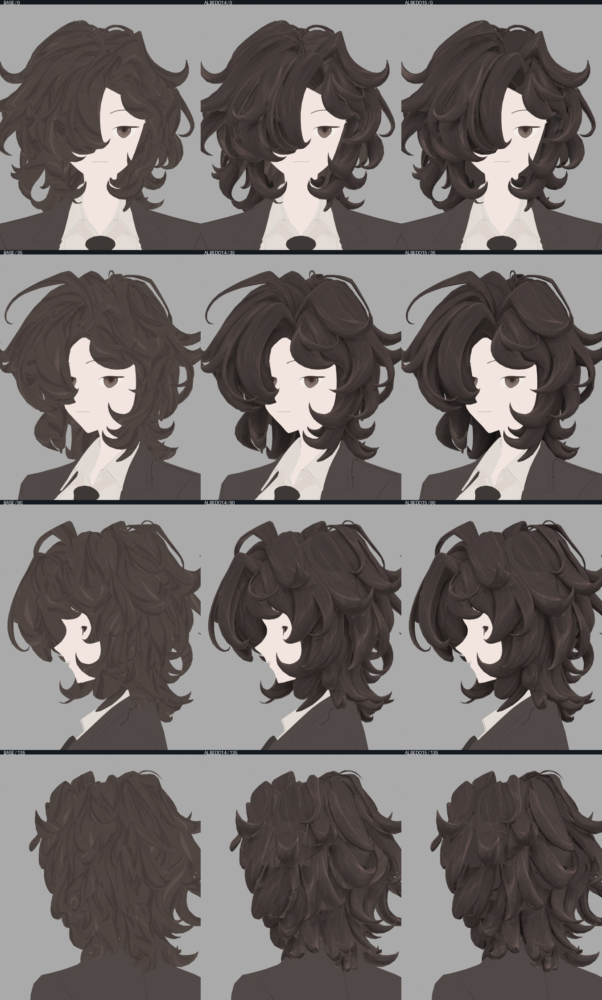

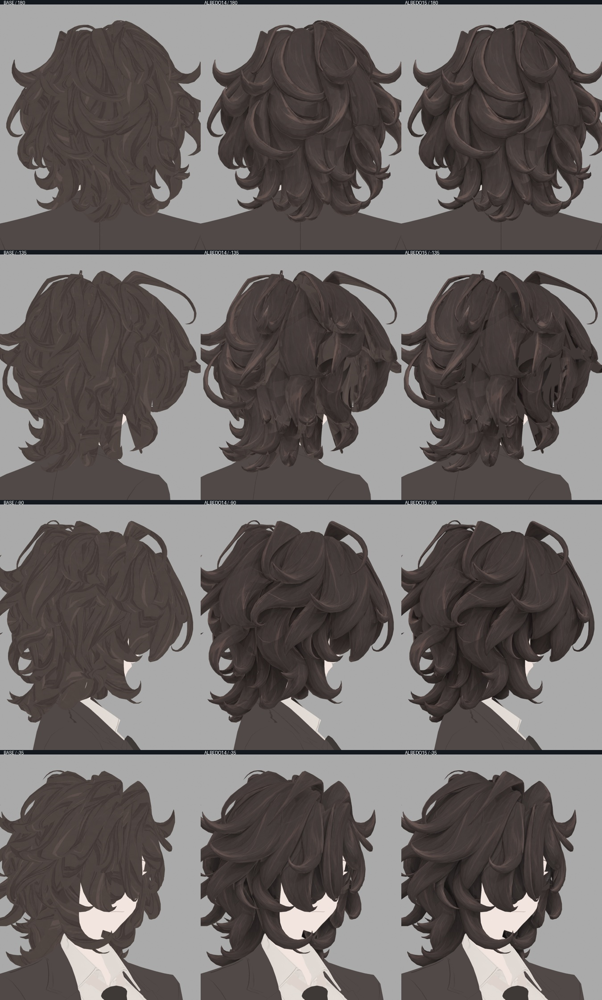

제작자가 두 연락판의 24칸과 주요 900×1100 원본을 직접 확인했다. 앞머리와 뒤통수의 큰 가로 띠가 줄었고 세로 가닥 선은 유지됐지만, 양옆과 뒤 대각선에는 색이 삼각형처럼 나뉘는 부분이 남았다. V14와 V15 모두 전체 헤어 완성본으로 채택하지 않았다. V15는 미전사 영역의 기존 새 바탕 무늬를 단색으로 바꾼 진단이므로, 가려진 부분까지 디테일이 완성됐다고 판단할 수 없다.

| 시도 | 확인한 점 | 판정·이유 |
|---|---|---|
| V12 동일 UV 섬 ID로 첫 표면 검사 | 같은 섬 안의 다른 겹친 면이 ID 일치를 만들 수 있음 | 면 중심 깊이와 첫 표면 깊이를 직접 비교하던 검증 방식 수정 |
| 독립적인 픽셀 중심 광선 대조 | 원래 31,263개 가림 삼각형에서 가장 가까운 면을 계산해 실제 EXR 깊이·섬 ID·표면 종류와 대조 | 임계값을 완화하지 않고 검증 대상을 올바르게 수정. 기존 실패 파일 보존 |
| V13 뒤 원화의 가로 하이라이트 제거 | 뒤통수에 적용해 원화 자체의 밝은 가로 띠가 원인이었던 부분 확인 | 뒤 부분 개선. 다른 각도는 별도 확인 필요 |
| V14 다섯 신규 알베도 전사 | 픽셀 정렬 합성, 전사되지 않은 영역은 defined2와 차이 0 | 앞·뒤 개선, 옆면 경계 잔여로 전체 미채택 |
| V15 단색 바탕·전사 강도 대조 | 같은 옆면 경계가 남음 | 바탕 무늬만의 문제가 아님. 디테일 완성 후보로 사용하지 않음 |
| 실제 런타임 UV 15,928삼각형 내부 겹침 검사 | 양의 면적 겹침 0쌍 | 이 경계를 UV 겹침 탓으로 단정하지 않음 |
| 렌더 픽셀→첫 면→UV→원화 기여 추적 | 같은 위치에서 앞 원화 RGB 31/25/24, 옆 원화 73/64/62처럼 다른 색이 합성되는 구간 확인 | 생성 원화의 국소 표현·정합과 합성 비중 문제. 그림자만 셰이더로 숨기지 않음 |

V16에서는 일정 각도 이상이면 모든 시점의 비중이 같아지던 제한을 없애고, 실제 표면을 정면으로 보는 시점을 더 우선하도록 코사인 6승 비중을 적용했다. 같은 페인트 픽셀과 가림 조건을 유지하고 비중만 바꿨다. 양옆의 큰 삼각형 색 경계는 줄었지만 뒤 대각선의 미전사 영역은 남았다. V16을 전체 채택하지 않았다.

V17은 실제 기존 메시에서 뽑은 ±135도 회색 가이드에 새 채색 원본 두 장을 추가했다. 승인된 2D 원화는 스타일 기준, 앞서 만든 새 뒤통수 알베도는 가닥 선과 색 기준으로 사용했다. 기존 초기 아바타 텍스처를 입력하지 않았다. 내장 image_gen으로 생성한 두 원본을 프로젝트에 복사하고 프롬프트·입력/출력 SHA를 함께 기록했다. 지시한 핵심은 기존 컬과 화면 정합 유지, 차분한 갈색, 길이 방향의 선명한 가닥 선, 넓은 반사 띠·방향성 그림자 배제다.

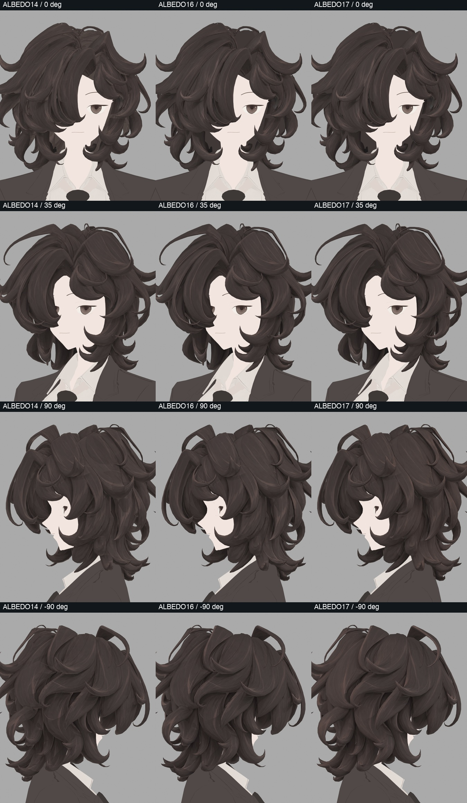

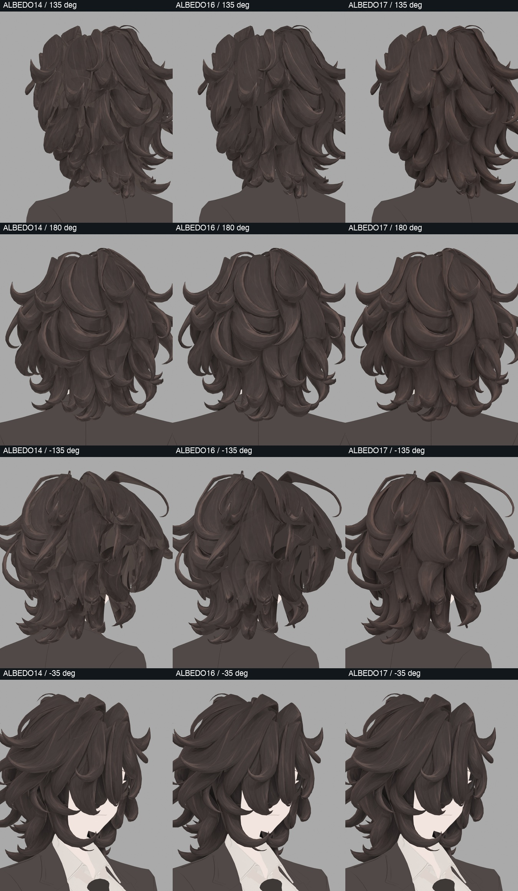

제작자가 8방향 전체 비교와 ±135도 원본을 직접 확인했다. 뒤 대각선에서 단색 면이 크게 드러나던 부분이 줄고 가닥의 선이 이어졌다. 일부 겹침 부근의 가는 색 경계, 정수리와 안쪽의 미전사 면, 동작 시 드러나는 면은 여전히 최종 전수 검수 대상이다. 텍스처를 흐리는 처리는 하지 않았다.

Unity에서는 동일한 목띠 교정 프리팹·재질·형상에서 헤어 색 이미지 하나만 바꿔 8시점 × 좌우 조명 × 3조건, 48장을 촬영했다. 아래는 defined2 기준 / V16 / V17이다. BASE의 Unity hair_V9 파일과 Blender defined2의 SHA가 같음을 별도로 확인했다. 사진의 좌우는 Unity 카메라 기준이므로 Blender 각도 부호와 인물 좌우를 혼동하지 않는다.

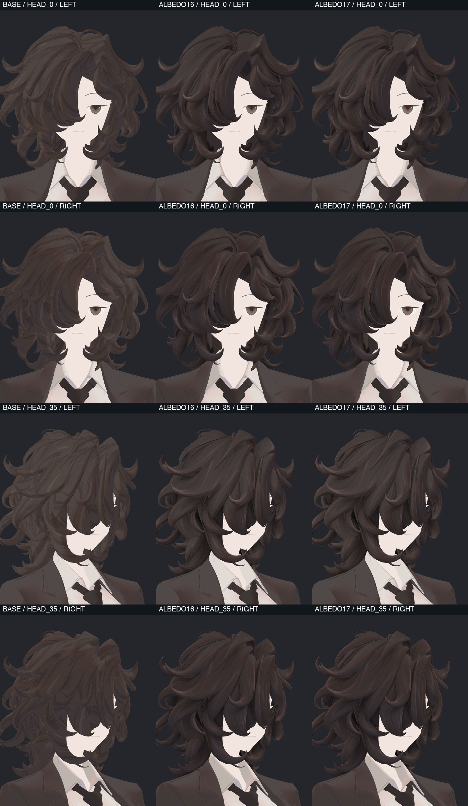

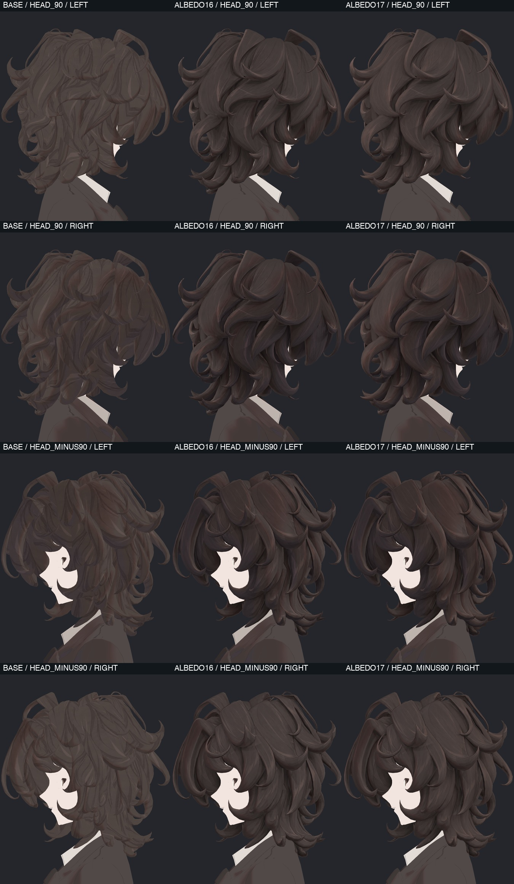

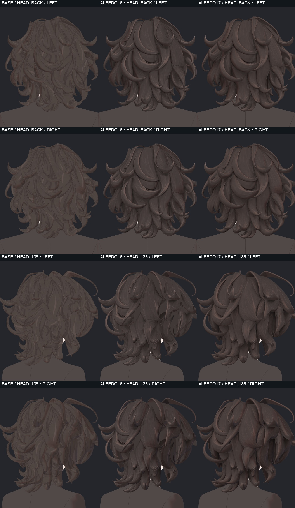

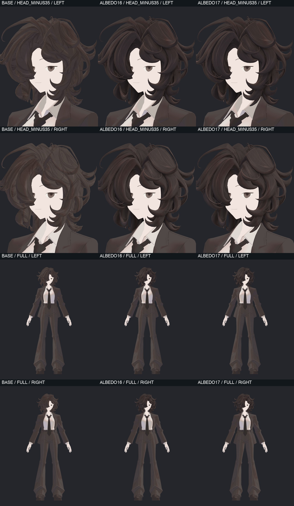

48장 모두 연락판으로 확인하고 뒤·대각선·앞머리 원본도 확대 확인했다. 원래 장면과 원본 프리팹 종속 파일은 유지됐다. 좌우 조명에서 뒤 대각선의 개선이 유지됐으며 앞머리 실루엣과 얼굴 형상은 바뀌지 않았다. 이는 두 조명 검수이며 모든 환경·표정·물리 또는 PC 클라이언트 합격은 아니다.

`bianca_v353_HAIR_ALBEDO17_REVIEW.blend`를 검수 사본으로 저장했다. 새 헤어와 이미 검증한 어두운 넥타이 목띠만 포함하고 실패한 어깨·물리 후보는 합치지 않았다. 실제 GUI로 다시 열어 메시 좌표·토폴로지·모든 UV·웨이트·기존 셰이프키 지문이 같고, 패킹된 두 4096 이미지가 원본 PNG SHA와 같음을 확인했다. 처음 검증에서는 이미지가 아직 지연 로드 상태인 것을 실패로 처리했으므로, 픽셀 로드를 명시한 뒤 실제 데이터와 SHA를 대조하도록 검증 도구를 수정했다. 파일 자체의 텍스처 누락은 없었다. Unity에도 `Bianca_v353_HAIR_ALBEDO17_REVIEW.prefab` 사본을 만들고 다시 읽어 헤어 이미지 바인딩·기존 메시 참조·129스킨 본을 확인했다. 기존 재질의 노멀과 그림자 설정은 유지했다.

## 넥타이: 정지 중력과 동작 중 관통을 따로 판단

원본 기준·분포 조정·매듭 회전 분담 20%/35%·셔츠 콜라이더·원본 반복의 6조건을 각각 중력 1,800프레임, 연속 동작 4,800프레임으로 실행했다. 중력은 조건당 66표면 표본, 연속 동작은 조건당 167표본이다. 완료 기록과 장면 복원을 확인했으며, 사진의 재질은 이 물리 시험의 고정 기준이다. 최신 색 교정 전체를 합친 최종 아바타 사진은 아니다.

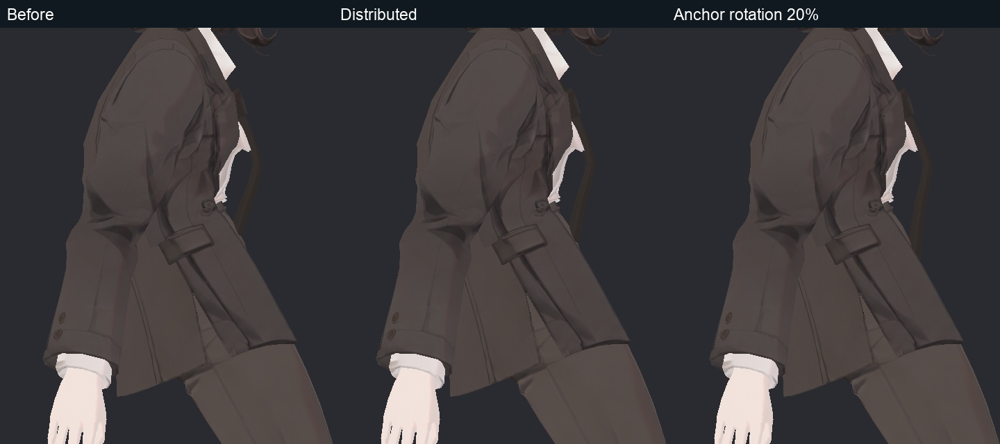

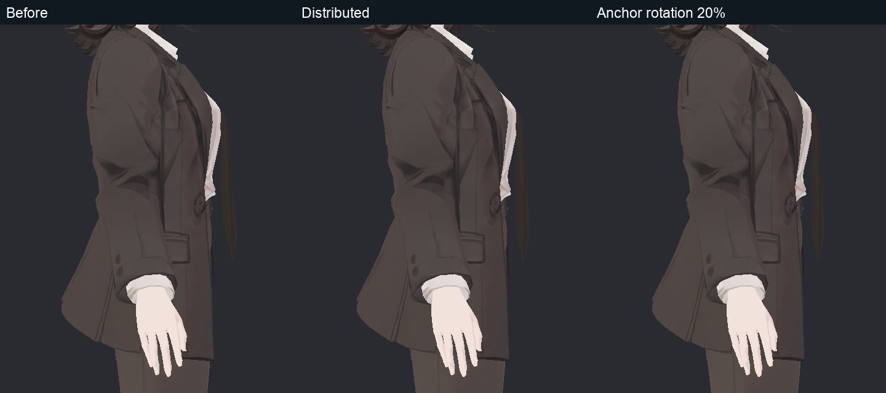

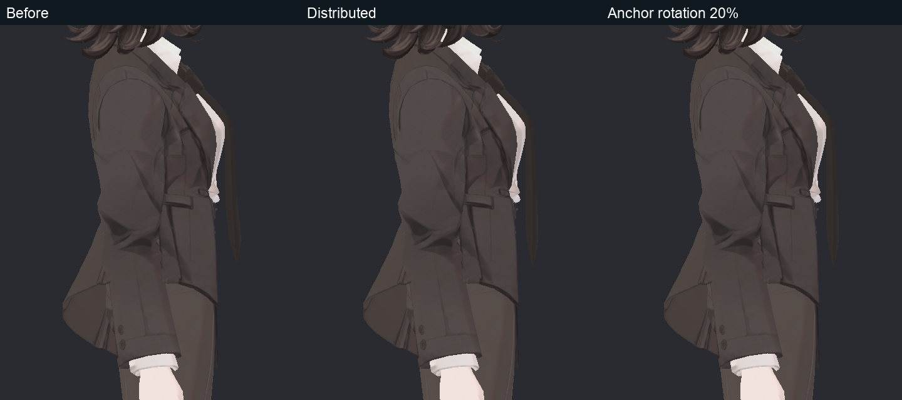

| 조건 | 앞으로 기울여 안정화한 넥타이 방향과 중력의 각도 | 연속 Bend의 90프레임에서 넥타이–셔츠 교차 삼각형 쌍 |
|---|---:|---:|
| 기준 | 12.69° | 26 |
| 분포 조정 | 5.25° | 26 |
| 매듭 회전 20% | 0.48° | 56 |
| 매듭 회전 35% | 3.15° | 96 |
| 셔츠 콜라이더 추가 | 5.25° | 26 |

각도는 루트부터 끝 본까지의 방향을 측정한 값이며, 천 전체의 자연스러움 점수가 아니다. Bend의 90은 프레임 번호이며 90도 굽힘을 의미하지 않는다. 20% 후보의 정지 방향은 좋아졌지만 동작 중 숨은 교차가 늘어 채택하지 않았다. 중력 표본에는 넥타이–셔츠 교차가 없었으나 코트–바지 교차가 조건당 20표본에 남아 있으며, 이를 넥타이 결과와 섞어 해결로 쓰지 않는다.

연속 기준 반복의 최대 본 위치 차이는 0.3442mm로, 부동소수점·물리 반복 차이가 존재한다. 넥타이 교차는 기준과 반복 모두 26쌍으로 재현됐다. 삼각형 교차 선분 길이는 관통 깊이가 아니므로 깊이로 표현하지 않는다.

공식 문서에서 PhysBone의 충돌은 지정한 본 반경과 콜라이더에 의해 계산되며 메시 표면 자체 충돌이 아님을 재확인했다. `Allow Collision=False`도 명시적으로 연결한 콜라이더를 비활성화하는 설정은 아니다. 따라서 단순히 이 옵션을 켜는 해결책은 적용하지 않았다. [VRChat PhysBones 공식 문서](https://creators.vrchat.com/common-components/physbones/)

추가 셔츠 콜라이더의 실제 위치가 예상한 표면 지지 위치보다 뒤로 이동한 것을 확인했다. 기존 ParentConstraint의 평균 회전·오프셋 대신 각 셔츠 지지 본 아래의 동일한 기준점을 개별 이동시키고 PositionConstraint로 위치를 가중 합산하는 두 후보를 만들었다. 메시·UV·웨이트·기존 스킨 본을 유지하며 실제 저장/재로드에서 중립 표면 차이 0mm를 확인했다. 이것은 제작 검증이며, 이후의 실제 동작 접촉 검증과 구분해 기록한다.

그 후 분포 기준·위치 가중 지지·매듭20%와 위치 가중 지지의 세 조건을 각각 4,800프레임 실행했다. 완료와 장면 복원 일치, 조건당 167표면 표본을 확인했다. 같은 Bend 90프레임의 넥타이–셔츠 교차는 각각 **26 / 16 / 50쌍**이었다. 위치 가중 지지만으로 감소했지만 해결은 아니다. 매듭20% 결합은 회귀로 제외한다. 나머지 표본의 해당 교차와 이 동작의 넥타이–코트·코트–바지 교차는 0이었다. 이 결과를 별도의 중력 기울임에서 남는 코트 교차의 해결로 확대하지 않는다.

잔여 교차는 셔츠의 기존 지지 면 주변에 모여 있었다. 두 구형 지지 콜라이더의 여유를 각각 1mm/2mm 늘린 별도 후보로 같은 4,800프레임 동작을 완료했다. 세 조건의 167표면 표본을 전부 비교한 결과, 원래 가중 지지는 16쌍의 셔츠 교차가 남았고 PAD1/PAD2는 넥타이–셔츠·넥타이–코트·코트–바지 교차가 모두 0이었다. 같은 입력의 반복에서 원래 가중 지지의 교차 선분 길이는 달라졌지만 16쌍이 재현됐다. 작은 변화인 PAD1을 우선 검토하며, 별도의 중력 자세와 연속 영상 검수 전에는 최종 채택하지 않는다.

중력 추가 검수도 세 조건 × 1,800프레임을 완료하고 장면 복원을 확인했다. 조건당 66표면 표본에서 넥타이–셔츠·넥타이–코트 교차는 모두 0이었다. 기존 자켓–바지 교차 20표본·최대 63쌍은 세 조건이 같아 해결되지 않았다. PAD1의 안정화 후 방향 각도는 앞으로 5.25°, 좌우 9.49°/9.45°였다. PAD2는 좌우 10.74°/10.96°로 더 많이 밀리므로 작은 PAD1을 우선 검토한다. 아래 정면·측면 18칸을 제작자가 확인했으며, 이 해상도에서 1mm 후보에 큰 실루엣 변화나 새 떠오름은 보이지 않았다. 넥타이의 기존 표면 굴곡과 코트 처짐 문제는 그대로 드러나며, 중력 각도 수치만으로 천의 자연스러움을 합격 처리하지 않는다.

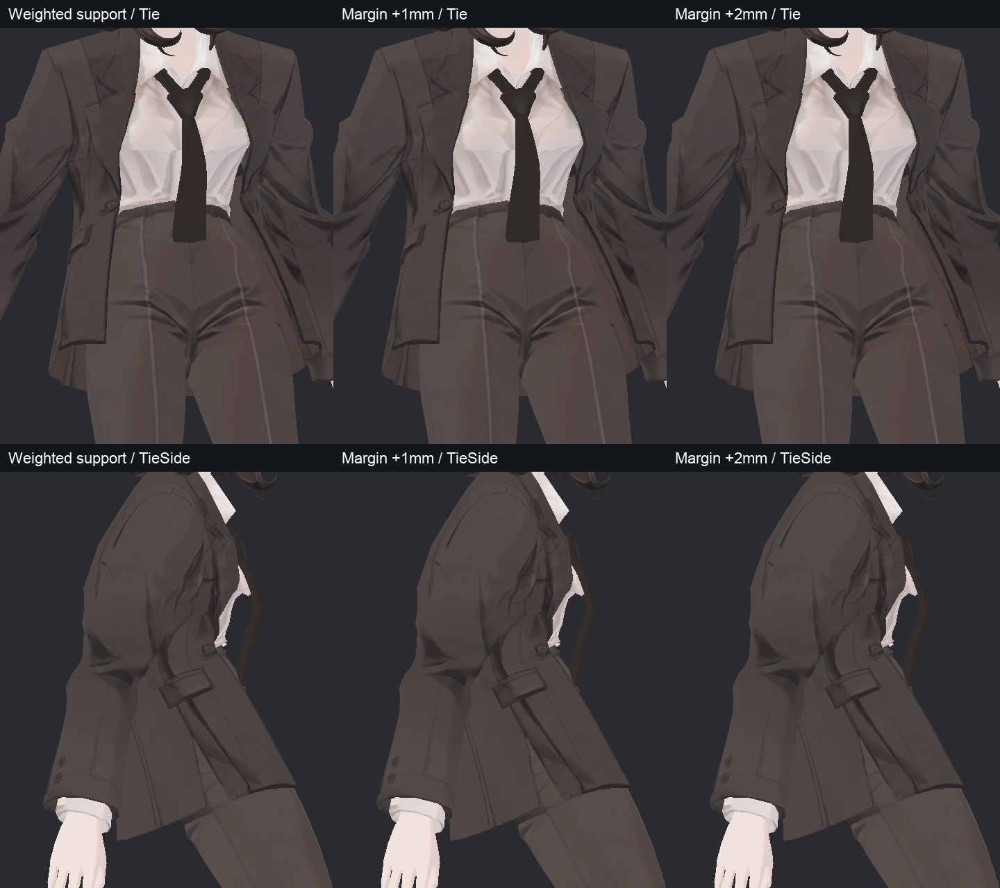

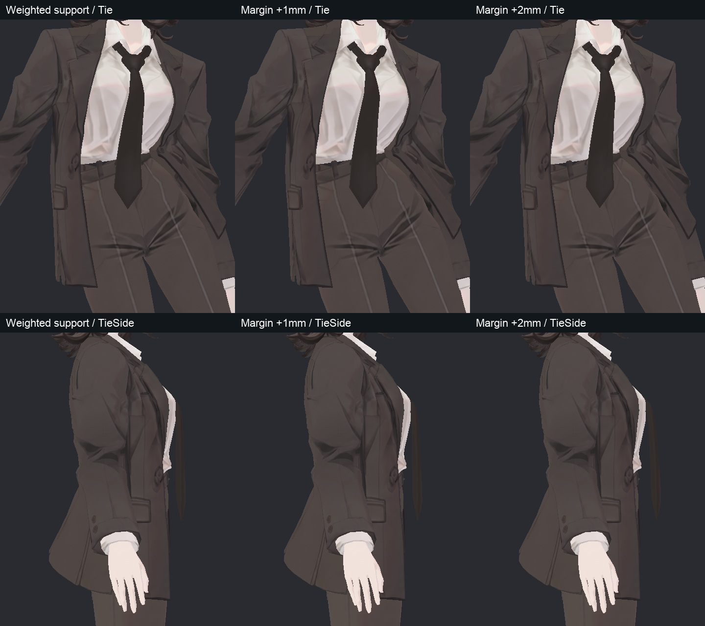

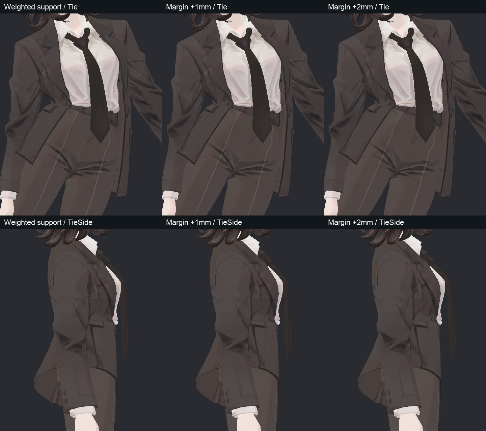

검사 도구의 종료 지연도 조사했다. 완료 파일은 기록됐지만 Unity가 Play를 나가며 약 46GB 규모의 프로세스 메모리에서 관리 객체 GC를 수행하고 있었다. 강제 종료하지 않고 원래 장면 복원까지 확인했다. 이후 매 프레임의 기록을 메모리 배열에 누적했다가 마지막에 쓰는 방식을, 프레임별 JSON 스트림으로 바꿨다. 물리 입력·SDK 완료 콜백·표본 주기·파일 스키마를 유지하며 새 세 후보의 각 4,800프레임+30워밍업 기록이 정상 JSON으로 저장되고 원래 장면 복원도 완료됐다. 저장 완료 기록에서 누적 보관하는 행은 0으로 확인됐다. 이는 아바타 런타임 스크립트가 아니라 Editor 검사 도구 수정이다.

## 자켓 Cloth: 계산 순서 가설 대조

기존 최대 이동 허용 0.01mm 대조에서도 현재 스킨과 Cloth의 위치가 최대 약 14mm 달라져, 단순 파라미터 튜닝을 하기 전에 원인을 검토했다.

- 기존 정점 3,894개는 원래 위치 1,736개로 대응하고 Cloth 입자도 1,736개다. 같은 위치에 중복된 1,375그룹에서 서로 다른 본 웨이트가 섞인 경우는 없었다.
- 최근접 스킨 위치나 전체 강체 변환으로 다시 맞춰도 오차가 남아, 단순 정점 번호 순서나 전체 위치 변환 차이로 설명되지 않았다.
- Update 전, HumanPose 적용 후 LateUpdate, SDK 처리 완료, EndOfFrame에서 동일 프레임의 실제 Cloth와 스킨을 각각 기록했다. 세 기울임 모두 네 시점의 기준 스킨은 같았고, Cloth 오차도 유지됐다.
- 이 시점의 최대 차이는 왼 기울임 13.7228mm, 오른 기울임 14.0631mm, 앞 기울임 11.3135mm였다. 1,800프레임 실행과 원래 장면 복원이 완료됐다.

따라서 단순한 촬영·계산 시점 차이를 원인으로 채택하지 않는다. Cloth 원인 전체가 확정되거나 드레이프가 해결된 것은 아니다. 공식 maxDistance 설명과 현재 실측이 어긋난다는 사실만으로 특정 Unity 버전 버그라고 단정하지 않는다. 기존 검사에서 셰이프키를 끈 기준도 같은 오차였으므로 표정·관절 보정키 삭제를 해결책으로 삼지 않는다.

## 어깨와 전체 관절

기존 32키와 129스킨 본을 보존한 어깨 35% 후보를 Unity에서 299정적·121연속·120복귀, 총 540표본으로 실행했다. 팔 올림에서 좌우 신규 보정키가 실제 100% 작동했다. 최초 실행은 무거운 초기 자료 추출 시간까지 SDK 콜백 대기 시간으로 계산해 측정 0표본에서 종료됐으며, 초기화 종료 후 타이머를 시작하도록 검사 도구를 고친 뒤 새 출력 폴더에서 다시 실행했다. 실패 자료는 보존했다.

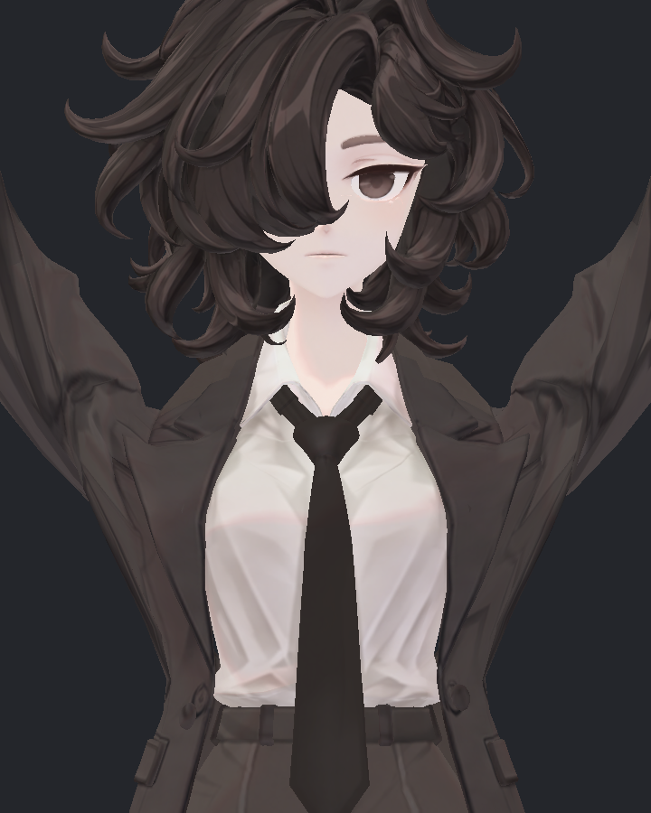

35%와 65% 모두 540표본 실행·실제 표면 비교를 마쳤다. 변경 정점을 포함하는 코트 삼각형 전체를 몸·헤어·코트와 비교했으며, 원본에도 있던 교차와 새 교차를 구분했다. 35%는 1,297삼각형, 65%는 1,313삼각형을 이 범위로 검사했다.

| 후보 | 새로운 교차가 생긴 표본 | 새 교차의 최대 선분 길이 | 새 면적 경고 표본 | 판정 |
|---|---:|---:|---:|---|
| 부피35% | 2 / 540 | 2.8818mm | 3 / 540 | 미채택 |
| 부피65% | 2 / 540 | 7.5169mm | 3 / 540 | 미채택 |

두 후보 모두 확대 사진의 어깨 경계가 여전히 꺼져 있고, 강한 보정은 새 교차를 키웠다. 선분 길이는 관통 깊이가 아니다. 변경 범위 밖의 최대 표면 차이는 0.000247mm 이하, 몸·헤어는 0.000067mm 이하의 수치 오차였다. 모든 비변경 영역에 대해 새로운 접촉 전체를 검사했다는 뜻은 아니며, 공면 접촉·표본 사이의 연속 충돌도 별도 한계다.

사진의 빈 부분에서 표면을 양면으로 추적한 지점에도 삼각형이 없었다. 해당 지점은 노멀이나 고정 그림자만의 문제가 아니라 실제 변형 실루엣 문제다. 가까운 어깨 위 정점이 윗팔에 약 64~84% 묶인 사례를 확인했다. 다음 세 후보는 기존 위쪽 정점 294개의 윗팔 영향 일부를 기존 쇄골로 옮기는 방식이며, 새 본·새 형상·UV 변경 없이 별도 제안으로 준비했다. 현재는 실제 Unity 적용·회귀 검증 전이며 해결로 기록하지 않는다. 오프라인 예측에서도 기존 팔 보정 셰이프키를 빼면 ArmsForward에 8.55mm 오차가 생겨, 실제 기록 표면에서 활성 보정을 보존하도록 계산을 수정했다.

사진은 물리 OFF 관절 검사이며 머리·의복의 물리 완료 증거가 아니다.

## 검수 범위와 계속할 작업

이번 추가 결과는 제작자 직접 검수다. 앞선 눈 63장·단추 32장의 독립 검토와 달리, 이번 후속 검토용 에이전트는 사용량 한도로 새 검토를 수행하지 못했다. 독립 검토 완료로 계산하지 않는다.

헤어 옆면 색 경계 및 가려진 면의 디테일, 넥타이와 셔츠 접촉, 자켓 처짐·접촉, 어깨 경계와 전체 회귀, 헤어 동작 중 가닥 접촉, 통합본의 다양한 Unity 조명·실사용 비용 및 PC 클라이언트 확인이 남아 있다. 새 관련 문제는 현재 작업 범위 안에서 수정·재검증한다. 기존 무릎·손가락 수용 상태와 향후 iPhone 표정 지원 가능성을 보존한다.
