> **기록 시점 안내:** 아래는 해당 단계 당시의 보고서입니다. 후속 결정은 [최신 상태](../../STATUS.md)를 기준으로 읽어주세요. 모델·원본 텍스처·검증 원시 데이터는 이 문서 공유본에 포함하지 않습니다.

# v353 — 정수리·머리 안쪽과 넥타이 연속 검수

전체 제작은 계속 진행 중이다. 이 문서는 [직전 알베도·관절·물리 검토](v353_ALBEDO_RIG_ROOT_REVIEW.md) 이후 실제 실행한 결과를 기록한다. 완료 기준은 Unity 게임/PC VRChat에서 원화의 NPR 인상·디테일과 움직임이 유지되는 것이며, 아직 통합본과 PC 클라이언트 검수는 완료되지 않았다.

## 1. 정수리: 이전 사진에서 드러나지 않았던 단색 면 보완

수평 8방향에 더해 위 60도·아래 30도에서 앞뒤좌우를 촬영했다. V17의 정수리 중앙과 일부 머리 안쪽은 전사가 닿지 않아 새 갈색 바탕만 보였다. 흐림 필터로 가리는 대신, 기존 메시의 위쪽 앞·뒤 실제 가이드에 새로운 원화 두 장을 제작했다. 기존 초기 아바타 텍스처는 입력하지 않았다.

새 원화는 승인된 2D 캐릭터의 일본 애니메이션·일러스트 스타일과 이번 v353에서 만든 갈색·가닥 표현을 기준으로 내장 image_gen을 사용했다. 프롬프트는 화면상의 컬·끝·겹침과 카메라 고정, 가닥 길이 방향의 선, 차분한 갈색, 넓은 방향성 그림자와 반사 띠 제거를 명시했다. 생성 원본·프롬프트·SHA는 작업 저장소에 보존했다. 공개 문서에는 실제 모델 적용 사진만 선별했다.

Blender Computer Use로 원래 15,928개 헤어 삼각형의 첫 표면을 판정해 UV에 전사했다. 새 두 시점 각각 독립 광선 259개가 일치했고, 최대 깊이 차이는 약 0.0011mm였다. 이는 전사 위치 검증이며 원화의 미관 합격을 대신하지 않는다. 원래 메시·모든 UV·재질 바인딩을 복원했다.

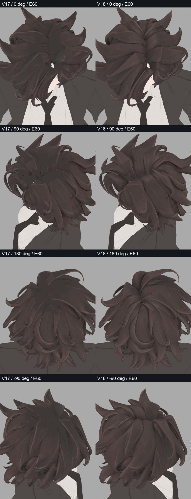

정수리의 큰 단색 면에 가닥 흐름이 생겼다. 같은 컬의 경계·실루엣·얼굴 형상은 유지했다. 아래쪽은 이 두 시점으로 채워지지 않으므로 별도 전사를 이어간다.

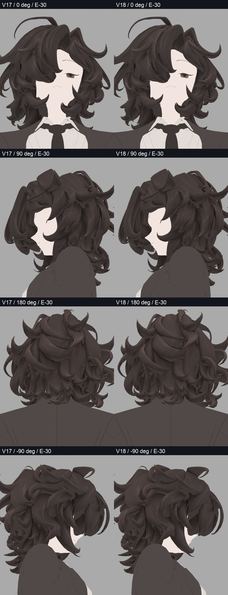

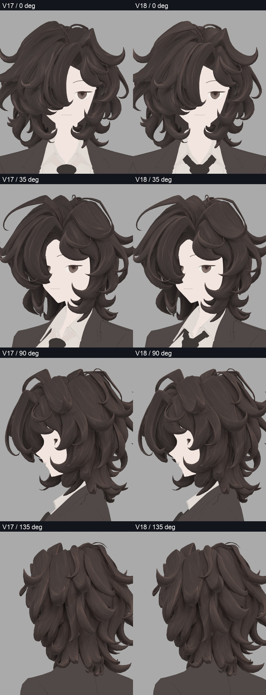

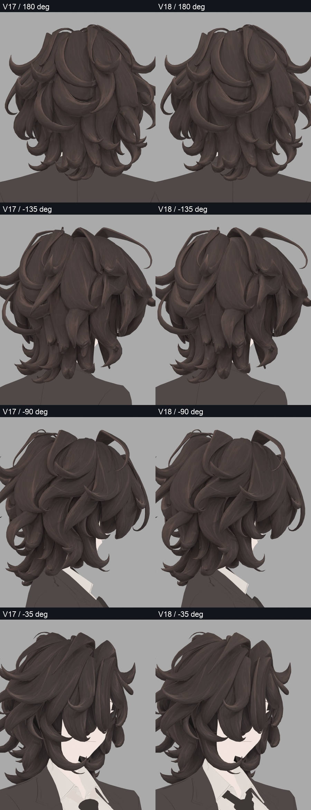

수평 Blender 비교의 V17 사진은 목띠 교정 적용 전, V18은 검증한 어두운 목띠 적용 후다. 따라서 이 두 수평 연락판은 헤어 비교에만 사용한다. 목띠 차이를 헤어 작업의 효과로 해석하지 않는다. 아래 Unity 비교는 양쪽 모두 동일한 목띠 교정 원본을 사용하여 헤어 색 이미지 하나만 바꾼 대조다.

## 2. Unity 실제 적용과 저장·재열기

V17/V18 × 16시점 × 좌우 조명으로 64장을 촬영했다. 위·아래 시점과 수평 시점, 전신을 포함한다. 제작자가 64칸 전체와 주요 원본을 확인했다. 원본 프리팹 종속 해시와 활성 장면 보존이 통과했다. 물리 OFF의 표면 비교이며 동작 중 가려진 면이나 모든 조명 환경의 합격은 아니다.

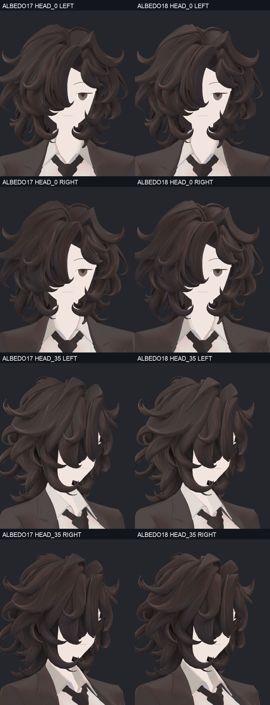

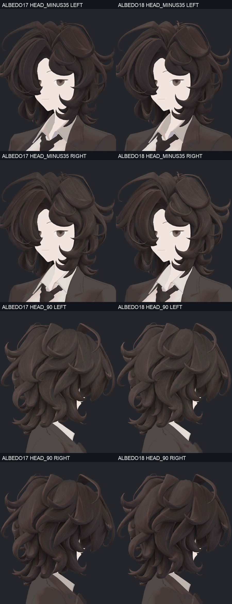

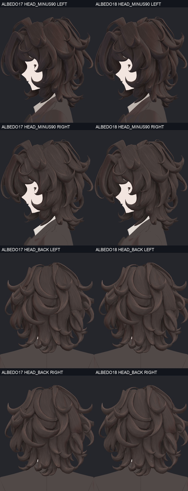

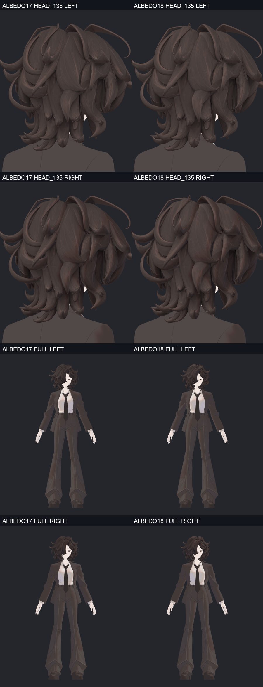

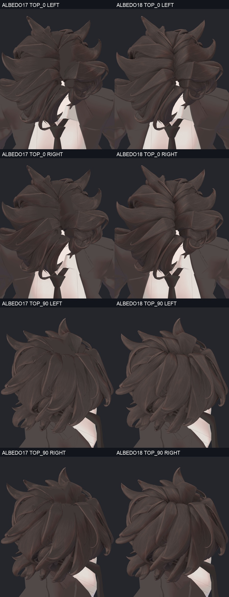

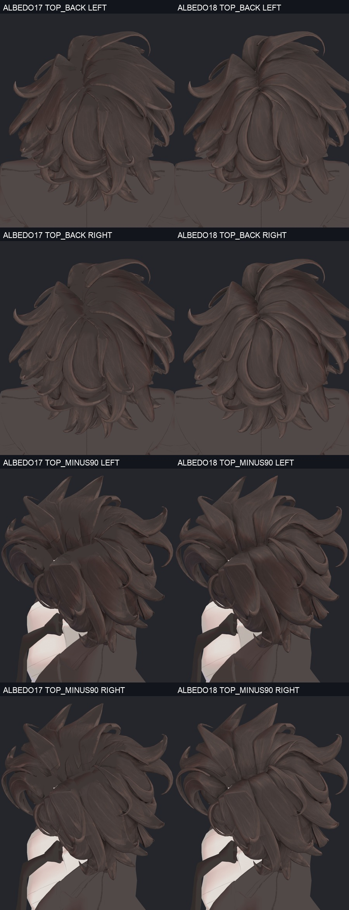

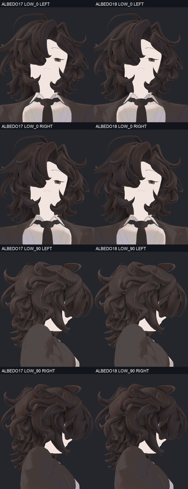

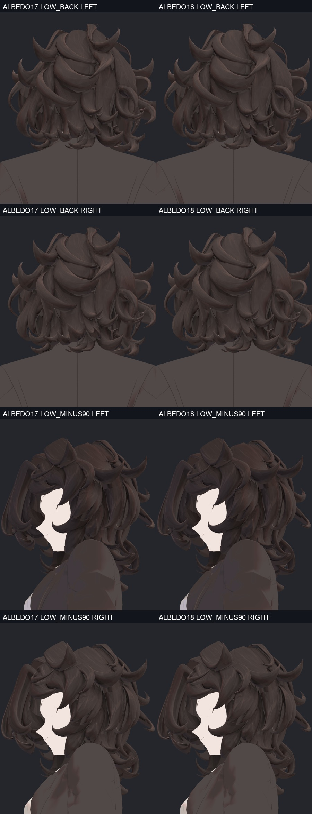

`bianca_v353_HAIR_ALBEDO18_REVIEW.blend`를 별도 저장하고 실제 GUI에서 다시 열었다. 메시 좌표·토폴로지·모든 UV·웨이트·기존 셰이프키 지문이 일치했고, 패킹된 두 4096×4096 이미지의 SHA도 실제 PNG와 같았다. Unity의 `Bianca_v353_HAIR_ALBEDO18_REVIEW.prefab`도 별도 저장·재로드해 동일 메시 참조와 129스킨 본, 새 헤어 바인딩을 확인했다. 실패한 어깨·Cloth 후보를 합치지 않았다.

### V19 후속: 아래에서 보이는 면까지 새 전사

아래 45도 앞·뒤 실제 가이드로 신규 채색 두 장을 추가했다. 원래 초기 아바타 픽셀을 사용하지 않았고, 이번 신규 원화의 가닥 선·갈색과 승인된 2D 스타일을 기준으로 만들었다. 첫 표면 광선 대조는 앞 259개·뒤 257개가 일치했고, 최대 깊이 차이는 각각 0.00481mm·0.000683mm였다. 실제 가시 면에만 전사하고 11시점 기여를 정규화해 V19를 만들었다.

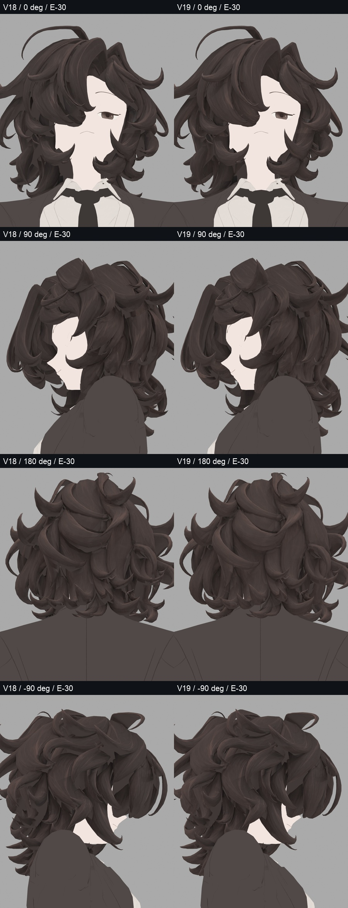

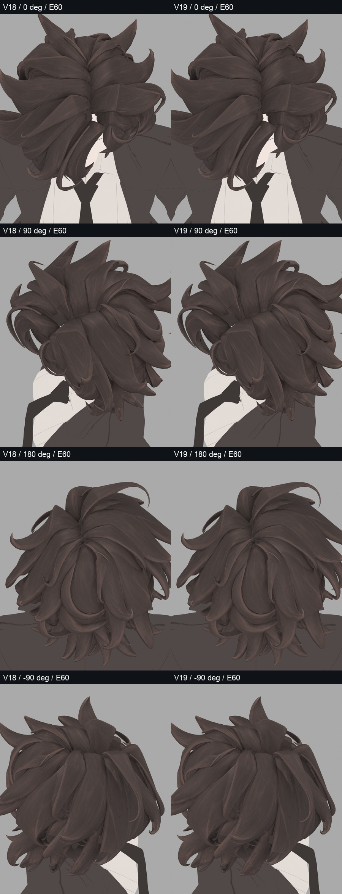

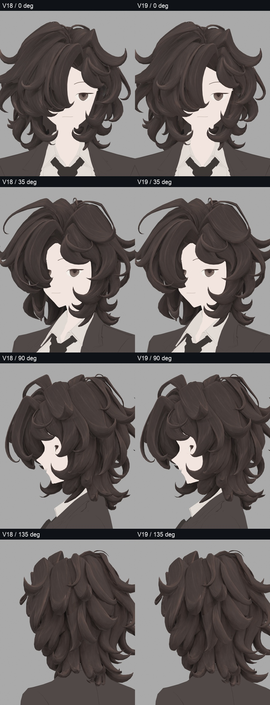

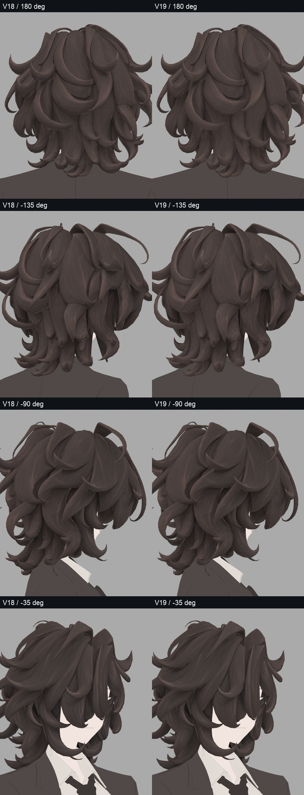

제작자가 실제 Blender 16시점의 전후 32칸을 확인했다. 특히 아래 정면의 단색 띠와 뒤 아래 가닥에서 선이 이어졌다. 정수리와 수평 방향의 기존 컬·실루엣은 유지됐다. 모든 겹친 머리 내부나 동작으로 새롭게 드러나는 면까지 완성됐다는 뜻은 아니다.

첫 수평 촬영에서는 도구가 이전 V18 함수를 참조한 오류가 있었다. 폴더 이름 대신 실제 적용 이미지 SHA·variant를 검사해 발견했고, 잘못 촬영한 폴더를 MISLABELED18로 보존한 뒤 V19를 다시 촬영했다. 기존 사진의 이름만 바꿔 수정 후로 쓰지 않았다.

Unity도 V18/V19의 같은 16시점·좌우 조명으로 64장을 추가 촬영하고 모든 연락판과 아래 정면·후면의 원본 두 장을 직접 확인했다. 아래쪽에 새 가닥 디테일이 생기는 변화가 Unity에서도 유지됐다. 같은 형상·재질에서 이미지 하나만 바꿨으며 원본 프리팹과 장면을 보존했다.

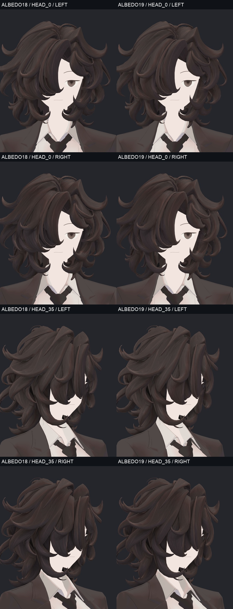

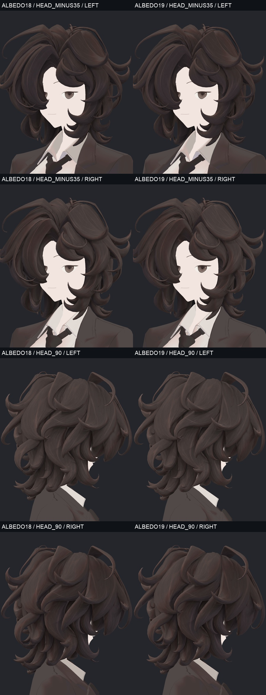

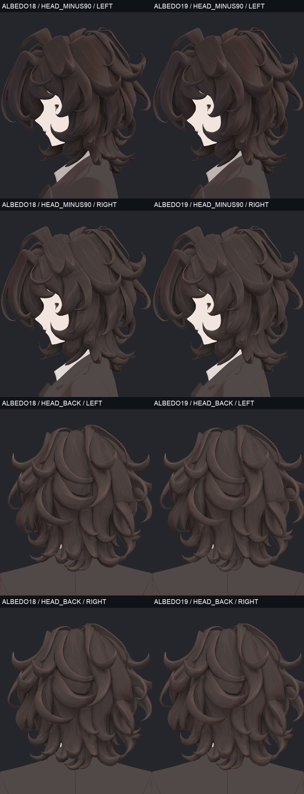

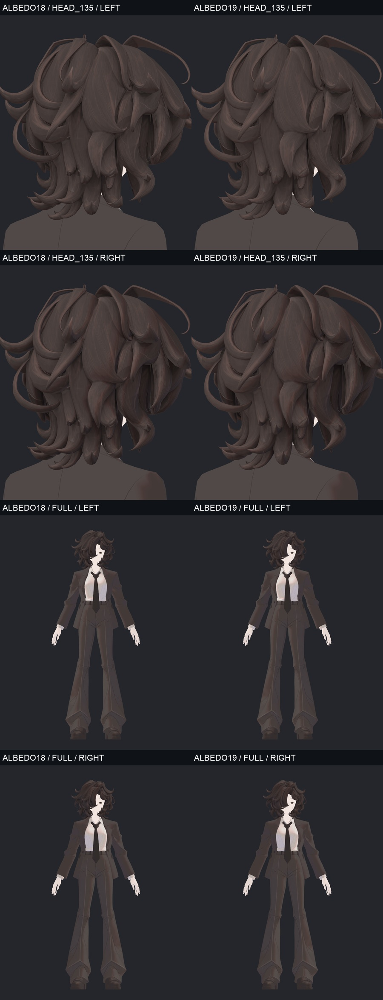

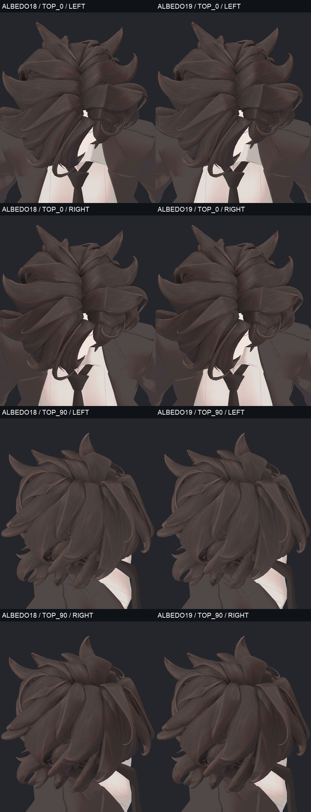

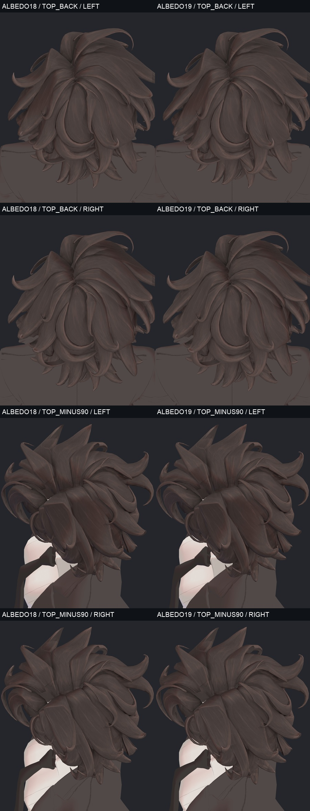

Unity `Bianca_v353_HAIR_ALBEDO19_REVIEW.prefab`도 저장·재로드 검증했다. `bianca_v353_HAIR_ALBEDO19_REVIEW.blend`도 실제 저장·GUI 재열기를 완료했다. 메시·모든 UV·웨이트·기존 키 지문과 패킹된 두 이미지 SHA가 일치했다. 검수용 표면 사본이며 전체 관절·물리가 끝난 최종 아바타는 아니다.

## 3. 넥타이: 같은 동작의 실제 연속 영상

직전의 4,800프레임 전체 동작과 1,800프레임 중력 검수에서 작은 1mm 여유 후보 PAD1을 우선 검토했다. 이번에는 원래 가중 지지와 PAD1을 같은 Bend 입력으로 각각 다시 600프레임 실행했다. 물리 60Hz의 매 2프레임마다 정면·측면을 촬영해 30fps 실시간 10초 영상을 만들었다. 보간으로 움직임을 생성하거나 드문 정지 사진을 연속 영상으로 표현하지 않았다.

[넥타이 전후 연속 영상 MP4](reviews/physics/media/v353_TIE_WEIGHTED_PAD1_CONTINUOUS.mp4)

영상은 왼쪽 가중 지지 기준, 오른쪽 PAD1이며 위는 정면·아래는 측면이다. 실제 원본 캡처 1,200장의 SHA, 출력 영상 SHA와 전체 디코드 검사를 기록했다. 제작자는 0~9.5초의 20개 시간 표본과 1.5초·3초 원본 확대를 확인했다. 모든 300프레임을 사람처럼 실시간 시청했다는 의미는 아니다.

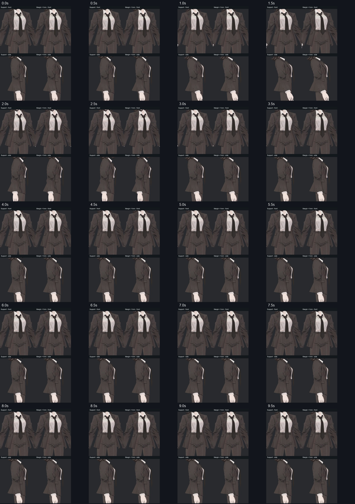

| 조건 | 이번 21개 표면 표본의 넥타이–셔츠 교차 | 넥타이–코트 / 코트–바지 | 판정 |
|---|---:|---:|---|
| 가중 지지 기준 | Bend 90프레임에서 16쌍 | 각 0 | 교차 재현 |
| PAD1 | 모든 표본 0 | 각 0 | 이 동작의 우선 후보 |

90은 프레임 번호다. 기존 4,800프레임의 167개 표면 표본과 이번 연속 영상 실행의 21개 표본은 서로 다른 실행으로 구분한다. 이번 기준의 최대 교차 선분은 10.3039mm이며, 관통 깊이를 뜻하지 않는다. 표본 사이의 모든 접촉·공면 충돌을 완전히 증명하는 검사도 아니다. 원래 장면은 복원됐다.

넥타이 후보의 물리는 이 단계의 고정 재질 기준으로 촬영했다. 최신 헤어·얼굴·옷 색을 모두 합친 최종 통합 영상은 아직 아니다. 별도 기울임 검사에서 남은 코트–바지 교차를 이번 넥타이 개선으로 해결 처리하지 않는다.

### 최신 표면 V19와 넥타이 물리의 실제 통합

별도 `Bianca_v353_SURFACE19_TIE_PAD1.prefab`에 검수한 V19 표면과 PAD1을 합쳤다. 비교용 BASE는 같은 V19 표면에 기존 물리 설정을 유지한다. 원래 메시·UV·웨이트·키·재질 참조는 유지했고, 저장·재로드한 중립 표면 차이는 0mm였다. 실패한 어깨·Cloth는 포함하지 않았다.

[최신 표면 V19 + 넥타이 전후 연속 영상](reviews/physics/media/v353_SURFACE19_TIE_CONTINUOUS.mp4)

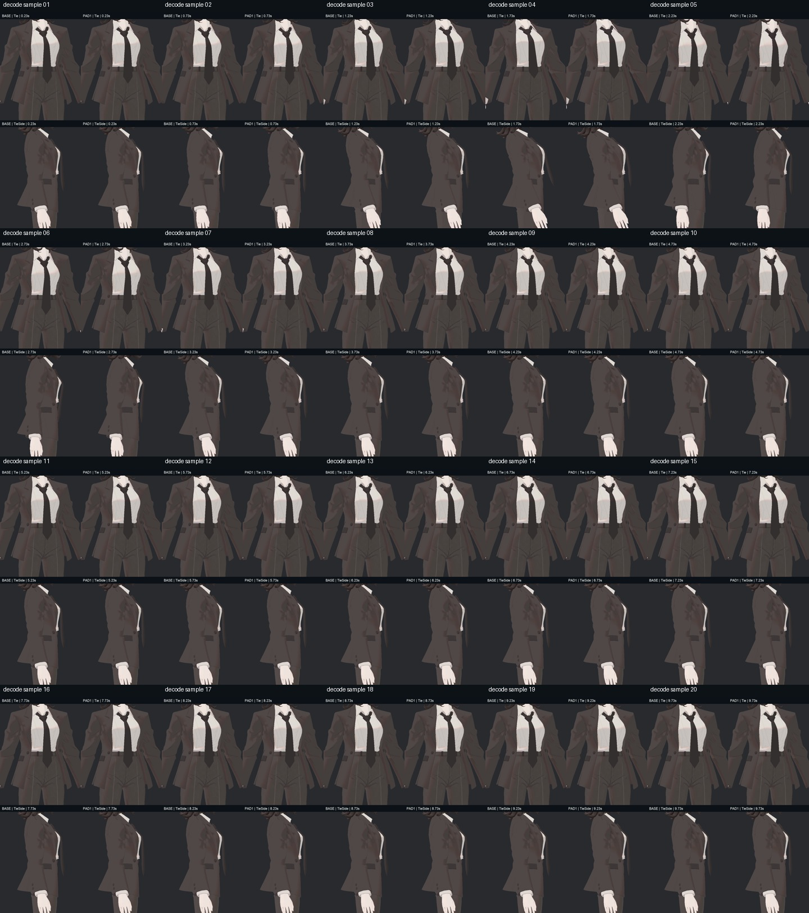

같은 Bend 입력으로 각 600프레임, 60Hz 물리를 실행했다. 매 2프레임의 정면·측면 1,200장으로 30fps·10초 영상을 만들었고 전체 디코드를 통과했다. 제작자가 디코드 20표본과 양쪽 원본 측면 90프레임을 직접 확인했다. 표본 사진에서 PAD1은 셔츠와의 간격을 더 유지한다. 이 Bend는 흉부 ±15도 입력이며, 사용자 사진의 강한 몸통 기울임·중력 정착 검사를 대신하지 않는다.

| 같은 최신 표면 | 넥타이–셔츠 교차 | 넥타이–코트 / 코트–바지 |
|---|---:|---:|
| 기존 물리 BASE | 21표본 중 1표본, 최대 26쌍 / 교차 선분 10.6527mm | 각 0 |
| PAD1 | 21표본 모두 0 | 각 0 |

기존 가중 지지와 비교한 위 영상의 16쌍과, 이번 기존 물리 BASE의 26쌍은 서로 다른 기준이다. 모두 최신 통합본의 모든 접촉이 해결됐다는 뜻은 아니다.

이번 접촉 도구는 이전에 제거한 눈 주변 100개 면을 헤어로 잘못 예상해 처음 멈췄다. 당시 실제 삭제 기록의 정점 삼중항과 정확히 대조하도록 수정했다. 범주만 허용하거나 인덱스를 임의로 100씩 빼지 않았다. 헤어 확대 카메라도 전체 메시 해시가 달라져 첫 전체동작 실행을 중지했다. 원래 목표 헤어 면의 정점·좌표가 같음을 확인하고 현재 면 번호와 전체 해시를 새로 기록한 뒤 별도 폴더에서 재실행했다. 실패 기록은 보존했다.

전체 이동·회전·바람 7구간은 각 4,800프레임까지 완료했고 장면을 복원했다. 각167표면 표본에서 BASE는 Bend90에26쌍, PAD1은 넥타이–셔츠/넥타이–코트/코트–바지 모두0이었다. PAD1의 넥타이 끝은 가슴 기준 이동에서 최대9.271mm, 회전12.986mm, Bend19.013mm, 지정 바람7.454mm 움직였고 마지막1초 잔차는 최대0.000191mm였다. 끝 본 움직임 수치이며 옷 전체 부피·자연스러움의 합격을 대신하지 않는다. 지정 바람은 검사 입력 BiancaWind=.7이며 PC VRChat 월드 바람 시험이 아니다. 강한 정지 기울임 통합 검증은 별도로 이어간다.

독립 검토자가 이번 굽힘42표면 표본을 캐시 없이 재계산해 같은 접촉 수치를 확인했다. 삭제100면은 모두 기존 눈 주변 face이고 헤어 삭제는0이다. 입력·코드 해시를 확인하지 않던 캐시 약점은 수정했고 새42캐시의 해시도 독립 재확인했다. 두 실행의 비넥타이 표면은 전부 같지는 않다. 21대조 표본의 헤어는 최대0.130075mm, 코트는0.00006144mm 차이가 있고 얼굴·손·셔츠·바지·신발은0이었다. 전체600행에서 헤어 끝 본은 최대0.34414mm 차이였으나 안정화 후 거의 일치했다. 같은 입력·고정점·공통 콜라이더 일치만으로 동적 결과까지 완전 동일하다고 적지 않는다. 이 좁은 감사는 전체 통합본의 독립 합격이 아니다. [독립 검토 상세](reviews/rig/integration_latest/v353_SURFACE19_INDEPENDENT_REVIEW.md)

## 4. 어깨: 웨이트 이동 후보는 회귀로 제외

원래 어깨 윗부분의 294개 Unity 정점에서 윗팔 웨이트 일부를 기존 쇄골로 옮긴 두 후보를 실제 SDK 540표본으로 끝까지 비교했다. 원본 메시·UV·노멀·키·129본을 유지한 별도 사본이다.

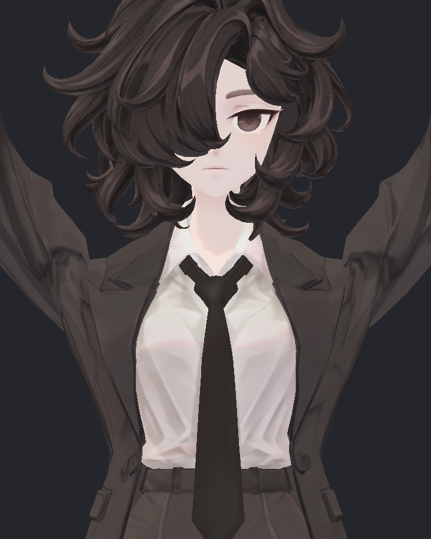

| 후보 | 새 교차가 생긴 표본 | 새 교차의 최대 선분 길이 | 새 면적 경고 표본 | 채택 |
|---|---:|---:|---:|---|
| 윗팔→쇄골 35% | 40 / 540 | 5.7219mm | 5 / 540 | 안 함 |
| 윗팔→쇄골 100% | 53 / 540 | 9.0877mm | 13 / 540 | 안 함 |

두 사진에서도 정상적인 어깨 윤곽이 완성되지 않았다. 변경 범위 밖과 몸·헤어 표면은 차이 0이었지만, 변경 부위의 다른 자세 회귀가 있으므로 채택하지 않는다. 중간 65%는 작성한 비교 사본만 있고 실제 540검사를 실행하지 않았다. 이를 검증 완료로 적지 않는다.

다음 원인 분리에서는 같은 위치에 나뉜 정점들의 웨이트 차이로 찢어지는지 조사했다. 1μm 위치 양자화로 대응한 어깨 중복 정점에 웨이트 차이 또는 ArmsUp 표면 분리 0.01mm 초과 사례가 없었다. 원래 코트 전체 경계는 59개, 어깨·앞 카라 주변 범위에 28개가 있었지만 옷의 열린 앞단도 포함하므로 경계 존재만으로 결함이라고 판단하지 않는다. 메시를 합치거나 새 면으로 가리는 작업은 하지 않았다.

## 5. Cloth: 스키닝 계산 자체 확인

4단계 촬영 순서 대조에 이어, 같은 실제 프레임의 본 세계 행렬·역바인드·원래 웨이트로 CPU 스킨을 계산하고 Unity의 Auto/1/2/4본 기준 렌더러와 대조했다. 임시 비가시 기준 렌더러만 사용했으며 실제 Cloth·원래 웨이트·형상은 바꾸지 않았다. 1,800프레임 실행과 장면 복원이 완료됐다.

| 정지 기울임 | CPU 스킨 대 Unity 4본 최대 차이 | Cloth 대 Unity 4본 최대 차이 |
|---|---:|---:|
| 왼쪽 | 0.000162mm | 13.72285mm |
| 오른쪽 | 0.000169mm | 14.06305mm |
| 앞 | 0.000150mm | 11.31349mm |

Auto와 4본 결과는 완전히 같았고 실제 품질 설정도 FourBones였다. 1본·2본으로 바꾼 기준은 오차를 해결하지 못했다. 해당 기울임에서 키를 끈 기준도 같은 결과였다. 따라서 영향 개수 설정이나 단순 CPU 스킨 식을 원인으로 삼아 원본 웨이트·셰이프키를 삭제하지 않는다. [Unity 스킨 품질 API](https://docs.unity3d.com/2022.3/Documentation/ScriptReference/SkinnedMeshRenderer-quality.html)

Cloth의 최대 이동 제약은 스킨 위치를 기준으로 정의된다. 현재 실측 차이가 남는다는 이유만으로 Unity 2022.3의 특정 엔진 버그라고 단정하지 않는다. [Unity maxDistance API](https://docs.unity3d.com/2022.3/Documentation/ScriptReference/ClothSkinningCoefficient-maxDistance.html)

기존 네 관측 시점 사이에서 애니메이터 갱신 직후·HumanPose 적용 직전은 기록하지 않았다. 다섯 번째 시점을 추가한 1,800프레임 대조에서 애니메이터가 골반을 기준 위치로 돌린 뒤 검사 코드가 목표 자세를 다시 적용하는 중간 변화를 확인했다. 이어 초기화 후 애니메이터를 비활성화하고 같은 목표 자세를 직접 적용하는 별도 1,800프레임을 완료했다. 덮어쓰기는 사라졌지만 Cloth 차이는 왼 13.72285mm·오른 14.06305mm·앞 11.31350mm로 유지됐다. 두 실행 모두 장면 복원 일치다. 따라서 이 중간 변화는 검사 도구의 개선 대상이나 해당 Cloth 오차의 직접 원인으로 채택하지 않는다. DQ 계산과의 대조도 최대 12~15mm 차이가 남아 설명하지 못했다. 형상·UV·웨이트를 바꾼 해결은 아직 아니다. [Unity 이벤트 실행 순서](https://docs.unity3d.com/2022.3/Documentation/Manual/ExecutionOrder.html)

추가로 외부 콜라이더가 없더라도 스킨 표면을 피하게 하는 정점별 제약은 켜져 있음을 확인했다. Unity 2022.3 Inspector 소스에서 `collisionSphereDistance`의 비활성 값은 `float.MaxValue`이며 0이 아니다. 기존 EPSILON과 Soft의 이 값만 비활성화한 별도 사본을 저장·재로드하고 각1,800프레임·장면복원까지 완료했다. 실제 계수도 확인했다. 그러나 EPSILON 최대14.0633mm, Soft 최대10.8478mm 차이가 남아 이 설정을 직접 해결책으로 채택하지 않는다. 외부 충돌 제거와 정점별 스킨 제약 제거를 혼동했던 검사 설정은 바로잡았다. [Unity 2022.3 ClothInspector 소스](https://github.com/Unity-Technologies/UnityCsReference/blob/2022.3/Editor/Mono/Inspector/ClothInspector.cs)

## 6. 검수·보존과 잔여

헤어 V19도 이후 독립 시각 검토에서64사진과 주요 원본을 확인했다. 안쪽 단색면 개선·디테일 유지는 인정했으나 낮은 측면 회색 띠와 뒤쪽 경계 등 잔여를 지적했다. [헤어 독립 시각 보고서](reviews/rig/integration_latest/v353_HAIR_V19_INDEPENDENT_VISUAL_REVIEW.md)를 함께 참고한다. 어깨·Cloth의 새 후속 독립 검토는 아직 완료되지 않았다. 이후 재개된 검토 에이전트는 최신 넥타이 통합의42표면 표본·각630행 기록·캐시 지문을 독립 감사했다. 이 범위와 앞선 눈63장·단추32장, 나머지 제작자 검수를 구분한다. 완료된 원시 결과는 압축 후 각 항목을 다시 읽어 SHA를 확인했고 원본도 유지했다. 대용량 압축은 Git 한도보다 작은 조각으로 저장한다. 진행 중 자료나 무관한 Unity ProjectSettings를 정리 대상으로 건드리지 않았다.

남은 머리 안쪽 전사, 어깨 윤곽·새 교차, 자켓의 몸과 분리된 처짐·접촉, 헤어 가닥 물리, 최종 통합본의 전신 관절·동작·조명·비용과 PC 클라이언트 검수는 현재 작업 범위에서 이어간다. 기존에 수용한 무릎·손가락 상태와 향후 iPhone 표정 작업 기반을 보존한다.
