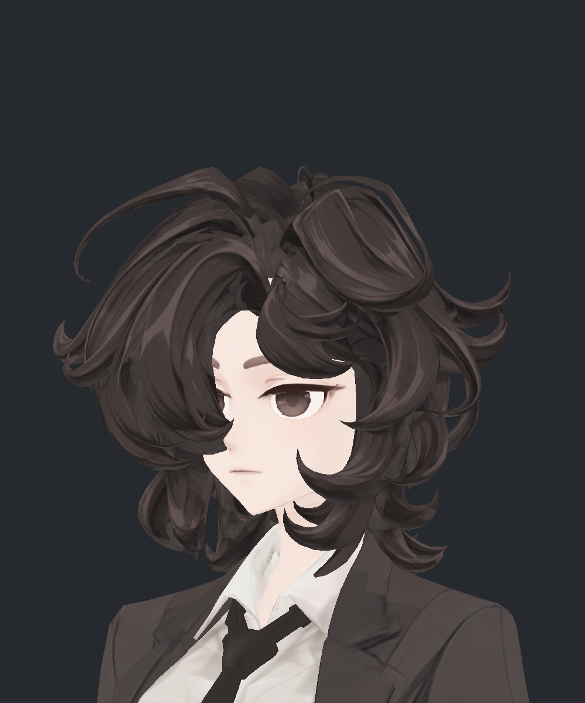
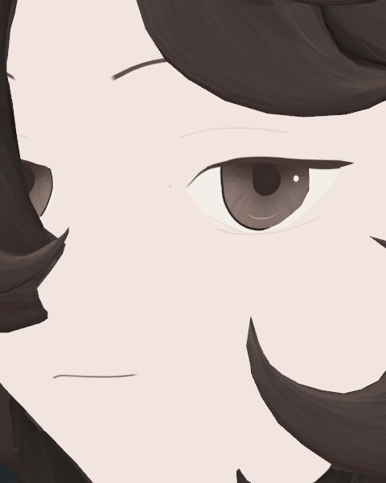
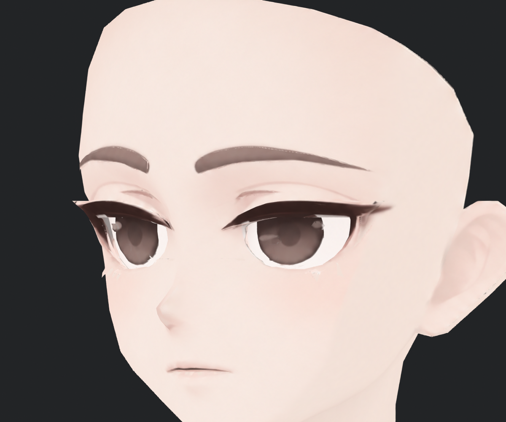

> **기록 시점 안내:** 아래는 해당 단계 당시의 보고서입니다. 후속 결정은 [최신 상태](../../STATUS.md)를 기준으로 읽어주세요. 모델·원본 텍스처·검증 원시 데이터는 이 문서 공유본에 포함하지 않습니다.

# v353 눈꺼풀 디테일 퇴행 재검토

사용자 중간 피드백으로 재작업 전 v352 사진과 현재 Hair29/BC7 사진을 직접 다시 확인했다. **윗눈꺼풀 접힘선과 눈매의 두께·눈꼬리 디테일이 약해진 것이 맞다. 현재 얼굴을 디테일 보존 완료로 취급하지 않는다.** 이번은 비교·원인 조사이며 모델·텍스처·재질을 수정하지 않았다.

## 재작업 전과 현재

| 재작업 전 v352 | 현재 Hair29, 압축 전 |
|---|---|
|  |  |

두 사진은 각각 기존 실제 Unity 사진이다. 같은 쪽 얼굴의 비슷한 사선 구도이나 카메라 크기·광원·헤어·재질까지 맞춘 통제 실험은 아니다. 따라서 픽셀 차이나 눈꺼풀 두께의 mm 측정 근거로 쓰지 않는다. 기존에는 접힘선과 주변의 좁은 색 변화, 두께감 있는 윗 속눈썹 선과 눈꼬리가 눈매를 만들었다. 현재는 접힘선이 피부색에 가까운 가는 선이 되고, 윗 속눈썹도 단일 곡선과 뾰족한 끝으로 단순해졌다. 눈썹과 입선도 가늘어져 얼굴 전체 인상이 더 평평해졌다.

근접에서는 위 접힘선이 아주 희미하게 남아 있다. 따라서 모든 눈꺼풀 메시가 삭제됐다고 결론 내리는 것은 부정확하지만, 일반 얼굴 크기에서 눈꺼풀이 사라져 보인다는 지적은 타당하다.

기존 근접에서는 긴 접힘선 아래의 짧고 진한 보조선도 읽힌다. 이 사진은 머리를 숨긴 이전 검사 조건이며 현재 사진과 광원·표시 조건이 같지는 않다. 독립 검토 에이전트도 v352/초기 v353 V2/현재 비압축 사진을 직접 확인해 같은 디테일 약화를 보고했다. 초기 V2부터 이미 가는 단일 선으로 단순화되어 있었다.

## 확인된 원인과 아직 분리할 부분

1. **새 채색에서 눈꺼풀을 과하게 단순화했다.** 실제 적용된 face7 PNG와 현재 BC7 후보의 원본 PNG SHA가 일치한다. face7 제작 코드의 접힘선은 혼합 강도0.26, 중심선 반폭0.00010의 가는 선이며 피부 위에 낮은 대비로 들어간다. 아래 눈꺼풀도0.30의 약한 선이다. 이는 모델 좌표 기반 제작 설정이며 실제 사람의 눈꺼풀 두께나 화면 픽셀값이 아니다. 윗 속눈썹은 하나의 부드러운 곡선과 가변 폭으로 구성됐다. 기존의 접힘·선 굵기·눈꼬리 특징을 충분히 다시 만들지 못했다.
2. **얼굴 명암 억제와 디테일 보존을 분리하지 못했다.** 현재 얼굴 재질은 UseShadow0이다. 이전 통제 사진에서 이 설정이 흰 아크 아티팩트를 없애는 것은 확인했지만, 그 상태에서 새 채색만으로 기존 눈꺼풀을 충분히 읽히게 하는 검수가 부족했다. 설정을 무조건 되돌리면 해결된다고 할 수 없고, 부위별 기여는 추가 대조가 필요하다.
3. **BC7 압축에서 새로 생긴 현상이 아니다.** 압축 전 Hair29와 face7 단계의 무조명 근접 사진에도 희미한 접힘선이 보인다. 최근 검수는 Hair29 원본과 BC7 사이의 변화가 작다는 검증이었다. 이를 재작업 전 눈매·디테일 보존의 증거로 확대하면 안 된다.
4. **구조 삭제와의 관계는 별도다.** 과거 눈 세부100면 정리 기록이 있지만, 그 사실만으로 윗눈꺼풀이 삭제됐다고 단정하지 않는다. 이번에는 메시를 새로 대조·수정하지 않았다. 실제 의미별 면과 현재 채색 경계의 관계는 복원 시 다시 확인한다.

## 판정 정정과 복원 기준

이전 중간 보고의 얼굴·디테일 판단은 부족했다. 압축 검증 결과는 보존하되 **현재 얼굴 미관 채택은 보류**한다. 기존 기록을 덮어 쓰지 않고 이 문서로 사용자 피드백과 재판정을 추가한다.

복원 시 기준은 기존 눈매의 윗눈꺼풀 접힘, 속눈썹의 굵기 변화, 눈꼬리와 아래 눈꺼풀의 구분이다. 기존 번짐을 통째로 가져오지 않고, 2D 레퍼런스와 재작업 전 눈매를 대조해 필요한 형태·선을 새 채색에 되살려야 한다. 재작업 전/현재/복원 후보를 동일 카메라·광원·표정·크기의 Unity 사진에서 비교하고, 근접뿐 아니라 얼굴 중간 거리에서도 선이 읽히는지 확인해야 한다.

이번 요청은 기존 상태 확인이므로 실제 복원은 아직 적용하지 않았다. 다른 관절·물리 작업도 중간 점검 상태를 유지한다.
