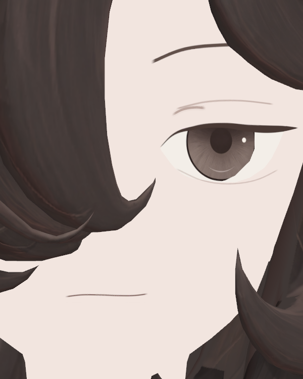
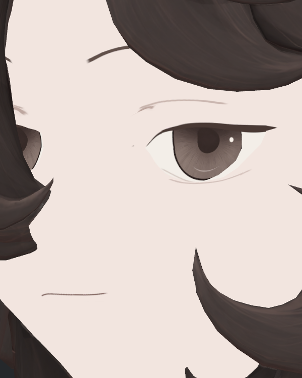
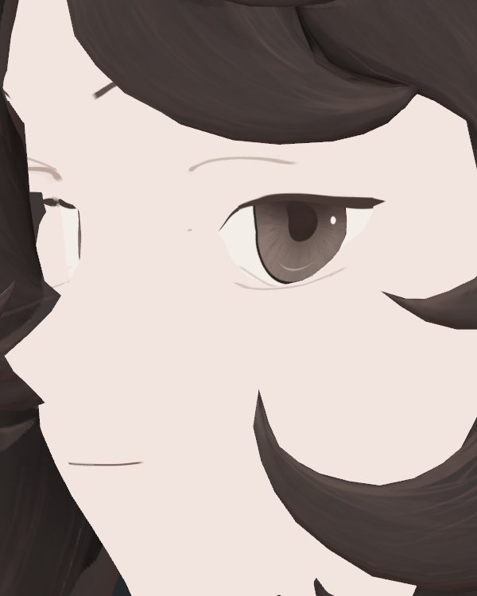
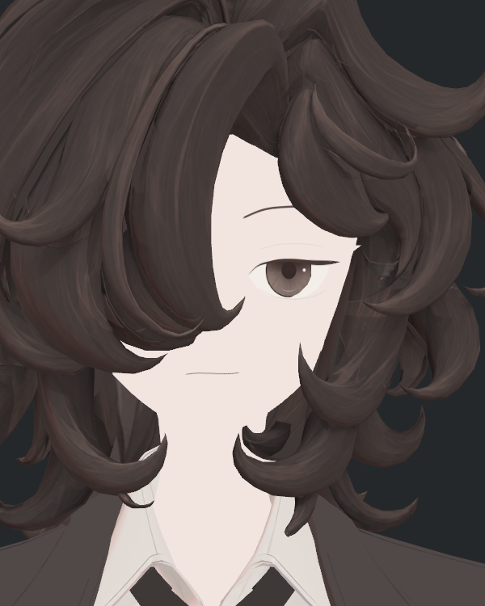
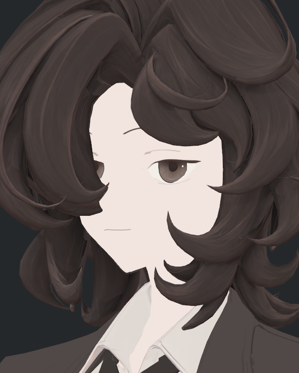
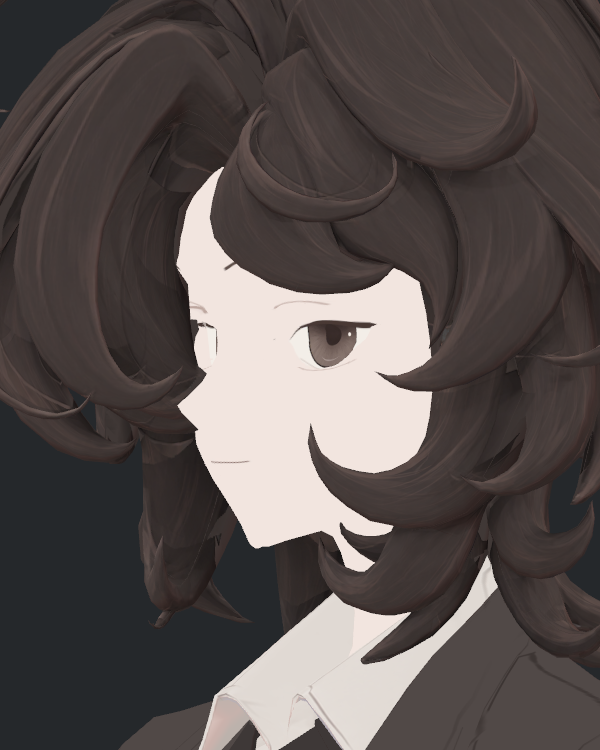

> **기록 시점 안내:** 아래는 해당 단계 당시의 보고서입니다. 후속 결정은 [최신 상태](../../STATUS.md)를 기준으로 읽어주세요. 모델·원본 텍스처·검증 원시 데이터는 이 문서 공유본에 포함하지 않습니다.

> **최신 사용자 결정: 이번 텍스처 전면 재작업은 전부 미채택·중단.** [폐기 결정과 재작업 전 기준](v353_TEXTURE_REBUILD_REJECTED.md). 아래는 당시 작업 이력이며 후속 채택 근거가 아니다.

# v353 눈꺼풀 복원과 옷·신발 디테일 검토

2026-09-14 사용자 요청에 따라 **눈꺼풀을 별도 사본에서 복원하고 실제 Unity 전후 사진을 검수했다.** 첫 후보 face8은 사선 잔선 때문에 미채택, 수정한 face9가 이번 복원 검수본이다. 옷·신발은 요청한 전후 검토와 결과 기록까지 진행했으며, 이번에 해당 텍스처를 수정한 것은 아니다.

## 눈꺼풀 복원 결과

재작업에서 거의 피부색에 묻혔던 긴 접힘선의 농도·두께를 보강하고, 기존 눈매의 특징인 짧은 안쪽 보조 접힘선을 다시 넣었다. 아래눈꺼풀도 약하게 보강했다. 홍채·동공·눈의 개구부와 기존 주속눈썹 폭은 유지했다. 원래 번진 텍스처를 그대로 복사하지 않고 기존 눈매와 2D 레퍼런스를 보고 새 채색에 필요한 표현을 되살렸다.

| 복원 전 face7 | 이번 복원 face9 |
|---|---|
|  |  |
|  |  |
|  |  |

실제 형상·카메라·광원·포즈를 고정한 Unity 사진이다. 사진 편집으로 선을 추가하거나 비교 이미지를 다시 생성하지 않았다. 같은 얼굴 크기에서 더 잘 읽히는지 아래 중거리도 확인했다.

| 복원 전 중거리 | 복원 후 중거리 |
|---|---|
|  |  |
|  |  |
|  |  |

기존 v352와의 눈매 비교는 [앞선 퇴행 조사](v353_EYELID_REGRESSION_REVIEW.md)에 있다. 이번에는 접힘선의 읽힘을 복원한 것이며, 기존 얼굴의 모든 채색·눈썹·입·피부 음영을 통째로 되돌린 작업은 아니다. 전체 얼굴 인상의 최종 선택은 사용자 피드백으로 확인한다.

## 첫 후보를 채택하지 않은 이유

face8에서는 긴 접힘선 위치를 위로 옮기고 속눈썹 폭도 넓혔다. 정면 개선은 있었지만, 35/55도에서 선 외측이 계단처럼 꺾이고 속눈썹 위에 별도 가는 잔선이 생겼다. 실제로 보고 미채택했다.

| 첫 후보 face8 · 미채택 | 수정 후보 face9 |
|---|---|
|  |  |

face9는 매끈하게 보이던 원래 접힘선 위치를 유지하고 주속눈썹 폭 확장을 되돌렸다. 같은 사선 사진에서 위 두 결함이 보이지 않는 것을 확인했다. 기존 분할면·깊이와 투영선의 세부 기여까지 확정한 것은 아니며, 메시를 지워 가린 것이 아니다.

[첫 후보 독립 검수](reviews/eye/eyelid_restore_v1/v353_EYELID_RESTORE_INDEPENDENT_REVIEW.md) · [두 번째 후보 독립 검수](reviews/eye/eyelid_restore_v1/v353_EYELID_RESTORE_V2_INDEPENDENT_REVIEW.md) · [실행 문제와 미채택 사유](reviews/eye/eyelid_restore_v1/v353_RESTORE_EXECUTION_LOG.md)

## 실제 검증과 전달 파일

- Blender Computer Use로 새 텍스처를 베이크하고, 원래 Hair29의 별도 사본에만 적용했다. 저장 후 실제 재열기에서 기존 형상·UV·노멀·웨이트·키·본·포즈와 패킹된 얼굴 텍스처를 확인했다.
- Unity는 기존 BC7 표면 검수본에서 얼굴 재질 하나와 MainTex만 별도 복제했다. 나머지7재질, 메시·본·키·컨트롤러는 기존 참조를 유지한다. 새 사본 저장·재로드, 원본·사용자 장면 보존 검사를 통과했다.
- 실제 Unity 6쌍/12장으로 형상 P/N/T·카메라·광원·포즈 일치를 확인했다. 얼굴 UseShadow0과 기존 BC7/해상도/필터 설정을 고정해 새 채색의 효과를 비교했다.
- 이번 검수는 중립의 정면·보이는 눈 쪽 두 사선과 두 크기다. 가려진 반대눈 전체, 눈깜박임·시선·iPhone 표정 추적, 모든 광원과 PC VRChat 클라이언트까지 검증한 것은 아니다.

Blender 복원 검수본: `trials/bianca_v353_EYELID_RESTORE_V2.blend`.

Unity 복원 검수 프리팹: `Assets/BiancaV353EyelidRestoreV2/Bianca_v353_EYELID_RESTORE_V2.prefab`.

텍스처: `textures/Bianca_v353_face_v9.png`. 첫 후보 face8 및 원래 face7/Hair29/BC7는 보존했다. 미채택 어깨 V7·Ribbon 보정은 이 전달본에 합치지 않았다.

## 옷·신발 검토 결과

**사용자가 지적한 디테일 약화가 확인됐다.** 기존 번짐을 줄이면서 부품과 주름을 설명하던 작은 선·명암도 함께 단순해졌다. 압축 전 Hair29에서도 같은 문제가 있어 BC7 압축 문제만으로 설명할 수 없다.

[사진 포함 10항목 상세 검토와 복원 우선순위](reviews/detail_regression_v1/REPORT.md)

| 우선순위 | 부분 | 확인한 문제 |
|---|---|---|
| 높음 | 신발 | 스트랩 겹침, 앞코 패널, 갑피–창–굽의 구분과 봉제선 가독성이 약해짐 |
| 높음 | 단추·소매 솔기 | 구멍·실·테두리가 어두운 면에 묻히고, 긴 솔기와 커프스 층이 덜 읽힘 |
| 높음 | 셔츠·라펠 | 작은 접힘 면과 얇은 단차가 줄고 긴 선·넓은 면 위주로 단순화됨 |
| 후속 국소 확인 | 포켓·벨트 | 경과 사진에서 테두리와 두께가 약해짐. 최신 같은 구도의 확대 비교는 추가 필요 |
| 선별 보강 | 바지 | 큰 프레스 라인은 남지만 일부 작은 접힘 면이 약해짐. 예전 과한 골반·안쪽 그림자와 분리 필요 |

신발·단추는 정보 자체가 모두 삭제됐다는 판정이 아니다. 남아 있는 세부가 어두운 재질·투영·조명 때문에 읽히지 않는 기여도 더 분리해야 한다. 코트·셔츠는 새 채색 원화 단계부터 작은 면의 구성이 줄어든 근거가 있다. 전체를 블러로 지우거나 예전 고정 그림자를 전부 복귀시키는 것으로 해결하지 않는다.
