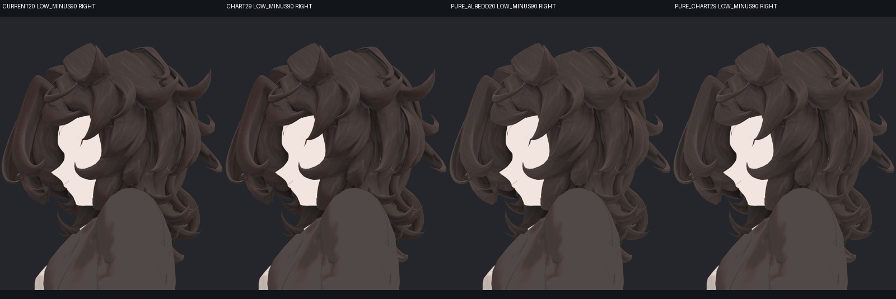
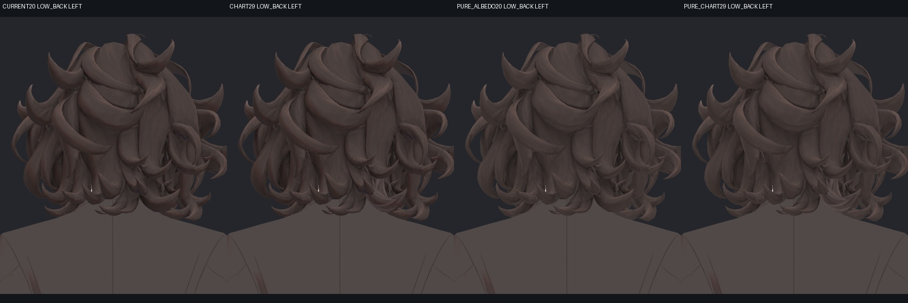
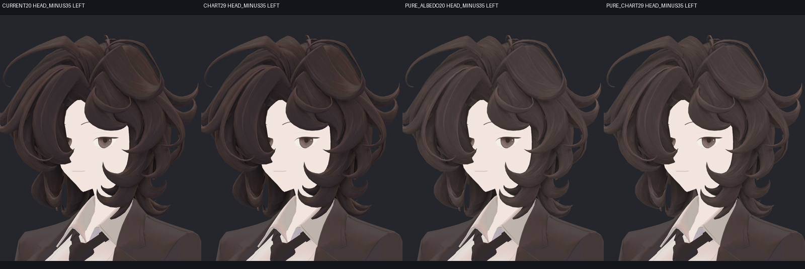
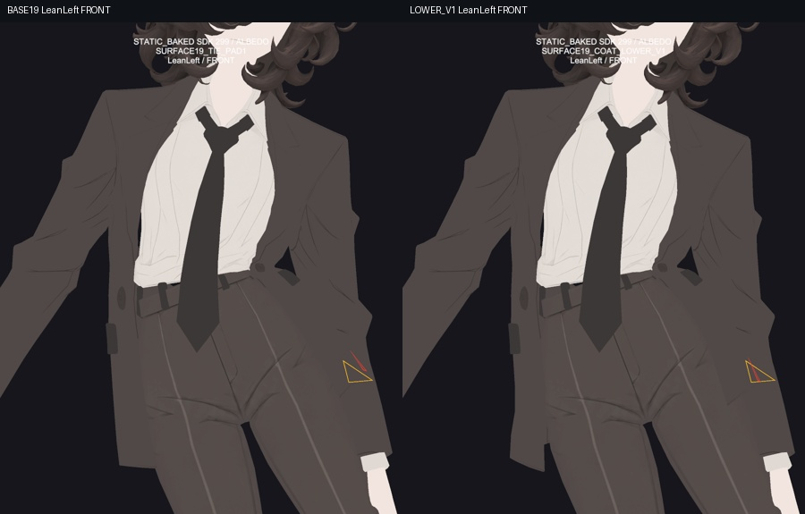
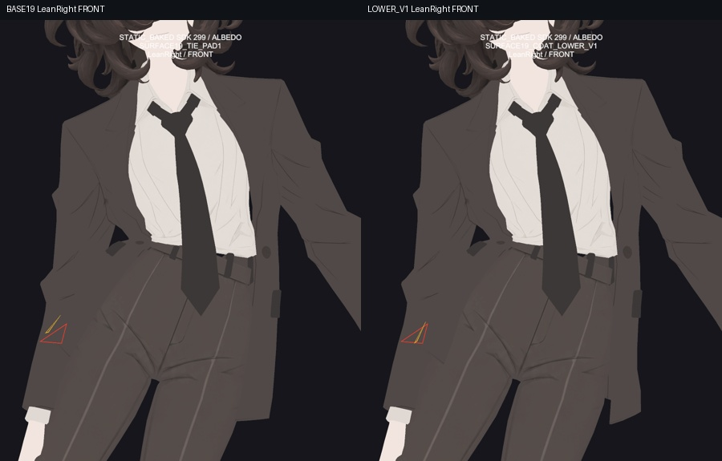
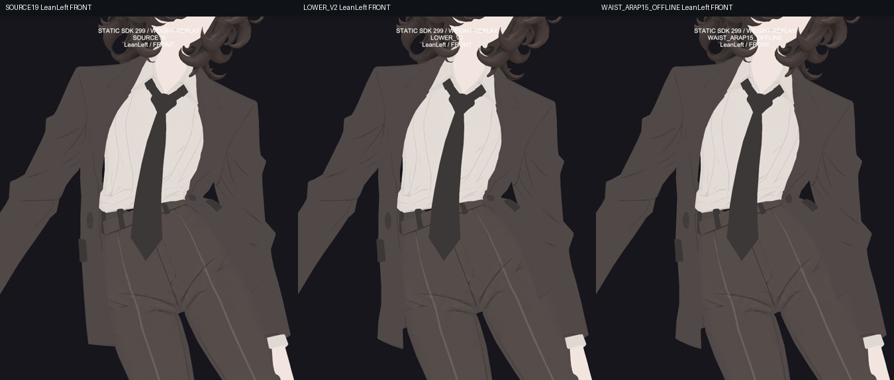

> **기록 시점 안내:** 아래는 해당 단계 당시의 보고서입니다. 후속 결정은 [최신 상태](../../STATUS.md)를 기준으로 읽어주세요. 모델·원본 텍스처·검증 원시 데이터는 이 문서 공유본에 포함하지 않습니다.

# v353 헤어29와 어깨·자켓 후속 검수

전체 작업은 진행 중입니다. 이번 보고서는 새 헤어 채색의 실제 Unity 검수, 어깨 자동 보정 검사 도구의 실패 원인, 자켓의 남은 구조 문제를 구분해 기록합니다. 최종 기준은 Unity 게임/PC VRChat에서 정상적으로 움직이고 레퍼런스의 NPR 스타일로 보이는 것입니다.

## 헤어29: 누락된 가닥 표면을 새로 채색

목 뒤와 낮은 측면에 남았던 넓고 밝은 면 중 일부는 기존 UV 차트114의 표면이 원화 시점에서 보이지 않아 충분히 채색되지 않은 문제였습니다. 주변 색을 흐리게 덮지 않고 원래 연결된 가닥 단위를 분리해 정면·뒤·측면·아래 대각선의 새 원화를 만들었습니다. 기존 초기 아바타의 텍스처는 새 원화의 채색 입력으로 사용하지 않았습니다.

원래 차트의 129면·242삼각형과 UV를 유지했습니다. 네 시점의 실제 가시성 및 채색 기여도를 Blender에서 베이크하고, 배경색이 머리카락에 섞이지 않게 색과 기여도를 함께 처리했습니다. 차트 밖은 직전 gap24와 정확히 같습니다. 차트 안에서 관측되지 않은 영역은 1,883텍셀에서 23텍셀로 줄었고, 새 검정 배경 혼입은 발견되지 않았습니다. 이 수치는 실제 텍셀 기준이며 곧바로 전체 헤어의 완성률을 뜻하지 않습니다.

### 실패한 시도와 수정

| 시도 | 실제 문제 | 처리 |
|---|---|---|
| side28 첫 원화 | 정사각 가이드를 세로형으로 잘못 요청해 실루엣이 어긋남. 겹침 비율 64.9% | 베이크에 사용하지 않음 |
| side29 | 실제 1536×1536 가이드를 확인한 뒤 정사각 형태로 재작성. 겹침 98.76% | 내부·외부 및 베이크 검증 후 사용 |
| oblique28 | 실제 정사각 결과이며 겹침 99.54%, 충분한 안쪽·바깥쪽 마스크 일치 | 검증 후 사용 |
| 차트27의 두 시점 | 낮은 측면과 뒤에서 넓은 밝은 삼각형 면 잔여 | 새 두 시점을 추가해 차트29로 비교 |

### 직접 확인한 Unity 결과

실제 Unity에서 8방향 × 2조명 × 기존20/새29/기존 순수색/새 순수색으로 64장을 만들었습니다. 제작자가 모든 비교 화면과 확대 원본을 확인했고, 별도 검토 에이전트도 64장과 원본을 확인했습니다. 새 검정 테두리·전사 경계·뚜렷한 선 중복은 발견하지 못했습니다. 낮은 측면과 뒤의 가닥 흐름이 이어지고 기존 실루엣도 유지됩니다.

표의 CURRENT20→CHART29에는 앞서 검증한 gap24의 개선도 포함됩니다. 20에서29로 달라진 모든 부분을 차트114만의 효과로 설명하지 않습니다. 20→gap24는209,459픽셀, gap24→29는31,231픽셀, 20→29는240,018픽셀 차이입니다.

목 옆의 좁은 밝은 면은 원화에 그린 별도 가닥의 면입니다. 양쪽 조명에서도 흰 얼룩처럼 튀지 않아 이번에는 유지합니다. 모든 명암을 지워 평평하게 만드는 대신, NPR에서 필요한 가닥의 색면과 선을 남깁니다.

Blender29 사본은 실제 GUI로 저장하고 다시 열었습니다. 형상·전체 UV·웨이트·기존 표정 키가 원본과 같고, 저장된 헤어·넥타이 목띠 이미지도 해시가 일치합니다. 헤어29는 다음 통합 후보이며 전체 아바타 완료 판정은 아닙니다. Unity 전달 프리팹도 V2 도구로 실제 저장하고 다시 불러왔습니다. 검수했던 source20 해시가 일치하는지 먼저 확인하고, 129본·표정값·메시·다른 재질·Animator 연결·사용자 장면이 그대로인지 대조했습니다. 필요한 기존 자산34개의 경로와 해시도 기록했습니다. 전달본은 프로젝트 안의 자산을 참조하는 검수 프리팹입니다.

처음 전달 도구는 저장된 재질 이름 `HairAlbedo20`을 찾지 못해 중단됐습니다. 이름 추측을 없애고 실제 재질 파일 경로를 검사하도록 고쳐 재실행했습니다. 실패 도구와 빈 출력 폴더를 보존했으며 원본은 변경되지 않았습니다. 새 프리팹에 실패한 어깨·자켓 물리 후보를 합치지 않았습니다.

## 어깨: 자동 구동 검사 도구의 시작 실패

기존 어깨 형상·노멀 검수와 달리 이번에는 팔 방향을 실제 SDK Contacts가 읽고 Animator가 보정 키를 구동하는지 검사합니다. 새 키 값을 검사 코드에서 직접 넣어 통과시키지 않습니다.

Runtime V2 프리팹 생성은 기존10레이어·123파라미터를 보존하며 통과했지만, 실제 검사는 시작하지 못했습니다. 검사 전용 MonoBehaviour를 Editor 폴더에 설치해 Unity가 부착을 거부한 것이 원인입니다. 실제 SDK 표본은0이며 성공으로 취급하지 않습니다. Play 종료 후 원래 장면이 복원된 것도 확인했습니다.

V3 검사기는 성공했던 다른 실행기와 같은 일반 Assets 영역에 두고, 실행 전에 실제 스크립트 클래스와 어셈블리를 확인하도록 수정했습니다. 아바타에 검사 스크립트를 배포하는 작업은 아닙니다. 수정한 V3로 실제540표본을 완료했습니다. 원본과 사용자 장면 보존도 확인했습니다. 정적299자세의 보정 키 오차는 최대0.0098/100, Contact 측정 오차는0.00000263 이내이고 잘못 켜진 정적 자세는0개입니다.

다만 기존 연속121표본과 복귀120표본은 새 보정 목표가 전부0이어서, 이 구간에서 지연이 없다는 수치를 활성 전환의 검증으로 쓰지 않습니다. 실제 보정이 켜지는 팔 높이105–145도와 앞뒤 방향 경계를 연속으로 통과하는 별도 영상 검사를 추가합니다. 기하 독립 분석도 완료했습니다. 이번 실제 본 행렬로 다시 계산한 위치 오차는 최대0.000304mm로, 이전 실행과의 미세한 부동소수점 차이를 형상 회귀와 구분했습니다. 보정이 활성화된 세 자세에서 새 비공면 교차(교차선0.05mm 초과), 새90도 면 뒤집힘·퇴화·음수 노멀 코너는0입니다. 새 키의315정점 범위 밖에는 계산상 변위가 없습니다. 최대보정8.665mm이며 실제 활성 전환의 영상 판정은 별도입니다.

## 자켓: 자락 충돌과 허리 V 접힘은 서로 다른 문제

하부 자락의 중력 반응을 늘린 CoatLowerV1은 자락이 더 떨어지는 대신 소매와 새 접촉184쌍이 생겨 채택하지 않았습니다. 이어 소매 콜라이더를 추가한 V2도 실제1,800프레임 검사와 저장된66개 스킨 표본에서 V1과 같은 표면을 보여 개선되지 않았습니다. 콜라이더가 소매를 따라가는 것과, 넓은 코트 표면을 담당하는 물리 본이 실제로 충돌하는 것은 다릅니다. 기존 두 후보는 실패 기록으로 보존합니다.

다음 후보는 콜라이더를 일괄 확대하지 않고, 실제 접촉하는 소매 구간에 맞춰 길이를 줄이고 반경을 다시 맞춥니다. 원래 메시·본·웨이트·물리 힘 곡선은 그대로 두며, 원래 자세에서 새 충돌을 만들지 않는지 먼저 확인합니다. 실제 동작 결과를 보기 전에는 해결로 판정하지 않습니다.

### 접촉 위치에 맞춘 콜라이더 후보의 실제 결과

TightForearmV1은 실제1,800프레임을 완료했고 원래 장면도 복원됐습니다. 이번에는 뒤 자락 표면이 V2보다 최대4.788mm 움직여 콜라이더 반응은 생겼지만, 접촉이 옆 면으로 이동했습니다. 기준source19보다 새로 생긴 접촉의 프레임별 합계는934에서1,036으로 늘었습니다. 이 값은 프레임 중복을 포함한 삼각형쌍 수이며 화면에서 보이는 구멍의 개수가 아닙니다. 팔·몸·헤어·넥타이와 기존 바지 접촉은 그대로였습니다.

따라서 이 후보도 제작본에 합치지 않습니다. 같은 반경을 반복 조정하는 작업은 멈추고, 허리의 지지 전이를 먼저 고칩니다. 작은 자락–소매 겹침은 비교 모델의 실제 동작과 시각적 노출 정도를 본 뒤 사용자 추가 기준에 따라 처리합니다.

### 허리의 V자 빈 공간

이 사진은 실제 SDK에서 얻은 정적 표면을 같은 카메라에서 순수색으로 보여주는 진단입니다. 표시한 삼각형 선은 가려진 면도 표시하므로 선만으로 화면에서 보이는 관통 정도를 판단하지 않습니다.

제작자가 18장 전체를 비교했습니다. 기울였을 때 허리 위의 몸판과 아래 자락 사이에 남은 큰 V자 모양은 하부 물리만 바꿔도 그대로입니다. 실제 카메라 광선과 삼각형을 대조해 그 사이의 검은 부분이 텍스처 색이 아니라 배경이 보이는 화면 영역임을 확인했습니다. 이것만으로 메시가 찢어졌다고 결론 내리지는 않습니다. 실제 경계를 추적한 결과, 빈 공간 양쪽은 앞몸판과 뒤소매였고 모두 닫힌 면 연결을 유지하며 겨드랑이 위에서 서로 연결되어 있었습니다. 따라서 검은 삼각형 자체는 정상적인 팔–몸 사이 음각 실루엣입니다. 수정 대상은 이 공간을 막는 것이 아니라 주변 자켓 몸판의 과한 안쪽 접힘과 여유 부족입니다. 위쪽 면은 척추·골반·자락 본에 분산되어 있고 바로 아래 면은 자락 첫 본에 거의 묶여 있어, 서로 다른 지지 방향을 따르는 전이가 핵심입니다.

전체 자락을 가슴에 따라가게 한 대조는 큰 이동과 뒤집힘 회귀가 생겨 채택하지 않습니다. 기존 웨이트만 국소 조정한 ARAP15 후보도27장으로 비교했습니다. 실제 SDK에서 저장한 기준 표면에 새 웨이트를 적용한 계산 결과이며 새 물리 실행은 아닙니다. 제작자와 독립 검토 모두 큰 허리 실루엣 개선이 부족하다고 판단했습니다. 별도540자세 사전 대조에서는 복합 자세의 한 면이164도 돌아가는 위험도 확인돼 이 후보를 적용하지 않습니다. 같은 고정 웨이트 조정을 반복하는 대신, 실제 몸판의 접힘과 지지 전이에 필요한 자세별 보정 구조를 검토합니다. 정상적인 팔–몸 사이 공간을 막는 방식으로 수정하지 않습니다.

 무릎과 손가락의 기존 수용 상태는 유지합니다.

## 후속 방법을 정할 때 다시 확인한 공식 자료

2026-09-14 공식 문서를 다시 확인했습니다. PhysBones의 충돌 반경은 메시 전체가 아니라 본 주변에 적용됩니다. 길이별 곡선으로 반경·힘을 조절할 수 있고, Gravity Falloff는 원래 자세에서 중력을 얼마나 줄일지 정합니다. 따라서 이번처럼 소매 표면을 덮는 콜라이더가 있어도 코트 본의 충돌 범위와 만나지 않으면 해결되지 않는다는 진단과 일치합니다. 이는 공식 기능 설명과 실제 이번 표면 측정을 함께 해석한 결론입니다. [VRChat PhysBones 공식 문서](https://creators.vrchat.com/common-components/physbones/)

Unity Cloth는 Skinned Mesh에 붙여 입자별 이동 제약과 충돌체를 설정하는 별도 방식입니다. 다만 이 프로젝트의 앞선 실제 Cloth 시험에서는 스킨과 입자 사이의 잔여 차이가 남았으므로, 기능이 있다는 이유만으로 제작본에 채택하지 않습니다. 현재는 기존 지지 연결과 실제 충돌 범위를 먼저 바로잡는 후보를 검수합니다. [Unity 2022.3 Cloth 문서](https://docs.unity3d.com/2022.3/Documentation/Manual/class-Cloth.html)

## 공통 모델 한계를 수용하는 추가 기준

최신 사용자 지시에 따라 다른 모델에서도 같은 정도로 나타나는 한계는 비교 근거를 남기고 넘어갈 수 있습니다. [공통 한계 별도 기록](v353_COMMON_MODEL_LIMITS.md)에 자세·거리·가림·실루엣 영향과 수용 이유를 기록합니다. 기존 SiuSiu/Lapwing의 본 설정 자료만으로 실제 움직임의 관통까지 같다고 판정하지 않고, 물리를 켠 유사 동작을 추가 비교합니다.

## 남은 완료 관문

- 헤어29를 보존 검증한 Unity 프리팹으로 저장하고, 통합본의 실제 다광원·동작에서도 확인.
- 어깨 보정이 실제 SDK Contacts→Animator로 자동 작동하는지 검증하고 새 회귀 수정.
- 코트 소매 접촉과 허리 지지 전이를 실제 표면·움직임으로 해결.
- 헤어·넥타이·코트의 통합 물리, 전체 관절, 조명별 NPR 외관 및 영상 재검수.
- 검증을 끝낸 결과만 작업 저장소와 선별 문서 저장소 main에 게시. PC VRChat 클라이언트에서 확인하지 않은 항목은 따로 표시.
