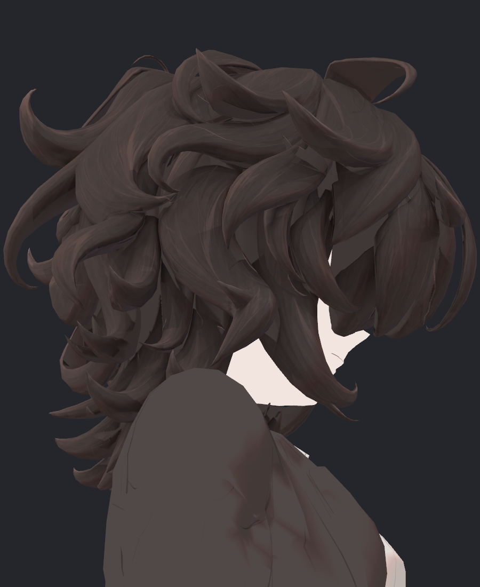
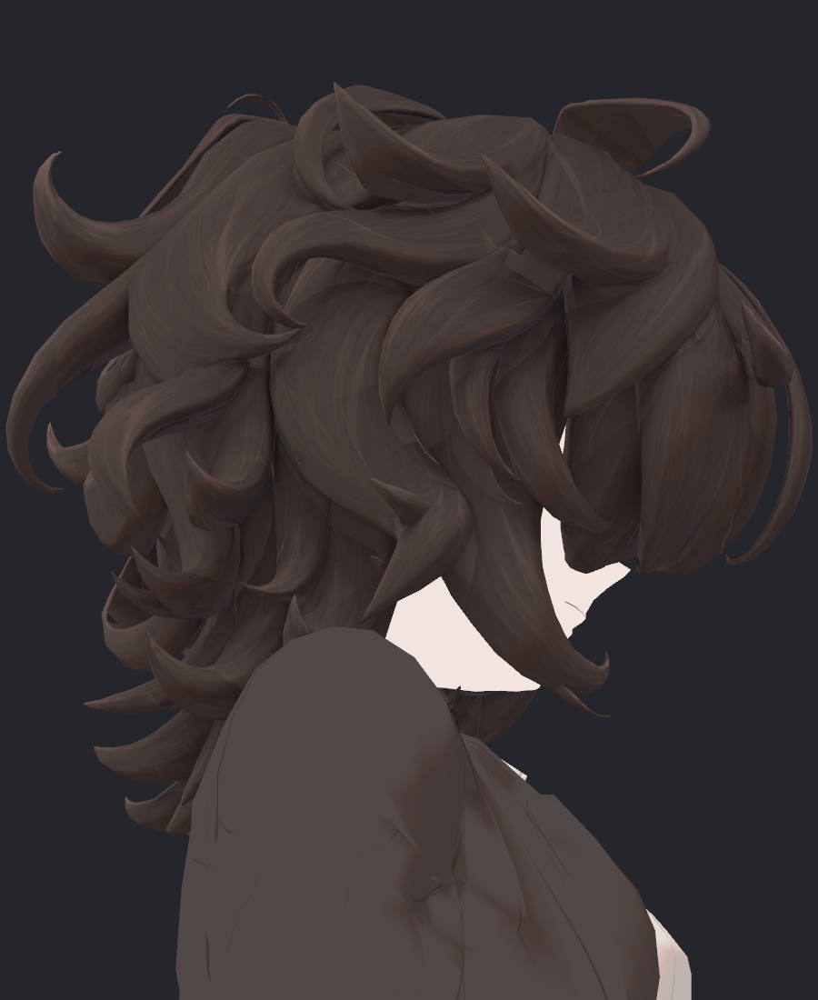
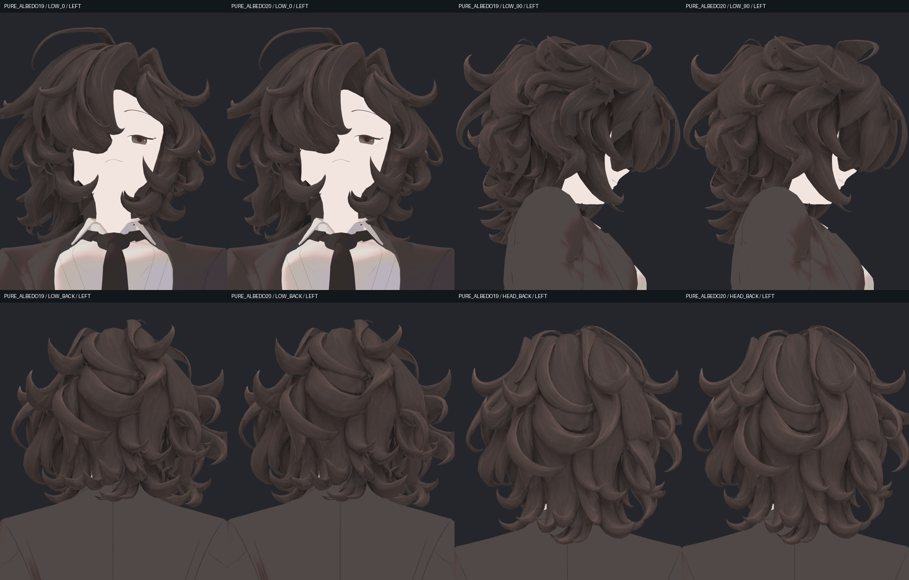
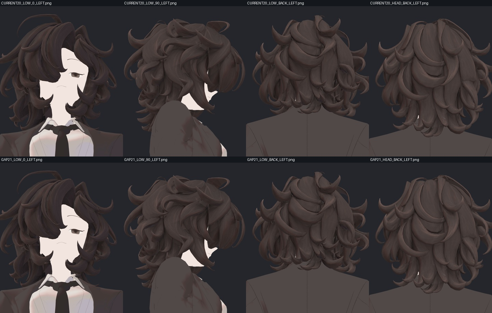
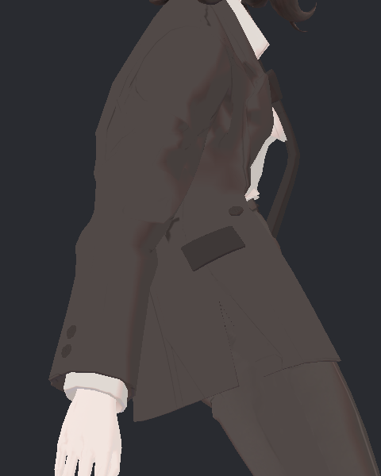

> **기록 시점 안내:** 아래는 해당 단계 당시의 보고서입니다. 후속 결정은 [최신 상태](../../STATUS.md)를 기준으로 읽어주세요. 모델·원본 텍스처·검증 원시 데이터는 이 문서 공유본에 포함하지 않습니다.

# v353 머리 안쪽 채색과 물리 대조 후속 검수

머리 아래 측면의 넓은 회색 띠를 새 원화로 보완하고 실제 Unity에서 비교했다. 넥타이의 접촉 개선도 반복·역순 실행에서 재검증했다. **헤어 전체, 코트 드레이프, 어깨와 최종 PC VRChat 검수는 계속 진행 중**이다. 이 문서는 검수가 끝난 결과와 실패 원인을 공유하는 중간 기록이다.

목표는 2D 레퍼런스의 일본 애니메이션·게임·일러스트 느낌을 유지하면서 Unity에서 다양한 조명과 움직임에 자연스럽게 반응하는 캐릭터다. 초기 문제 텍스처를 채색 원본으로 다시 쓰지 않았다. Blender 작업은 Computer Use로 실행했다.

## 1. 회색 띠가 조명 때문인지 먼저 분리

동일한 source19 기하에서 현재 재질, 순수 기본색, 단색 Unlit, 단색 Lit, 부위 ID를 네 구도·두 광원으로 촬영했다. 실제 40장을 제작자와 별도 검토 에이전트가 확인했다.

| 현재 재질 | 순수 기본색 | 부위 ID |
|---|---|---|
|  |  |  |

낮은 측면 중앙과 안쪽의 띠는 조명을 제거해도 정확히 같은 갈색 바탕값으로 남았고, 부위 ID는 헤어였다. 노멀이나 그림자 설정으로 덮을 문제가 아니라 **신규 원화가 전사되지 않은 기본색 영역**이었다. 반면 뒤쪽 작은 흰 조각은 구도에 따라 피부 또는 셔츠로 판정됐다. 그 조각에는 헤어를 칠하지 않았다.

[40장 원인 분리 독립 검토](reviews/eye/v353_HAIR_INNER_CAUSAL20_INDEPENDENT_REVIEW.md)에 위치별 판정과 남는 불확실성을 기록했다. 단색 Lit 진단은 Standard 재질이므로 그 화면의 조명을 현재 NPR 셰이더 결함으로 해석하지 않았다.

## 2. 새 아래 측면 원화와 실제 UV 전사

기존 메시의 좌우 아래 30도 구도를 회색 가이드로 만들고, 레퍼런스 스타일에 맞춘 새 원화 두 장을 제작했다. 기존 헤어 15,928삼각형과 UV를 대상으로 실제 가림·깊이·연결된 UV 영역·원화의 갈색 영역을 확인하며 Blender에서 베이크했다. 두 새 시점의 유효 커버리지 표본은 각각 978,457/1,539,037텍셀이며, 서로 겹치는 값이므로 단순 합산한 전체 커버리지율이 아니다.

새 두 시점을 포함한 13시점의 채색을 정규화해 hair20을 만들었다. 평활화로 머리결을 지우는 방식은 사용하지 않았다. 평가된 실제 표면과 가이드의 좌표 오차0, 헤어 밖 베이크 변경0을 확인했다. 원래 기하·모든 UV·웨이트·기존 셰이프키 지문을 유지한 별도 Blender 파일을 저장한 뒤 **실제로 다시 열어** 내장 이미지 해시와 바인딩을 확인했다. Unity prefab도 생성·재로드했다.

| hair19 · 수정 전 | hair20 · 새 아래 측면 |
|---|---|
|  |  |

Unity 16구도×2광원×전후 64장을 제작자가 확인했다. 외측 컬의 선과 실루엣을 유지하면서 안쪽의 넓은 회색 띠에 갈색 머리결이 들어왔다. 이어 순수 기본색으로도 재촬영해 조명 효과와 구분했다.

| 구도 | 이전과 정확히 같은 바탕값 픽셀 · 전→후 | 가장 큰 연결 바탕 구간 · 전→후 |
|---|---:|---:|
| 낮은 측면 | 23,528 → 2,462 | 3,949 → 1,022 |
| 낮은 정면 | 13,378 → 10,568 | 3,126 → 3,126 |
| 낮은 뒤 | 6,546 → 5,992 | 1,672 → 1,672 |
| 뒤 | 3,865 → 3,381 | 1,897 → 1,897 |

두 광원에서 같은 결과이며, 비교 화면의 전체 실루엣 픽셀 차이는0이다. 이 수치는 화면에서 RGB(64,56,54)와 정확히 같은 영역을 세었으며, 전체 UV 누락률이나 품질 점수가 아니다. 피부·옷의 재질이나 픽셀을 수정하지 않았지만, 경계의 작은 렌더 샘플 차이까지 모든 픽셀0이라고 주장하지 않는다.

**남은 문제:** 정면 아래와 뒤의 일부 단색 면, 후면 큰 컬 패널의 약한 결, 일부 컬 경계의 채색 연결이 남는다. 추가 조사에서 실제 헤어로 식별되는 좁은 면이 원화에는 회색으로 남아 전사에서 제외된 사례를 확인했다. 마스크를 추가한 첫 보완 원화에서도 이 회색이 일부 남아 미채택했다. 머리만 분리해 보이는 가이드로 원화를 다시 제작하고, 기존13시점의 전사 신뢰도가 낮은 영역에만 새 원화를 적용한 gap21 사본을 만들었다. 기존 채색이 충분한 영역의 변경은0이며, 실제 변경은 아틀라스182,611픽셀이다. Blender 아래 네 구도 전후8장을 직접 확인했으며, 턱 아래 안쪽 가닥에 선이 추가됐지만 큰 안쪽 면은 여전히 남는다. Unity에서도 현재 재질/순수 기본색×4구도×2광원32장을 직접 확인했다. 낮은 정면의 단색 영역은10,568→10,155픽셀, 가장 큰 구간은3,126→3,039픽셀로 소폭만 줄었다. 네 구도 실루엣 차이는0이지만 핵심 누락을 해결하지 못했으므로 추가 검수 사본으로 보존한다.

검수 사본: `bianca_v353_HAIR_ALBEDO20_REVIEW.blend`, `Bianca_v353_HAIR_ALBEDO20_REVIEW.prefab`. 기존 눈·넥타이 목띠 교정 위에 hair20을 얹은 표면 검수본이며, 실패한 어깨·Cloth 후보를 합치지 않았다.

## 3. 넥타이 중력과 접촉

source19 통합본에서 BASE와 PAD1을 각각1,800프레임 실행하고, 앞으로/좌우 숙이기에서 정지·복귀까지 확인했다. 각66개 실제 표면 표본에서 넥타이–셔츠와 넥타이–코트 교차는 두 조건 모두0이었다. 같은 강한 정지 자세에서는 기존 코트–바지 교차가20/66표본, 최대63쌍 남았다. 넥타이 수정이 코트 드레이프까지 해결한 것은 아니다.

| 숙임 BASE | 숙임 PAD1 |
|---|---|
|  |  |

정지 마지막1초의 넥타이 시작점–끝점 방향과 중력 아래 방향의 최대 각도는 앞으로12.689→5.246도, 왼쪽13.678→9.488도, 오른쪽13.822→9.451도였다. 끝점 방향이 아래로 가까워졌다는 증거이며, 넥타이 표면 전체의 주름·중력 품질 합격을 뜻하지 않는다. 제작자가 원본 사진도 확인했다.

이전 실제 연속 전후 영상도 함께 볼 수 있다. 아래 영상은 source19/PAD1의 같은 굽힘 동작이며, 새 hair20 통합 영상으로 표시하지 않는다.

## 4. 비대상 헤어의 미세 차이를 추측으로 넘기지 않음

처음에는 넥타이만 수정했는데 머리 표면 최대0.130075mm, 머리 본 최대0.344140mm 차이가 보였다. 동일 조건을 다시 실행하자 처음 결과와 정확히 같아 무작위 오차로 설명할 수 없었다. 그래서 BASE→PAD1 순서를 PAD1→BASE로 뒤집어 실제 SDK 시험을 다시 수행했다.

| 같은 실행 순서끼리 비교 | 비대상 머리 표면 | 머리 본 | 코트 표면 |
|---|---:|---:|---:|
| 첫 BASE ↔ 역순 첫 PAD1 | 0mm | 0mm | 0mm |
| 둘째 PAD1 ↔ 역순 둘째 BASE | 0mm | 0mm | 0mm |

차이는 후보가 아니라 **같은 Play 세션의 첫/두 번째 실행 순서**를 정확히 따라갔다. SDK 내부의 어느 초기화 요소인지는 아직 특정하지 않았다. 이후 비교는 후보마다 별도 Play 세션에서 첫 번째로 실행하는 방식으로 분리한다.

역순의 실제 표면 접촉도 새로 계산했다. PAD1을 먼저 실행해도 넥타이–셔츠/코트 교차는 각21표본 모두0이었다. BASE를 두 번째로 실행하면 이전과 같은26개 넥타이–셔츠 교차쌍이 남았다. 최대 교차선 길이는10.647mm이며 관통 깊이가 아니다. 600프레임 전체 표면이나 연속 충돌 전수라는 뜻으로 확대하지 않는다.

[반복·역순 독립 검토](reviews/rig/integration_latest/v353_SURFACE19_REVERSE_REVIEW.md) · [역순 접촉과 실행 분리](reviews/rig/integration_latest/v353_SURFACE19_REVERSE_CONTACTS_AND_ISOLATION.md)

## 5. 코트 Cloth: 실패한 대조도 원인을 바로 수정

Unity의 Cloth는 SkinnedMeshRenderer를 대상으로 하고, Max Distance는 스킨 위치로부터 입자 이동 범위를 제한한다. 외부 충돌체는 명시적으로 연결해야 한다. 이번 문제는 콜라이더 반경만의 문제가 아니라, 매우 작은 이동 제한에서도 실제 Cloth 표면이 현재 네이티브 스킨과 약11mm 어긋나는 현상이다. [Unity 2022.3 Cloth](https://docs.unity3d.com/2022.3/Documentation/Manual/class-Cloth.html)

| 시도 | 실제 확인 | 판정 |
|---|---|---|
| 같은 설정에서 Cloth 재생성 | 원래 조건1,800프레임; 좌10.063/우10.848/앞8.890mm 차이 재현 | 재생성만으로 해결되지 않음 |
| 동일 기하를 단위 본 계층으로 표현 | 생성 시 네이티브 오차0.000123mm, SDK 뒤1.584mm | 뒤늦은 원래 본 갱신을 사본이 받지 못해 대조 무효 |
| 실제 SDK 정지 자세 확보 후 컴포넌트 없는 계층에 재생 | 목표 오차0.000180mm까지 통과; Cloth 자신을 금지한 검사 코드에서 중단 | 물리 실패가 아닌 검사 코드 오류; 실제 타입을 기록하고 의도한 Cloth만 허용하도록 수정 |

0.002mm 비교 관문을 낮추거나 측정 직전에만 본을 맞추어 통과시키지 않았다. 원본 및 장면 보존을 확인했고, 실패 후보는 제작 아바타에 채택하지 않았다. 수정한 V3 실행기는 실제 SDK에서 확보한 자세를 사용해 원래/단위 본과 중립/숙인 초기화12조건×360프레임을 완료했다. 13,032검사 행에서 네이티브 스킨 동등성 최대0.000194mm, 목표 자세 오차 최대0.000306mm로0.002mm 관문을 통과했다. 원본과 장면 복원도 일치했다.

그러나 중립에서 숙인 자세로 변경하면 Cloth 차이가 원래 본8.890~10.848mm, 단위 본8.649~11.297mm 남았다. 숙인 자세로 바로 초기화하면 단위 본0.037mm 이하로 줄었다. **초기화 자세에 따라 차이가 재현됐으며, 단위 본만으로 해결되지 않았다.** 단일 가슴 본100% 정점에서도 차이가 남아 여러 본의 혼합만으로 설명할 수 없다. 이 후보도 미채택하고, 가슴 본의 작은 회전·이동에 Cloth가 실제로 어떤 벡터로 반응하는지 좁혀 검사한다. [V3 독립 검토](reviews/rig/integration_latest/v353_CLOTH_FIXED_V3_REVIEW.md)

## 6. 어깨: 같은 앞판 접힘을 묶는 후속 후보

어깨 함몰을 단순히 들어 올리는 50/75% 후보는 뒤목–헤어와 앞판 접힘끼리 새 교차가 생겨 모두 미채택했다. 앞뒤 표면을 대응시켜 같이 움직여도 앞판의 작은 접힘 묶음 내부가 서로 다른 양으로 이동하면서 겹쳤다. 분할선만 추가하는 것으로 같은 실패 표면은 해결되지 않는다.

후속 V4는 오른쪽 기존9점/왼쪽10점의 앞판 접힘 묶음을 같은 세계 이동으로 유지하고, 뒤목 접촉 경계를 고정했다. 전체 영향은 기존123점, Unity 별칭315점이다. 50% 후보는540입력 사전 계산에서 새 비공면 교차·90도 초과 면 회전·새 퇴화0, 실제 목표 자세의 뒤쪽 처짐50%/앞쪽31.5~31.7% 감소였다. 75%는 여전히 회귀해 제외했다.

이 50% 후보를 **기존 기하를 바꾸지 않는 새 좌우 보정키2개**로 별도 Blender 사본에 저장했다. 새 키는0이며, 기존32개 키·UV·노멀·웨이트·본·원형을 유지했다. Unity 사본을 생성·재로드했고, 실제540입력 재생도 종료했다. 독립 실제 표면 분석에서 새 교차·90도 초과 면 회전·새 퇴화0, BodyHair와315점 밖 변화0을 확인했다. 기존32개 보정키 값과 장면 복원도 일치했다. 같은 프레임에서 키를 전환한 기존 사진은 실제 정점 변화에 비해 화면 차이가 거의 없어 유효한 전후 미관 근거에서 제외했다. 서로 분리한 렌더 인스턴스로 촬영을 보완한다. 최종 관절 합격이나 런타임 구동 완료로 보지 않는다. 이전 컨트롤러와 새 후보의 구동 좌표계가 달라 이름만 바꿔 연결하지 않는다.

## 다음 진행과 완료 기준

남는 헤어 면의 원화·전사, 어깨 후보의 실제 자세/Unity 검수, 코트의 스킨 목표 차이와 드레이프, 헤어–코트 접촉을 이어서 해결한다. 이후 표면과 물리를 하나의 후보로 합쳐 다광원·전체 관절·연속 이동/바람·성능을 확인한다. iPhone 얼굴 추적을 위한 기존 얼굴 키/구조 보존을 유지하며, 실제 장치 연결과 PC VRChat 클라이언트 검증은 아직 완료되지 않았다.

검수 에이전트의 계산 통과, Blender 저장, Unity 임포트, SDK 재생, 실제 클라이언트 구동은 각각 다른 확인 단계로 기록한다. 사진만 공유하고 합격으로 넘기지 않는다.
