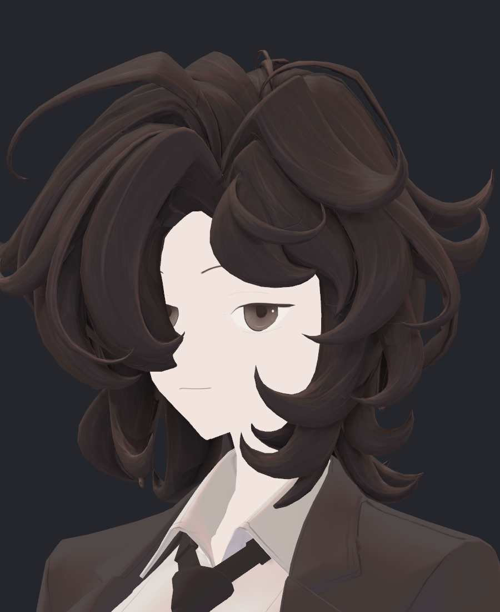
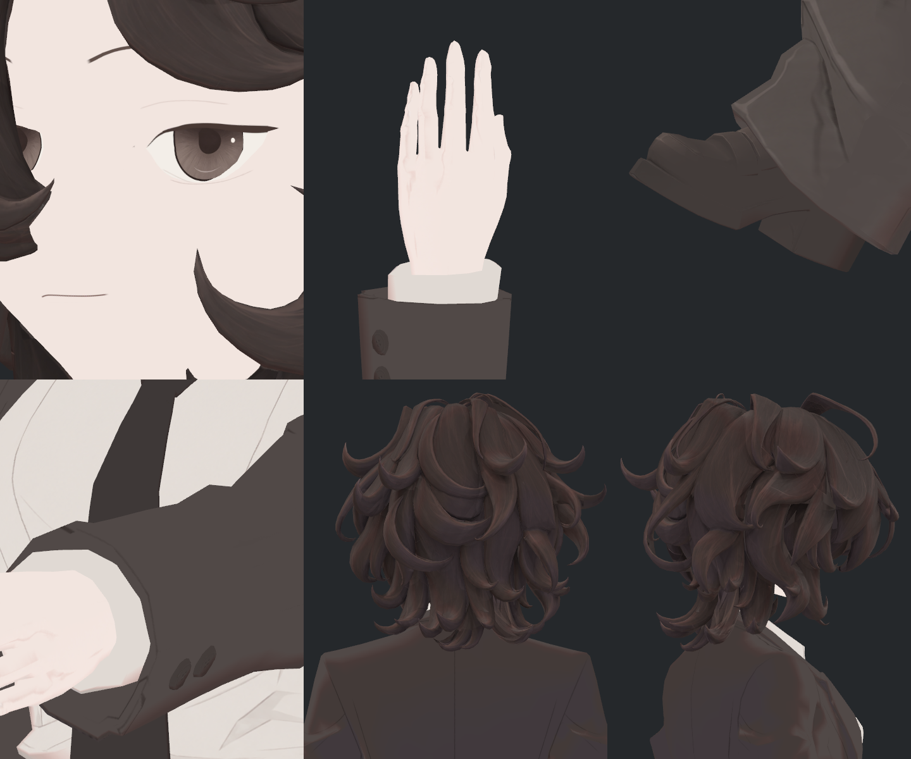
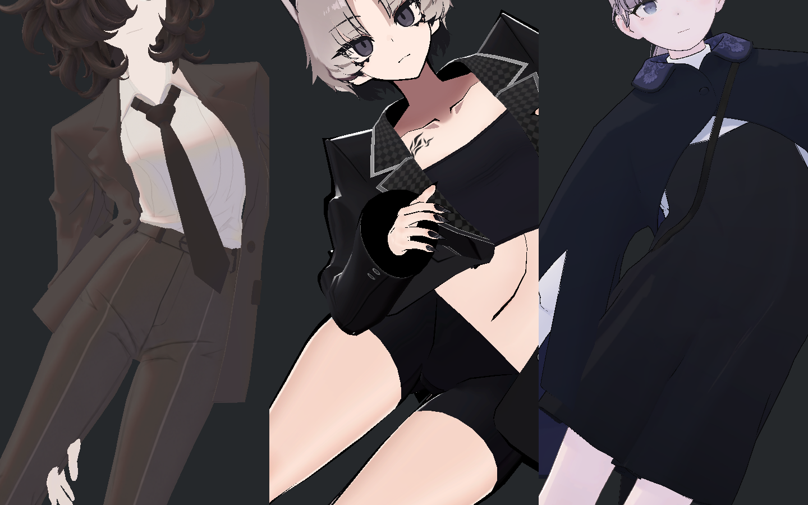

> **기록 시점 안내:** 아래는 해당 단계 당시의 보고서입니다. 후속 결정은 [최신 상태](../../STATUS.md)를 기준으로 읽어주세요. 모델·원본 텍스처·검증 원시 데이터는 이 문서 공유본에 포함하지 않습니다.

> **후속 실행:** 눈꺼풀 복원 요청에 따라 face9 검수 사본을 작성했다. [실제 전후 사진과 옷·신발 디테일 검토](v353_EYELID_RESTORE_AND_DETAIL_REVIEW.md). 아래는 이전 중간 점검 시점의 기록이다.

> **중간 피드백 정정:** 기존 v352보다 눈꺼풀 접힘선·속눈썹·눈꼬리 디테일이 약해진 것이 확인됐다. 현재 얼굴 미관 채택은 보류한다. [재작업 전후 사진·원인 조사](v353_EYELID_REGRESSION_REVIEW.md). 압축 보존 결과를 원래 눈매 보존으로 해석하지 않는다.

# v353 중간 점검 — NPR 표면과 남은 변형 문제

2026-09-14 사용자 요청에 따라 추가 모델 수정을 멈추고 중간 점검본을 정리했다. **지금 확인하기 좋은 부분은 얼굴·헤어·옷의 NPR 표현과 디테일이다. 어깨·자켓의 새 보정을 모두 합친 완성본은 아직 아니다.** 현재 통과한 표면과 실패·미채택 사본을 섞어 완료로 표시하지 않는다.

## 먼저 봐주실 부분

1. **얼굴 인상** — 눈매, 홍채, 입선이 레퍼런스의 차분한 일본 애니메이션/일러스트 인상에 맞는지.
2. **헤어 표현** — 큰 가닥의 덩어리와 세부 선이 자연스러운지, 선과 명암이 너무 약하거나 강하지 않은지.
3. **옷·신발의 디테일** — 전체가 깨끗해진 대신 원하던 세부가 약해지지는 않았는지. 특히 단추·봉제선·신발 스트랩의 선명도.

아래 얼굴 사진은 현재 선택된 Hair29 채색의 실제 Unity 원본 재질 사진이다. BC7 적용 전이며, 아래 압축 비교에서 원본과 압축 후보의 인상·디테일이 유지됨을 별도로 확인했다.

아래는 **실제 BC7 후보**의 눈·손등·신발·소매 단추·헤어 뒤/옆 사진이다. 가짜 생성 이미지나 렌더 후 보정 사진이 아니다.

[원본/압축 전후 비교와 검증 상세](v353_SURFACE_COMPRESSION_REVIEW.md) · [실제 6쌍 독립 검토](reviews/eye/bc7_gpu_roi_v1/actual_npr_v2/v353_BC7_NPR_INDEPENDENT_REVIEW.md)

## 이번 시점의 상태

| 항목 | 현재 결과 | 판단 |
|---|---|---|
| NPR 표면·디테일 | 실제 GPU8맵, 같은 카메라/광원/자세의 NPR6쌍을 직접·독립 검수. 큰 새 번짐·선 소실 미확인 | **표면 통합 시험용 선택**, 사용자 인상 피드백 대기 |
| 실행용 압축 | 원본 PNG/해상도 유지. SDK 텍스처554.67→138.67MiB,75% 감소 | 현재 Opaque8재질 BC7 사용 가능. 전체 비용 등급은 여전히 Very Poor |
| 손·신발·눈·안쪽 표면 | 기존40+수정 손2장, 출처42개 모두 검증 | 눈에 보이는 범위 확인. 코트 안감 전체·가려진 신발 갑피는 전수 완료로 주장하지 않음 |
| 헤어·넥타이 | 기존 네 동작의 참고 모델 비교 및 넥타이 지지/중력 시험 자료 보존 | 네 동작에서 보수적 헤어 물리 유지. 최종 합본의 바람/연속 움직임은 미검증 |
| 어깨 수정 V7 | Blender 저장·재열기 보존 통과. 새 뒤 소매 위치/N/T는 실제 입력을 재사용한 예측에서 개선 | Unity 새 사본 저장 후 **재로드 보존 검사 실패**, 미채택. 실제 V7 전체 구동은 아직 안 함 |
| 자켓 허리 보정 Ribbon | 실제540 표본의 자동 구동 통과. 새 음수 노멀·퇴화·90°초과 면반전0 | **접촉276/540개에서 새 경고, 미채택.** 통과한 구동 수치가 옷의 최종 품질을 뜻하지 않음 |
| 최종 전달 | 선택된 표면과 새 보정의 통합 실행기/검수 준비 | 합본·최종 광원/바람·게임 빌드/PC VRChat 실기는 미완료 |
| iPhone 표정 | 기존 표정 확장을 고려한 준비 방향 유지 | 현재 관절 보정 키는 ARKit 표정 세트가 아님. 얼굴 추적 실기는 미구현·미검증 |

## 아직 넘기면 안 되는 문제

**자켓 허리 접힘:** SiuSiu의 실제 블레이저 차림도 비교했다. 참고 모델도 몸판이 몸 기울임을 따르지만, Bianca의 단추 아래 접힘이 더 국소적이고 날카롭게 보인다. 이 결과를 자켓 중력 문제가 일반적으로 허용된다는 근거로 사용하지 않았다. 서로 다른 의상·체형·팔 자세이며 물리가 꺼진 정적 비교다.

[블레이저 비교의 조건·6장·한계](reviews/rig/integration_latest/waist_blazer_reference_v1/v353_WAIST_BLAZER_INDEPENDENT_REVIEW.md)

Ribbon은 몸과 함께 깊게 접히는 허리와 장식 주변을 개선하려는 후보다. 540개 실제 자동 구동 및 기하/N 검사와 별개로, 접촉 검사는276/540개에서 중지했다. 이 범위에서 코트 자기 접촉은10자세, 코트–셔츠/장식 접촉은23자세에 새 경고가 나왔다. 좌우 기울임 외 복합 자세도 포함된다. 교차선 길이는 깊이나 화면에서 보이는 결함의 크기가 아니므로 이를 구분해 후속 검토해야 한다. 중간 점검본에 자동 합치지 않았다. [검사 범위·중지 경계](reviews/rig/integration_latest/v353_RIBBON_ACTUAL540_CHECKPOINT.md)

**어깨·손 접촉:** V7의 새 뒤 소매 보정은 예측에서 새 자기교차와 노멀 코너 문제를 줄였다. 하지만 Unity 저장·재로드 검사의 참조 표현 차이를 정리하는 과정이 아직 끝나지 않아 완성 후보로 전달하지 않는다. 강한 팔 접힘의 손–소매 경계는 원본에도 겹침이 있고 30mm 근접 비교에서 작은 경계 이동이 남았다. 다른 모델에서도 허용된다는 판정은 아직 하지 않았다.

**직접 본 인상:** 얼굴의 넓은 면은 깨끗하지만, 레퍼런스보다 평평하게 느껴질 여지가 있다. 헤어는 큰 가닥이 읽히는 반면 내부의 부드러운 선이 일러스트의 단정한 명암 면보다 촘촘하게 보인다. 이 두 부분은 오류가 없다는 검사와 별개로 이번 피드백에서 방향을 확인할 항목이다.

**표면 잔여:** 바지 밑단의 얇은 반복 띠와 신발의 낮은 선 대비는 비압축 원본에서도 관찰된다. 이번 압축 때문에 발생한 결함은 아니지만, 원화 주름·표면 명암·UV·필터 기여를 더 분리할 여지가 있다. 디테일을 지우는 블러로 덮지 않았다.

[다른 모델과 비교해 수용한 한계 및 미수용 항목](v353_COMMON_MODEL_LIMITS.md)

## A 포즈 대신 T 포즈 검토

실제 기본 팔은 아래로 내린 방향에서 약20.7° 벌어진 자세다. 기존 실제 입력에는 T90°가 포함되며, 같은 어깨 삼각형에서 T 자세가 중립보다 UV 신장이 자동으로 작아지지는 않았다. 단순히 변형된 T 자세를 새 기본 형상으로 굳히는 수학 사본은 원래 팔 내림으로 돌아갈 때 어깨가 최대8.5mm 달라졌다.

따라서 **이번에는 기본 포즈를 T로 바꾸지 않았다.** 이것은 모든 T 기반 제작 방식이 나쁘다는 결론이 아니다. T 기준으로 웨이트·보정까지 다시 설계한 실제 사본은 아직 시험하지 않았다. 기존 Unity Humanoid의 T 기준 설정과 모델의 바인드 포즈도 구분한다.

[공식 조사·실측·미실행 범위](v353_A_T_POSE_RESEARCH.md)

## 확인용 파일과 다음 순서

Unity에서 현재 표면을 확인할 파일은 `Assets/BiancaV353BC7SurfaceTrialV1/Bianca_v353_BC7_REVIEW.prefab`이다. **표면 검수용이며 새 V7/Ribbon을 합친 최종 아바타가 아니다.** 원본 비압축 Hair29도 보존했다. Blender의 새 V7/Ribbon 사본은 미채택 변형 시험본으로 별도 보존하며, 그 저장 성공을 Unity 품질 통과로 해석하지 않는다.

피드백 후에는 표면 인상 조정의 필요성을 먼저 정하고, 어깨 재로드 검사·Ribbon 접촉 경고를 정리한 다음 선택된 보정을 통합한다. 이후 최종 합본에서 전체 관절/복귀·조명/거리·헤어/넥타이/자켓 물리와 영상 검증을 진행한다. 최종 기준은 Unity 게임/PC VRChat에서 정상적으로 구동되고 레퍼런스의 NPR 느낌으로 보이는 것이다.
