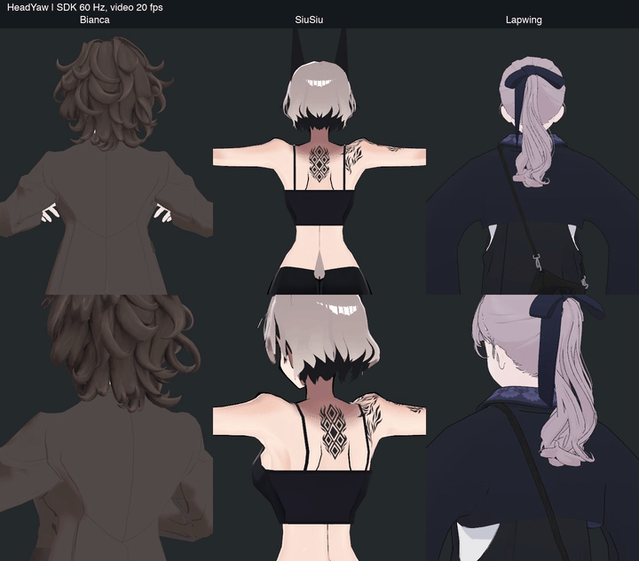
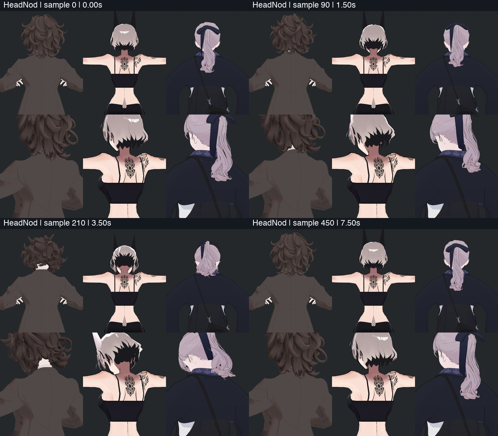
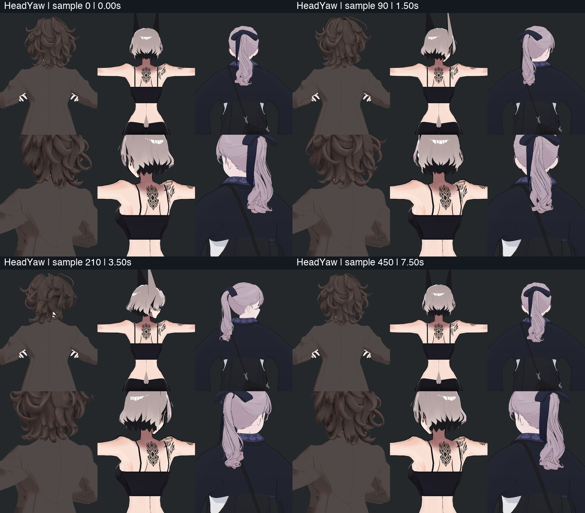
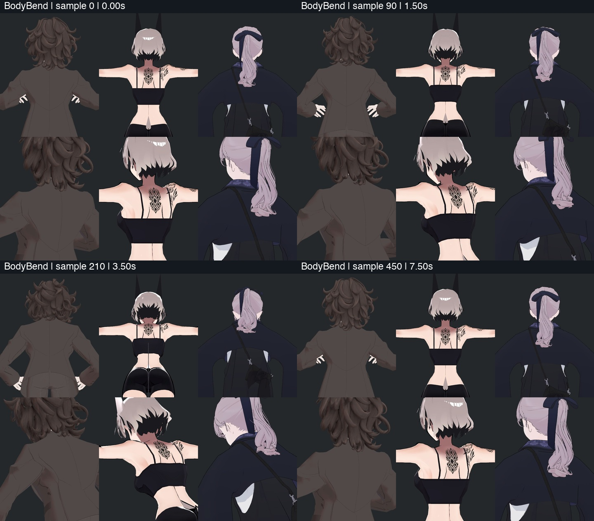
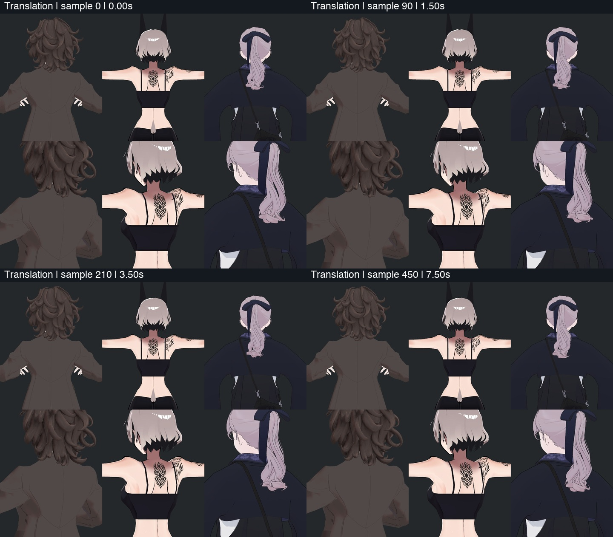
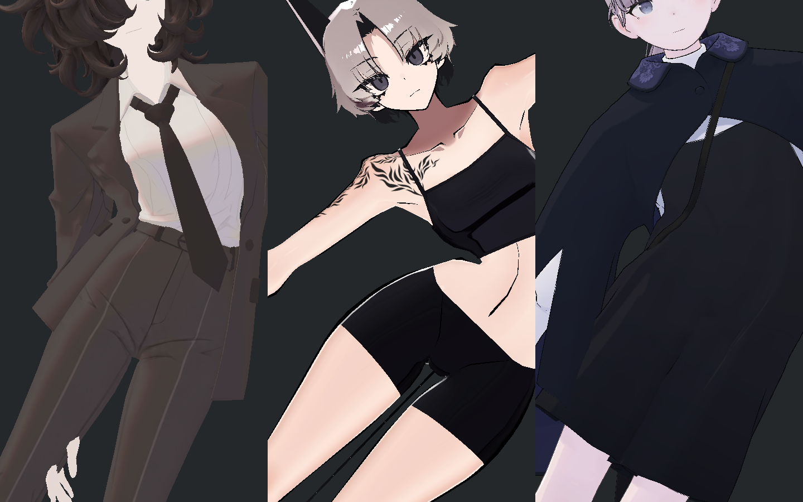
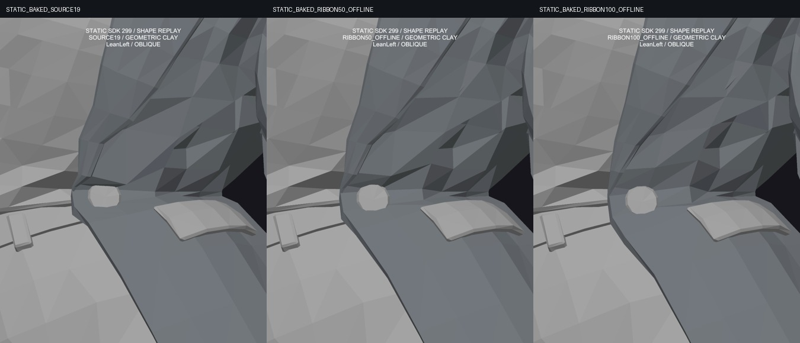
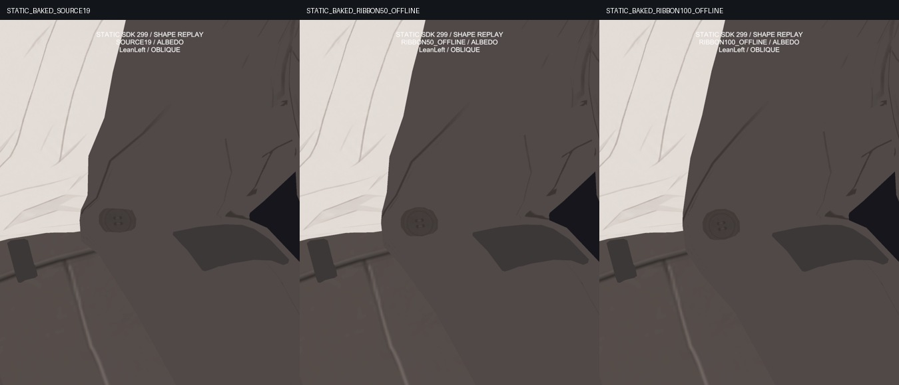

> **기록 시점 안내:** 아래는 해당 단계 당시의 보고서입니다. 후속 결정은 [최신 상태](../../STATUS.md)를 기준으로 읽어주세요. 모델·원본 텍스처·검증 원시 데이터는 이 문서 공유본에 포함하지 않습니다.

# v353 실제 참고 모델 동작 비교와 수용 범위

SiuSiu·Lapwing의 원래 헤어 물리를 Unity에서 함께 움직여 확인했습니다. **Bianca의 현재 헤어 물리는 고개 숙임·회전·몸 전체 기울임·이동의 네 동작에서 유지하기로 했습니다.** 숙일 때 SiuSiu보다 덜 흔들리지만, 실제 반응과 복귀가 있고 기존 컬의 형태를 유지합니다. 단순히 흔들림을 키운 후보에서 생긴 원형 벌어짐과 새 접촉을 다시 합치지 않습니다.

이는 전체 아바타 완료 보고가 아닙니다. 최종 기준은 Unity의 실제 조명과 움직임에서 자연스럽고 선명하게 보이는지입니다. 최종 통합본의 바람 동작, 자켓 몸판 접힘과 중력, 활성 어깨 보정의 연속 전환, 전신 재검수는 계속 진행합니다. PC VRChat 클라이언트 실행은 별도 미검증입니다.

## 실제로 비교한 조건

세 모델의 원래 메시·재질·PhysBone을 보존하고 같은 종류의 입력을 적용했습니다. 체격과 머리 길이가 달라 동일한 흔들림 크기를 강제하지 않았습니다. 영상의 각 행은 왼쪽부터 **Bianca / SiuSiu / Lapwing**, 위는 후면 일반 거리, 아래는 후면 사선 근접입니다.

| 동작 | 일반 입력 → 강한 입력 | 확인한 내용 |
|---|---|---|
| 고개 숙임 | 20° → 45° | 목 뒤 노출, 컬의 반응과 복귀 |
| 고개 회전 | 30° → 65° | 가닥의 지연, 큰 벌어짐·끝 관통 여부 |
| 몸 전체 기울임 | 15° → 35° | 머리 아래쪽 가닥의 중력 반응 |
| 이동 | 체격의 0.06배 → 0.15배 | 이동과 정지 후 흔들림·정착 |

각 동작은 8초이며 원위치 복귀와 3초 안정 구간을 포함합니다. 실제 SDK 60Hz로 네 동작 1,920시점을 기록하고 20fps로 640장을 촬영했습니다. 이 비교는 Source19 채색으로 진행했으므로 최신 Hair29 텍스처 전후 비교와 구분합니다. BodyBend는 모델 전체를 기울인 입력이며 척추를 굽힌 자켓 검증이 아닙니다. 모델별 원래 팔 자세와 의복도 달라 소매 접촉을 동등하게 비교할 수 없습니다.

## 영상과 직접 확인

[32초 전체 비교 영상](reviews/eye/shoulder_readonly/hair_reference_motion_v2/media/v353_REFERENCE_HAIR_MOTION_V2.mp4) · [숙임](reviews/eye/shoulder_readonly/hair_reference_motion_v2/media/HeadNod.mp4) · [회전](reviews/eye/shoulder_readonly/hair_reference_motion_v2/media/HeadYaw.mp4) · [기울임](reviews/eye/shoulder_readonly/hair_reference_motion_v2/media/BodyBend.mp4) · [이동](reviews/eye/shoulder_readonly/hair_reference_motion_v2/media/Translation.mp4)

Bianca는 숙임에서 컬 덩어리를 비교적 단단하게 유지합니다. 강한 숙임 때 보이는 목 뒤 피부는 머리가 회전하면서 드러나는 목 경계로, 정수리에 새 구멍이 생긴 것으로 판단하지 않았습니다. SiuSiu도 헤어 아래의 층과 목 경계가 더 드러나며, Lapwing의 긴 포니테일은 더 크게 움직입니다.

회전과 이동에서는 Bianca의 아래 컬이 조금 늦게 따라오고 원위치로 정착합니다. 직접 본 일반 거리·근접의 대표 시점에서 큰 끝 관통이나 새 큰 틈은 식별하지 못했습니다. 제작자는 네 요약 시트와 강한 입력 원본을, 독립 검토자는 대표 원본 32장과 네 요약 시트를 확인했습니다. **640장 모두를 한 장씩 눈으로 판독했다는 뜻은 아닙니다.** 본 궤적은 전수 분석했고 640장 파일 해시를 검증했으며, MP4 다섯 개는 전체 디코딩 오류가 없었습니다.

## 실제 움직임 크기와 선택 이유

머리 자체의 이동과 회전을 제외한 Head 좌표계에서 헤어 본의 최대 이동을 측정했습니다. 각 모델의 서로 다른 본 중 최대값이므로 동일한 가닥끼리의 비교나 품질 순위는 아닙니다.

| 동작 | Bianca | SiuSiu | Lapwing |
|---|---:|---:|---:|
| 숙임 | 4.49mm | 11.57mm | 55.47mm |
| 회전 | 11.34mm | 12.48mm | 105.07mm |
| 몸 전체 기울임 | 19.72mm | 34.49mm | 174.58mm |
| 이동 | 19.47mm | 23.59mm | 88.58mm |

Bianca와 SiuSiu는 마지막 1초에 처음 위치로 수치 정밀도 수준까지 돌아왔습니다. Lapwing은 긴 가닥의 작은 잔여 움직임이 남았습니다. 구조와 길이가 달라 그 차이만으로 결함이라고 판단하지 않습니다. Bianca의 숙임 반응이 작은 느낌은 남지만 물리가 멈춘 상태는 아니며, 현재 원형을 유지하는 선택을 기록합니다.

## 넘어갈 항목과 계속 수정할 항목

| 항목 | 처리 |
|---|---|
| 가려진 헤어 뿌리와 컬 층의 겹쳐 보임 | 참고 모델에도 층별 가려짐이 남음. 원형을 벌려 모든 겹침을 없애지 않고 이번 통합에서 허용 |
| 숙임에서 상대적으로 단단한 헤어 반응 | 실제 반응·복귀 확인. 네 동작에서는 현재 물리 유지 |
| 기존 바람 구도의 헤어–코트 접촉 | 이번 영상에 바람 입력이 없어 종결하지 않음. 최종 통합본 구도에서 추가 확인 |
| 자켓 허리 몸판의 과한 접힘 | 의복이 다른 참고 모델을 수용 근거로 확대하지 않고 별도 수정·검증 계속 |
| 어깨 함몰·큰 틈·텍스처 얼룩 | 가려진 작은 겹침과 구분. 다른 모델의 공통 한계로 넘기지 않음 |

자세한 수용 기준은 [공통 모델 한계 문서](v353_COMMON_MODEL_LIMITS.md)에 모읍니다. 비교 모델의 제작자가 어떤 결함을 의도적으로 허용했다고 추측하지 않습니다. 사진에서 겹쳐 보인다는 사실과 실제 삼각형 교차·관통 깊이는 서로 다른 증거입니다.

## 실패했던 비교와 수정

첫 촬영에서는 작은 각도의 측정 오류와 카메라 합성 오류가 발생했습니다. 마지막 카메라가 비교 시트 전체를 덮어 올바른 세 모델 비교가 아니었습니다. 각도 허용치를 완화하지 않고 quaternion 측정을 수정했으며, 카메라마다 별도 화면에 렌더한 뒤 합성하도록 변경했습니다. 수정 후 한 장 미리보기를 직접 확인하고 전체 동작을 실행했습니다. 실패 사진은 품질 판정에 사용하지 않았습니다.

원래 프리팹 의존성과 사용자 Unity 장면은 실제 실행 전후 동일합니다. 구매 모델 원본·텍스처·메시 데이터는 이 공개 보고에 포함하지 않습니다.

## 자켓 비교와 후속 보정

허리 기울임을 세 모델의 가슴–골반 중심선 기준 약±17.23°로 맞춘 정적 사진 6장도 직접·독립 검토했습니다. 원래 재질과 메시를 유지한 물리 OFF 진단입니다. SiuSiu는 재킷이 없는 맨허리이고 Lapwing은 넓은 드레스·소매라 Bianca와 같은 옷의 변형 비교가 아닙니다.

Bianca에서 검게 보이는 삼각 공간은 정상 소매–몸판 사이의 배경입니다. 메워야 할 메시 구멍이 아닙니다. 다만 바로 옆 몸판의 과한 안쪽 접힘은 별도 문제여서 기존 정점의 자세 보정을 시험했습니다.

이 회색 사진은 텍스처나 기존 정점 노멀의 영향을 제외하고 실제 면의 기울기를 보여주는 진단용입니다. 왼쪽 단추 위의 가느다란 접힘 골이 줄고 면 흐름이 이어집니다. 단추와 포켓은 기존 구성요소를 통째로 움직여 형태를 유지했습니다. 위쪽 주름과 각진 면은 남습니다.

일반 거리와 채색만 보는 사진의 개선은 작습니다. 제작자는 일반 거리 27장과 근접 24장, 독립 검토자는 핵심 좌우 사선 원본을 직접 확인했습니다. 이 사진은 기존 SDK에서 기록한 표면에 새 보정을 계산해 적용한 **정적 예측**이며 새 후보의 실제 물리·자동 구동 결과가 아닙니다. 개선 가치가 있어 Blender 사본에 기존 메시용 보정 키를 저장했으며, 기존 좌표·웨이트·UV·노멀·기존 키·원본 파일은 보존했습니다. 이후 실제 Unity 구동과 접촉 회귀를 통과해야 합칠 수 있습니다. 자켓 전체의 중력·처짐 해결로 표시하지 않습니다.
