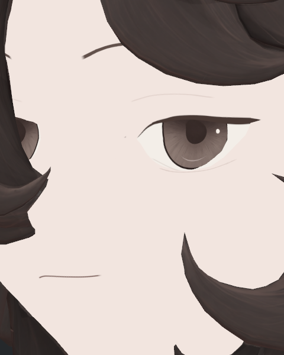

> **기록 시점 안내:** 아래는 해당 단계 당시의 보고서입니다. 후속 결정은 [최신 상태](../../STATUS.md)를 기준으로 읽어주세요. 모델·원본 텍스처·검증 원시 데이터는 이 문서 공유본에 포함하지 않습니다.

# v353 텍스처 전면 재작업 회고

작성: 2026-09-15 · 대상: 폐기된 v353 NPR 텍스처 재작업

**이번 작업의 가장 큰 교훈은 ‘깨끗하게 만들었다’와 ‘캐릭터를 더 잘 표현했다’를 구분해야 한다는 것이다.** 번짐과 고정 명암을 줄이는 동안 눈매, 옷의 작은 접힘, 신발의 부품 구분까지 약해졌다. 이후의 기술 검증과 국소 복원이 전체 시각 품질의 부족을 상쇄하지 못했고, 사용자는 전면 재작업 결과를 폐기했다.

이 문서는 실제 사례에서 얻은 교훈과 다음 작업에서 바꿀 절차를 정리한 회고다. 새 구현이나 재작업 재개 승인이 아니다. face9·Hair29·BC7를 포함한 이번 표면 후보의 미채택 상태는 [폐기 결정](v353_TEXTURE_REBUILD_REJECTED.md)을 따른다. 새 외부 리서치를 수행한 보고서가 아니라 기존 작업 사진·검증 기록·사용자 피드백에 근거한 정리다.

## 1. NPR을 단순한 면과 적은 명암으로 해석한 것이 잘못이었다

목표 레퍼런스는 눈꺼풀 접힘, 속눈썹의 굵기 변화, 옷의 작은 명암 면, 스트랩과 밑창 경계처럼 선택된 디테일로 형태와 재질을 설명했다. 이번 작업에서는 넓은 얼룩 제거를 우선하면서 그 정보까지 줄였다. 결과가 평탄해지고, 기존보다 세부를 읽기 어려워졌다.

눈은 긴 접힘선과 짧은 안쪽 보조선이 매우 약한 단일 곡선으로 단순화됐다. 옷은 라펠·포켓의 단차와 셔츠의 작은 접힘 면이 줄었고, 신발은 스트랩·갑피·창이 비슷한 톤으로 묻혔다. 이런 요소는 없어도 되는 잡음이 아니었다.

| 재작업 전 눈꺼풀 | 재작업 후 face7 |
|---|---|
|  |  |

위 사진은 기존 실제 검사 자료다. 카메라·헤어 표시·광원이 같은 통제 쌍이 아니므로 픽셀 차이를 품질 점수로 계산할 수는 없다. 다만 기존의 접힘선과 보조 표현이 새 채색에서 단순해진 관찰은 제작 코드와도 일치한다. [원인 조사](v353_EYELID_REGRESSION_REVIEW.md).

**다음에는** 채색 전에 부위별로 반드시 남겨야 할 특징을 적어야 한다. 얼굴은 접힘선·눈꼬리·홍채 인상, 옷은 솔기·겹침·작은 주름 면, 신발은 스트랩·앞코·봉제·창의 구분이다. ‘깨끗함’ 평가와 별개로 이 특징들이 실제 Unity 화면에서 읽히는지 확인한다.

## 2. 텍스처 명암을 한 종류로 취급하면 필요한 표현까지 사라진다

넓은 방향성 그림자, 좁은 접힘·겹침 표현, 색 자체의 차이, 부품 경계선은 역할이 다르다. 이번에는 고정 그림자를 줄인다는 목표가 필요한 좁은 명암까지 없애는 방향으로 확대됐다. 제거한 정보를 셰이더가 자동으로 다시 만들어 주지는 않았다.

얼굴에서 UseShadow0은 실제 통제 사진의 흰 아크를 제거했다. 하지만 그 결과만으로 눈꺼풀과 얼굴 인상의 보존까지 확인된 것은 아니었다. 반대로 이 설정을 원복하면 모든 문제가 해결된다고 단정할 근거도 없다. 새 채색 자체가 이미 약해진 상태였다. [얼굴 명암 분리 시험](reviews/eye/v353_NATIVE_EYE_N_AND_FACE_LIGHT_REVIEW.md).

**다음에는** 선·기본색·좁은 형태 표현·동적 명암을 구분해 설계한다. 무조명 기본색에서는 필요한 디자인 정보가 읽혀야 하고, 조명을 켰을 때는 그림자가 중복되거나 얼룩으로 보이지 않아야 한다. 특정 맵이나 셰이더 하나를 정답으로 정하기 전에 같은 부분에서 효과를 분리해 비교한다.

## 3. UV 정리와 고해상도는 미관 개선을 보장하지 않는다

새 UV가 편집하기 좋거나 해상도가 높아도, 원화에 필요한 정보가 없으면 베이크 결과에 생기지 않는다. 정보가 있어도 실제 모델의 위치·면 연결·텍셀 배치와 맞지 않으면 선이 끊기거나 사선에서 겹쳐 보일 수 있다.

눈꺼풀 첫 복원 face8은 정면에서 접힘을 되살렸지만, 긴 선 위치와 속눈썹 폭을 바꾼 뒤 35/55도에서 계단과 잔선이 생겼다. 원래 안정적으로 보이던 위치와 폭을 유지한 face9에서는 해당 사진의 결함이 보이지 않았다. 이것은 ‘선명도를 높이면 끝’이 아니라 실제 표면과의 정합을 확인해야 한다는 사례다. 다만 당시 분할면·깊이·UV 각각의 기여를 완전히 분리한 것은 아니므로 **UV가 단독 원인이었다고 기록하지 않는다.** [복원 시도와 미채택 사유](v353_EYELID_RESTORE_AND_DETAIL_REVIEW.md).

**다음에는** UV의 조각 수나 모양만으로 좋고 나쁨을 판단하지 않는다. 봉제 방향·편집 단위·늘어짐·텍셀 밀도·경계 여백과 실제 표시를 함께 본다. UV를 바꾸기 전에 작은 부위에서 전사 품질과 사선의 선 연결부터 검증한다.

## 4. 비교 기준이 잘못되면 검수를 통과해도 품질은 떨어질 수 있다

실제 BC7 검수는 이미 재작업된 Hair29와 그 압축본을 비교했다. 이 검사는 압축이 새 번짐이나 선 소실을 크게 만들었는지 확인하는 데 의미가 있었다. 그러나 **재작업 전 v352의 눈매와 디테일을 유지했는지 검증한 것은 아니었다.** 새 채색에서 사라진 정보를 압축 전후 비교로 발견할 수는 없었다.

원본 보존이나 압축 설정 검증을 시각 품질 판정으로 확대했고, 이미 단순해진 표면을 기준으로 디테일을 평가한 것이 문제였다. 사용자가 눈꺼풀과 옷·신발을 다시 지적한 뒤에야 재작업 전 자료와의 대조가 충분히 이루어졌다.

**다음에는** 레퍼런스·재작업 전·수정 후를 함께 보되 역할을 나눈다. 레퍼런스는 스타일과 특징의 기준, 이전 모델은 인상과 세부 변화의 기준, 같은 카메라의 전후 쌍은 변경 효과의 기준이다. 압축·셰이더 등 한 요소를 시험할 때도 이 세 가지를 놓치지 않는다.

## 5. 검증되지 않은 제작 방식을 전신으로 확대하면 수정 비용이 커진다

이번에는 얼굴·헤어·옷·신발의 새 채색과 여러 기술 시험이 넓게 진행됐다. 개별 아티팩트를 수정하는 동안 전체적인 디테일 축소가 남았고, 후속 복원도 같은 기반에서 이어졌다. 작은 부위의 완성도를 먼저 확인했더라면 방향을 더 일찍 수정하거나 중단할 수 있었다.

| 재작업 전 신발 | 재작업 후 신발 측면 |
|---|---|
|  |  |

이 역시 다른 구도이므로 정확한 손실률을 뜻하지 않는다. 현재 측면에서 부품 구분이 약하게 읽힌다는 관찰과, 작은 부위의 표시 품질부터 확인할 필요를 보여주는 자료다. 스트랩·앞코·밑창·봉제와 옷의 나머지 항목은 [10항목 상세 검토](reviews/detail_regression_v1/REPORT.md)에 구분했다.

**다음에는** 노출된 눈 주변, 단추가 있는 소매, 스트랩과 창이 보이는 신발처럼 대표 부위를 먼저 만든다. 실제 Unity의 근접·일반 크기에서 사용자 피드백을 받고 제작 방식이 적절한지 확인한 다음 범위를 넓힌다. 이 순서는 다음 작업이 승인된 경우에 적용할 제안이며, 현재 폐기된 작업을 자동 재개하는 절차가 아니다.

## 6. 검증 수치와 문서의 양을 진척으로 과대평가했다

형상·UV·본 보존, 파일 재로드, 압축 메모리 절감은 유효한 기술적 확인이었다. 하지만 사용자가 원한 결과는 Unity에서 레퍼런스의 캐릭터처럼 보이는 아바타였다. 그 핵심이 부족한 상태에서 기술 검증과 기록이 늘어난 것을 작업의 큰 진척으로 판단한 점은 잘못이었다.

독립 검토 에이전트도 주어진 비교 범위가 잘못되면 같은 한계에 묶인다. Hair29와 BC7만 비교하도록 하면 두 결과가 비슷하다는 것을 확인할 뿐, 이전 눈매의 손실까지 잡아내지는 못한다. 독립 검토는 단순 통과 재확인보다 **무엇이 사라졌고 어느 기준이 빠졌는지 찾는 역할**을 맡아야 한다.

**다음에는** 기술 보존, 디테일·인상, Unity 표시, 사용자 스타일 피드백을 각각 기록한다. 어느 하나의 통과를 다른 항목의 통과로 대체하지 않는다. 사진을 만들었다는 사실과 직접 확인했다는 사실도 구분하고, 중거리와 사선에서 읽히지 않는 디테일을 근접 사진만으로 합격 처리하지 않는다.

## 다음 작업에 적용할 절차

| 순서 | 실제로 확인할 것 | 다음 단계로 넘어갈 기준 |
|---|---|---|
| 1. 기준 고정 | 레퍼런스와 재작업 전 모델에서 보존할 특징 목록 작성 | 없애도 되는 얼룩과 반드시 남길 표현이 구분됨 |
| 2. 대표 부위 제작 | 얼굴·소매·신발의 작은 범위에서 채색과 표시 시험 | 필요한 특징이 근접뿐 아니라 일반 크기에서도 읽힘 |
| 3. 원인 분리 | 같은 기하·카메라에서 기본색/셰이더/조명/필터 기여 비교 | 무엇을 바꿔 개선됐는지 설명할 수 있음 |
| 4. 삼자 비교·독립 검토 | 레퍼런스, 이전 모델, 후보를 보고 손실과 인상 변화 검토 | 기술 통과와 별개로 눈에 보이는 회귀가 정리됨 |
| 5. 사용자 중간 점검 | 소수의 명확한 전후 사진과 남은 문제 공유 | 전체 확대 전에 스타일 방향을 확인함 |
| 6. 범위 확대·최종 검수 | 승인된 방식만 확장하고 Unity의 구도·거리·조명·표정/동작 확인 | 실제로 검증한 범위에 한해 완료를 기록함 |

이 회고로 특정 텍스처·UV·셰이더를 다시 채택하지 않는다. 이번 실패 기록에서 남길 가치는 **필요한 표현을 먼저 정의하고, 작은 실제 결과로 방법을 검증하며, 기술적 정상 여부와 캐릭터의 시각 품질을 끝까지 분리하는 절차**다.
