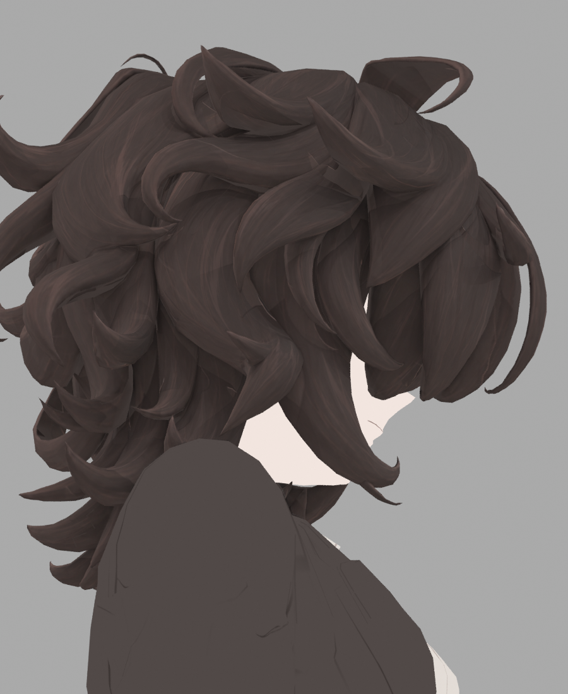
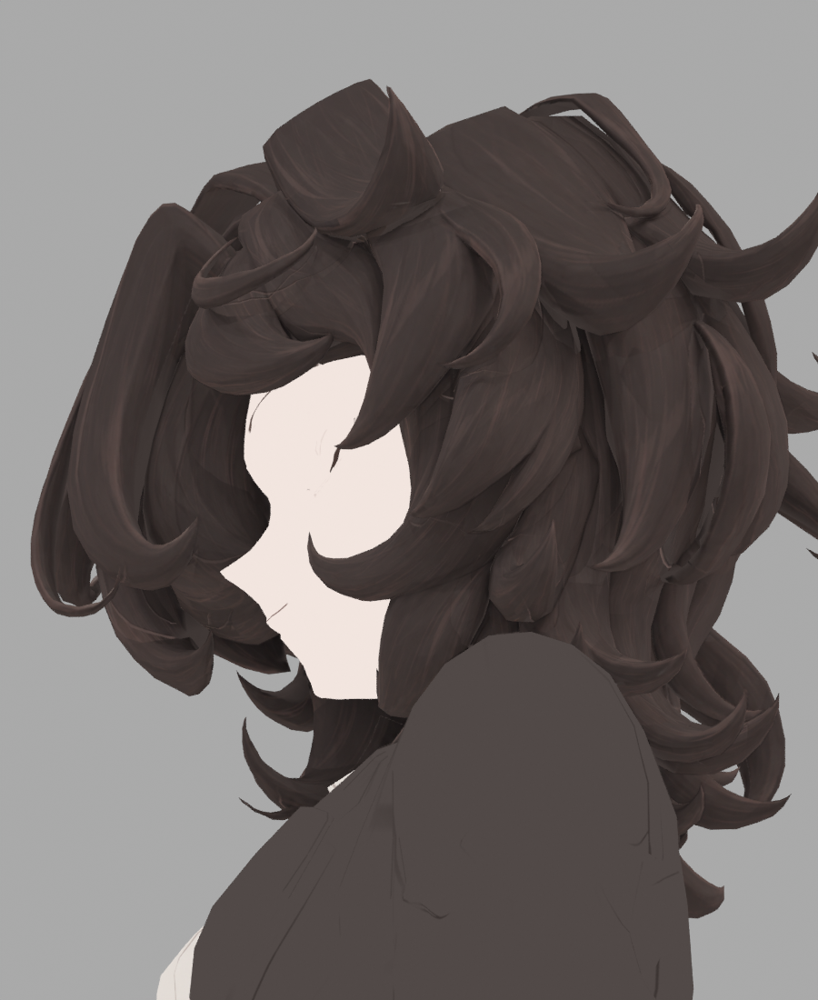
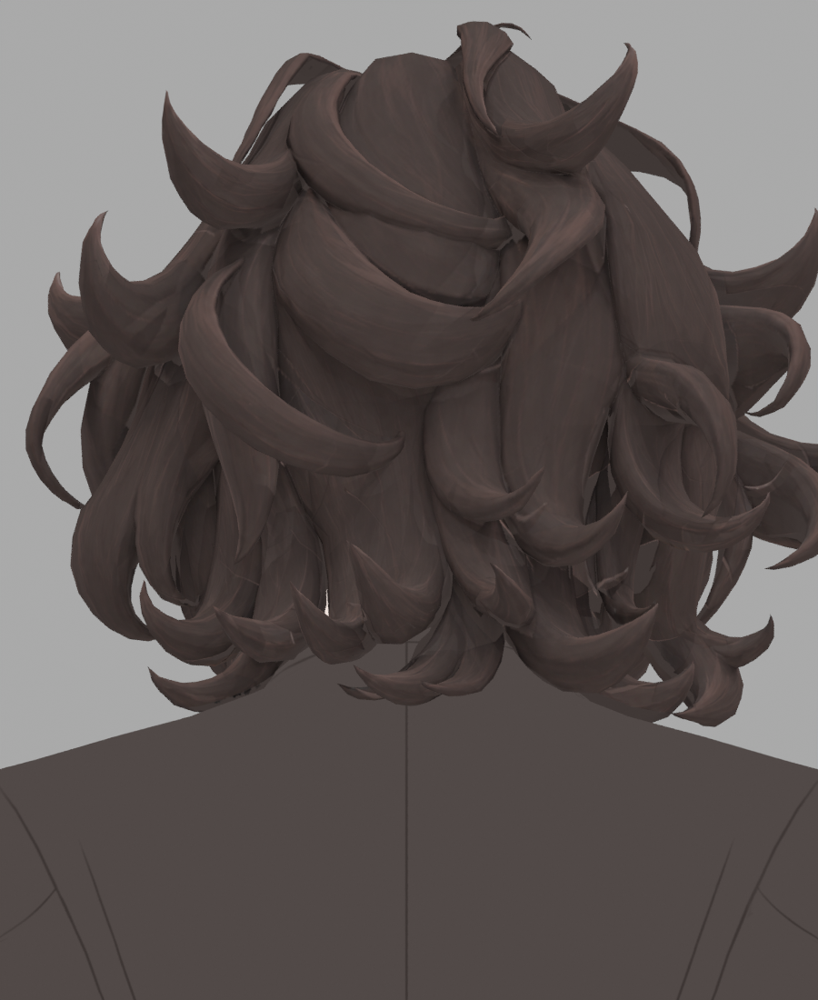
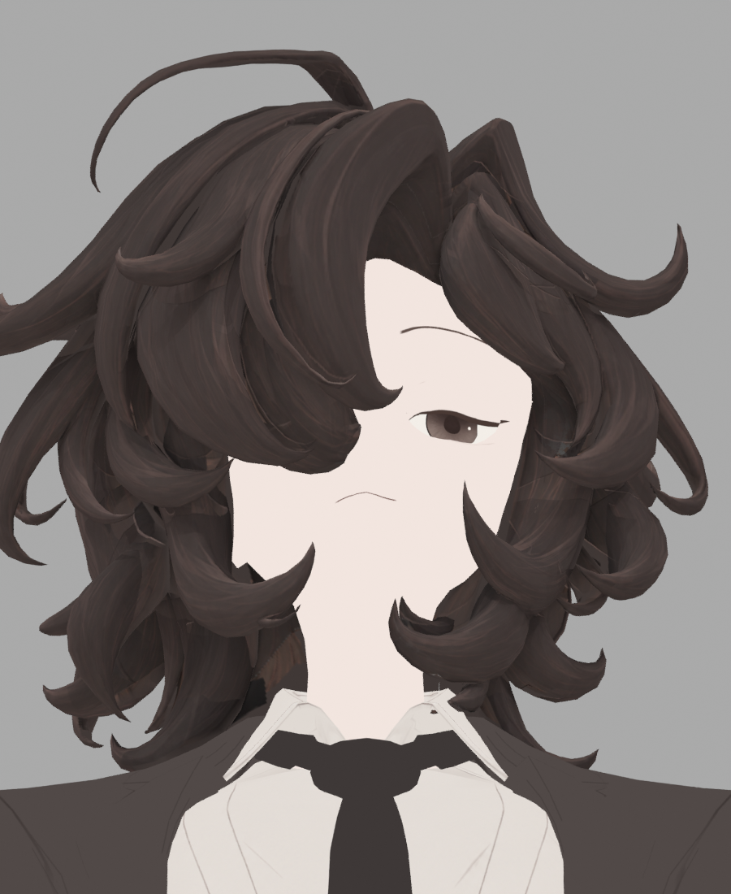
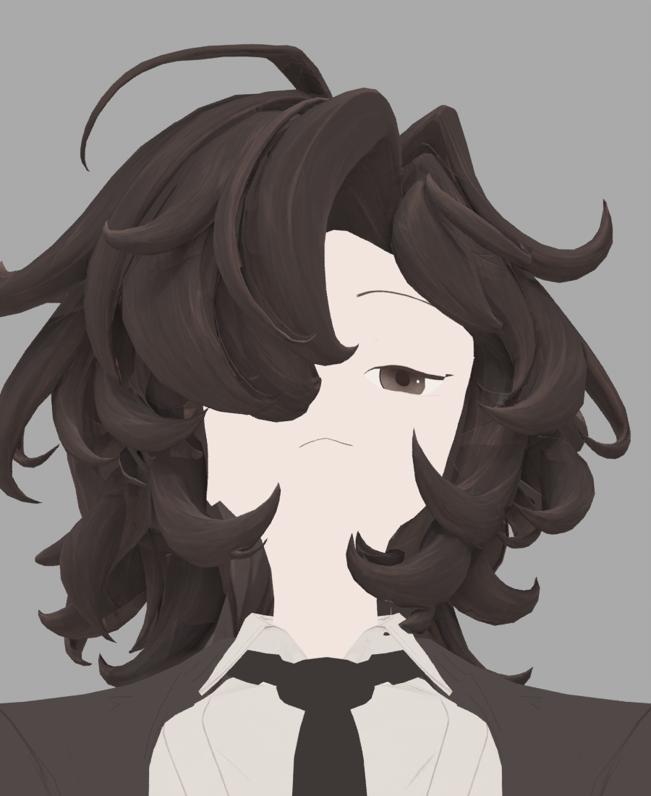
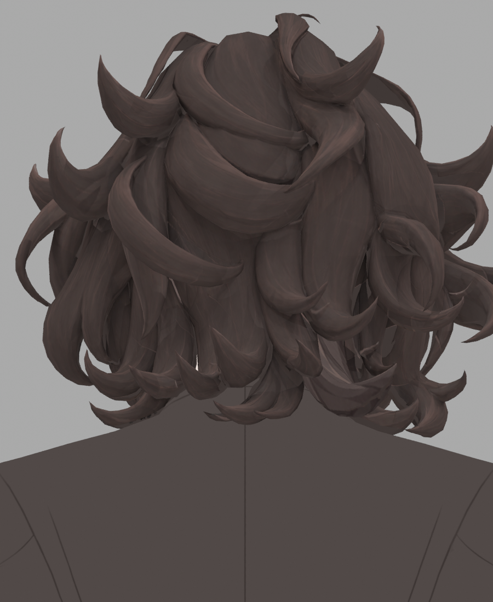
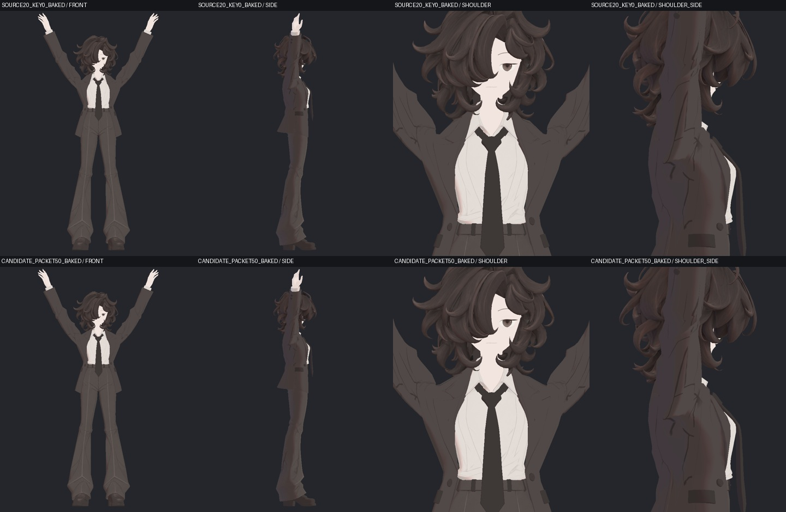
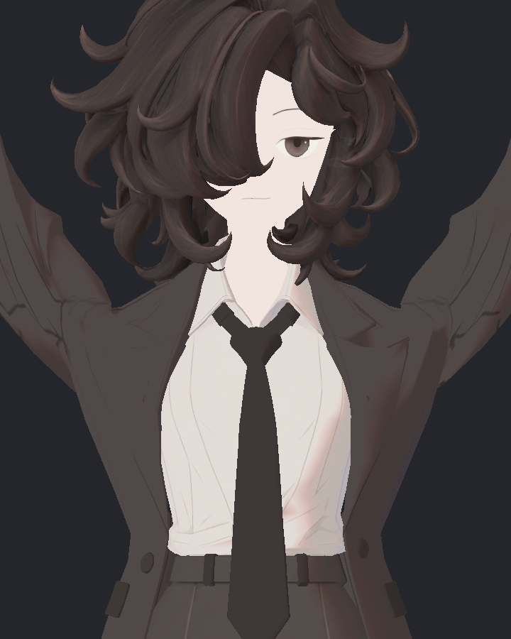

> **기록 시점 안내:** 아래는 해당 단계 당시의 보고서입니다. 후속 결정은 [최신 상태](../../STATUS.md)를 기준으로 읽어주세요. 모델·원본 텍스처·검증 원시 데이터는 이 문서 공유본에 포함하지 않습니다.

# v353 어깨·헤어 안쪽·자켓 물리 후속 작업 보고

2026-09-14. 레퍼런스의 일본 애니메이션·게임·일러스트 NPR 방향을 유지하는 후속 작업이다. **헤어의 배경 혼입은 원인을 수정했지만 일부 채색 경계가 남고, 어깨와 자켓은 실제 동작 검증을 계속하고 있다. 전체 완료본은 아니다.** 아래 사진은 실제 모델/Unity 평가 표면의 결과이며 원화를 완성 모델 사진으로 대신하지 않았다.

## 1. 헤어 안쪽: 가려진 면의 부분 채색과 검은 테두리

목 옆 넓은 가닥이 단색으로 남는 이유를 현재 모델의 삼각형→UV→실제 카메라→채색 원화까지 추적했다. 전체 머리를 아래45도에서 본 가이드에서는 몸이나 다른 가닥에 가려졌지만, 실제 아래30도 구도에서는 드러나는 면이 있었다. 카메라를 추가해도 같은 가닥의 일부만 그려져 넓은 단색 면과 새 붓결 사이 경계가 생겼다.

추가 가이드의 GAP22 후보는 빈 면 일부를 채웠지만 목 왼쪽에 검은 톱니 같은 테두리를 만들었다. 제작자와 별도 검토 에이전트가 실제 사진을 확인하여 미채택했다. 원화 배경의 RGB(1,0,0)이 갈색 여부를 비율로만 검사하는 마스크를 통과했다. 실제 polygon8429/8390과 UV 위치에서 이 픽셀을 그대로 가져온 것이 확인됐다.

| 이전 비교 기준 · ALBEDO20 | 미채택 · GAP22 | 배경 혼입 수정 · GAP24 |
|---|---|---|
|  |  |  |

단순히 검은 부분을 밝게 칠하지 않았다. 새 전사에서는 유효한 갈색 영역만 통과시키고, 유효색×적용률과 적용률을 같은 샘플 조건에서 각각 베이크한 뒤 선형 공간에서 나누어 색을 복원한다. 이 방식은 가장자리 안티앨리어싱 때 배경색까지 평균내던 경로를 차단한다. 원화의 색 자체를 일괄 밝히거나 흐리게 처리하지 않았다.

중간 GAP23에서는 EXR 확장자 파일의 실제 내용이 PNG인 저장 오류도 발견했다. 해당 결과는 형식 검증 실패로 보존했고, GAP24는 Blender의 명시적 OPEN_EXR/32비트 저장 및 실제 파일 헤더·채널 검사를 통과한 결과다. 파일이 생성됐다는 이유로 성공으로 계산하지 않았다.

| GAP24 검증 | 실제 결과 |
|---|---|
| 저장 데이터 | RGBA FLOAT32 ZIP OpenEXR, 실제 헤더 확인 |
| GAP22에서 새로 생긴 배경 혼입 위치 | 178곳 모두 차단; 그중 거의 검정 26곳도 제거 |
| 다른 기존 고신뢰 채색 | 5,686,124텍셀 변화 0 |
| 정상 채색 표본 | 기존 의도한 갈색 유지 |
| 실제 전체 모델 검수 | 정면·좌우·뒤 4방향 전후 8장 직접 확인 |
| 남은 문제 | 목 옆 갈색 채움과 단색 바탕의 단차; 다른 가려진 넓은 면 |

정면의 새 검은 테두리는 사라졌지만 목 옆 갈색 패치 경계가 아직 보인다. 따라서 **GAP24는 전사 오류를 해결한 중간 후보이며 헤어 최종 채택이 아니다.** 기존 ALBEDO20 모델을 보존한다.

| 왼쪽 측면 · GAP24 | 오른쪽 측면 · GAP24 | 뒤 · GAP24 |
|---|---|---|
|  |  |  |

다음 수정은 원래 UV chart114 하나의 흐름을 전체적으로 다시 채색하는 것이다. 기존 129개 면/242개 실제 삼각형만 대상으로 하며, 다른 가닥은 가이드 제작 때만 투명하게 해 가림을 제거한다. 실제 모델의 메시·UV·본을 분리하거나 새 메시로 대체하지 않는다. 현재 전체 구도에서 이 가닥의 표면 중심 가시 면적은 6.4%에 불과했고, 같은 가닥만 드러내면 52.5%였다. 부분 투영을 반복했던 원인을 이 단계에서 바로잡는다.

해당 연결 가닥의 앞면·반대면 새 원화와 실제 UV 전사를 완료했다. 원래 129면/242삼각형의 UV 영역 31,309텍셀 중 29,426텍셀은 두 시점에서 유효하게 관측됐다. 방향에 따른 전사 가중치와 최종 불투명도를 분리해, 낮은 가중치의 정상 채색을 바탕색으로 흐리게 섞지 않도록 했다. 해당 가닥 밖 및 미관측 1,883텍셀은 이전 신규 채색과 정확히 같게 보존했다. 기존 초기 아바타 텍스처는 새 원화 입력으로 쓰지 않았다.

| 부분 투영 · GAP24 | 연결 가닥 앞·뒤 재채색 · CHART114 V27 |
|---|---|
|  |  |
|  |  |

제작자가 실제 8장을 직접 확인했다. 정면 목 옆 갈색 패치 단차가 줄었지만, 반대면의 가닥 연결부에 선명한 선과 잔여 채색의 경계가 드러난다. 나머지 약6% 면을 추가 시점으로 확인하고 있다. 다른 가닥에 남은 넓은 단색 면도 전체 머리 후속 범위다. 이 가닥 한 곳의 개선을 헤어 전체 완료로 보고하지 않는다.

## 2. 어깨: 실제 함몰 보정과 노멀을 별도로 검사

기존 어깨 연결 띠의 접힘을 함께 움직이는 Packet50 후보를 실제 SDK의 540개 자세·연속·복귀 표본에서 검사했다. 원래 32개 보정키·본·웨이트·UV를 유지했고 새 교차·퇴화·회전 반전은 없었다. 수정 범위 밖과 다른 메시의 위치 변화도 없었다.

최초 동일 프레임에서 키만 전환한 사진은 GPU 스키닝 캐시 때문에 실제 형태 차이를 제대로 보여주지 못했다. 이 사진들은 비교 근거에서 제외했다. 아래는 SDK에서 평가된 실제 위치를 서로 독립된 정적 렌더러에 넣은 비교다. **실제 평가 표면을 정적으로 그린 사진이며 GPU 스키닝 연속 영상은 아니다.**

제작자와 독립 검토에서 어깨의 깊은 함몰 완화와 기존 부피 유지가 확인됐지만 짧고 각진 연결 경계는 일부 남았다. 형태 수정 후 바깥면 8코너의 기존 노멀이 면의 반대 반구에 들어가는 문제도 찾아냈다. 위치만 고치고 이 문제를 그대로 두지 않았다.

기존 안쪽 접힌 면은 보존하고, 바깥 연결면의 기존 분리점 27개에만 새 보정키의 노멀·접선 변화를 추가했다. 다른 UV 조각이라는 이유로 색을 덧칠한 방식이 아니다. 노멀 회전은 최대 약32도이므로 조명 비교를 필수로 진행한다. 전체 노멀 재계산이나 새 면 추가는 하지 않았다.

같은 위치의 모든 분리점을 함께 회전시키는 방법은 원래 안쪽 접힘의 노멀을 악화시켜 미채택했다. 실제 빌드에서 아주 작은 원래 위치 변화가 근사0 판별에 빠지는 문제도 보존 검사로 잡았고, 정확한 성분 비교로 수정한 사본은 저장·재로드·원본 보존을 통과했다. 새 노멀의 실제 SDK 540개 표본과 세 방향 광원 54장 비교까지 완료했다. 제작자와 독립 에이전트가 사진을 전부 확인했다. 새 노멀 역행0·기존 역행 추가 악화0이며, 앞선 기하 후보의 실제 2,160개 위치 파일과 정확히 같아 위치 회귀도 없었다. 537개 비활성 자세에서는 노멀이 원래대로 유지됐다.

| 실제 같은 형태 · 노멀 수정 전 | 실제 같은 형태 · 노멀 수정 후 |
|---|---|
|  |  |

사진에서 새 큰 검은 쐐기나 둥글게 부풀어 보이는 셰이딩은 발견하지 못했다. 옆구리와 셔츠의 넓은 명암은 양쪽에 공통으로 남는 별개 범위다. **노멀 후보는 자동 구동 통합 검수 대상으로 진행하며, 전체 어깨 완료나 클라이언트 통과로 취급하지 않는다.** 기존 가슴 기준 팔 방향을 Contacts와 위치 제약으로 측정해 표준 Animator 보정키를 구동하는 구현을 진행하고 있다. 이전 쇄골 각도 제어에 키 이름만 바꾸지 않는다.

첫 SDK 실행은 178표본에서 검사기의 대기시간 판별로 중단됐다. 실패 실행을 보존하고 실제 SDK 콜백·유효 표본·에디터 멈춤 시간을 구분하는 검사기로 고쳤다. 두 번째 실제 실행은 540표본을 끝까지 마쳤으며 장면과 원본이 복원됐다.

## 3. 자켓: Cloth 비교를 닫고 하부 중력 분배로 진행

자켓 Cloth는 중립에서 숙인 자세로 이동할 때 약9~11mm 잔여 변형이 반복됐다. 단위 스케일, 내부 backstop, 초기화 자세, 동일 위치의 여러 UV 정점 웨이트를 구분해 검사했다. 표면이 잘못 움직이는 현상을 기다리면 해결된다고 판단하지 않았다.

| 시험 | 확인된 사실 | 채택 판단 |
|---|---|---|
| V3 고정된 정확한 SDK 목표 표면 | 단위 변환 뒤에도 초기화 자세에 따라 잔여 발생 | 단위 보정만으로 해결 실패 |
| V4 가슴 본 ±1도/±2mm | 작은 입력에서도 위치별 응답 감쇠가 계속 남음 | 원래 Cloth 제작 적용 보류 |
| 모든 실제 웨이트 검사 | 같은 위치의 입자 그룹은 모두 같은 전체 웨이트; 최대4본 | UV 분리점 웨이트 불일치 가설 제외 |
| V5 실제 중립 표면·단일 본 강체 이동 | ±2mm 이동량 오차 약0.000108mm; 입력 직후 1프레임 지연 후 안정 | 단순 강체 이동 정상, 원래 옷 굽힘 해결은 아님 |

V5에는 중립 표면 재기준화와 바인드 변경, 여러 본의 비강체 변형을 강체 이동으로 바꾼 조건이 함께 있다. 따라서 본 개수 때문에 생긴 엔진 버그로 확정하지 않으며, 단일 본 시험용 웨이트를 제작 모델에 적용하지 않는다. 중립부터 남는 약0.0367mm 상수 표면 차이도 별도로 기록했다.

현재 제작 후보는 기존 자켓 본·메시·웨이트를 유지하면서 **상부 지지 구간은 원래 물리값에 가깝게 유지하고 아래 자락 쪽만 중력과 충돌 반경을 늘리는 방식**이다. 전 구간을 느슨하게 했던 이전 후보는 소매–몸판 새 접촉이 생겨 제외했다. 새 사본의 저장·재로드에서 중립 차이0과 원본 보존을 확인했고, 기준/후보는 각각 별도 Play의 첫 실행으로 비교한다. 곡선 설정만 보고 상부가 동일하게 움직인다고 단정하지 않고 실제 위치·부피·교차·복귀를 측정한다.

하부 분배 V1의 기준·후보 각 1,800프레임 실제 실행을 마쳤다. 상부 첫 본 회전은 유지됐고 자락 방향은 중력 쪽으로 더 기울었다. 그러나 66개 실제 표면 표본에서 **자락–소매 새 자기교차 184개 유일 면쌍**이 생겨 V1을 채택하지 않았다. 최대 15.655mm는 교차 선분 길이이며 관통 깊이가 아니다. 앞 숙임만 보거나 정적인 중립 간격만 보고 통과시켰다면 놓칠 문제였다.

후속은 기존 팔 아래쪽 본을 따라 움직이는 소매 콜라이더 2개를 자켓 물리에만 연결하는 사본이다. 실제 새 접촉 면에서 크기와 위치를 측정했다. 첫 저장 시도는 물리 설정 보존 비교에서 중단되어 저장하지 않았다. 실제 원문 3단계를 비교한 결과, 변경은 `MonoBehaviour.colliders` 목록 6→8뿐이고 다른 힘·설정 변화는0이었다. 검사 코드가 중첩된 목록을 제거하지 못한 것이 원인이었다. 정확한 경로로 고친 실행기는 모든 기존 보존 관문을 유지한 채 저장·재로드를 통과했고 중립 표면 차이는0이었다. 새 후보의 실제 1,800프레임 재생도 종료됐으며, 최종 접촉 분석과 장면 복원 확인은 아직 진행 중이다.

## 4. 전달 범위와 계속 진행할 검수

이번에도 원본, 실패 후보, 새 후보를 구분한다. 승인된 무릎·손가락 상태를 유지하고 Blender 작업은 Computer Use로 수행했다. 원화·텍스처·모델·코드·원시 검증 자료는 작업 저장소에 보존하며 공개 문서에는 선별 보고서와 모델 사진만 공유한다.

헤어 한 가닥의 채색 경계, 어깨의 자동 보정 구동, 자켓의 하부 중력과 새 접촉 검증을 이어간다. 이후 최신 표면과 검증한 물리를 통합해 Unity의 다양한 광원·전신 관절·연속 이동을 다시 확인한다. Unity Editor/SDK 검사와 PC VRChat 클라이언트에서의 최종 모습은 구분하며, 아직 최종 아바타 완료라고 보고하지 않는다.
