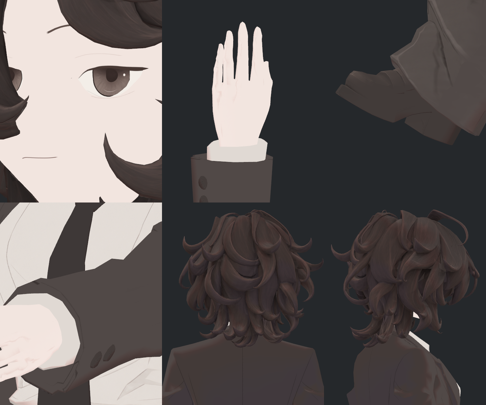

> **기록 시점 안내:** 아래는 해당 단계 당시의 보고서입니다. 후속 결정은 [최신 상태](../../STATUS.md)를 기준으로 읽어주세요. 모델·원본 텍스처·검증 원시 데이터는 이 문서 공유본에 포함하지 않습니다.

> **최신 사용자 결정: 이번 텍스처 전면 재작업은 전부 미채택·중단.** [폐기 결정과 재작업 전 기준](v353_TEXTURE_REBUILD_REJECTED.md). 아래는 당시 작업 이력이며 후속 채택 근거가 아니다.

# v353 표면 근접 검수와 BC7 압축 비교

현재 새 NPR 표면의 **BC7 후보를 통합 시험에 사용하기로 했다.** 원본 PNG와 해상도를 줄이지 않고, 실제 Unity SDK의 데스크톱 텍스처 사용량이 554.67MiB에서 138.67MiB로 75% 감소했다. 모델 형상·UV·본·재질 속성은 이 압축 후보에서 변경하지 않았다. 전체 아바타 통합이나 PC VRChat 클라이언트 검증이 끝났다는 의미는 아니다.

## 직접 확인한 실제 화면

동일한 Unity 카메라·광원·자세에서 눈, 손등, 신발, 소매 단추, 헤어 뒤·옆을 촬영했다. 부모는 아래 두 실제 시트를, 독립 검토자는 두 시트와 원본 개별 12장을 모두 확인했다. 눈 선·홍채 결·손금·단추·봉제선·헤어 선에서 눈에 띄는 새로운 번짐이나 테두리 고리는 확인하지 못했다. 기존 신발의 낮은 명암 대비는 압축으로 새로 생긴 현상이 아니며, 압축이 이를 개선한다고도 주장하지 않는다.

**원본 비압축**

**BC7 후보**

[개별 6쌍과 독립 검토](reviews/eye/bc7_gpu_roi_v1/actual_npr_v2/v353_BC7_NPR_INDEPENDENT_REVIEW.md)

## 검증한 것

| 항목 | 결과 |
|---|---|
| 원본 이미지 | 8장 PNG 바이트 동일. 4K 6장+2K 2장, 기존 밉수·필터·UV 변환 유지 |
| 변경 | Standalone 가져오기 설정을 BC7 고품질로 변경한 별도 사본 |
| 자산 보존 | 실제 722개 오브젝트·24,243개 속성 대조, 허용된 이미지/재질 참조만 대응시켜 검증 |
| GPU 비교 | 실제 GPU의 mip0 값을 동일 선형 float 경로로 읽어 사용 UV·눈/단추 의미 영역·세부 선·UV 경계를 비교 |
| 실제 표시 | 원래 lilToon 재질과 실제 필터/밉을 사용한 6쌍. 카메라·광원·자세 동일 |
| 시각 판정 | 부모/독립 검토 모두 현재 표면의 통합 사용 가능. 전체 최종 승인 아님 |
| 비용 | SDK 텍스처 554.67→138.67MiB. 전체 성능 등급은 여전히 Very Poor이며 Contacts 등 별도 비용이 남음 |

사용 UV 내 RGB 평균 오차는 0~255 눈금으로 얼굴0.0055, 헤어0.1201, 단추 포함 디테일0.0060, 손0.0135, 신발0.0154였다. 넓은 단색 면이 평균을 낮출 수 있으므로 평균만으로 판정하지 않았다. 눈 선과 홍채 의미 영역, 디테일 경계의 오차 상위 크롭을 직접 보고 위 실제 NPR 화면으로 확인했다.

알파는 GPU에서 원본255, BC7 후보254/255가 관측됐다. 현재 8개 재질은 모두 Opaque이며 실제 사용 중인 lilToon의 불투명 분기에서 출력 알파를1로 고정하므로 현재 표시에서 알파 컷아웃 구멍을 만들지 않는다. 향후 투명/컷아웃 재질로 전환하면 이 판정을 재사용하지 않는다. 특정 BC7 블록 모드를 읽어 원인을 확정한 것은 아니다.

## 전수 근접 사진의 보완

현재 표면의 양손 앞뒤, 좌우 신발 안/밖/위, 겨드랑이와 코트 밑단, 다리 안쪽, 눈꺼풀 근접·중간·원거리 등 42장을 촬영했다. 첫 손 거리 사진2장은 좌우 프레임 밖으로 잘려 제외하고, 실제 양손 정점 경계로 구도를 다시 잡아 재촬영했다. 원래42장도 보존하며, 최종 검수 묶음은 **원래40장+수정2장**이다.

코트 밑단 사진은 보이는 안쪽 면의 표본이며 전체 안감 모든 픽셀의 검수라고 확대하지 않는다. 바지에 가린 신발 갑피 역시 자연 가림 범위는 남는다. 겨드랑이·바지 밑단의 얇은 접힘 띠는 압축 이전에도 존재하므로 형상·명암 원인을 따로 판단한다.

## 실패와 수정

- 최초 압축 사본 보존 검사는 Unity의 임시 instanceID와 저장된 GUID/fileID 참조 형식을 직접 비교해 실패했다. 전체 속성을 실제 참조로 해석해 대조하는 방식으로 수정하고 원본 보존을 실제 재검증했다.
- GPU 영역 분류 초안은 경로의 문자열으로 얼굴 범주를 오분류했다. 실제8개 원본 경로와 의미 범주의 동결 목록으로 수정하고8장 모두 재실행했다.
- 신발 구도 초안은 BakeMesh 스케일 처리 문제로 실패했다. 실제 renderer 변환과 발 정점 경계를 검증해 수정했다. 실패 사진은 채택하지 않았다.
- 진단 호출기는 같은 이름의 인자 있는/없는 함수를 구분하지 못해 실행 전에 실패했다. 무인자 함수 서명을 명시해 수정하고 실제 NPR/손 재촬영을 성공시켰다.

## 이어지는 작업

새 어깨·자켓 허리 보정의 실제 자동 구동, 두 보정이 동시에 작동할 때의 면·노멀·접촉, 넥타이/헤어/자켓 물리, 최종 합본의 광원·거리·바람/이동 검증을 진행한다. 이 문서의 표면 합격을 그 결과의 대체 근거로 쓰지 않는다. 최종 목표는 Unity 게임/PC VRChat에서 NPR 스타일과 동작이 정상적으로 보이는 것이다.
