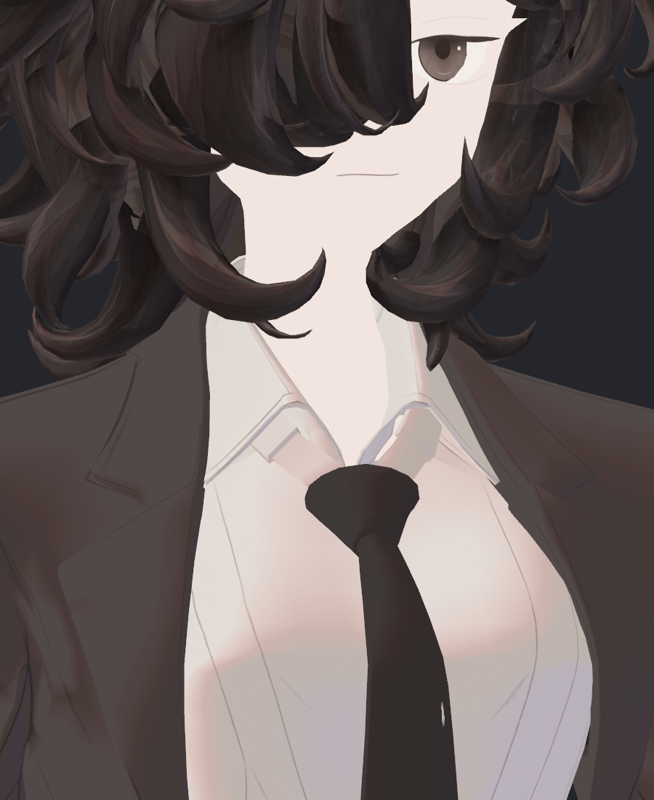
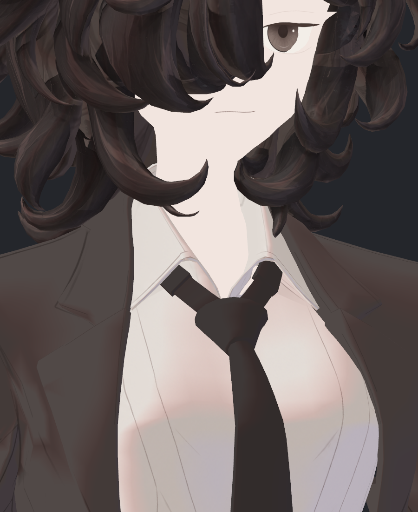
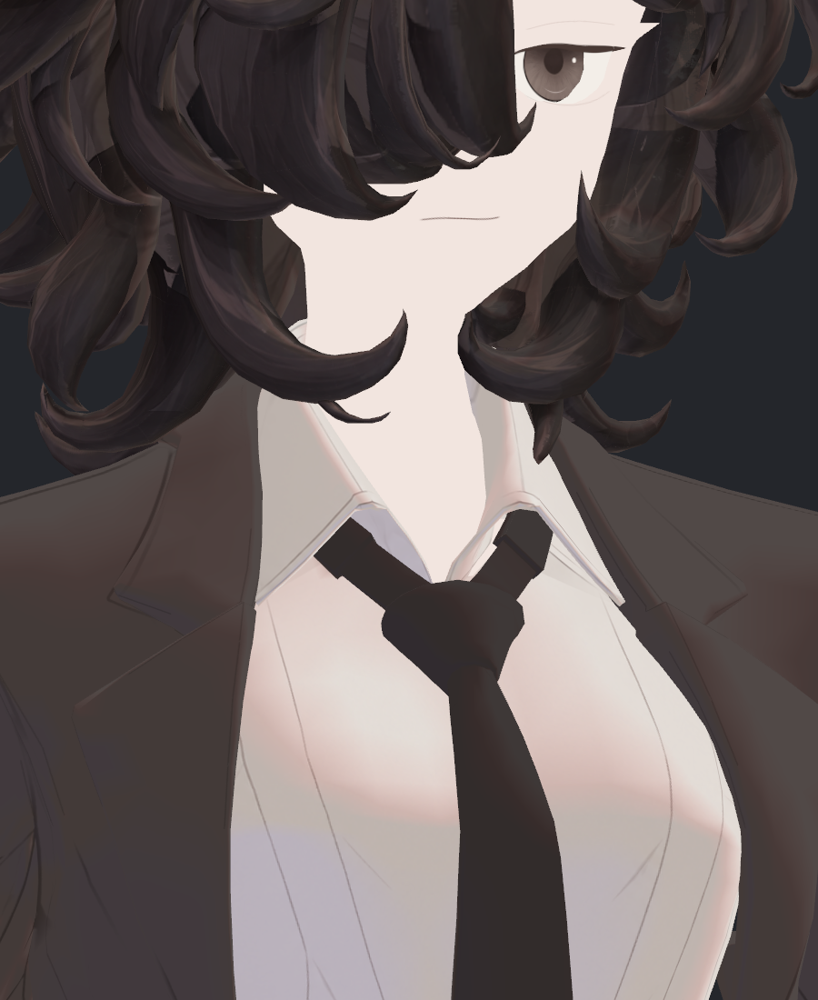
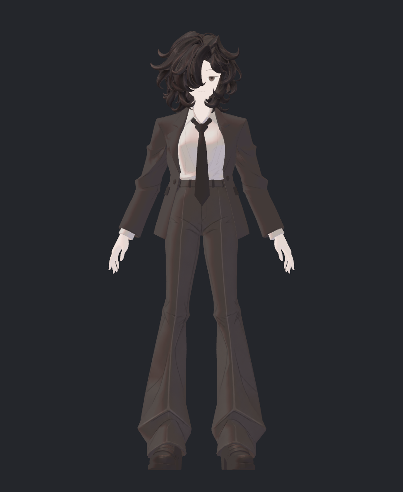
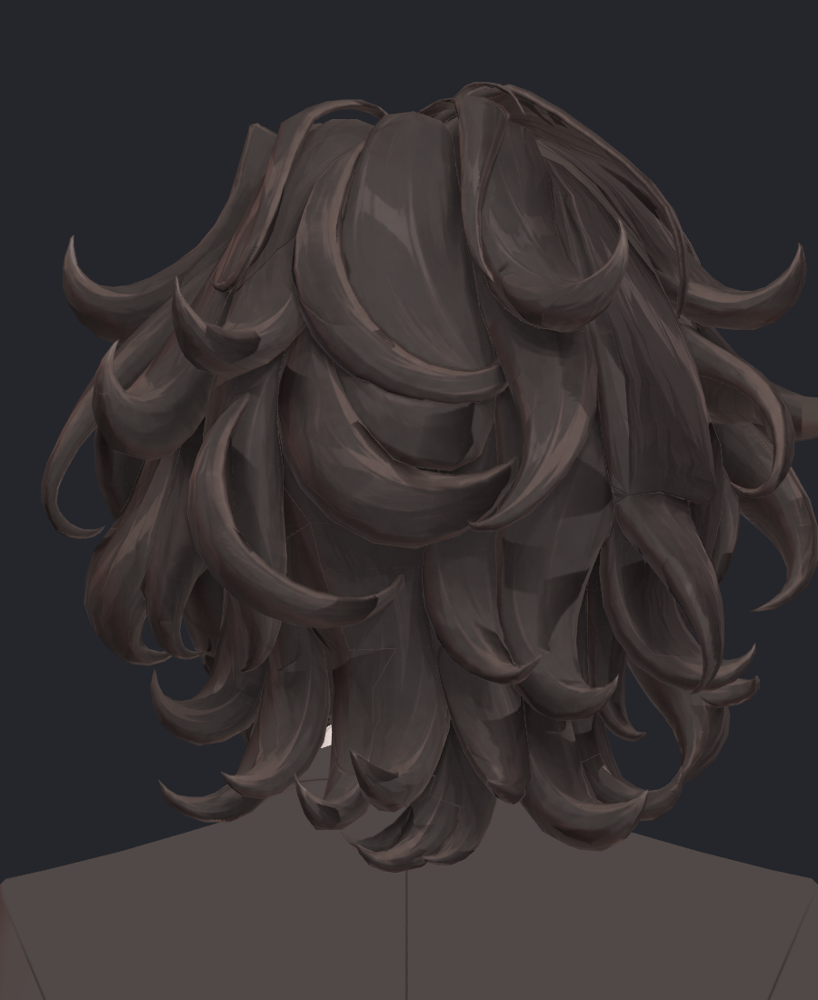
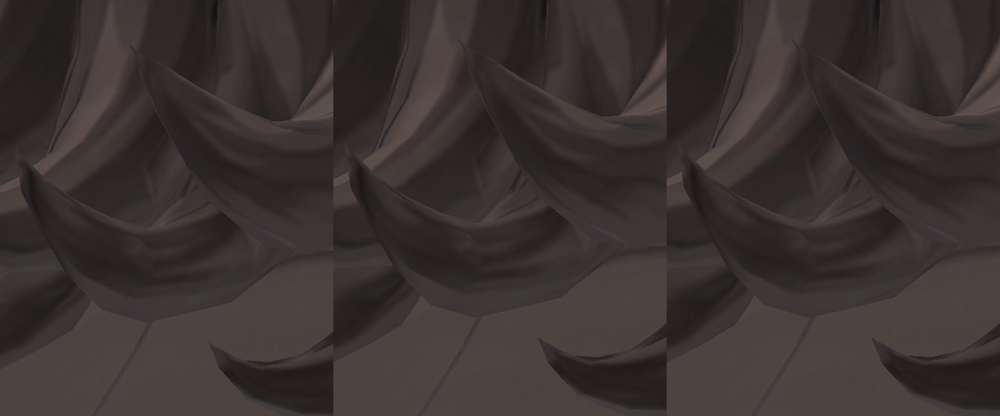

> **기록 시점 안내:** 아래는 해당 단계 당시의 보고서입니다. 후속 결정은 [최신 상태](../../STATUS.md)를 기준으로 읽어주세요. 모델·원본 텍스처·검증 원시 데이터는 이 문서 공유본에 포함하지 않습니다.

# v353 표면·카라·물리 후속 작업 보고

NPR 재작업을 계속 진행하고 있다. 이 보고서는 실제 실행과 직접 검수한 결과를 정리한 중간 기록이며 전체 아바타 완료나 PC VRChat 클라이언트 합격을 뜻하지 않는다. 초기 텍스처의 픽셀을 새 채색 원본으로 사용하지 않았고, 기존 외형·UV·웨이트·보정키를 유지한 비교 사본에서 확인했다.

## 이번에 드러난 근본 원인과 수정

| 대상 | 확인한 원인 | 이번 대응 | 판정 |
|---|---|---|---|
| 헤어 회색 오염 | 투영 원화의 회색 얼굴/배경 가이드가 실제 모양과 조금 어긋나 가닥에 혼입 | 실제 가시 면·깊이에 더해 원화 채색 영역도 검사 | 회색 혼입 개선, 다른 색 경계는 잔여 |
| 헤어 띠/삼각 패치 | 시점별 채색과 가중 경계, 원화에 있는 하이라이트 띠가 섞임 | 코너 노멀 보간 가중 V10, 동시 정규화 합성 V11 비교 | 부분 개선이나 최종 미채택 |
| 카라 첫 시험의 넥타이 오염 | 현재 면 번호와 원본 부품 번호 불일치. 이전 정리로 100면 이동 | 원본 면 식별자 복원, 실제 Unity UV/120삼각형 대응 확인 | 잘못된 첫 후보 제외; 정확한 영역 베이크 성공 |
| 카라 안 회색 두 조각 | 레퍼런스에서 매듭에 연결된 검은 넥타이 목띠를 셔츠색으로 분류 | 새 넥타이 기본색으로 목띠 영역만 재채색 | 좌·우 조명/전신에서 목띠 연결 확인. 색 교정 보존 |
| Cloth 고정 시험 | 모든 maxDistance0 조건에서는 실제 입자 활동이 없었음 | 0.01mm epsilon으로 활동성 대조 | 움직이지만 원래 스킨과 최대14.0631mm 차이. 처짐 합격 아님 |
| Cloth/셰이프 의심 | 같은 프레임 참조에서 셰이프 ON/OFF의 차이가 원인이 아님 | 현재 본/메시를 그대로 사용한 비표시 스킨 대조 | 셰이프 삭제하지 않음; 강성 해제/Animator hold 대조에서도 차이 잔여 |
| 헤어 물리 | 알려진 한 접촉을 줄여도 다른 접촉이 늘어남 | 06/10 후보 각각4800프레임 및 기존/반복 대조 | 둘 다 미채택 |

## 카라: 두 번의 잘못된 가정과 교정

첫 베이크는 "다른 텍스처 픽셀이 그대로인가"만 통과했다. 그러나 그 마스크 자체가 잘못된 현재 면을 가리켰으므로, Unity에서는 넥타이에 흰 줄이 생겼다. 이는 캐릭터의 원래 문제를 해결한 결과가 아니라 이번 시험에서 발생한 회귀다. 해당 후보는 원본이나 최종 파일에 합치지 않았다.

원본 면 식별자를 사용해 현재5003↔원본5103, 현재11394↔원본11494를 대응했다. 화면의 두 회색 부분이 실제 Unity details 재질의786/1292번 삼각형임을 확인했다. Blender120삼각형과 Unity120삼각형은 UV 최대오차 약3.44×10⁻⁸로 대응한다. 셔츠색 후보 V2에서는 넥타이 흰 줄이 사라졌지만, 두 목띠가 흰색인 근본적인 인상 문제는 남았다.

`ref_char.png`를 다시 직접 확인했다. 흰 카라 아래에는 검은 목띠가 있고 이것이 넥타이 매듭으로 이어진다. 따라서 두 조각을 더 밝게 만드는 대신, 동일한 새 넥타이색 #3E3837로 연결하는 후보를 만들었다. 형상·UV를 움직여 감춘 수정이 아니다. 이 부품 역할 판정은 레퍼런스의 시각 대응에 근거한다.

Unity에서 같은 카메라·광원으로 다시 확인했다. 검은 목띠가 매듭으로 연결되며 첫 후보의 흰 줄은 없다. 색상 교정을 보존할 수정으로 정리한다. 전체 아바타나 헤어 후보의 최종 채택은 아니다.

수정은 기존60면/120삼각형의 텍스처 영역에만 적용했다. 변경 범위 밖 픽셀은 원래 새 details_v8과 정확히 일치한다. 새 메시·본·UV 변경이나 기존 단추/넥타이 본체의 재채색은 없다.

## 헤어: 개선과 미채택 이유

5시점 원화는 새로 생성한 NPR 그림이다. 가닥별 선·굽음·실루엣을 따르도록 실제 회색 형상 가이드를 사용했다. 생성 그림을 예쁘다는 이유로 결과 사진처럼 제시하지 않고, 실제 모델에 적용한 모습을 비교했다.

V9/V10 Unity48장 전체는 비교표로 확인하고, 목둘레·전신·후면의 주요 원본을 확대 검수했다. V10은 회색 가이드 혼입을 제거했지만 앞머리·뒤통수에 색 경계가 남았다. V11은 5시점의 선후관계에 따른 덮어쓰기를 없앤 동시 합성이다. 블러는 사용하지 않았지만 서로 맞지 않는 가닥 선이 평균되면 디테일을 낮출 수 있어 자동 채택하지 않았다.

현재 hair_defined_v2 원본 바인딩은 그대로 보존했다. [시도별 상세 비교](reviews/rig/hair_flow/v353_HAIR_MULTIVIEW_REVIEW.md).

## 헤어 물리: 실제 동작을 보고 제외

기존/06/10/기존반복 각4800프레임, 각167개 메시 표본을 확보했다. 기존129본의 부모와 중립 외형을 유지하고, 기존 연결 가닥5개의 움직임을 보조 가이드로 조절한 사본이다. 중립 최대차이 약0.00048mm, 비교 반복본 대비 대상 외 메시/코트 좌표 변화0이다.

알려진 바람120프레임의 접촉 깊이는 기존3.1888mm→06후보0.3059mm→10후보0mm로 줄었다. 하지만 전체에서는 다른 헤어-코트 접촉이 새로 생긴 표본이 각55개였다. 새 가닥끼리의 삼각형 접촉도 증가했다. 삼각형 접촉 수 자체를 모두 눈에 보이는 결함과 동일시하지는 않지만, 한 장 개선으로 후보를 합칠 수 없는 결과다.

아래 비교는 **왼쪽 기존 / 가운데06 / 오른쪽10**이다. 실제 Unity 캡처 10시점을 원래 시간 간격에 놓은20초 자료이며, 캡처 사이에는 같은 사진을 유지한다. 연속60fps의 모든 중간 형상을 촬영한 영상은 아니다. 합성 움직임이나 보간으로 품질을 꾸미지 않았다. MP4 전체 디코딩 검사와2초 프레임 직접 확인을 수행했다.

[MP4 비교 보기](reviews/physics/media/v353_HAIR_SURFACE_GUIDE_WIND_SAMPLED.mp4)

## 자켓 Cloth: 무엇을 확인했는가

전체 고정 상태에서는 기본값/수면0 모두1736입자가66표본 내내 runtime frame0위치에 머물렀다. 단지 카메라를 켜거나 스케일1로 바꾸는 것만으로는 해결되지 않았다. epsilon0.01mm를 주면 움직이므로 전부 고정된 대조만으로 Cloth 구동 상태를 판단할 수 없다.

이후 실제 SDK 콜백에서 같은 메시와 현재 본 배열을 가진 보이지 않는 스킨 참조를 만들어 직접 비교했다. 현재 셰이프 유지/참조에서만 셰이프0을 각각 계산했으며 실제 Cloth나 원본 셰이프는 건드리지 않았다. 두 epsilon조건 각각1800프레임/66표본을 완료했지만, 스킨과 최대14.0631mm가 달랐다. 보정키를 지우는 해결책은 근거가 없으므로 제외한다.

강성·감쇠·테더를 해제한 대조는 최대 10.8476mm 차이가 남았고, 같은 자세를 유지한 채 Animator를 끈 대조도 최대 14.0631mm였다. 각각 1800프레임/66표본을 완료하고 장면 복원을 확인했다. 둘 다 해결책으로 채택하지 않았다.

원래 작업의 자켓 처짐 요구는 계속 유효하다. 이 대조의 성공은 측정 경로 확보이지 자연스러운 옷 구현의 완료가 아니다. [조사 근거와 실행 구분](reviews/physics/v353_CLOTH_EVALUATION_RESEARCH.md).

## 검증 범위와 계속 처리할 항목

- 표면 노멀 통합은 NEW4 눈, 기존 단추·정수리·셔츠 교정의 기하/UV/본 보존 및 실제 Unity 재로드를 검증했다. 헤어·카라의 미채택 후보까지 최종 승인됐다는 뜻이 아니다.
- 자켓 중력·접촉, 넥타이 root후보의 연속동작/중력, 헤어 새 접촉, 어깨 들기 및 최종540전신 검수가 남아 있다. 새 결함을 이번 진행 범위에서 다룬다.
- 신규 독립 검수는 검토 에이전트 사용량 한도로 실행되지 않았다. 이 보고서의 새 사진 판정은 제작자 직접 검수이며 기존 눈63장·단추32장 독립 검수와 구분한다.
- PC VRChat 클라이언트는 아직 실행하지 않았다. Unity Editor/SDK의 결과를 PC 클라이언트 검수로 표시하지 않는다.

검토용 색상 교정 사본: Blender `bianca_v353_TIE_BAND_COLOR_CORRECTION.blend`, Unity `Bianca_v353_TIE_BAND_COLOR_CORRECTION.prefab`. Unity는 저장 후 다시 열어 메시·UV·노멀·본과 텍스처 연결을 확인했다. 헤어는 기존 새 hair_defined_v2와 동일한 해시의 기본 채색을 사용하며 미채택 V9/V10/V11 투영 후보와 실패한 물리 후보를 포함하지 않는다.
