> **기록 시점 안내:** 아래는 해당 단계 당시의 보고서입니다. 후속 결정은 [최신 상태](../../STATUS.md)를 기준으로 읽어주세요. 모델·원본 텍스처·검증 원시 데이터는 이 문서 공유본에 포함하지 않습니다.

# v353 NPR 전면 재작업 — 실제 실행 중간 검수

**전체 작업은 진행 중이며 최종 채택본이 아니다.** 기존 텍스처의 픽셀을 채색 원본으로 사용하지 않고 새 기본색·세부 그림을 제작했다. 실제 모델 적용에서 발견한 투영·UV·기하·셰이더·물리 문제를 분리하고 수정 중이다. 아래 사진은 제작자가 직접 열어 확인한 결과이며, 보기 좋지 않은 시험도 원인과 함께 남긴다.

최종 목표는 **Unity 게임/PC VRChat에서 조명·자세·움직임이 달라져도 정상적으로 동작하는 일본 애니메이션·게임·일러스트 계열 NPR 캐릭터**다. 레퍼런스의 차분한 색과 인상, 머리 컬과 가는 선, 눈매, 봉제선·단추·신발 디테일을 존중한다. 그림자를 없앤다는 이유로 디테일을 지우지 않는다. [아트 방향과 공식 조사](v353_ART_DIRECTION.md)

Blender 편집과 베이크·렌더는 Computer Use로 실행한다. 기존 메시·사본을 보존하며 대체 메시를 만들지 않는다. 베이크용으로 동일 삼각형을 임시 복사한 경우 작업 후 폐기한다. Unity Editor SDK 시험은 실제 PC VRChat 클라이언트 검증과 구분한다.

## 후속 실제 검수: 눈·얼굴 63장, 단추 32장

후방 얼굴 20점까지 불필요하게 이동했던 첫 눈 깊이 시험을 바로잡아, 눈 앞쪽 268점의 깊이 조정만 남긴 `EYE_ONLY` 사본을 만들었다. UV·키 상대변위·웨이트를 보존하고 새 기하 교차가 없는지 확인했다. 이후 새로 문제를 일으킨 눈의 Unity 노멀 4개만 보정한 NEW4와 더 넓은 ALL7을 실제 Unity에서 비교했다. ALL7의 추가 미관 이득은 없어 최소 수정 NEW4를 후속 후보로 선택한다. 노멀 수정만으로 아래 흰 띠가 사라진 것은 아니다.

| 같은 NEW4·face7, 기존 얼굴 그림자 | 얼굴 국소 그림자 OFF, 환경광 반응 유지 |
| --- | --- |
|  | 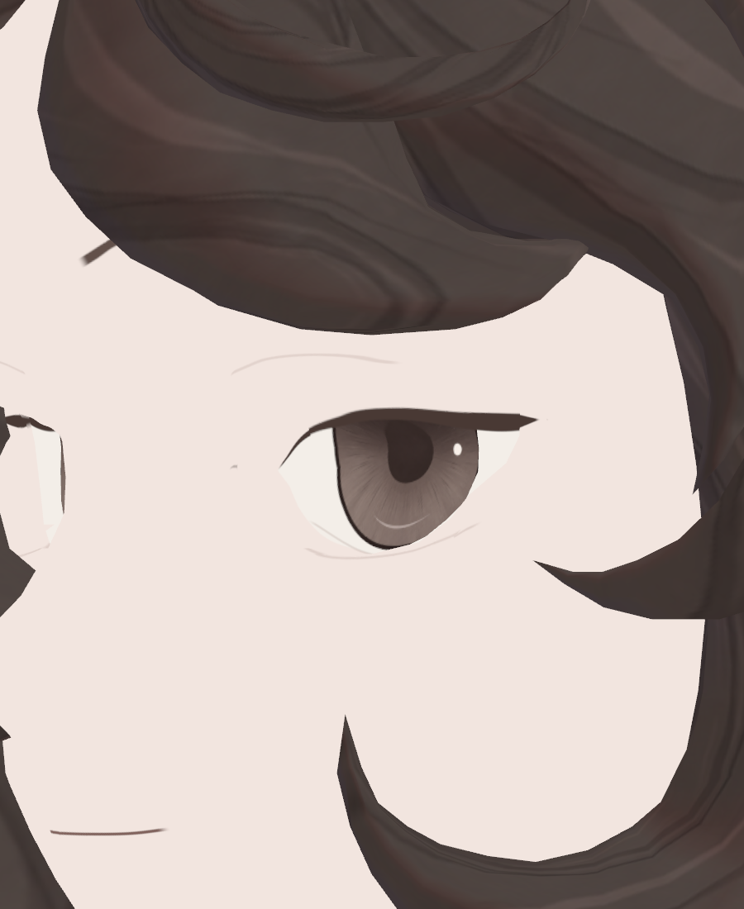 |

눈·입 주위 하얀 각반은 실제 셰이더 명암에서 발생했다. `_UseShadow=0`인 얼굴에서는 사라졌고, 약한 광원에서는 피부도 어두워졌다. `_AsUnlit=.45`이며 빛을 완전히 무시하는 설정이 아니다. 0.10으로 약하게 남긴 그림자는 같은 얼룩 형태가 잔존했다. 정면·35·55도와 좌/우/위/약한 광원 36장을 제작자와 독립 검토자가 직접 확인했다. 얼굴과 몸의 색광·밝기 조화는 이어서 확인한다. [눈 노멀 27장과 얼굴 조명 36장 상세 비교](reviews/eye/v353_NATIVE_EYE_N_AND_FACE_LIGHT_REVIEW.md)

| 수정 노멀, 요철 맵 OFF | 수정 노멀, 미세 요철 맵 .35 |
| --- | --- |
|  | 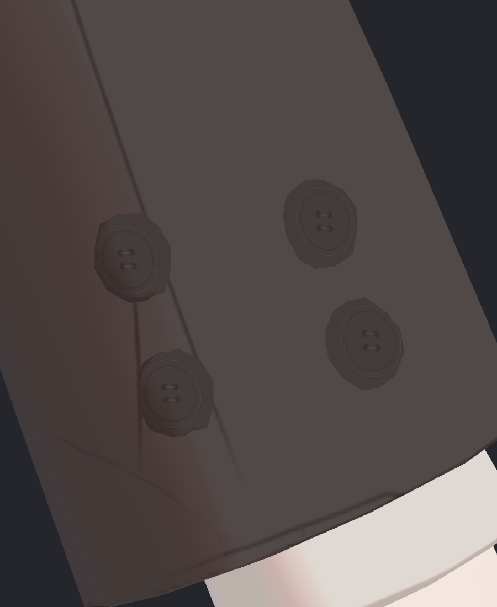 |

단추 맵의 큰 색쐐기는 원래 custom normal 반전과 분리 베이크 조각의 접선 차이가 원인이었다. 연결된 원래 면과 국소 57코너 노멀 수정, 동일 기준의 베이크로 이를 제거했다. 실제 단추 앞면을 향한 카메라로 32장을 다시 확인했다. 앞선 커프스 뒷면 사진은 단추 효과 판정에 사용하지 않는다.

새 4구멍·실·테두리 채색은 노멀맵 OFF에서도 유지된다. .35/.65의 추가 효과가 작아 **수정 노멀 + 맵 OFF를 기본 후보**, .35는 비교용으로 보존한다. 불필요한 4K BC5 텍스처 비용도 피한다. 팔각 외곽은 원래 형상이며 노멀맵으로 새로 생긴 결함이 아니다. 카라 안쪽의 별도 회색 면 문제는 이 단추 시험으로 완료 처리하지 않는다. [단추 32장 독립 검토](reviews/eye/v353_BUTTON_NORMAL_INDEPENDENT_REVIEW.md)

머리의 과한 U자 띠는 새 채색을 단순하게 만들기보다 실제 표면의 투영 방향·가림을 바로잡는 방법을 시험 중이다. 디테일이 줄어든 새 원화 V3는 미채택이다. 헤어·자켓·넥타이의 실제 물리 시험과 어깨·전체 관절·최종 통합도 계속 진행한다. **이 후속 기록 역시 전체 작업 완료나 최종 통합본 전달이 아니다.** 아래 초기 실험은 경과 기록으로 유지하며, 현재 눈·얼굴·단추의 선택은 이 후속 절을 우선한다.

## 이번에 확인한 근본 원인

| 부위 | 실제 원인/시험 결과 | 현재 대응과 판정 |
|---|---|---|
| 옷의 고정 명암 | 기본색만 표시해도 넓은 어두운 면이 남는 채색과, 광원 변경에 반응하는 셰이더 명암을 구분했다. | 새 기본색과 작은 선을 제작. 큰 고정 명암은 제거했지만 선의 모델 정합과 미관은 재검수 중. |
| 단추 | 앞/뒤 UV 패널마다 투영 범위를 따로 계산해 한 단추의 그림이 어긋났고, 낮은 베이크 샘플로 가장자리가 거칠었다. | 실제 단추 전체에 공통 좌표를 사용하고 4K·16샘플로 다시 베이크. 네 구멍·테두리를 보존하며 개선. Unity 최종 통합 전. |
| 카라 안쪽 | 삼각형의 꺾인 경계를 일괄 선으로 그려 실제 봉제선이 아닌 선이 생겼다. | 해당 내부 삼각형 선을 제거. 별도 셔츠 그림의 카라 정합은 계속 검수. |
| 머리 | 휴리스틱으로 고른 가닥 끝이 실제 끝이 아닌 사례가 있었다. 새 전개도 일부 면을 접거나 압축했다. | 지정된 뿌리/끝과 기존 유효 UV를 사용하는 비교에서 개선. 퇴화 후보는 베이크 차단. 수치 통과 SLIM/Tutte도 실제 미관 실패로 미채택. 일부 컬 방향/각진 선은 남음. |
| 눈 | 앞 원판·별도 눈 세부 조각과 뒤 눈꺼풀 면의 깊이 차이로 사선에서 같은 그림이 다른 위치로 보였다. | 기존 눈 부품의 깊이만 조정하는 사본 비교. 25/50%는 단차가 줄지만 내안각·윙 잔여로 미채택. |
| 검은 점선 | 실제 SkinnedRenderer의 스케일과 윤곽선 패스 조합. MSAA만으로 원인이 없어지지 않았다. | 새 `lilToon` noOutline 재질에서 점선 제거 확인. 원래 노멀을 일괄 재계산하지 않음. |
| 코트 처짐 | 체인 중력뿐 아니라 몸판 지지와 본–옷 표면 간격을 대표하는 충돌 범위가 중요했다. | 원래 지지를 유지한 후보는 바지 접촉과 처짐 개선. 새 소매/몸판 교차가 있어 전체 채택 보류. |
| 헤어 접촉 | 일부 표면은 충돌 대리 본과 별도로 기존 Wind 본의 영향을 받아 움직였다. | 단순 콜라이더 추가는 실패. 기존 Wind 입력이 충돌 제어 체인을 거치도록 별도 가이드 후보 시험. |
| 넥타이 | 매듭과 아래 부분의 중력·강성을 똑같이 바꾸면 접촉/복귀가 악화됐다. | 깊이별 중력 분담 후보에서 기울임 개선. 큰 숙임의 숨은 셔츠 교차는 남아 있음. |

## 새 세부 채색: 적용 사진과 수정

### 단추와 카라 내부

| 수정 전: 패널별 투영·삼각형 선 | 수정 후: 부품 전체 투영·내부 선 제거 |
|---|---|
|  | 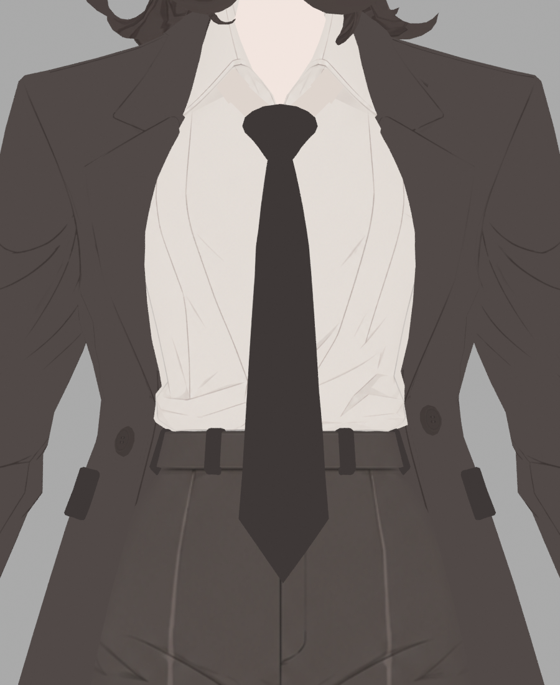 |
|  | 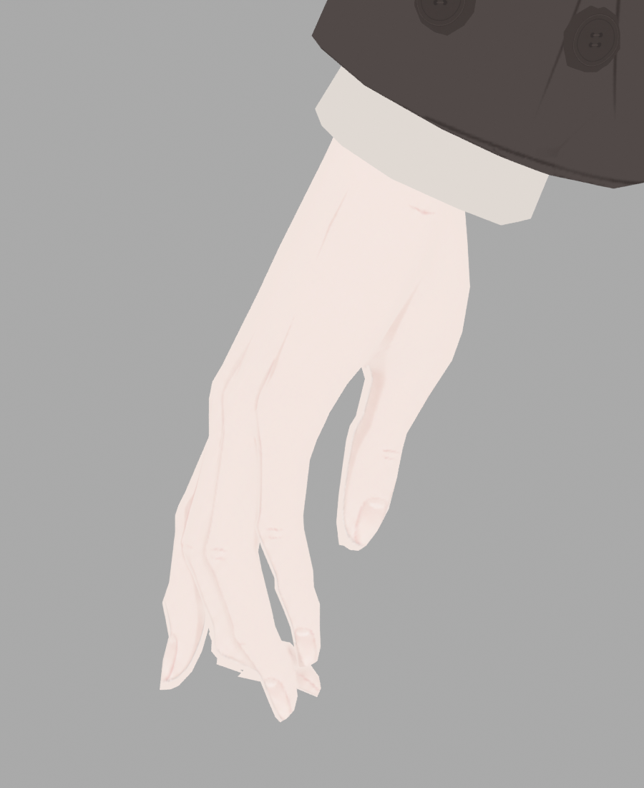 |

단추를 단색으로 덮지 않고 새 네 구멍 그림을 유지했다. UV 섬의 왜곡된 모양만 보고 판정하지 않고 실제 단추에 적용한 앞뒤 좌표의 일관성을 수정했다. 카라 안쪽의 쓸모없는 선도 별도 장식 재질에서 제거됐다. 손의 옅은 손톱·관절 선은 새 그림이며, 승인된 손가락 압축이나 손 형상을 수정한 결과가 아니다. 손 전체 각도와 텍셀 선명도는 계속 확인한다.

### 실제 Unity 새 재질

| 전체 | 옷과 셔츠 | 바지 측면 |
|---|---|---|
| 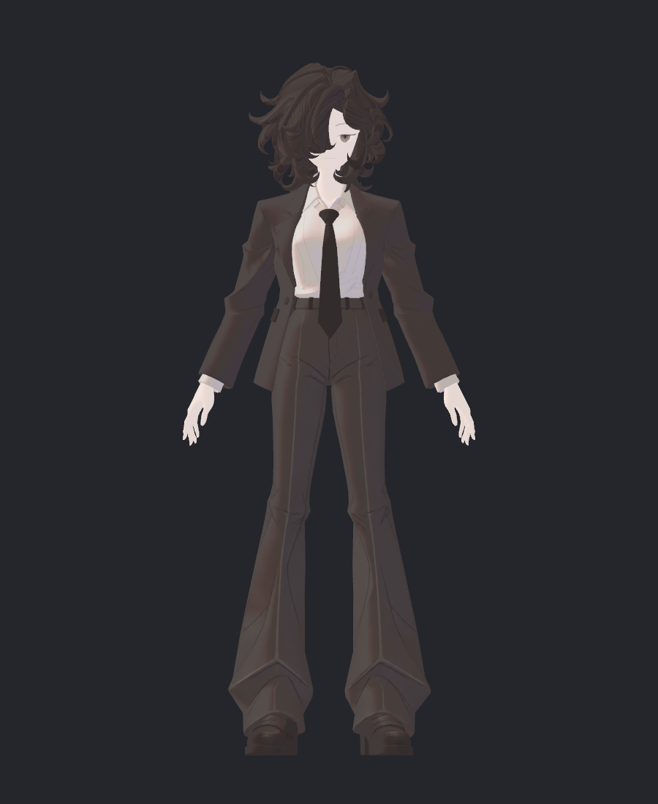 | 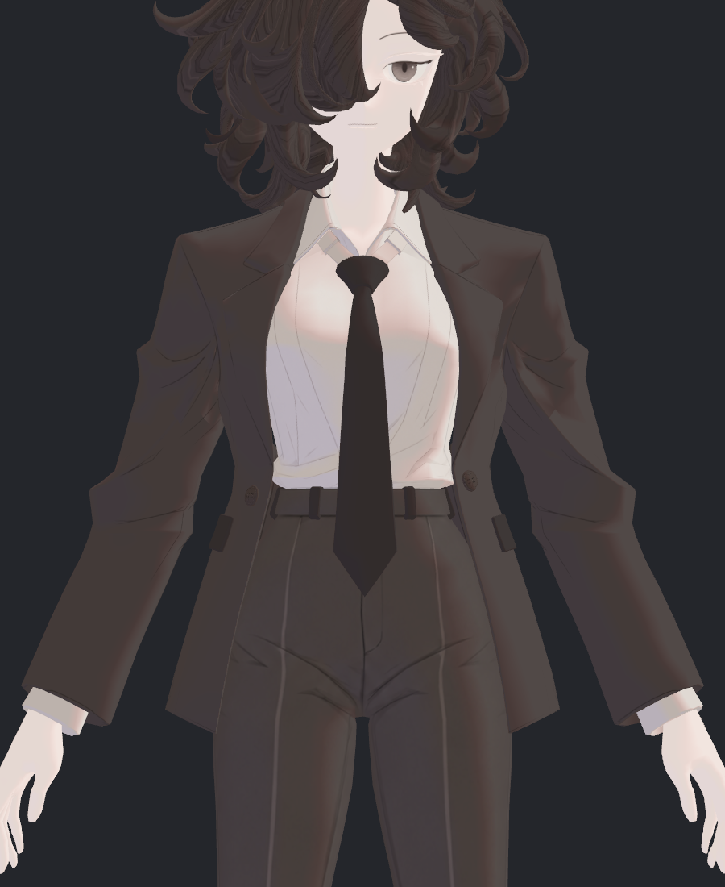 | 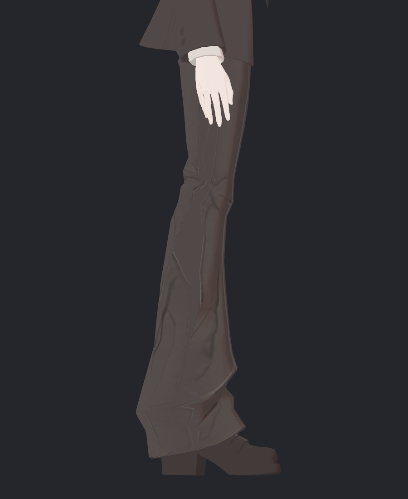 |

이 사진은 원래 SkinnedRenderer·노멀을 유지한 실제 Unity 렌더다. 기본색 진단과 좌우 광원 사진을 포함해 30장을 생성했다. 사진 속 머리와 단추는 이 비교를 고정하기 위한 앞선 새 채색 후보이며, 위 단추 후속 수정본과 혼동하지 않는다. 소매의 둥근 선, 일부 옷깃 선의 불일치와 바지 옆 선은 아직 미관 합격이 아니다. 셔츠의 명암은 동적 셰이더의 기여이며 기본색 진단과 함께 판단한다.

윤곽선 문제는 [실제 Renderer 비교 보고](reviews/eye/v353_NATIVE_SURFACE_RESULTS.md)에 따로 기록했다. 스케일이 다른 정적 베이크 사진만으로 실제 런타임의 윤곽선 두께를 판단하면 안 된다. 노멀맵은 현재 새 재질에서 꺼져 있으며, 미세 요철 비교를 완료했다는 뜻이 아니다.

## 머리 UV: 시도한 방법과 미채택 이유

| 방법 | 실제 결과 | 판정 |
|---|---|---|
| 연결 좌표 완화 / cotangent / 강제 중심 경로 | 가로 등고선처럼 보이거나 일부 넓은 면의 선이 사라짐 | 미채택 |
| Conformal 전개 | 축소/퇴화 1,028삼각형, 뒤집힌 방향 118 | 베이크 금지 |
| Angle Based 전개 | 축소/퇴화 857삼각형, 뒤집힌 방향 28 | 베이크 금지 |
| 실제 뿌리·끝 seam + Minimum Stretch | 축소/퇴화 0이지만 pin 인접 31면 뒤집힘 | 베이크 금지 |
| 기존 유효 UV + 지정 뿌리·끝 방향 | 새 뒤집힘/퇴화 0. 아래 사진에서 선 흐름 개선 | 후속 비교 기준, 미관 완료 아님 |

일반 Blender Unwrap은 기존 UV를 그대로 최적화의 초기값으로 쓴다고 단정할 수 없었다. 공식 소스에서 SLIM의 초기화 경로를 확인한 뒤 앞선 가정을 정정했다. No Flip 옵션의 존재나 연산 성공은 실제 면 검사 통과를 대신하지 않았다. 임시 전개는 원래 모델의 8개 UV 레이어와 메시를 변경하지 않았다.

| 앞쪽 컬 | 뒤쪽 컬 |
|---|---|
| 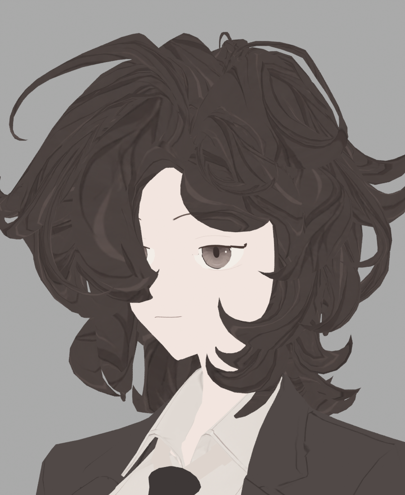 | 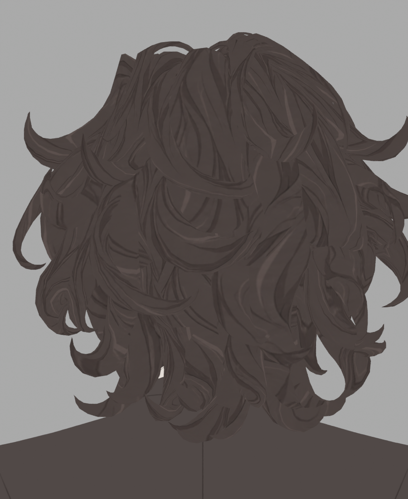 |

가닥을 가로지르던 큰 선과 점무늬가 줄었지만 뒤쪽 일부 컬에는 각진 선과 방향 불일치가 남는다. 좌표와 베이크 샘플을 함께 바꿨으므로 개선을 한 원인의 효과로만 설명하지 않는다. 이 사진을 머리 최종 완성으로 전달하지 않는다.

## 눈: 표면 채색과 실제 깊이를 분리

| 수정 전 35° | 깊이 25% 정합 | 깊이 50% 정합 |
|---|---|---|
|  | 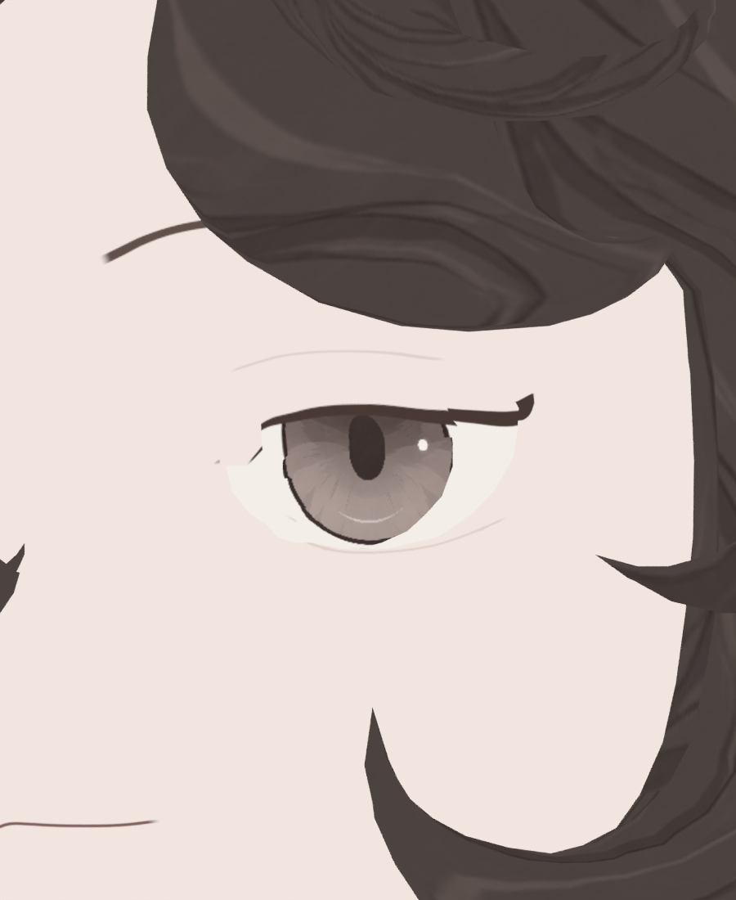 | 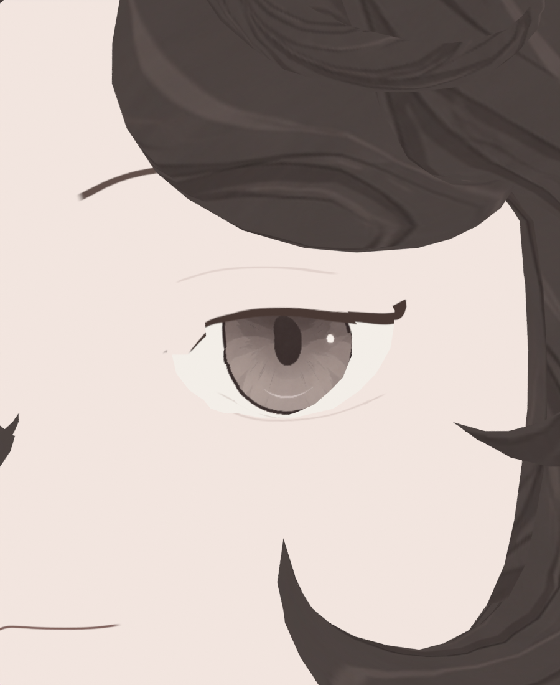 |

원래 눈 부품의 377 raw 정점만 깊이 방향으로 수정했다. 앞에서 보는 XZ 좌표·8개 UV·모든 키의 상대 변위는 보존했다. 최대 이동은 1.933/3.866mm이며 새 면 뒤집힘은 0이었다. 그러나 눈꼬리 꺾임과 내안각 절단이 남아 두 사본 모두 미채택이다. 수정량이 작은 것과 문제가 해결된 것은 다르다.

기존 눈에는 정상적인 얼굴 표정/시선 키 세트가 없다. 현재 27개 키는 관절 보정이며 ARKit/iPhone 표정 지원을 증명하지 않는다. 얼굴 인상을 유지하면서 후속 표정을 만들 수 있는 구조를 고려하되, 실제 기기 추적 완료로 표시하지 않는다. [눈 깊이 원인 검토](reviews/eye/v353_V5_CLOSE_REVIEW.md)

## 중력과 움직임: 개선과 회귀를 함께 기록

| 코트 원래 지지 | 원래 지지 + 중력/충돌 범위 조정 |
|---|---|
|  | 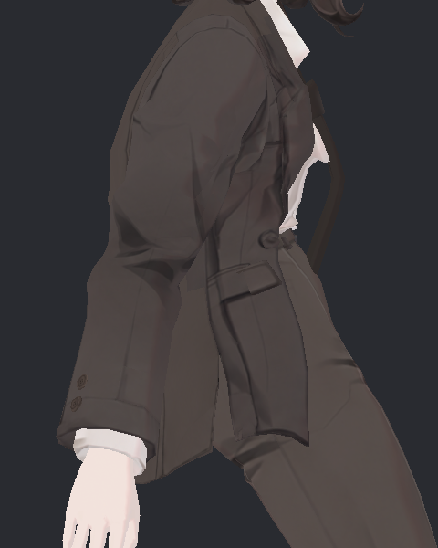 |

이 입력은 내부 이름과 달리 몸을 뒤로 젖힌 case176이다. 앞으로 깊게 숙이는 검사로 확대하지 않는다. 원래 지지 F16B12는 몸판–바지 새 교차 0/66, 아래로 향하는 자락 개선을 보였다. 그러나 추가 검사에서 소매–자락 및 겨드랑이 전이부의 새 교차가 확인돼 전체 합격으로 채택하지 않았다. 높은 새 지지점에 상부 웨이트를 크게 옮긴 후보와 큰 충돌 반경은 각각 당김·새 접촉·불필요한 벌어짐으로 제외했다. [물리 상세 전후 검토](reviews/physics/v353_GRAVITY_REFINED_REVIEW.md)

헤어는 실제 SDK 7단계 동작에서 167개 스킨 표본과 중립·복귀를 확인한다. 단순 인접 콜라이더 추가는 Wind 접촉을 해결하지 못했다. 기존 Wind 본 영향이 충돌 제어를 우회하는 원인을 찾아 가이드 추종 후보를 별도 실행하고 있다. [인접 콜라이더 실패와 원인](reviews/physics/v353_HAIR_NEIGHBOR_REVIEW.md)

넥타이 깊이별 분담 후보는 기울임의 하방 정렬을 개선했지만 큰 숙임에서 숨은 셔츠 교차가 남았다. 코트·헤어·넥타이 후보의 파일 존재나 각각의 제한적 개선을 전체 통합 완료로 계산하지 않는다. 최종 후보가 정해진 뒤 같은 입력의 비교 GIF/영상과 실제 통합 결과를 추가한다.

## 추가 확인: 바지 외곽 혼입과 눈의 중복 면

### 바지의 톱니선: UV 경계가 아닌 원화 배경 혼입

| 기존 새 채색의 측면 | 배경 혼입 차단 후 같은 측면 |
|---|---|
|  | 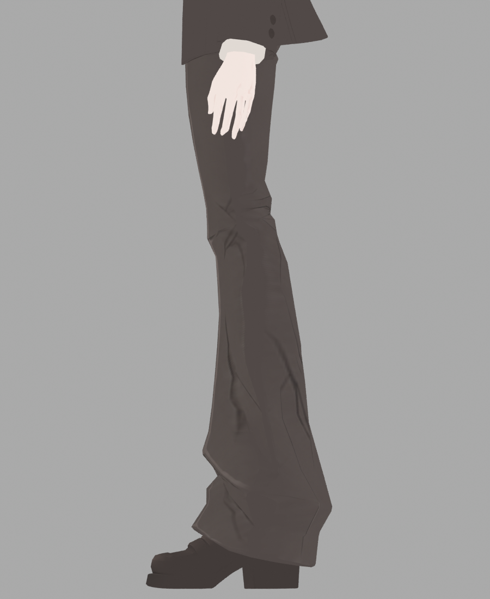 |

흰 배경과 섞인 원화 가장자리의 회색 픽셀이 전사 마스크를 통과했다. 조사한 문제 표본 55개 모두 원화의 흰 배경에서 2픽셀 이내였고, 실제 아틀라스에서는 UV섬 경계에서 최대 202.65텍셀 안쪽이었다. 바지의 1,724삼각형 중 정확 중복면은 0이었다. 따라서 UV 패딩이나 셰이더 강도로 가리는 방식으로 해결하지 않았다.

새 원화의 2.5픽셀 주변 배경 근접도를 검사해 외곽 혼입을 줄이고 16샘플로 다시 베이크했다. 기존 형상과 UV, 원화 안쪽의 주름선은 그대로 사용했다. 제작자가 위 두 사진을 직접 확인했고 측면 톱니선 감소를 확인했다. 반대쪽·뒤·정면 및 Unity 재질 비교도 별도 검사하며, 신발 측면의 디테일 부족을 바지 개선으로 완료 처리하지 않는다.

### 눈: 깊이 정합과 기존 중복 면 정리

| 기존 35° | 깊이·중복 면·새 눈 경계 수정 후 35° | 현재 남은 바깥 끝 55° |
|---|---|---|
|  | 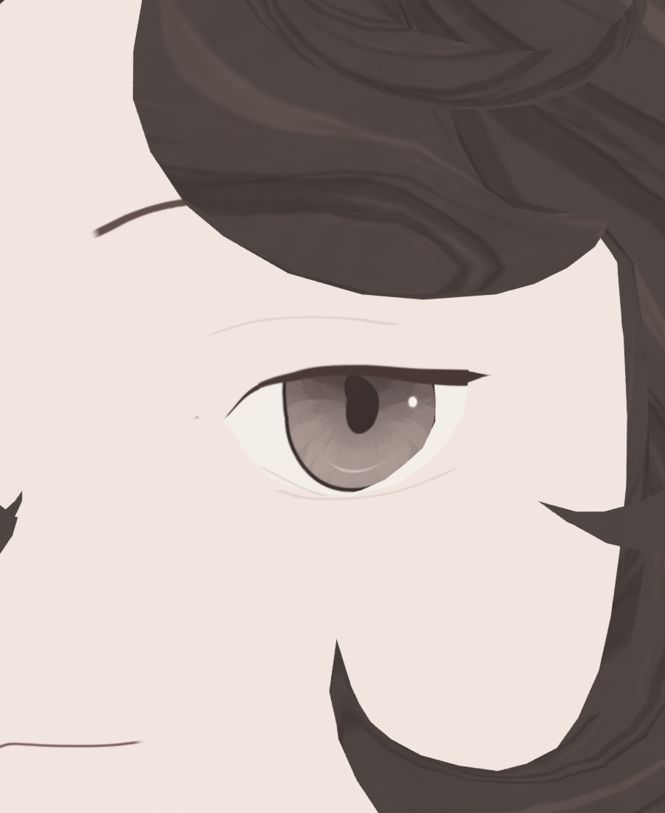 | 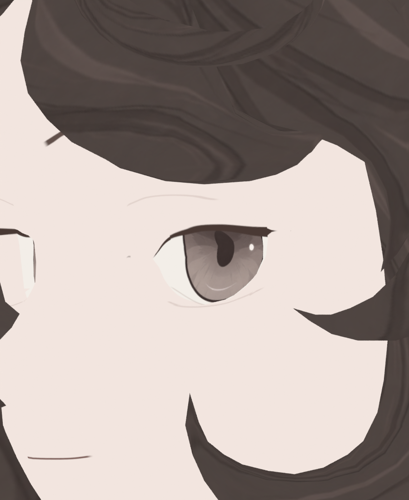 |

앞뒤 부품의 각 점을 따로 납작하게 투영하면 원래 두께를 잃으므로, 동일 위치의 층들이 공통 깊이 이동을 받는 방식으로 바꿨다. 이어 원판 위에 겹친 기존 세부 면 100개를 정리했다. 모든 기존 정점·키·웨이트와 남는 면의 UV를 유지했으며, 새 눈 메시로 대체하지 않았다. 별도 세부 면의 원래 역할을 ‘반사 조각’으로 단정했던 표현은 정정한다.

삭제 비교 14장과 새 채색 사진을 제작자와 독립 검토자가 확인했다. 이후 V6 장면에 임시 얼굴 베이크 프록시가 남아 겹친 것을 발견해 제거하고, 실제 아바타 메시 2개만 있는 상태로 5장을 다시 촬영했다. 위 후속 사진은 프록시 제거 후 결과다. 앞선 프록시 포함 V6/벽 이동 사진만으로 내린 세부 판정은 보류했으며 재촬영으로 대체한다. Unity native 검수에는 이 임시 프록시가 포함되지 않았다. 흰 사각 조각·홍채 경계 차단은 줄었지만 바깥 눈꼬리에는 단차가 남고, 현재 세로타원 동공도 레퍼런스 인상과 다르다. 이 상태는 최종 미합격이다. 실제 광선·UV 대응에서 바깥 단차가 눈 주변 안쪽 면과 앞벽의 깊이 차이와 연관되는 것을 확인해 기존 벽의 연결을 검토 중이다. [독립 눈 검토](reviews/eye/v353_EYE_V6_REVIEW.md)

### 헤어 수치 통과와 실제 미관은 다르다

| Tutte 시험: 각진 등고선으로 미채택 | 기존 유효 UV와 가닥선 후속 후보 |
|---|---|
|  |  |

pin을 풀고 최소 왜곡으로 전개한 SLIM, 양의 가중치로 연결한 Tutte는 각각 뒤집힘/퇴화 0인 후보를 만들었지만 실제 사진에서는 가닥을 가로지르는 띠나 각진 고리가 남았다. 수치상 흐름 역전이 줄었다는 이유로 채택하지 않는다. 오른쪽 후보가 덜 각지지만 머리 전체를 미관 완료로 판정한 것은 아니다. [헤어 실패 원인 기록](reviews/rig/hair_flow/v353_HAIR_FAILURE_CAUSES.md)

헤어 물리도 가이드 통합으로 Wind 접촉은 개선됐으나 고개 끄덕임 한 표본에서 접촉이 남았다. 회전 상한 25°를 60°로 연 시험은 그 표본의 새 교차가 13쌍에서 30쌍으로 늘고 국소 가닥이 당겨 보여 미채택이다. 본 끝만 충돌을 피하고 실제 표면이 다른 본과 섞여 움직이는 구조를 가닥 전체에서 다시 검토한다.

## 이어서 실행할 관문

1. 머리 컬 방향과 눈 깊이/눈꺼풀 연결 수정 후 실제 여러 각도 재검수.
2. 소매·카라·바지·신발·손 및 가려진 부분의 새 채색 정합과 세부 선명도 확인.
3. 단추 후속본·최종 눈/머리·새 재질 통합, 다양한 광원·색만 표시·필요한 미세 노멀 후보 비교.
4. 헤어/넥타이/코트 물리의 새 접촉 수정, 어깨 부피 후보의 실제 관절 검사 및 통합 회귀.
5. Unity 재로드·실행·텍스처 비용·연속 동작·독립 검토, 전후 사진과 동영상 보고.

아직 새 통합본의 전체 관절 검증, 노멀 후보 비교, 최종 물리 영상, PC VRChat 클라이언트 확인을 완료하지 않았다. 이 문서는 검증한 실험과 발견한 원인을 공유하는 중간 기록이며 작업 종료 문서가 아니다.
