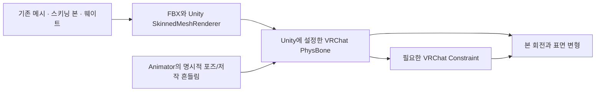

> **기록 시점 안내:** 아래는 해당 단계 당시의 보고서입니다. 후속 결정은 [최신 상태](../../../../STATUS.md)를 기준으로 읽어주세요. 모델·원본 텍스처·검증 원시 데이터는 이 문서 공유본에 포함하지 않습니다.

# v354 참고 모델 물리 구현과 적용 방향

**SiuSiu와 Lapwing의 전달 아바타는 Unity에 설정한 VRChat PhysBone으로 흔들린다. Blender 물리 시뮬레이션을 실행하는 구조가 아니다.** 두 실제 원본 프리팹에 PhysBone이 각각14개이고 Unity Cloth는 없다. SiuSiu는 별도 물리 제어본의 회전을 여러 스키닝 본으로 전달하고, Lapwing은 긴 헤어와 소매 트임 본에 직접 PhysBone을 둔다. v354도 **Blender에서는 기존 메시·본·웨이트를 정리하고, 실제 흔들림은 Unity의 PhysBone/VRChat Constraints로 완성하는 방식**을 따른다.

이 문서는 실제 로컬 프리팹·제작자 설명·기존 SDK 기록을 읽은 결과다. 이번에 Unity/Blender/UI를 실행하거나 Assets를 변경하지 않았다. 아직 참고 방식의 새 v354 후보를 적용했다는 뜻은 아니다. v353 텍스처 폐기와 v352 원형 보존 결정을 유지한다.

## 무엇을 실제로 확인했는가

|구분|실제 입력과 확인 범위|
|---|---|
|SiuSiu|`Assets/References/siusiu/99e0b3fc970bc4045ac8d74232ba3bc6.prefab` — 현재 비교에 사용한 Kisekae 계열. 별도 일반판/VRM 변환본과 구분|
|Lapwing|`Assets/References/lapwing/61ac2e4da9b7de54fbce00fb1337f5e9.prefab` — 원래 기본 의복 프리팹|
|우리 기준|`Assets/BiancaV352Review/Bianca_v352_Final.prefab`와 `Assets/BiancaV354RigRecovery/Bianca_v354_V352_TIE_PAD1_REVIEW.prefab`|
|현재성 대조|이전 실제 `hair_reference_motion_v2/INVENTORY.json`의 두 참고 PB14+14를 현재 YAML과 float32 값으로 대조하여 모두 일치. 그 실행의 참고 의존506파일 SHA도 현재 전부 일치|
|원본 보존|읽은 네 prefab의 전후 SHA 동일. 자산/설정 변경 없음. 새로운 동작·클라이언트 검증 없음|

수치·본·제약·컨트롤러 증거 JSON (공유본 미포함: `v354_REFERENCE_PHYSICS_EVIDENCE.json`), 바람 바인딩 증거 (공유본 미포함: `v354_WIND_BINDING_EVIDENCE.json`). 원본 메시·텍스처·FBX·blend 파일은 문서에 복사하지 않았다. 상세 로컬 중간 집계는 `v354_REFERENCE_PHYSICS_DETAIL_LOCAL.json`이며 공유용 원본 모델 자료가 아니다.

제작자가 모델링에 Blender를 썼는지는 이 납품 데이터만으로 확정할 수 없다. 두 패키지는 FBX와 Unity 프리팹을 제공한다. 로컬의 `SiuSiu_LOCAL_INSPECTION.blend`/`Lapwing_LOCAL_INSPECTION.blend`는 우리가 조사 목적으로 가져온 사본으로, 제작자의 원래 Blender 물리 파일이라는 증거가 아니다. Siu 제작자 Readme v1.0.2도 UnityPackage·Prefab·Animator 구성을 설명한다. 제품 원문 역시 PhysBone 지원과14컴포넌트를 명시한다. [SiuSiu 제작자](https://adpx.booth.pm/items/8426340), [Lapwing 제작자](https://booth.pm/ko/items/4993931).

## 제작 구조와 실행 물리를 구분

본과 웨이트는 표면이 어떤 본을 얼마나 따라가는지 정한다. PhysBone은 그 본을 동적으로 움직인다. Collider는 지정한 본/입자와 충돌하며 모든 옷 정점을 직접 밀어내는 보장은 없다. Unity도 SkinnedMeshRenderer를 본·bindpose·blendshape 등에 의해 변형되는 메시의 렌더러로 설명한다. [Unity SkinnedMeshRenderer](https://docs.unity3d.com/2022.3/Documentation/Manual/class-SkinnedMeshRenderer.html).

PhysBone은 의복의 간단한 흔들림에도 쓸 수 있다. 각도 제한과 길이별 곡선을 지원하지만, 본의 위치와 실제 표면이 어긋나면 숫자만 조절해서는 해결되지 않는다. v1.0/1.1 및 Simplified/Advanced에 따라 힘의 의미도 달라 같은 숫자를 복사하지 않는다. 특히 serialized `spring`은 Advanced에서 UI의 Momentum에 해당한다. [VRChat PhysBones](https://creators.vrchat.com/common-components/physbones/).

## 실제 두 모델의 구조

|항목|SiuSiu 비교 프리팹|Lapwing 기본 프리팹|
|---|---|---|
|PhysBone|14|14|
|PhysBone Collider|5|11|
|Constraint|VRC 회전44·위치5·부모4|Unity 회전16·위치2|
|Unity Cloth|0|0|
|헤어|FrontHair/BackHair/SideHair L/R의 작은 제어 체인4개. 실제 헤어 스키닝 본에 회전제약25개를 통해 전파|앞머리 체인1개, 포니테일 체인1개. 해당 로컬 hierarchy에서 root/end를 포함해15/30 Transform|
|옷|앞 스커트3PB, 블레이저 뒤1PB. 앞 블레이저는 스커트 본 회전을 받아 함께 움직임|재킷 소매 slit6PB, 반바지 앞2PB. 의상 전체를 천으로 푸는 방식이 아님|
|기타|귀2·꼬리1·가슴1·신발 끈1·자동 시선용1|머리 리본1·신발 리본2·가방1|
|별도 넥타이|확인하지 못함|확인하지 못함|

Siu는 inherited FBX Transform을 가진 prefab variant다. YAML에 남은 자식 수만 세어 스커트 체인 길이를1이라고 결론내리지 않았다. 위 실제 root 이름은 이전 SDK 로드 기록과 대조했고, FBX 내부 자식 수가 미해석인 부분은 JSON에 명시했다. Lapwing의15/30도 물리 계산에 들어가는 변형 본만의 수가 아니라 root/end 포함 Transform 수다.

참고 프리팹에 나타나는 MonoBehaviour 참조는 실제 SDK DLL GUID와 대조했다. PhysBone/Collider, Constraints, Contacts, AvatarDescriptor/Pipeline 등의 VRChat 구성이다. 독자적인 사용자 물리 C#가 이 프리팹에 붙어 있다는 증거는 없다. Siu의 자체 립싱크는 Readme가 설명하는 Animator Talk Control/Talk 레이어이며 독자 물리 코드라는 뜻이 아니다. 새 아바타에는 지원되는 SDK 컴포넌트를 사용한다. [VRChat 허용 컴포넌트](https://creators.vrchat.com/avatars/whitelisted-avatar-components/whitelisted-avatar-components/).

## 재현 가능한 부위별 설정 차이

아래 값은 현재 로컬 원형이다. 권장 숫자나 새 v354에 복사할 값이 아니다. G=Gravity, GF=Gravity Falloff, I=Immobile. 물리 버전은 YAML 0→1.0, 1→1.1이다.

|부위|버전/적분|Pull|Spring 또는 Momentum|Stiffness|G / GF / I|제한·충돌|
|---|---|---:|---:|---:|---|---|
|Siu 헤어 제어4개|1.1 / Simplified|.3|Spring .202|해당 모드에서 비활성|.3 / .3 / .8|Polar25°/25°, Back만40°/40°. 명시 collider목록0|
|Siu 뒤 블레이저|1.1 / Advanced|.1|Momentum .6|0|0 / 0 / .1|Hinge26°, 명시 collider목록0|
|Siu 앞 스커트3개|1.1 / Advanced|.1|Momentum1 + 곡선|0|0 / 0 / .9|중앙Polar66°/25° +Hips, 좌우Angle80° +동측Leg|
|Lap 앞머리|1.0 / Simplified|.5 + 곡선|Spring .2|해당 모드에서 비활성|.05 / .71 / .669|Angle45°, 명시 collider목록0|
|Lap 포니|1.0 / Advanced|.033|Momentum .767|.033|.08 / .92 / .537|Angle50°, Chest/Head collider|
|Lap 소매 slit6개|1.0 / Advanced|.046|Momentum .75|.75|.11 / 0 / .409|Angle25~60°. 전완/보조 전완 collider를 부위별 지정|
|우리 v352 헤어6개|1.1 / Advanced|.25|Momentum .28|.3|.08 / 1 / .1|Angle25°, 각 체인 Head/Neck/Chest/양Shoulder|
|우리 v352 코트4개|1.1 / Advanced|.65|Momentum .12|.75|.04 / 1 / .2|Angle18°, Hips/양Thigh|
|우리 v352 넥타이|1.1 / Advanced|.38|Momentum .22|.5|.03 / 1 / .05|Angle12°, Chest|
|우리 v354 PAD1 넥타이 후보|1.1 / Advanced|.38 + 곡선|Momentum .18|.65 + 곡선|.75 + 곡선 / 1 / .05|상부12°를 유지하고 하부 최대60°. Chest+가중 위치추종 구2개|

Siu 헤어의 높은 Immobile .8이 ‘움직임이 풍부한 정답 숫자’인 것도 아니다. 적분법·제어본/실제 가닥 사이 전달·헤어 길이가 다르므로 움직임의 결과를 비교해야 한다. Lap 소매 안쪽 두 PB의 collider 배열에는 실제 fileID0인 빈 슬롯이 있다. 그것을 작동하는 collider1개로 세지 않았다.

### Siu의 블레이저와 헤어 전달 경로

실제 `99e0...prefab`에서:

- line9938: `Costume_Blazer_Back` PB → `LowerBlazer.001`.
- line10094/10203: `LowerBlazer.001_L/R`은 위 본의 회전을 받아 뒤 자락 양쪽에 전달. 왼쪽은 local space, 오른쪽은 world space 설정이므로 축까지 확인해야 한다.
- line2303/2412: `LowerBlazer.002_L/R`은 `SkirtFront_L/R`에서 회전을 받는다. 앞 블레이저를 서로 독립적인 물리 제어4개로 푼 구성이 아니다.
- 헤어 제어본은 `AvatarDynamics/PB/Body_Head/Head_Dummy` 아래에 있고, Front/Back/Side 제어를 기존 헤어 본25개에 전달한다. **제어용 물리 체인과 표면의 많은 변형 본을 분리**한다.

실제 제약은 `VRC.SDK3.Dynamics.Constraint.Components.VRCRotationConstraint`다. SDK DLL GUID `58e2f...`/fileID1788371120과 필드가 확인된다. Lapwing은 기존 Unity Rotation/PositionConstraint를 쓴다. 새 v354는 공식 권장대로 VRC 계열로 구성한다. [VRChat Constraints](https://creators.vrchat.com/common-components/constraints/).

작은 단추·플랩 각각의 정점이 어떤 본을 공유하는지는 이번 원형 집계만으로 확정하지 못했다. 하나의 옷 메시라는 이유만으로 장식과 몸판의 웨이트가 같다고 주장하지 않는다.

## 바람은 별도의 확인 항목

참고 프리팹에 실제 지정된 controller 각5개에서 Wind/Breeze/Sway 변수·레이어 이름을 찾지 못했다. 직접 참조하는 외부 clip Siu98개/Lap36개를 조사했다. Siu의 귀/꼬리 자세·흔들기 곡선은 있고 해당 PB는 `isAnimated=true`다. 이 조사 범위의 헤어·블레이저 transform 바람 곡선은 발견되지 않았고 Lap에서도 같은 바인딩을 발견하지 못했다. 깊은 외부 blendtree/FBX 내장 clip까지 모두 검사한 결과나 ‘어떠한 환경에서도 바람 기능이 없다’는 증명으로 확대하지 않는다.

우리 원래 v352는 다르다. `Bianca_v349_WorldWind.controller`의 `BiancaWind`(기본 .35), `WorldWind`, `WorldWindFloor`(.7)가 `Bianca_v347_FlowSafeBiancaCalm/Breeze.anim`을 혼합한다. 실제 clip은 **tie_anchor1·hair_wind6·coat_wind4의 회전**을 저작한다. 따라서 테스트의0.7은 풍속·중력·물리 힘이 아니라 Animator 혼합 입력이다. 실제 원형 바람 바인딩 (공유본 미포함: `v354_WIND_BINDING_EVIDENCE.json`).

또한 원래 v349 구현에는 호환 월드의 `BiancaWorldWind` ContactSender가 아바타 Receiver/Animator의 WorldWind를 켜는 별도 약속이 있다. 임의 월드의 WindZone나 풍향·풍속을 자동 수신하지 않는다. compact 검사의 수동 BiancaWind 주입만으로 이 월드접촉 경로까지 통과했다고 말하지 않는다. 기존 [v349 실제 구현 보고](../../../v349_remaining_npr/v349_WORK_REVIEW.md)의 SDK 접촉 검사와 VRChat 클라이언트 검증은 구분한다.

후속 기본 바람 OFF 컨트롤러 제안 (공유본 미포함: `v354_DEFAULT_WIND_OFF_PROPOSAL.md`)은 저장된 강도와 월드 접촉 경로까지 차단하는 명시적 opt-in 상태를 제안한다. 단순히 BiancaWind default만0으로 바꾸는 안은 부족하다. 실제 적용 전이다.

**참고 모델과 정합할 기본 검사는** 저작 바람0·호환 태그 접촉 없음에서 Nod/Yaw/몸 기울임/이동/정지 후 복귀의 PhysBone 반응을 먼저 본다. 기존 저작 바람은 별도 옵션으로 보존하고, 선택한 새 구조가 anchor 입력도 정상 전달하는지를 별도 검사한다. 지원되지 않는 사용자 런타임 스크립트나 전역 WindZone 수신을 새로 얹지 않는다.

## v354에 적용할 구체적인 수정 방향

### 넥타이: 현재 SDK 구조를 유지하고 actual 결과로 계수 선택

현재 PAD1은 이미 참고 모델과 같은 계열의 **VRCPhysBone+VRCPositionConstraint** 방식이다. 기존 표면·129 skin bone·웨이트·컨트롤러는 그대로이며, 서로 다른 spine/chest 지지를 가진 작은 collider2개가 셔츠 표면을 따라간다. 상부는 기존12° 제한을 유지하고 하부에 더 큰 가동범위를 준다. Blender 물리를 Unity로 다시 옮겨야 하는 상황이 아니다.

두 참고 모델에서 동등한 넥타이 체인을 확인하지 못했으므로 ‘Siu 넥타이 설정 복사’는 하지 않는다. 이미 v354 실제 Detail 표본에서 셔츠 교차26→0과 비대상 표면 보존을 확인한 현재 후보를 대상으로 중력·이동/저작 바람·복귀·원래 외형을 마무리 검수한다. 이 보고 작성 시 진행 중인 최종 compact 후보 Run은 완료로 세지 않는다.

### 코트: 자유자락 지지와 장식 지지를 맞추는 작은 후보부터

Siu처럼 **고정 몸통·허리와 움직이는 자락의 역할을 구분하고, 같은 천에 붙은 부분은 관련 의상본의 움직임을 전달받도록 한다.** Lap 소매 slit를 옷 전체 중력의 근거로 쓰거나 Hinge26°/gravity0을 우리 코트에 일괄 복사하지 않는다.

우리 v352 기존 장식33/34/41/45는 coat PB 영향0인 반면 인접 몸판은 평균16–26%라는 별도 구조 조사 결과가 있다. 코트가 움직여도 장식이 따라가지 않는 것은 PhysBone 값 이전의 지지 불일치다. 현재 코트 담당이 준비하는 **기존 장식4부품의 rigid support + 인접 hips/spine/coat 본 지지 비율을 추종하는 SDK constraint** 사본을 우선 비교한다. 메시 좌표·UV·N은 유지하며 장식이 붙는 위치의 실제 변형을 기준으로 한다. 추가적인 넓은 몸판 교정키나 큰 collider 확대보다 이 원인 대응을 먼저 검증한다.

중립·좌우 기울임·앞 숙임에서 몸판/소매/장식/셔츠 접촉을 함께 보고, 원래 실루엣과 장식 간격을 보존해야 한다. 고정 상부에서 자유자락으로 불연속적으로 큰 PB 웨이트를 주는 방식은 이전 뒤집힘 원인이라 반복하지 않는다. 무릎·골반 움직임과 자락 중력도 별개 검수다.

### 헤어: 계수 복사보다 제어 구조를 참고

기존 `v353_HAIR_WHOLE_STRAND_PLAN.md`는 **v352 Final 출발**의 물리 진단이다. 문제 안쪽 connected component10/원래241polygon·444triangle/552Unity점에서는 아래쪽도 head76–81%와 hair00 약19–24%가 섞였고, hair00 tip과 표면 깊이 차이가 약31mm였다. 따라서 본이 충돌을 피해도 실제 안쪽 가닥은 head를 따라 남을 수 있다. 이 원인 기록은 폐기된 v353 채색과 별개지만 **당시 후보 메시/웨이트를 가져오지는 않는다.**

기존 whole-strand/R11/RESTFIT의 독립5본 체인 및 큰 입자 반경은 중립에서 가닥을 밀어냈고 이웃 접촉이 늘어 미채택이다. RESTFIT도 중립8.826mm 변화와 새코트38쌍이 남았다. 반경·중력만 다시 조절하는 반복을 후속으로 권하지 않는다.

v354의 다음 제한 시험은 **Siu식 공통 물리 제어 → 여러 기존 변형 본으로 회전 전달**을 참고한다. 먼저 기존 hair00 관련 가닥 묶음의 제어 proxy를 분리하고, 그 묶음의 기존 변형 본에 같은 운동 위상을 전달하는 사본을 만든다. 기존6PB가 같은 대상 본에 중복 적용되지 않게 소유권을 하나로 정한다. 원래 rest 축/위치·bindpose를 유지하고 다른 다섯 그룹·원재질은 건드리지 않는다. 처음에는 웨이트를 그대로 두어 제어 구조만의 변화를 분리한다.

이 단계만으로 head에 고정된 안쪽 가닥이 부드러워지지는 않는다. 실제 v352에서 같은 component를 재확인한 뒤, **그 연결된 가닥 전체**의 고정부→가동부 분담을 같은 제어 묶음에 맞추는 두 번째 사본을 만든다. 일부16점만 옮기거나 원래 hair00 본을31mm 이동해 다른 가닥2,883점을 함께 흔드는 방안은 피한다. 고정뿌리·가동가닥과 인접가닥의 상대 운동을 같이 평가하며 외형이 벌어지면 채택하지 않는다. 정확 새 웨이트·본 수는 현재 계측 후 정할 항목으로, 여기서 미리 적용 완료로 기록하지 않는다.

새 체인의 힘 수치는 적분모드와 실제 길이/표면 거리를 먼저 맞춘 후 조절한다. **Siu .8 Immobile을 우리 .1에 그대로 덮는 것은 위 구조 적용이 아니다.** Head/Neck/코트 상대 충돌 여유와 중립 실루엣부터 확인하고 움직임·감쇠·복귀를 본과 native 표면 모두에서 확인한다. 원래 가려진 뿌리 겹침과 새 노출 끝 관통도 구분한다.

## 이번 결론과 미확인 범위

채택할 작업 방식은 **Unity의 실제 SDK PhysBone/Constraint를 기준으로 완성하고, Blender에서 필요한 기존 본·웨이트 지지 구조만 정리하는 것**이다. 넥타이는 그 경로를 이미 사용하므로 검수를 끝낸다. 코트는 장식과 천의 지지 불일치를 우선 수정한다. 헤어는 서로 겹치는 가닥을 각자 크게 밀어내기보다 공통 제어와 실제 표면 웨이트의 일관성을 시험한다.

참고 모델 제작자의 원래 저작 프로그램, 개별 단추/플랩 weight, 미검사된 clip의 환경 입력은 모르는 것으로 남긴다. 두 모델도 특정부위 한계를 가진다는 사실이 우리 코트 접힘이나 큰 끝 관통을 자동 허용하는 근거는 아니다. Lapwing 제작자는 팔꿈치를 굽힐 때 소매 slit가 팔을 일부 통과할 수 있음을 따로 안내한다. 이를 소매 slit 외의 모든 관통 허용으로 확대하지 않는다. [Lapwing 제작자 안내](https://booth.pm/ko/items/4993931).
