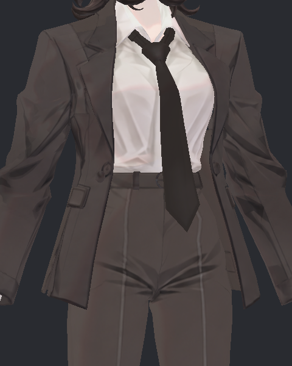
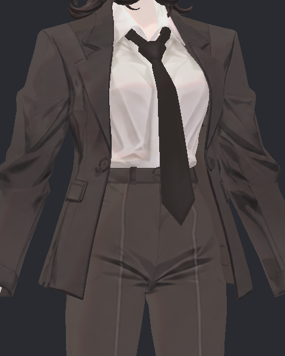
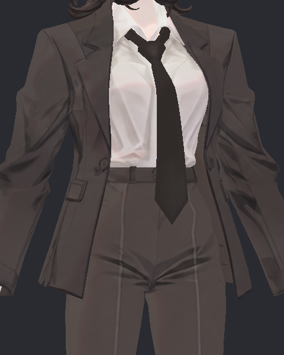

> **기록 시점 안내:** 아래는 해당 단계 당시의 보고서입니다. 후속 결정은 [최신 상태](../../../../STATUS.md)를 기준으로 읽어주세요. 모델·원본 텍스처·검증 원시 데이터는 이 문서 공유본에 포함하지 않습니다.

# v354 넥타이 이동·바람 독립 검토 및 P1 판정

**PAD1을 넥타이 교차·중력 개선을 위한 다음 통합 사본으로 선택할 수 있다.** 상세 굽힘의 셔츠 교차26→0, 중력에 따른 하방 처짐 개선에 이어, 이번 이동·급정지·회전·바람 시험에서도 새 넥타이 접촉이나 비대상 변화를 찾지 못했다. 다만 옆으로 흔들리는 폭은 줄었다. 이를 “뻣뻣함 전체 해결”이나 “모든 움직임이 더 자연스러워졌다”로 확대하지 않는다.

각 후보는 별도 Play 순서0에서 실제1,200프레임(이동/급정지/회전 각4초, 바람8초), 90프레임 예열로 실행했다. DONE·SOURCE·SCENE 보존은 모두 통과했다. 실제 루트 이동·회전이 명시 입력과 일치하는 관문도 통과했으며, 현재v352 메시/웨이트/본과 실행기·입력·Build SHA를 대조했다. 과거 실행을 새로운 검증으로 세지 않았다.

| 팁의 가슴 기준 최대 이동 | v352 | PAD1 | 0.1mm 이내 정착 시간 v352→PAD1 |
|---|---:|---:|---:|
| 완만한30mm 이동 | 10.324mm | 8.394mm | 0.283→0.183초 |
| 60mm 이동·급정지 | 16.430mm | 13.338mm | 0.417→0.300초 |
| 25도 회전 | 14.280mm | 11.479mm | 0.317→0.217초 |
| BiancaWind 0.7 | 14.960mm | 7.455mm | 0.517→0.400초 |

정착 시간은 입력 종료 후 본 팁이 각 후보의 마지막 예열 위치에서0.1mm 이내로 들어와 계속 머문 시간이다. 정착 임계값은 설명용이며 미관 합격 점수가 아니다. 모든phase 끝의 PAD1 팁 복귀 오차는 최대0.000170mm, 기준은0이다. 위 최대값과 복귀는 전체1,200프레임 본 로그에서 계산했다. 후보의 옆방향 관성 반응은 유지되지만 감쇠가 더 크며, 바람 반응 폭은 특히 약 절반이다. 굽힘에서 하방 처짐이 커진 결과와 모순되지 않는다. 입력 방향과 물리의 응답 특성이 다른 것이다.

실제34표면 표본에서 넥타이–셔츠/코트/자기교차0, 수치상 거의0 면적0이다. 이 시험의 코트–바지 교차도 양쪽0이다. 넥타이 밖 BodyHair와 Coat 좌표 차이는34표본 모두 정확히0, 공통 hair/coat 본의 세계 위치 차이는 전체1,200프레임 모두0이다. Gravity에서 남은 기존 코트–바지20/66 접촉과 코트 V접힘이 해결된 뜻은 아니다.

이번 검토에서 실제 사진11장을 열었다. 전후 각 정면 Translation29/StartStop29/Wind59/최종Wind479, 추가 기준 측면 StartStop59/Turn59/Wind239다. 급정지29는 양쪽 팁 최대 반응 시점이며 바람59는 기준 최대58, 후보최대60 근처다. 후보가 덜 옆으로 쏠리는 것을 직접 확인했고, 끝479에서는 안정된 윤곽으로 복귀한다. 사진의 매듭·코트 장식에 큰 새 외형 변화는 보이지 않는다.

급정지 원본:

급정지 후보:

바람 원본:

바람 후보:

34표면/68사진은 시간 간격이 불균일한 표본이다. 이를 일정fps로 이어서 “실제20초 연속 영상”이라고 표시하지 않는다. 연속 동작 영상은 별도 Detail의 실제600프레임 입력에 맞춰15fps로 촬영한 자료와 구분한다. 이번 원시 배열·본 로그는 gzip으로 저장했고 각 출력은128MiB 상한 이내다.

참고 모델 방법과의 관계:

- 독립 참고 담당자가 실제原prefab와 이전 실제SDK inventory의506의존 SHA를 대조했다. SiuSiu/Lapwing은 각각14 PhysBone, 네이티브Cloth0이며, Blender 시뮬레이션을 재생하는 구조로 확인된 것이 아니다. Siu는 작은헤어제어체인과 회전제약을 조합하고 Lapwing은 더 긴 변형 체인에 PB를 직접 적용한다.
- v354도 아바타에 저장되는 것은 표준 VRCPhysBone과 가중 VRCPositionConstraint·콜라이더다. 임의 MonoBehaviour를 업로드해 물리를 구동하는 방식이 아니다. `MacV354TieCompactAuditV1`는 임시 Editor 검사scene에서 몸 이동과 입력을 주는 도구일 뿐이다.
- Siu 머리 PB의gravity.3/pull.3, Lap 포니앞머리gravity.05/pull.5 등 설정은 부위·체인·모드·웨이트가 다르다. 숫자를 복사해 같은 품질을 보장할 수 없다. 이번 넥타이의 하부중력/상부보호 곡선과 두 지지콜라이더도 실제목적·메시접촉을 기준으로 검증했다.
- 여기서 Wind0.7은 바람속도값이 아니다. 원래v352의 `Bianca_v349_WorldWind.controller`가 Calm/Breeze clip으로 기존 tie_anchor·hair_wind·coat_wind 회전을 섞는 아바타 파라미터이다. 참고 담당자의 직접연결클립 조사에서 Siu/Lapwing 헤어·옷의 같은 바람바인딩을 찾지 못했지만, 숨은/내장 모든clip 부재를 전수 증명한 것은 아니다. 일반 월드 WindZone 자동 수신이나PC클라이언트 바람 호환을 검증했다고 주장하지 않는다.

정확한 참고 근거는 `../physics_reference/v354_REFERENCE_PHYSICS_EVIDENCE.json`과 `v354_WIND_BINDING_EVIDENCE.json`; 담당자의 별도 참고 보고서가 종합 출처다. 새실행 결과는 `compact_analysis_v1/compact_PAIR.json`, `COMPACT_NON_TIE_BONES_V1.json`, 각SUMMARY/MOTION_DETAIL/TIE_LOCAL_SHAPE. `COMPACT_INDEPENDENT_REVIEW_V1.json`에는 출처SHA·직접확인사진·용량을 기록했다.

접촉 검사는 비공면0.05mm 이상 교차선과34개 실제 표면에 한정한다. 선 길이는 관통깊이가 아니며 연속 swept·모든공면검수는 아니다. 다음 P1 통합은 **v352외형 + 검증된 직접PAD1 물리만**이며, 어깨/자켓과 함께 묶은 최종본의 전체 관절·접촉·물리 상호작용 및PC VRChat 클라이언트 검증은 별도로 남는다.
