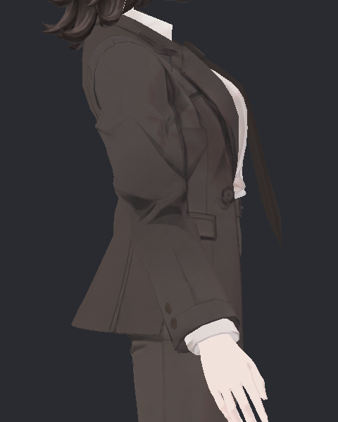
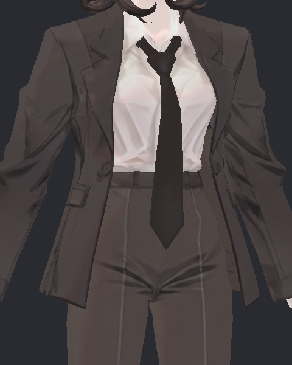

> **기록 시점 안내:** 아래는 해당 단계 당시의 보고서입니다. 후속 결정은 [최신 상태](../../../../STATUS.md)를 기준으로 읽어주세요. 모델·원본 텍스처·검증 원시 데이터는 이 문서 공유본에 포함하지 않습니다.

# v354 넥타이 상세 굽힘 독립 검토

새 v354 기준/후보의 실제 실행을 비교했다. **현재 상세 굽힘 표본에서는 PAD1이 기존 셔츠 교차를 제거했고, 넥타이 외 메시 좌표 변화는 없다.** 중력·이동·바람 후속 검증 전이므로 넥타이 전체 최종 채택으로 확대하지 않는다. v353 외형 작업은 복구 대상에 포함하지 않았다.

각 후보 별도 Play 순서 0, 90프레임 예열과 600프레임 실제 SDK 기록, 300장 사진, 표면 21표본을 새로 생성했다. 두 SOURCE/SCENE 보존은 모두 true이고 원래 v352 메시·웨이트·본 대응과 동일한 실행 코드·자세 입력을 확인했다. 이전 v353 결과를 새 검증으로 세지 않았다.

| 검사항목 | v352 기준 | PAD1 후보 |
|---|---:|---:|
| 넥타이–셔츠 교차 표본 | 1 / 21 | 0 / 21 |
| 해당 90프레임 교차 삼각형 쌍 | 26 | 0 |
| 최대 교차선 길이 | 10.652724mm | 0 |
| 넥타이–코트 교차 표본 | 0 / 21 | 0 / 21 |
| 코트–바지 교차 표본 | 0 / 21 | 0 / 21 |
| 가슴 기준 팁 최대 이동 | 14.048363mm | 19.020211mm |
| 최종 599프레임 팁 복귀 오차 | 0mm | 0.000170mm |

교차선은 관통 깊이가 아니다. 비공면 0.05mm 이상 선분을 세었으며, 21개 정적 표본의 판정이다. 연속600프레임 전수 교차나 공면·가려짐 전체 검사를 했다는 뜻은 아니다. 본 복귀는 각 후보의 마지막 예열 프레임을 기준으로 측정했다. PAD1의 물리 평형 자세 자체가 기준본과 같다는 뜻은 아니다.

21개 같은 프레임 실제 스킨에서 넥타이 밖 BodyHair와 Coat 좌표 차이는 **정확히 0**이다. 팁 반응이 늘었으나 고정부 tie_01 이동은 양쪽 동일하게 약0.000142mm이다. 본 로그는 양쪽600프레임 전체를 읽었다.

실제 사진 10장을 직접 열어 확인했다: 전후 각각 측면92/148, 정면92/148/596. 상세 입력의 각도 극값은93/147프레임(약−13.04/+13.04도)이므로 15fps 사진92/148을 사용했다. 120/240은 입력이 0이므로 그 장면만을 활동 모습으로 해석하지 않았다.

측면92에서는 후보가 더 수직으로 드리워지고 정면92는 팁이 약간 가운데로 이동한다. 148에서는 작은 앞뒤 팁 차이가 있으나 매듭·단추·코트의 큰 새 변형은 보이지 않는다. 복귀596 정면에서는 후보와 원본 모두 안정된 길이와 윤곽을 유지한다. 이 거리의 사진만으로 작은 접촉 제거를 증명하지 않고 위 실제 표면 판정을 함께 사용했다. 셔츠와 가까워 보이는 외형 자체는 남는다.

원본92 측면:

후보92 측면:

원본148 정면:

후보148 정면:

재현 분석은 `analyze_v354_tie_actual.py --mode tie_detail --variant both`. `actual_analysis_v1/tie_detail_PAIR.json`과 두 SUMMARY에 표본별 값이 있으며 `DETAIL_INDEPENDENT_REVIEW_V1.json`에 검토 입력 SHA/보존/실제 열린 사진을 기록했다. 캐시는 현재 소스·BIN·삼각형 대응 의존 파일·분석 코드·실행기 SHA가 모두 같을 때만 재사용했다. 후속 Gravity와 compact movement/wind는 별도 결과가 확인되기 전까지 미검증이다.
