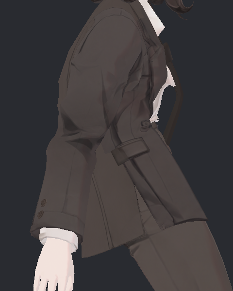
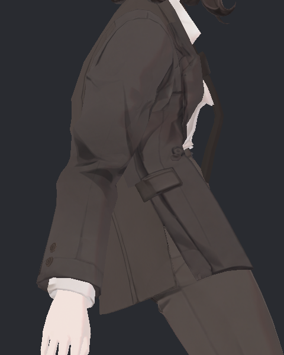
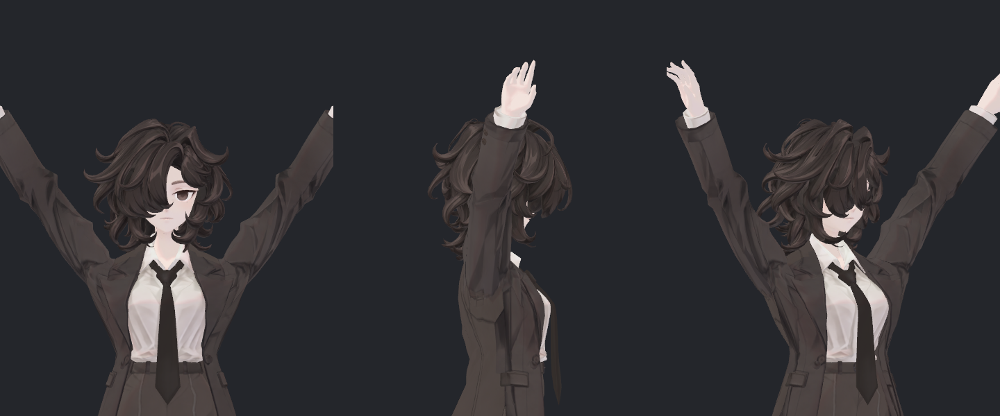
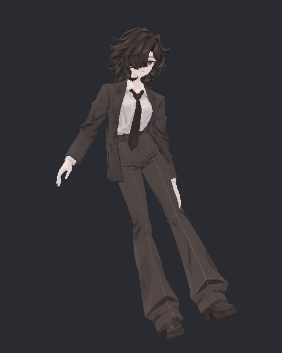
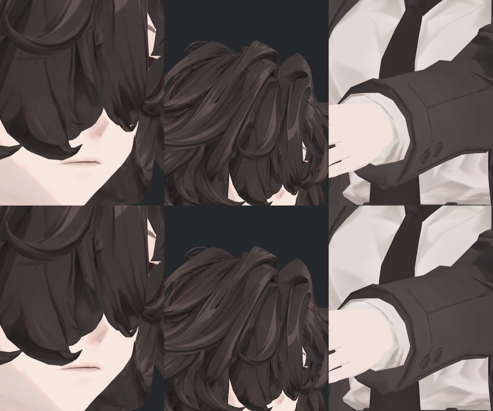

> **기록 시점 안내:** 아래는 해당 단계 당시의 보고서입니다. 후속 결정은 [최신 상태](../../STATUS.md)를 기준으로 읽어주세요. 모델·원본 텍스처·검증 원시 데이터는 이 문서 공유본에 포함하지 않습니다.

# v354 중간 점검 — 기존 외형 복귀와 관절·물리

2026-09-15. **사용자 요청에 따라 새 실험과 Unity 재생을 멈췄다. 피드백 전에는 후속 후보 제작·검사를 자동 재개하지 않는다.**

현재 성과는 **v352 원래 외형 복귀와 넥타이 물리의 검증된 개선**이다. 넥타이만 다음 통합의 기준 후보로 선택했다. 어깨·자켓·눈·헤어를 모두 고친 완성본은 아직 없다. 폐기한 v353 텍스처·UV·재질·셰이더는 가져오지 않았다.

## 1. 작업별 실제 상태

|항목|이번에 실제 수행한 것|현재 판정|
|---|---|---|
|P0 기준 복귀|v352 원본 확인, Blender에서 v354 사본 저장·재열기, 데이터 보존 검사|완료. 기존 외형을 비교 기준으로 확보|
|P1 넥타이|물리 설정·셔츠 추종 콜라이더 분리 이식, 원본/후보 각각 3종 실제 Unity Play, 사진·영상·독립 검수|통합 기준 후보 선택. 아래로 처짐 개선, 좌우 흔들림 감소라는 절충 있음|
|P2 어깨|새 보정 키 저장 누락 원인 수정, 사본 저장·재로드, SDK 자동 구동 145° 후보 미리보기|후보 생성 완료. 전체 연속 동작 전후 검사는 중간 중단, 미채택|
|P3 자켓|지지 본과 장식 웨이트 불일치 조사, 기존 실패안 검토, Unity 지지·장식 추종 후보 코드 준비|아직 실제 후보 생성·재생 없음. 허리 접힘·장식 늘어짐 미해결|
|P4 국소 노멀|장식 44점·정수리 1점의 노멀/탄젠트 사본 생성·재로드|시각 채택 보류. V1 사진 구도 실패, 수정 구도 V2 미실행|
|P4 눈·정수리 틈|기존 눈꺼풀을 유지한 기준 복귀, 검사 구도 수정 준비|눈·흰자·눈 위 틈·정수리 빈 곳의 해결 판정 없음|
|P4 헤어|SiuSiu/Lapwing 제어 구조 조사, hair00 공통 제어 코드 초안|모델 적용·동작 검수 미실행. 뻣뻣함 해결 전|
|바람|기존 바람이 물리 풍속이 아니라 애니메이션 입력임을 확인, 명시적 ON/OFF 후보 코드 준비|기본 OFF는 아직 적용하지 않음|
|P5 최종 통합|각 변경의 보존·검수 경계 정리|통합 전신·다광원·빌드·PC VRChat 실기 미완료|

무릎과 손가락 국소 압축은 기존 수용 상태를 유지한다. T 기본 포즈 전환은 적용하지 않았다. iPhone 표정 트래킹은 후속 범위이며 이번에 지원 완료했다고 보고하지 않는다.

## 2. 넥타이 — 실제 전후와 남은 절충

기존 메시·UV·웨이트·키·원래 재질을 유지했다. 넥타이 PhysBone 필드 10개와 지원 Transform 6개가 변경 범위다. 셔츠 표면을 따라가는 콜라이더 두 개를 포함한다. 저장·재로드 후 기본 자세의 정점 차이는 0이다.

|검수 항목|기준 v352|PAD1 후보|
|---|---:|---:|
|상세 굽힘의 넥타이–셔츠 교차 삼각형 쌍|26|0|
|앞 숙임 정지 시 세계 아래 방향과의 각도|12.69°|5.25°|
|급정지 때 팁 움직임 최대|16.43mm|13.34mm|
|저작 바람 입력 때 팁 움직임 최대|14.96mm|7.46mm|
|최종 팁 복귀 오차 최대|0mm|0.000170mm|

**아래로 늘어지는 방향과 안정성은 좋아졌지만 옆으로 흔들리는 양은 줄었다.** 따라서 ‘더 많이 부드럽게 흔들린다’ 또는 ‘뻣뻣함이 모두 해결됐다’는 판정은 하지 않는다.

아래는 실제 Unity 촬영 10초 비교다. **왼쪽 원래 기준 / 오른쪽 후보.**

넥타이 실제 전후 동작 (공유본 미포함: `v354_TIE_DETAIL_SIDE_COMPARISON.mp4`)

영상이 인라인 재생되지 않으면 MP4 파일 (공유본 미포함: `v354_TIE_DETAIL_SIDE_COMPARISON.mp4`)을 연다.

|앞 숙임 — 원래 기준|앞 숙임 — 후보|
|---|---|
|||

원본/후보를 각각 상세 굽힘 600프레임, 기울임 1,800프레임, 이동·정지·회전·저작 바람 1,200프레임으로 별도 Play 실행했다. 여섯 실행 모두 원본과 장면 보존을 확인했다. 표면 교차 검사는 각각 21·66·34개 저장 표본이며 모든 연속 순간의 전수 검사는 아니다. 비대상 실제 표면 좌표 차이는 0이다.

작업자와 독립 검토자가 실제 사진을 확인했다. [상세 검수와 근거](v354_TIE_RECOVERY_REVIEW.md)에 실행별 결과와 제한을 정리했다. 아직 PC VRChat 클라이언트 판정은 아니다.

## 3. 어깨 — 사본은 만들었지만 전체 합격은 아님

기존 Coat 기본 형상·UV·노멀·웨이트·32개 키와 BodyHair·원래 8개 재질을 보존하고, 어깨 보정 키 2개와 SDK 구동 구성을 추가했다.

처음에는 Unity의 새 BlendShape 저장 과정에서 **위치 변화만 매우 작은 57개 행**이 누락됐다. 실제 재로드 데이터를 대조해 원인을 분리하고, 새 두 키의 희소 데이터를 정확히 저장하도록 수정했다. 보존 오차 허용치를 늘려 통과시키지 않았으며 기존 32개 키는 그대로다.

아래는 **145° 팔 올림 후보 하나의 실제 SDK 미리보기**다. 정면·측면·사선이며, 수동으로 새 보정 값을 강제한 사진이 아니다. 이 검사에서는 다른 물리의 영향을 제외하고 Contacts/Animator 자동 보정을 확인했다.

직접 확인한 이 구도에서는 어깨 상단에 큰 열린 틈은 보이지 않지만, 팔 안쪽과 옆구리의 원래 강한 명암은 남아 있다. 일부 손은 화면 밖이므로 전신 구도 합격 사진으로 쓰지 않는다. **동일 자세의 원본/후보 쌍이 아니므로 이 사진만으로 개선량이나 최종 부피를 확정하지 않는다.**

이후 원본·후보 각 720프레임 전후 검사를 시작했으나 사용자 중간 점검 요청으로 원본 단계에서 정지했다. 마지막 저장 진행값은 151/720, 원본 PNG는 54장이다. 이 값은 주기적으로 남긴 진행 기록이며 정확한 최종 처리 프레임 수는 아니다. 후보 전체 실행·최종 집계는 없다. 따라서 연속/복합 자세의 교차·노멀·복귀 검수는 **미완료**다.

## 4. 자켓 — 아직 남아 있는 문제와 준비한 방법

아래 기준본의 좌 기울임에서 허리 주변의 급한 접힘이 남아 있다. 넥타이 후보는 자켓 좌표를 바꾸지 않았으므로 같은 문제가 유지된다.

원인 조사에서 몸판 허리에는 자락 물리 본 영향이 평균 약 16–26%인 반면, 부착 장식 네 부분은 자락 물리 영향이 0인 구조를 확인했다. 몸판과 장식이 서로 다른 지지를 따라가므로 중력 계수만 바꾸어도 함께 자연스럽게 움직인다고 보장할 수 없다.

준비한 첫 시험은 기존 네 자락 지지를 가슴의 움직임과 연결하고, 장식 네 부분을 인접 의상과 함께 따라가게 하는 Unity VRC 제약 방식이다. 기존 장식 435개 정점의 웨이트와 지원 본 4개를 다루는 코드이며, 기본 위치·UV·원래 재질을 보존하도록 설계했다. **실제 Build·Play는 아직 하지 않았다.**

이전에 검토한 Ribbon 보정은 일부 접촉을 줄여도 V자 접힘이 다시 생겼고, 복합 자세 두 곳에서 각각 새 교차 11쌍이 나타나 채택하지 않았다. 이 결과를 ‘모든 모델이 허용하는 한계’로 넘기지 않았다. 자켓 허리 접힘, 장식 변형, 기존 코트–바지 접촉은 여전히 미해결이다.

## 5. 눈·단추·정수리 — 노멀 후보와 검수 실패를 구분

장식 44점과 정수리 1점의 노멀/탄젠트만 변경한 사본은 생성·재로드 검사를 통과했다. 메시 위치·UV·웨이트·키와 기존 눈꺼풀 면·원래 텍스처는 그대로다. 새 텍스처나 노멀맵을 만든 작업이 아니다.

하지만 [V1 미리보기](reviews/eye/local_normal_pair_v1_preview/PREVIEW.png)는 눈이 머리카락에 가려지고 정수리의 지적 위치가 맞지 않아 시각 검수 자료로 거부했다. 단추가 보인다고 눈과 정수리까지 통과시키지 않았다. 카메라 방향을 바꾼 V2는 준비만 했고 촬영하지 않았다.

아래는 **구도 실패 기록**이며 눈·정수리 개선의 합격 비교 자료가 아니다.

따라서 눈동자·흰자위의 겹침/깊이·UV, 눈 위 빈 공간, 정수리 틈의 최종 해결과 눈꺼풀 선명도 검수는 남아 있다. 원래 눈꺼풀 보존은 확인했지만 새로운 국소 후보의 시각 채택은 없다.

## 6. 다른 모델 물리 방식과 헤어·바람

[SiuSiu/Lapwing 실제 프리팹과 공식 자료 조사](reviews/physics_reference/v354_REFERENCE_PHYSICS_REVIEW.md)에서 **두 모델 모두 Unity VRChat PhysBone을 각각 14개 사용**하고 Unity Cloth는 없는 것을 확인했다. SiuSiu는 일부 헤어 제어 체인의 회전을 여러 변형 본에 전달하고, Lapwing은 헤어 체인에 직접 PhysBone을 사용하는 차이가 있다. 제작자가 어느 DCC에서 만들었는지는 이 결과만으로 알 수 없다.

우리도 Blender에서는 기존 본·웨이트를 제작하고, 최종 흔들림·충돌·중력은 Unity의 지원되는 PhysBone/제약에서 검증하는 방향이다. 참고 모델에 동등한 넥타이 체인을 찾지 못했으므로 넥타이 수치를 그대로 복사했다고 말하지 않는다. 의상 형태와 체인 구조가 달라 다른 부위의 계수도 그대로 복사하지 않는다.

- **헤어:** hair00의 공통 제어 초안만 준비했다. 기존 영향 범위가 총 3,411점이므로 특정 가닥 552점만 바뀐다고 가정할 수 없다. 웨이트는 아직 변경하지 않았고 뻣뻣함이나 가닥 충돌 개선은 미검증이다.
- **바람:** 기존 BiancaWind는 앵커 회전 애니메이션 혼합이다. 물리 풍속이나 임의의 Unity WindZone/모든 월드 바람에 반응하는 기능이 아니다. 평상시 자연 물리와 별도 선택 바람으로 나누는 빌더를 준비했지만, 기본 OFF를 실제 적용하지는 않았다.

## 7. 지금 열어볼 파일과 검증 경계

|용도|작업 저장소 내 파일|주의|
|---|---|---|
|Blender 원래 외형 검수|`avatar_modeling/v354_rig_recovery/bianca_v354_BASELINE_REVIEW.blend`|v352 기준 사본. Unity 물리 변경을 포함한 완성 blend가 아님|
|넥타이 통합 기준 후보|`unity_vrchat_avatar/Assets/BiancaV354RigRecovery/Bianca_v354_V352_TIE_PAD1_REVIEW.prefab`|현재 실제 검증된 물리 개선|
|어깨 검수 후보|`unity_vrchat_avatar/Assets/BiancaV354ShoulderReviewV1/Bianca_v354_SHOULDER_REVIEW_V1.prefab`|저장·미리보기 완료, 전체 동작 검수 전|
|국소 노멀 후보|`unity_vrchat_avatar/Assets/BiancaV354LocalNormalsV1/Bianca_v354_LOCAL_NORMALS_V1.prefab`|시각 미채택, V2 촬영 전|

검사를 멈춘 뒤 Unity Play OFF와 원래 깨끗한 장면 복원을 확인했다. 중단 실행의 기준/부모 의존성 목록 각각 70항목 해시도 모두 일치한다. 세 독립 담당자는 중지 상태다. 중단된 검사의 일부 결과는 실패 판정이나 완료 판정으로 바꾸지 않고 보존한다.

## 8. 이번 중간 점검에서 봐주실 부분

1. **넥타이:** 더 아래로 늘어지는 대신 좌우 흔들림이 줄어든 정도가 원하는 느낌에 맞는지.
2. **어깨:** 위 후보 사진에서 어깨 부피가 과하거나 아직 각지게 느껴지는 부분이 있는지. 정확한 개선 비교는 전체 전후 검사를 마친 뒤 판단해야 한다.

피드백 이후의 남은 순서는 어깨 전체 전후 검사 → 자켓 지지/장식 추종 실제 시험 → 눈·정수리·단추 구도 검증 → 헤어/선택 바람 → 같은 최종 파일의 통합 검수다. [작업 계획](v354_WORK_PLAN.md)과 [시도·실패 기록](v354_WORK_LOG.md)을 함께 갱신했다. 지금은 중간 점검 대기 상태이며 자동 재개하지 않는다.
