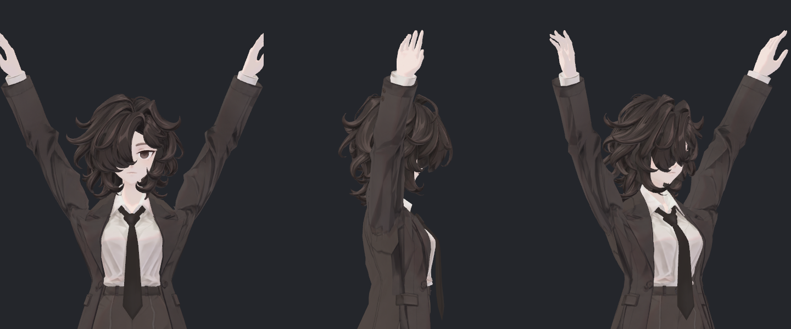
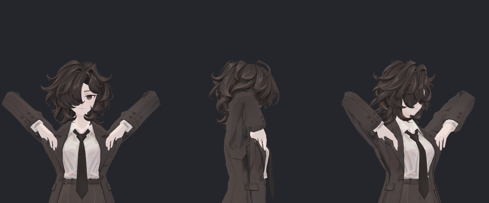
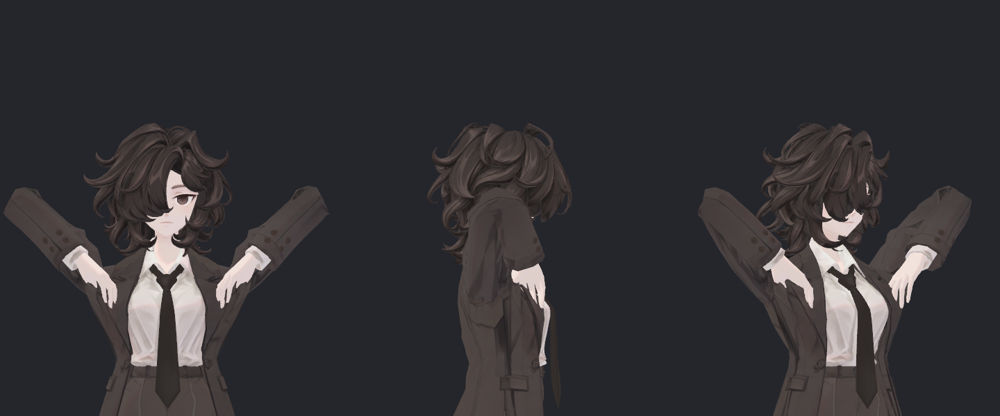

> **기록 시점 안내:** 아래는 해당 단계 당시의 보고서입니다. 후속 결정은 [최신 상태](../../../../../STATUS.md)를 기준으로 읽어주세요. 모델·원본 텍스처·검증 원시 데이터는 이 문서 공유본에 포함하지 않습니다.

# v355 실제 SDK 지지 V11 독립 검수

**새 지지 V11+전용 N/T의 실제 Unity SDK 검사에서 원형 대비 새 교차와 새 노멀 방향 반전은 확인되지 않았다.** 다만 어깨 안쪽의 강한 주름과 좁아진 폭, 원래 교차는 남는다. 두 팬의 비단위 원시 노멀이 원래 재질의 모든 경로에서 안전한지는 별도 고해상도/다중 광원 검수 중이다. 최종 채택/전체 아바타 검증으로 확대하지 않는다.

## 실제 실행과 보존

`support_v1/native_v355_support_sweep`의 BASE/CANDIDATE 각720프레임, 총1440개 실제 SDK 기록을 읽었다. 후보마다 별도 Play와 domain reload를 거쳤고, 두720행의 입력 자세/카메라가 일치한다. DONE과 각 원본·리플레이·장면 보존 기록이 모두 통과했다. 이전 후보의 캐시를 새 실행으로 사용하지 않았다.

기본 P/N/T/UV/본 웨이트/바인드 행렬, BodyHair 메시 및 원래32키는 두 소스에서 정확히 같다. 새 두 키의 P/N/T는 설치 입력과 float32 원소별로 동일하다. 실제 키는 SDK Contacts/Animator로 구동됐으며 수동으로 주입한 값이 아니다.

P변화327점이 직접 닿는 면은353삼각형이다. N/T를 포함한519점에 닿는546삼각형으로 검사 범위를 더 넓혔다. 앞선 오프라인의387삼각형은 미채택 모델 V7의 제거 범위까지 합한 비교 범위로, 수량 정의가 다르다.

## 독립 결과

| 항목 | 실제 검수 결과 |
|---|---:|
| 실제 시간/자동구동 기록 | 720×2 |
| 저장된 실제 표면 시점 | 121×2 |
| 동일시점 원형 키0 대비 새 교차 | **0표본** |
| 새90° 초과 면 방향 변화 | 0표본 |
| 새 퇴화 삼각형 | 0표본 |
| 기존 양수 노멀 코너의 새 음수 | 0표본 |
| 실제 P와 전체 LBS 재구성 최대 오차 | 0.000361mm |
| 비대상 Coat와 별도 BASE 최대 차이 | 0.000239mm |
| BodyHair 최대 위치 차이 | 0mm |
| 본 위치의 별도 실행 간 최대 차이 | 0.000148mm |
| 측정 피벗 최대 오차 | 0.000179mm |
| N 방향 재구성 최대 벡터 오차 | 0.000000661 |
| 새 키가 만든 최대 변위(전체 시험) | 15.367mm |
| 마지막719의 새 키/변위 | 0/0mm |

접촉은 매6프레임과마지막의121저장시점, 변경 영향면과 전체 Coat/BodyHair 상대면에 대한 검사이다. 비공면 교차선0.05mm초과를 기록하며 선분 길이를 관통깊이라고 부르지 않는다. 인접 동일위치 정점을 공유하는 면은 제외하며 공면은 별도 계수한다. 연속720시점 전부의 접촉·전체아바타 부피/물리·VRChat 클라이언트 검수가 아니다.

각 세 활성구간에서 기하 목표 및 측정 Contacts 트리 대비 가장 잘 맞는 지연은 양쪽 모두 **1프레임(약16.7ms)**이다. 프레임466에서 목표가0이 된 직후 키0.388이 남는 것은 직전 활성화에 대한 해제 지연과 일치하며, 무관한 독립 오작동으로 분류하지 않았다. 중립복귀에서는 새 키0과 변위0으로 돌아왔다.

## 사진 독립 확인

전체480장의 PNG 해시·구도·디코딩은 검사했다. 그중 BASE/CANDIDATE의120/306/510/570/717 **10사진(각3구도)을 실제로 열어 직접 비교**했다. 전체480장을 사람이 직접 보거나 연속 영상을 검수했다고 쓰지 않는다.

팔을 높이 올린120에서는 목–위팔 사이 어깨 상단이 이전보다 올라와 깊은 패임이 완화된다. 일반 거리에서 소매 안쪽의 짙은 기존 명암과 길게 접힌 자국은 여전히 두드러진다.306의 사선 올림은 차이가 더 작고,510/570의 깊은 팔꿈치 굽힘에서는 새 큰 구멍이나 넓게 튀어나온 손을 이 크기의 사진에서 발견하지 못했다. 이것을 원래 손 접촉이 없다는 뜻으로 확대하지 않는다.717 복귀 외형은 같다.

## 원시 노멀과 남은 검증

현재 SDK 실행기의 NORMAL 저장은 `BakeMesh.normals`에 inverse-transpose 변환 후 `.normalized`를 적용한다. 따라서 이 저장 배열의 길이가1인 사실로 **원시 BakeMesh 노멀이 이미 단위벡터라고 주장할 수 없다.** 두 팬의100% 원시 노멀 길이4.140/6.691는 별도 native rawN/T 검수 대상이다. 실제 원래 SkinnedRenderer 사진은 유효하지만, 이 일반 거리 사진만으로 outline 폭이나 특수 조명까지 안전하다고 판단하지 않는다.

원래 접촉 중 뒤 소매 전이의 작은 교차선 증가도 별도로 확인해야 한다. 새 실제 스킨에서 증가0.05mm초과는9관찰이며, 최대는frame324 Bianca_Coat:402:3382의+0.314mm다. 새 교차0과 구분한다. 폭 보완 V13은 별도 후보이고 이번 실제 V11에 합치지 않았다. V13에 V11 N/T를 그대로 쓰면720예측271표본2615개 새음수코너가 생겨 재사용 불가다.

근거: `V355_SUPPORT_ACTIVE_SWEEP_V1_REVIEW.json`, `...GEOMETRY.json`, `...TIMING_ROWS.json`, `ALLFRAME_PAIR.json`, `INPUT_SIGNATURE.json`, `DIRECT_VISUAL_10.json`. 입력·코드·원시 배열은 모두 현재 지문으로 검증했고 Assets/Blender/Unity 실행은 독립 검수자가 수행하지 않았다.

## 후속 기록 — 2026-09-15T09:48:41.812058+09:00

이 절은 위 최초 검수 기록을 보존한 상태에서 뒤에 추가했다. 부모는 **V11을 검수 전달본으로 정리**하기로 결정했다. 이는 어깨 전체 문제와 모든 실행 환경의 최종 해결 판정이 아니다. V11의 실제120 경로 측정은 뒤 함몰16.744210→7.309961mm, 앞15.329350→8.789964mm, 뒤 경로길이49.386399→51.020136mm이다(새 SDK120 실제 P 측정 (공유본 미포함: `ACTUAL_120_CAP_PATHS.json`)). 어깨 폭이 측정 단면에서 약16% 줄어드는 한계는 유지하며, 폭 감소를 전체부피 감소율로 표현하지 않는다.

추가 원래 SkinnedMeshRenderer의 raw N/T 재현 검사 (공유본 미포함: `REVIEW.json`)는7자세×2변형의 실제 기록 본을 재현하고,5뷰씩70사진을 생성했다. 새로운 SDK 연속 실행은 아니다. 원시 N을 정규화하기 전 읽어 후보 범위0.056992–3.345721를 확인했고, 따라서 원시 단위길이를 보장한다고 쓰지 않는다. 이 독립 검수자는 완료·장면/소스 보존·수치 기록을 읽었으며,70장 전체 직접 시각검수는 [참고 검수 담당자의 별도 기록](../../reference/v355_NATIVE_RAW_NORMAL_REVIEW.md)에 근거한다. 여기서 직접 보았다고 기록한 사진은 앞의10장이다.

현재 코트 재질의 실제 shader variant는 plain lilToon으로 외곽선 패스를 포함하지 않고 노멀맵도 사용하지 않는다는 후속 코드·재질 조사가 완료됐다. Probe의 공통 `_OutlineWidth` 값이나 `outline_pass_enabled=true`를 실제 외곽선 실행 증거로 사용하지 않는다. 현재 재질에서의 결과를 외곽선/노멀맵을 새로 켠 다른 재질의 안전성으로 확대하지 않는다. 앞서 제기한 raw N 위험은 이 현재 설정·7자세 검수 범위에서 후속 평가되었으며, 다른 설정은 별도 검수 대상이다.

Blender GUI 저장 (공유본 미포함: `BLENDER_SUPPORT_SAVE.json`)과 실제 재열기 (공유본 미포함: `BLENDER_SUPPORT_REOPEN.json`) 모두 완료했다. 독립 검수에서도 현재 디스크의 v352 원본 SHA 및 새 `bianca_v355_SHOULDER_SUPPORT_REVIEW.blend` SHA가 기록과 일치함을 다시 확인했다. 원래 기하/UV/웨이트/노멀/기존키/재질·이미지/본 보존과 새 두 위치키의 정확성 기록이 있다. **Blender의 새 키는 편집 가능한 기본값0이며, 새 키 N/T와 자동 구동은 Unity 전달본이 기준**이다. Blender만 열면 동일 Contacts 자동구동까지 제공된다고 쓰지 않는다.

폭 보완 **V13은 미채택**이다. 오프라인121접촉 새0은 확인했지만 V11 N/T를 그대로 적용하면720예측에서 새음수코너가 남았고, 새 N/T·실제 SDK·실제 미관 검수까지 진행된 전달본이 아니다. V11에 자동 합치지 않았다.

이번 후기에 사용한 파일 지문은 후속 증거 시점 (공유본 미포함: `FOLLOWUP_EVIDENCE_SNAPSHOT.json`)에 보존했다. 최종 DELIVERY가 작성되면 경로·파일 SHA·선택 버전·Blender/Unity 기능 경계를 별도로 읽기 전용 확인할 예정이다.
