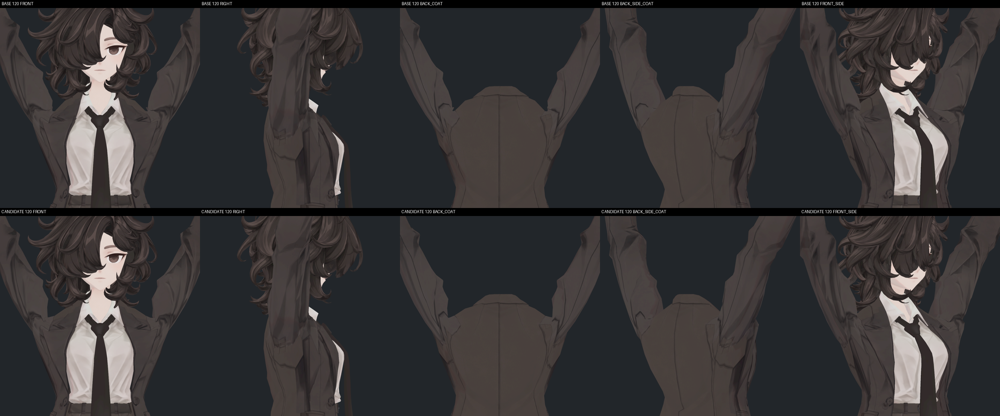
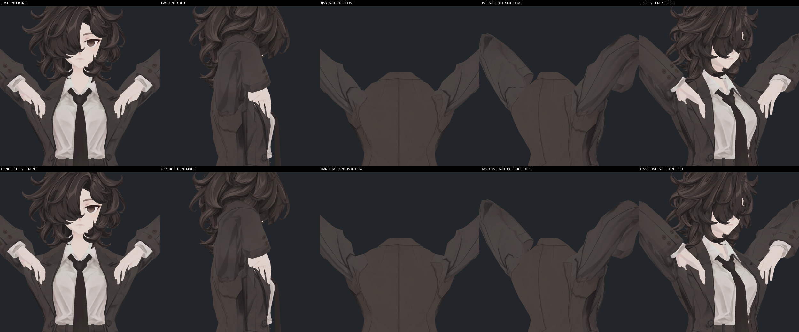
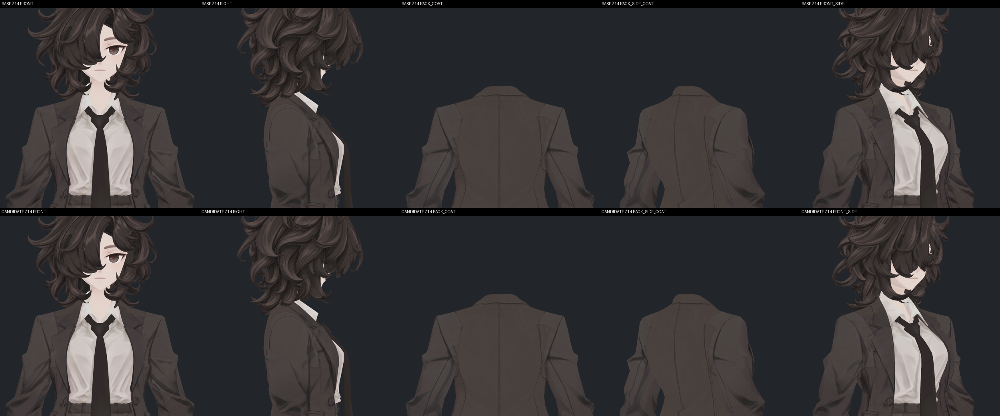

> **기록 시점 안내:** 아래는 해당 단계 당시의 보고서입니다. 후속 결정은 [최신 상태](../../../../STATUS.md)를 기준으로 읽어주세요. 모델·원본 텍스처·검증 원시 데이터는 이 문서 공유본에 포함하지 않습니다.

# v355 실제 원시 노멀·현재 lilToon 검토

**이번 추가 측정은 BakeMesh의 원시 N/T를 정규화하지 않고 읽었으므로, 새 키를 켠 실제 원시 노멀이 비단위 길이라는 점이 확인됐다. 현재 코트가 사용하는 plain lilToon은 이 노멀을 정규화해 사용하고, 외곽선 패스는 포함하지 않는다.** 70개 실제 재질 사진에서 새 광원 폭발이나 큰 검은 면 반전은 확인하지 못했다. 현재 재질의7개 자세 재현 검수 결과이며 모든 셰이더·연속 동작 합격으로 확대하지 않는다.

## 실제 실행 범위와 자료 정합

REVIEW.json (공유본 미포함: `REVIEW.json`)의 완료·두 원본 dependency 보존·장면 보존을 확인했다. 기준 dependency `b9432a082baf52f7ebfdd0f6514fe728`, 후보 `32dfa2bc50c8580ffca0bdea131cf1c1`이다. 7개 실제 저장 자세(index0/30/120/330/570/576/714)를 해당 본 위치·회전과 기존/새 키 값으로 재현했다. 스킨 위치를 기존 실제 SDK P와 대조한 관문이 있다.

이번은 **새 SDK 시간 진행이 아니다.** Animator/기타 Behaviour를 끈 독립 Preview에서 저장한 실제 값을 복원한 정적 시험이다. 검사용 BakeMesh를 렌더 메시로 교체하지 않고 원래 SkinnedMeshRenderer를 사용한다. 새 키를 기록값으로 수동 복원하는 것은 정적 재현의 일부이며, 앞서 full720 SDK 자동 구동 시험과 구분한다.

7자세×2모델×5개의 카메라/광원 조합=70사진이다. 5조합마다 카메라와 조명이 함께 바뀌므로 ‘한 고정 카메라에서 광원만5회 분리한 시험’은 아니다. 뒤2뷰는 Coat만 보이게 하여 머리 가림을 제거했다. 코드상 그림자 투사는 껐고 원래 재질 자체 명암 응답은 유지한다. 사진70개를 기록 SHA256과 모두 대조했다.

## 실제 원시 N/T 길이

Probe는 `baked.normals`/`baked.tangents`를 직접 읽었다. 길이를 저장하기 전에 `.normalized`하지 않는다. 아래 값은 피부변형 전 local 끝점 N 길이4.140/6.691과 다른, **현재 자세의 실제 BakeMesh 출력 길이**다. 길이는 방향 벡터 크기이며 거리 단위mm가 아니다.

| index | BASE N317 / N1159 | 후보 N317 / N1159 | 후보 Coat 전체 N 최소 / 최대 |
|---|---:|---:|---:|
|0|.895795 / .872443|같음|.822186 / 1.000010|
|30|.817117 / .770388|.900676 / 1.140889|.605440 / 1.140889|
|120|.670567 / .571515|1.843972 / 2.783375|.056992 / 2.783375|
|330|.993429 / .970396|1.001370 / .990012|.557997 / 1.001370|
|570|.745318 / .674332|2.097437 / 3.345721|.117379 / 3.345721|
|576|.774355 / .713531|1.714014 / 2.753476|.258412 / 2.753476|
|714|.996778 / .996817|같음|.996632 / 1.000010|

원본 N도 스키닝 후 반드시 단위길이는 아니다. 후보는 그 길이 편차가 더 크지만 샘플 N은 전부 유한하고0벡터는 없다. 이번 실제 측정으로 지난 보고서의 ‘엔진 raw 길이 미계측’ 항목 중 **7개 재현 자세**의 한계를 보완했다. full720 전체 rawN를 새로 측정한 것은 아니다.

T도 단위길이가 아니며 후보에서 전체 최소.272327, 최대1.000007이다. 특수 팬의 정규화 N·T 내적은0이 아니다. 예를 들어120 팬317은 BASE .64427→후보−.22621,1159는 .65375→.30138이다. 원래도 비직교였고 이 두 값만으로 일괄 악화라고 단정할 수 없다. 탄젠트 직교성이나 임의 노멀맵 사용을 합격 처리하지 않는다. 자세별 값은 독립 수치 (공유본 미포함: `NATIVE_RAW_NORMAL_NUMERIC.json`)에 남겼다.

## 외곽선 판정 정정

실제 Coat 재질은 `Assets/BiancaV352Review/Bianca_v352_coat.mat`이고 shader GUID는 `df12117ecd77c31469c224178886498e`다. 로컬 패키지 `jp.lilxyzw.liltoon/Shader/lts.shader.meta`와 일치한다.

- `lts.shader:1`: shader 이름은 **lilToon**.
- `lts.shader:641–644`: FORWARD, FORWARD_ADD, SHADOW_CASTER, META만 UsePass.
- `lts_o.shader:1`: 별도 shader 이름 **Hidden/lilToonOutline**.
- `lts_o.shader:642/644/645`: FORWARD_OUTLINE/FORWARD_ADD_OUTLINE/SHADOW_CASTER_OUTLINE을 포함한다.

현재 재질은 후자의 외곽선 variant가 아니다. `_OutlineWidth=.08`은 공통 Properties에 저장된 값일 뿐 현재 실행되는 외곽선 패스의 증거가 아니다. Probe의 `outline_pass_enabled=true`는 `GetShaderPassEnabled("SRPDefaultUnlit")` 반환값인데, 현재 BRP plain shader의 실제 outline pass를 조회한 것이 아니다. **이 값만으로 ‘외곽선 켜진 상태에서도 큰 N이 안전하다’고 주장하면 잘못이다.** 현재 빈 keywords 역시 단독 근거로 쓰지 않았다. 실제 shader GUID와 UsePass 목록으로 판정했다.

## 현재 조명에서 N을 사용하는 방식

설치된 공식 패키지 소스를 읽었다.

- `Includes/lil_common_functions.hlsl:244–260`: `lilGetVertexNormalInputs`가 `lilTransformNormalOStoWS(normalOS, true)`를 호출한다. T도 true로 방향을 정규화한다.
- `Includes/lil_common_macro.hlsl:597`: true인 경우 inverse-transpose 또는 uniform-scale 경로 결과를 normalize한다.
- `Includes/lil_pass_forward_normal.hlsl:299–311`: fragment에서도 변환한 normalmap 또는 input.normalWS를 normalize한다.

따라서 현재 plain lilToon의 조명 계산은 큰 길이를 그대로 밝기 배율로 쓰는 구조가 아니다. 실제 Coat 설정은 `_UseBumpMap=0`, `_UseBump2ndMap=0`, `_UseAnisotropy=0`, `_UseReflection=0`, `_UseMatCap=0`, `_UseShadow=1`, `_AsUnlit=.45`다. 현재 설정의 사진을 향후 외곽선 variant/노멀맵/다른 셰이더 안전성으로 일반화하지 않는다. 외곽선 검증을 위해 임의로 원래 재질을 바꾸지는 않았다.

## 직접 본 사진

7개의 전후5뷰 확인판으로70사진을 전부 직접 확인했고,120 뒤와570 뒤사선은 원본1000²도 각각 전후 열었다. 확대된 코트에서 전면/후면 어깨의 기존 U자 꺾임이 줄어드는 것이 보인다. 여전히 봉제선 근처의 어두운 꺾임과 각진 작은 면은 존재한다. 그 자체를 새 노멀 파손으로 취급하지 않았으며, P와 N이 함께 바뀐 결과에서 개별 기여는 분리하지 않았다.

큰 키를 켠120/570에서 새 흰색 플래시나 광원색 폭발·큰 검은 삼각형 반전은 보이지 않는다. 뒤판과 소매 사이 새 형상 경계가 더 수직/평평하게 읽히는 점은 기존 단면검토와 같다. 0/714 키0 자세는 원래 윤곽과 명암으로 돌아간다.

## 남은 위험과 판정

1. 후보 원시N의 최소길이 .05699는0은 아니지만 원래보다 짧다. 작은 N의 정규화는 입력 변화에 민감해질 수 있으므로, 기존 full720에서 확인한 팬317/1159의 빠른 방향전환 구간은 계속 명시한다. 이번7자세에는 그 최대 전환 index462/464가 없다.
2. 이번은 정지 사진이며 깜박임의 연속 시청 증거가 아니다. 모든 입력 사이의 원시N 길이나 노멀맵 TBN·외곽선 확대 안전성을 완전히 검증하지 않았다.
3. 현재 재질과 이번 자세/광원 조합에서는 새 원시 길이 때문에 나타나는 뚜렷한 시각 파손은 발견하지 못했다. 단지 길이가1을 벗어났다는 이유로 후보를 폐기하거나, normalize가 있다는 이유로 모든 미래 재질에 안전하다고 확정하지 않는다.

모델·Assets·GUI 변경은0이다. 분석 스크립트 (공유본 미포함: `analyze_native_raw_normal_v1.py`), 원시 수치 (공유본 미포함: `NATIVE_RAW_NORMAL_NUMERIC.json`), [전체 실행 방향 검토](v355_NATIVE_SUPPORT_REVIEW.md)를 함께 보관한다.

## 실제 재질 경로 정정

초기 보고서는 셰이더 설정을 읽을 때 v351 재질을 선택하고 실제 사용 재질로 잘못 적었다. 부모 지적으로 probe REVIEW의 모든14개 Coat 기록을 다시 확인했고, 실제 사용 재질은 `Assets/BiancaV352Review/Bianca_v352_coat.mat`이다. **경로 오표기뿐 아니라 초기 설정 조사 대상 선택도 잘못됐으므로 실제 v352 파일을 다시 읽어 검증했다.**

실제 v352의 shader GUID, AsUnlit .45, OutlineWidth .08, Bump1/2·Anisotropy·Reflection·MatCap 0, Shadow1은 위 설명과 동일했다. 따라서 plain lilToon/외곽선 비활성 및 현재 조명 정규화 결론은 유지된다. 실제 probe 사진·rawN 측정은 처음부터 v352 재질을 사용했으며 잘못된 재질로 렌더한 것이 아니다. 실제 v352 파일 SHA256 `0ba7e4b14417362cde27d1df6ec424d9bb8594d5f8bf2b2c3d79073a1e500967`는 BASE/CANDIDATE 실행 전·후 manifest와 현재파일 모두 일치했다. 경로 정정·재해시 증거 (공유본 미포함: `NATIVE_RAW_NORMAL_ACTUAL_MATERIAL_CORRECTION.json`)를 보관한다.
