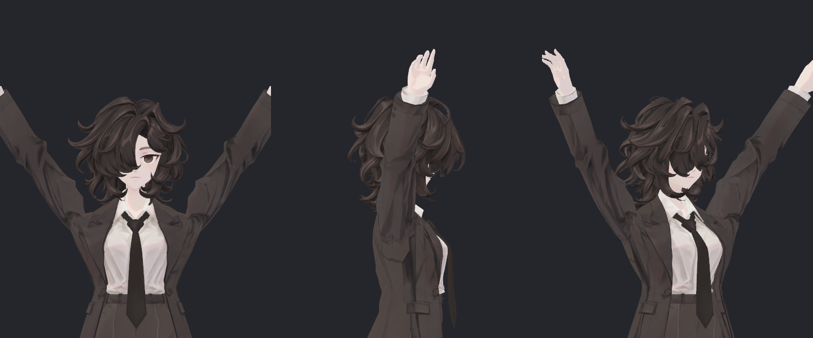
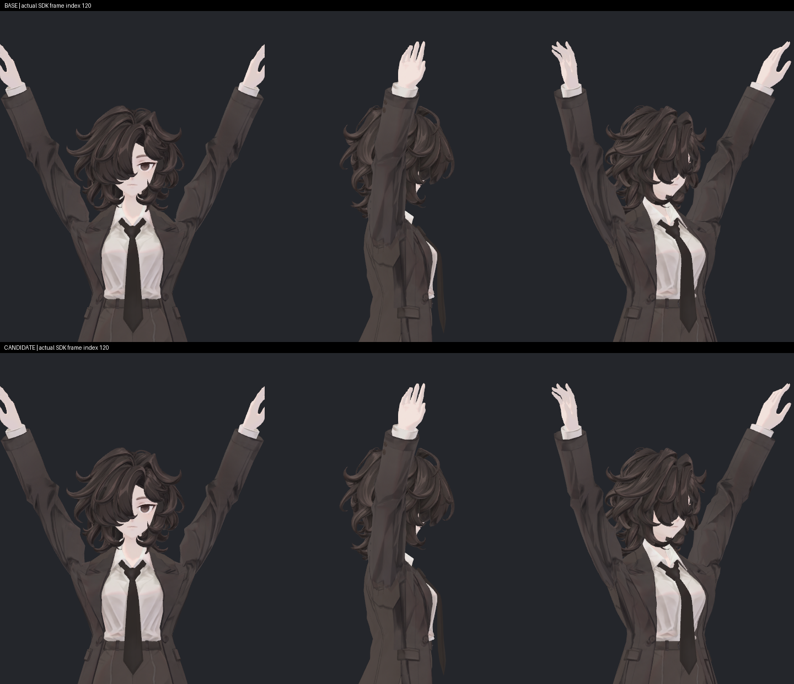
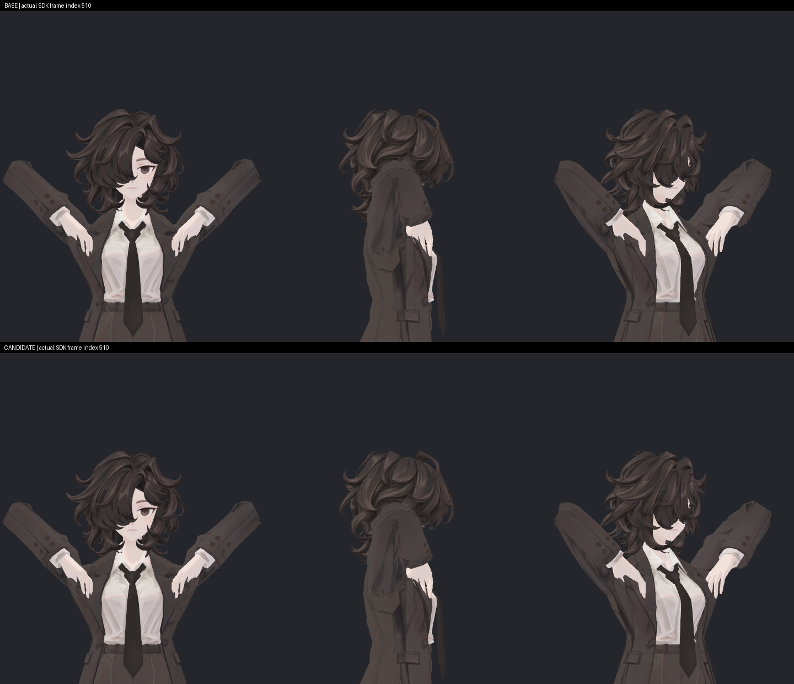
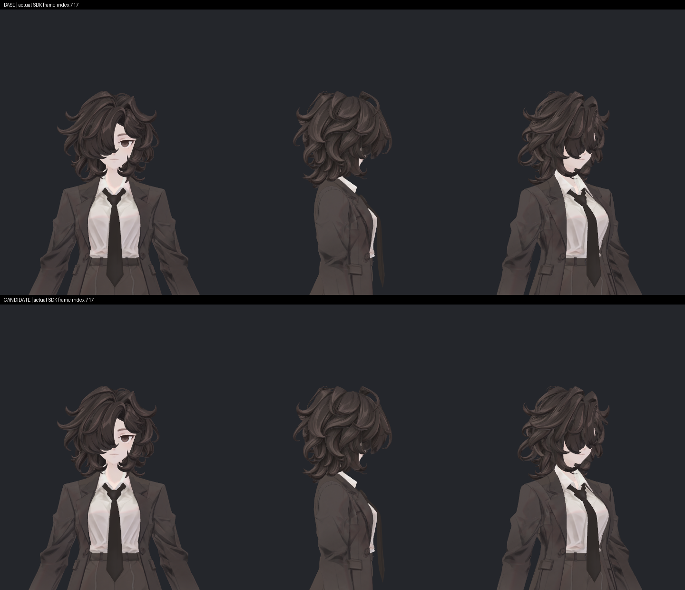

> **기록 시점 안내:** 아래는 해당 단계 당시의 보고서입니다. 후속 결정은 [최신 상태](../../../../STATUS.md)를 기준으로 읽어주세요. 모델·원본 텍스처·검증 원시 데이터는 이 문서 공유본에 포함하지 않습니다.

# v355 V11 실제 어깨 구동·노멀 독립 검토

새 V11 어깨 후보의 실제 빌드·재로드와 원본/후보 각720 SDK 프레임을 확인했다. 기본 메시와 기존32키는 보존됐고, 새2키는 동결한 P/N/T와 정확히 일치한다. **노멀 방향·유한성 검사는 통과했지만, 저장기가 정규화한 값이므로 엔진 원시 노멀 길이의 증거는 아니다.** 여러 광원/탄젠트/클라이언트 최종 합격과 구분한다. 기하 교차 전수 검사는 integration 담당의 별도 결과를 따른다.

## 입력과 보존

- 기준: `Assets/BiancaV354RigRecovery/Bianca_v354_V352_TIE_PAD1_REVIEW.prefab`.
- 후보: `Assets/BiancaV355ShoulderSupportV1/Bianca_v355_SHOULDER_SUPPORT_V1.prefab`, dependency `32dfa2bc50c8580ffca0bdea131cf1c1`.
- BUILD_RESULT (공유본 미포함: `BUILD_RESULT.json`)의 completed/reloaded/source_preserved/scene_preserved=true를 실제 코드와 대조했다. 이 파일의 actual_runtime_tested=false는 빌드 시점의 범위이며, 아래 별도 SDK 완료 자료가 후속 증거다.
- 기본 P/N/T·모든UV·토폴로지·바인드포즈·웨이트·129개 Coat 스킨본과 순서, 기존32키 P/N/T 및 재질이 보존된다. BodyHair는 같은 메시 자산이다. 컨트롤러의 기존 서브자산/레이어/파라미터는 유지하고 새2층·Contacts6개·위치제약2개를 더했다.
- 새 P/N/T 전체 범위519점(L254/R265), 그중 위치 변경327점. 네이티브 희소 키에서 작은 델타가 생략되지 않도록 새 프레임만 정확 저장한 뒤 MeshExact를 저장 전/재로드 후 실행했다. 원래32개 희소 프레임은 보존했다.
- 독립 검사에서 BASE/CANDIDATE raw SOURCE의 기본 배열을 전부 비교하고, 기존키 V/N/T 배열을 원소별 비교했다. 새32/33번 키도 동결 PNT (공유본 미포함: `SHOULDER_KEY_PNT.json`)의 float32와 일치한다(SHA256 `7a64350006646362c920e1e3d650c22e69716b77312dbe249e6095a9a1943654`).
- 기록된 원본 보존 bool에만 의존하지 않고 현재 프로젝트의 dependency 파일을 각70개 재해시했다. 재해시 결과 (공유본 미포함: `NATIVE_SUPPORT_ASSET_REHASH.json`). 새 raw manifest BASE662/CANDIDATE668파일도 전체 해시가 맞았다.

## 실제 SDK 실행 범위

완료 기록 (공유본 미포함: `DONE.json`)은 두 개별 Play 세션에서 각각720프레임, 입력 간격1/60초, 실수신 프레임 연속을 확인한다. Contacts/Animator는 SDK에서 실제 구동했으며 새 키/측정 파라미터의 수동 입력은 없다. PhysBone은 꺼진 어깨 제어 시험이므로 물리·VRChat 클라이언트 검증으로 확대하지 않는다.

각720개 본행렬/기존키/입력 기록, 각121개 실제 P/N 스킨 샘플, 각240개3뷰 사진이 생성됐다. 모든 P/N 샘플은 유한하다. 양 세션 입력·근육·루트·카메라 설정은 같다. 실제 본행렬까지 비트 동일하진 않다. 최대 본 위치 차이는 index566 coat_front_02.R의 **0.0001485mm**, 행렬 원소 차이는4.01e−5, 기존32키 실행값 차이는2.46e−5/100이다. 모델 변경으로 볼 규모가 아닌 별도 실행의 수치차로 기록하며, 동일 행렬이라고 허위 표현하지 않는다.

## 자동 구동과 복귀

세 활성 단계(팔올림·앞쪽 회전·팔꿈치 접은 올림) 모두 실제 측정 Contacts→BlendTree→키의 가장 잘 맞는 지연은 **1프레임(약16.7ms)**이다. 이 지연을 반영하면 .2/100 이상 설명되지 않는 프레임별 점프는0이다. 비활성 복귀 단계는 신호 변화가 없어 지연0 통과라고 판정하지 않았다.

Contact의 같은 프레임 거리식 대비 최대 오차는 L2.787e−6/R2.120e−6이다. 목표0인데 실제값>.2인 index466은 양쪽 약.388/100이며 직전 활성에서 돌아오는1프레임 잔류다. 지속 오활성으로 분류하지 않는다. 100초과 최대는1.5e−5/100의 수치오차다. 최종 복귀 단계 키0을 확인했다.

## 길이가 큰 두 노멀 팬

Sweep `Measure()`는 `BakeMesh(...).normals`에 renderer inverse-transpose를 적용한 뒤 **`.normalized`**하여 NORMAL.bin에 쓴다. 저장값 길이 범위는 약0.999999911–1.000000093이지만 이것은 **저장된 방향의 정상성**이며 Unity 내부 원시 노멀이 단위길이로 계산됐다는 증명이 아니다. 실제 raw 길이를 측정했다고 적으면 안 된다.

별도로 새·기존34키와 실제720 본행렬로 LBS를 재구성했다. 저장된121 네이티브 방향과의 최대 벡터오차는 **6.6113e−7**, 위치 재구성 최대오차는 **0.0003609mm**였다. 그러므로 현재 저장 스킨의 방향은 의도한 새 키 방향과 일치한다. 720의 중간값은 재구성이며 실제 N 샘플은121개라는 구분을 유지한다.

| 팬 대표 | 재구성 local 원시 N 길이 범위 | 최대 연속1프레임 방향 변화 | 위치 |
|---|---:|---:|---|
|317|.999722–4.139504|7.5474°|index462|
|1159|.997613–6.690794|7.4771°|index464|

두 팬은 키가 꺼질 때 회전이 집중된다. 317의 index456→468 변화는3.27→4.13→4.83→5.90→6.43→7.28→7.55→6.92→6.27→5.00→2.46→1.57→.95°다. 단발 NaN/불연속 대신 가속 후 감속하는 패턴이다. 그렇다고 광원하의 변화 속도가 항상 자연스럽다고 확정하지 않는다. **원시 길이가 커진 탓에 방향 보간이 비선형으로 집중되는 점은 남은 품질 검수 항목**이다. 원래 N을 덮거나 전체 재계산하지 않았다.

## 직접 본 실제 사진

145° 미리보기의3뷰를 직접 확인했다. 전면 안쪽 U자 접힘은 줄고, 소매의 작은 각진 주름은 남아 있다.

전체 실행에서 index0/60/90/120/306/510/600/717의 원본과후보 **8쌍(48뷰)**을 직접 열었다. 이는 기존 재질을 사용한 새 후보의 실제 SDK 촬영이며, 이전 V11 예측P+임시 재계산N 사진과 다르다. 원래 픽셀을 위아래 배열한 확인판과 파일 해시 (공유본 미포함: `MANIFEST.json`)를 남겼다.

90/120의 높은 팔올림에서 어깨 안쪽 U 돌출이 완화되고, 옷 가장자리와 접힌 명암이 함께 정리된다. 팔의 바깥 큰 윤곽은 유사하다. 기존 안쪽 천 여유가 줄어드는 변화는 [단면 검토](v355_SHOULDER_VOLUME_REVIEW.md)와 같이 공개해야 한다. 사진만으로 전체 부피 보존이라 부르지 않는다.

510은 강하게 접은 손이 소매/가슴 가까이 오는 스트레스 자세다. 이 일반거리 사진에서 새 큰 구멍이나 찢어짐은 확인하지 못했다. 작은 접촉의 존재·노출 여부는 별도 접촉 감사로 판단해야 하며 사진만으로 교차0이라 적지 않는다.

index0/600/717은 새 키가 꺼진 외형이 원본과 같아 보인다. 717에서 어깨선·셔츠·넥타이·머리의 외형을 보존한다. 텍스처 디테일 재제작을 한 후보가 아니다.

방향 변화가 집중되는459/462/465의3뷰도 직접 확인했다. 이3개의 일반거리 정지사진에서는 단발 흰 반짝임/검은면 반전이 보이지 않는다. 다만 영상 재생으로 플리커를 검사한 것은 아니므로 연속 시청·다중 광원 검수를 대체하지 않는다.

## 판정

이번 독립 범위에서 원본/기존키 보존, 새 PNT 네이티브 반영, 실제 자동 구동, 저장 P/N 유한성·의도 방향 일치가 확인됐다. **엔진 원시 N 길이·탄젠트의 동작 중 TBN·여러 광원·클라이언트 최종 검증은 남아 있다.** 긴 노멀 팬의 방향 전환이 빨라지는 구간을 숨기지 않는다. 새 접촉과 형상 채택은 integration 결과 및 사용자 외형 피드백과 합쳐 판단한다.

재현: 분석 스크립트 (공유본 미포함: `analyze_native_support_v1.py`), 전체 수치 (공유본 미포함: `NATIVE_SUPPORT_NUMERIC.json`). 이번 담당은 모델·Assets·Unity·Blender를 수정하거나 실행하지 않았다.

추가 측정: 후속 [실제 raw N 검토](v355_NATIVE_RAW_NORMAL_REVIEW.md)에서7개 기록 자세의 BakeMesh 원시 길이와70사진을 확인했다. full720 raw길이 측정이나 외곽선 활성 검증으로 확대하지 않는다. 현재 material은 plain lilToon이며 outline variant가 아니다.
