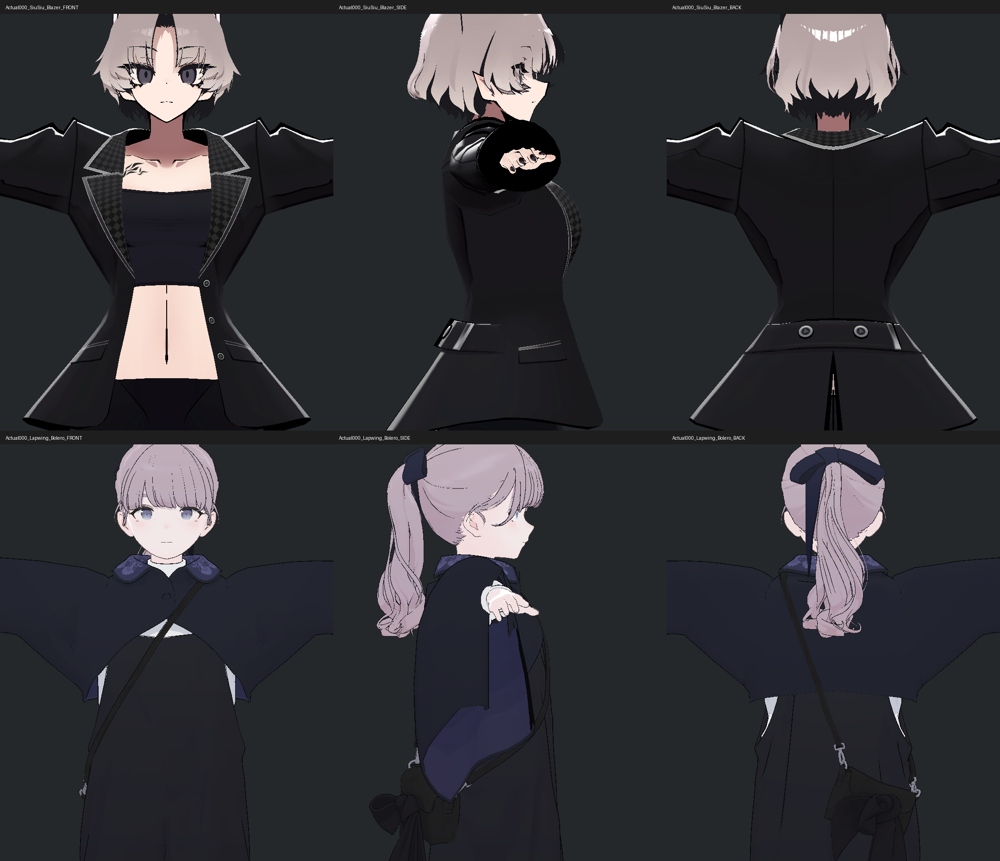
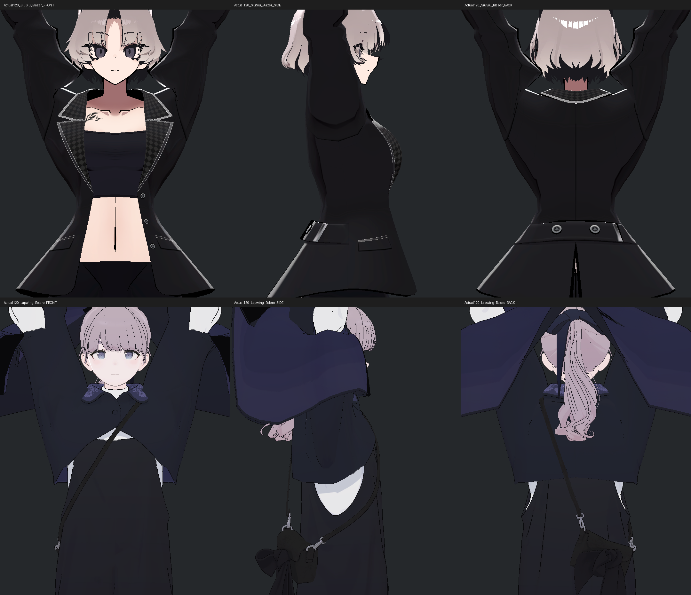
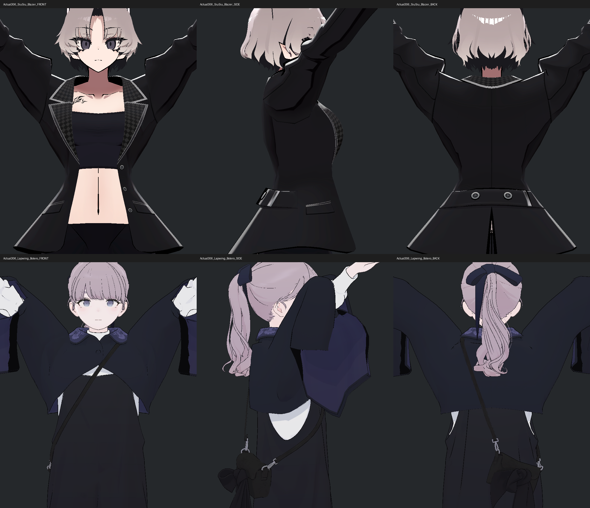
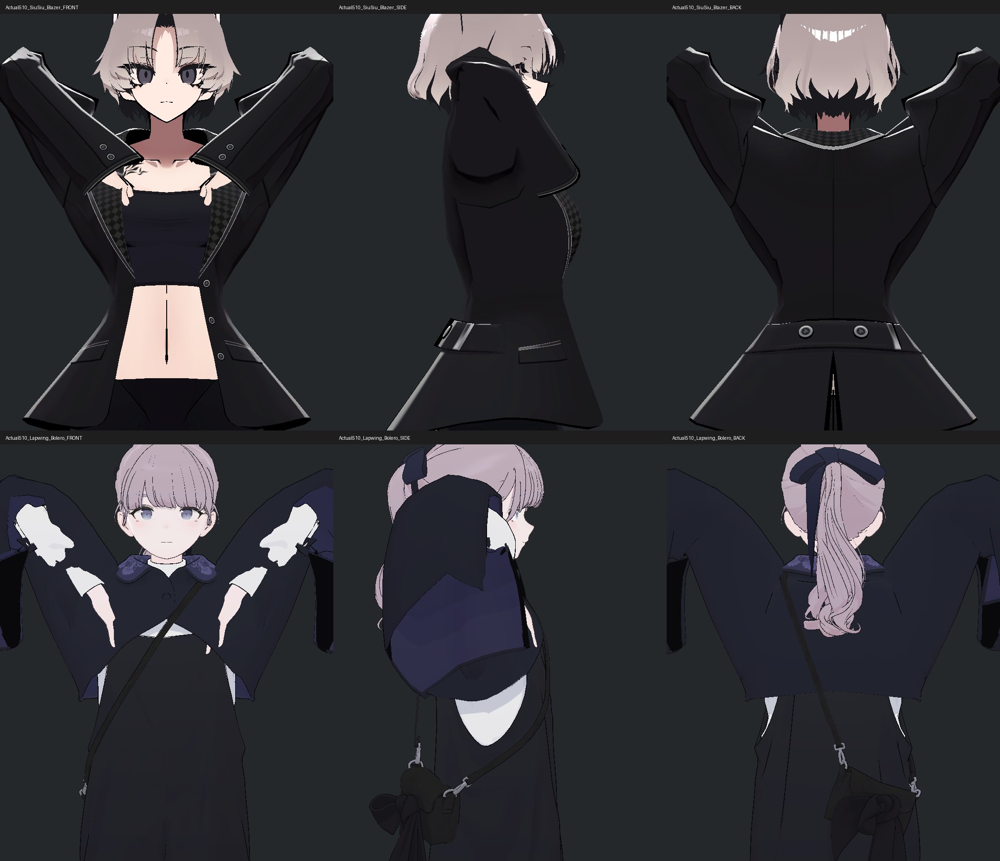
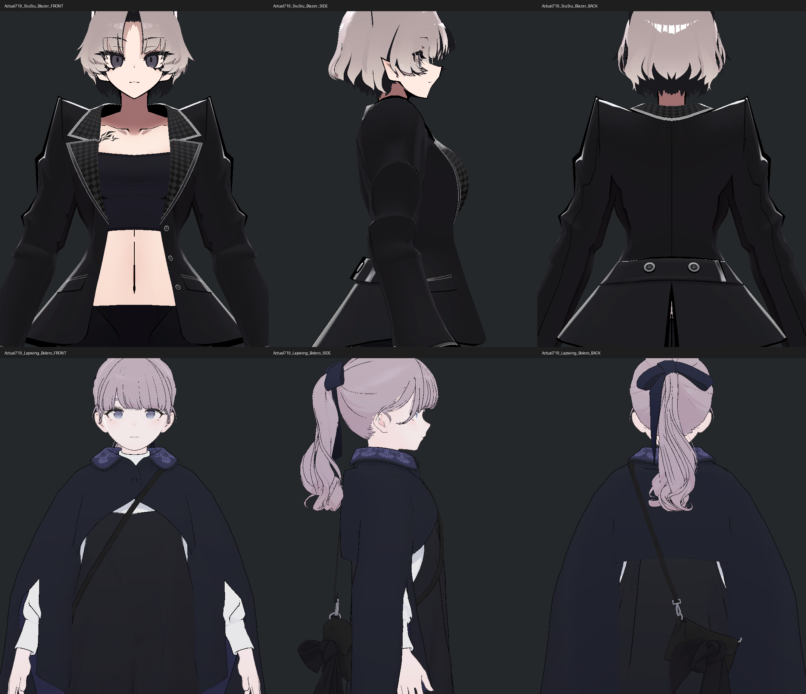

> **기록 시점 안내:** 아래는 해당 단계 당시의 보고서입니다. 후속 결정은 [최신 상태](../../../../STATUS.md)를 기준으로 읽어주세요. 모델·원본 텍스처·검증 원시 데이터는 이 문서 공유본에 포함하지 않습니다.

# v355 어깨 참고 구조 독립 검토

2026-09-15. **부모가 새 참고 Unity SDK 시험 5자세×2모델×3방향=30사진을 실행했고, 독립 검토에서 전부 직접 확인했다. 원본·장면 보존을 통과했다. 비앙카 수정 채택이나 참고 모델 전체 품질 합격은 아니다.** 어깨만 재개하며 v353 전면 텍스처 재작업 폐기와 다른 부위 중지는 유지한다.

## 확인된 차이

| 항목 | SiuSiu Kisekae 블레이저 | Lapwing 볼레로 | Bianca v352 / v354 P2 |
|---|---|---|---|
| 기본 계층 | Chest→Shoulder→UpperArm | Chest→Shoulder→UpperArm | chest→clavicle→upper_arm |
| 옷 어깨의 지지 | 쇄골 Shoulder 웨이트가 넓게 분포 | xLapJacketUpperArm 및 xLapJacketChest 전용 의상본 | 기존 쇄골·상완 스킨 + 기존 자세 보정 |
| 별도 어깨 회전 본 | Kisekae에서 추가 어깨 constraint는 발견하지 못함 | xLapJacket_L/R에 상완 회전을 0.1 가중 추종 | shoulder_support 좌우가 상완을 local 회전 0.5로 추종하지만 **Coat 영향 정점 0** |
| Twist | 본은 있음. Standard와 Kisekae 설정 다름 | UpperArmTwist가 LowerArm Y축을 0.7 추종 | 전용 지원본이 있다고 옷 웨이트까지 연결된 것은 아님 |
| 해당 옷의 shape keys | blazer_open, breasts_small, breasts_big. 과거 저장 감사에서 모두 0 | LapBolero에는 shape key 없음 | 원래 Coat 32키. v354 P2는 국소 어깨 2키 및 자동구동을 추가한 별도 후보 |
| 이번 결과의 한계 | 새 5자세 SDK/30사진 비교 완료; 한계는 아래 기록 | 과거 수동 검수에 의상 겹침이 있어 그대로 성공 사례로 채택 불가 | 실제 새 v355 runtime 결과는 부모 검수 담당. 빌드 성공을 합격으로 쓰지 않음 |

### SiuSiu

보존된 FBX 구조에는 UpperArm_Twist_L/R가 상완 자식으로 존재한다. `DEEP_AUDIT.json`의 블레이저 왼 어깨 252점, 반경 0.10332357m 영역에서 평균 Shoulder_L 0.60182, Chest 0.17545, UpperArm_L 0.15587, Breast_L 0.06972다. 이는 **그 Blender 가져오기 영역에 한정된 집계**다. 가져오기된 weight sum이 정확히 1이 아닌 점도 있으므로 정규화된 추천 비율로 사용하지 않는다.

실제 v266 Unity 스킨의 별도 462점 ROI에는 Shoulder_L 합계231.02558, Chest80.91155, UpperArm_L71.51255, Breast_L72.28895가 기록돼 있다. 선택 반경·정점 분리 수가 달라 252점 집계와 직접 차감할 수 없다. 두 자료 모두 쇄골과 가슴 지지가 의미 있게 존재한다는 정성적 근거다.

**Standard의 twist 설정을 Kisekae에 잘못 적용하면 안 된다.** `RESOLVED_CONSTRAINTS.json`에서 Standard prefab b51b…는 UpperArm_Twist가 LowerArm Y축을 weight0.5로 추종하지만 Kisekae 99e0…에는 이 네 팔 twist constraint가 없다. 현재 Kisekae YAML의 53개 VRC constraint에서 어깨/상완 관련 참조가 없고, 중간 849e… prefab은 FBX 원본 위에 추가 component 0이다. 다만 FBX에 내재된 동작 전체의 부재를 단순 YAML만으로 증명하지는 않는다. 새 runtime helper의 실제 결과에서도 Kisekae constraint53개 중 어깨/상완 twist constraint는 없고, 다섯 자세의 UpperArm_Twist local 회전 변화는 0이었다.

### Lapwing

현재 `61ac…prefab`의 실제 직렬화 설정을 읽었다.

- xLapJacketUpperArm_L/R는 UpperArm_L/R 자식이며, 별도 constraint 없이 부모 상완을 따라가는 의상 스킨본이다.
- xLapJacketChest는 Chest 자식이다. xLapJacket_L/R는 그 아래에 있고 각 UpperArm을 원래 offset을 유지한 RotationConstraint로 weight0.1 추종한다. 소스 YAML 3771/3854행.
- UpperArmTwist_L/R는 LowerArm에서 Y축만 weight0.7로 추종한다. 3995/6622행. 이는 어깨 올림 전체를 70% 섞는 설정이 아니다.
- LapBolero 자체에는 shape key가 없다. LapOveralls의 `borelo` 키는 의상 맞춤 키이며 어깨 자동 교정 키로 확인된 것이 아니다.
- 보존된 `WEIGHTS.json`의 볼레로 어깨 469점은 Chest 합262.29847, xLapJacketUpperArm_L124.65713, xLapJacketChest48.58565, Shoulder_L33.184다. Siu ROI와 조건이 달라 품질 점수나 그대로 복사할 비율이 아니다.

현재 직렬화 추출 (공유본 미포함: `CURRENT_PREFAB_SHOULDER.json`), 재현 스크립트 inspect_reference_shoulders.py (공유본 미포함: `inspect_reference_shoulders.py`). Siu의 nested stripped transform 중 현재 로컬 YAML에 나타나지 않는 본은 여기 nodes 목록에 없을 수 있다. nodes 0을 실제 본 0으로 해석하지 않는다.

### 비앙카의 실제 차이

v352 Coat의 원래 3894 Unity 분리 정점을 대상으로 저장된 SOURCE를 다시 집계했다. shoulder_support.L/R 웨이트는 각각 0점이다. clavicle.L/R는 702/684점, upper_arm.L/R는 978/939점에 영향을 준다. 이는 전 Coat 집계이며 어깨 ROI 비율 비교가 아니다.

v354 P2 보존 그래프에는 support가 원래 clavicle의 자식이고 local-space RotationConstraint weight0.5로 upper_arm을 추종한다. **그 보조본을 움직이는 것만으로 Coat 형상이 바뀌지 않는다.** 실제 표면 지지 분담이 연결되지 않았기 때문이다. 반면 P2의 새 키는 정해진 높은 팔 방향에서 회전중심 위 앞/뒤 표면 띠의 압축을 국소 교정한다. 본 회전과 키의 효과를 별도로 평가해야 한다.

## 실제 사진을 열어 확인한 범위

아래 두 장을 이번 조사에서 직접 열었다. 과거 v266 생성물이며 **회색 Standard 재질, Animator OFF, PhysBone OFF, 작성된 constraints ON**, 실제 상완 방향 90°의 수동 검수다. 원래 재질의 새 SDK 동작 영상이 아니다.

Siu 과거 왼팔90 측면 (공유본 미포함: `SiuKisekae_3_SIDE.png`)

Siu는 소매 윗부분이 넓게 남고 어깨에서 아래 소매로 이어지는 윤곽이 비교적 둥글다. 겨드랑이 아래에 각진 면은 남는다. 특정 스타일의 정상적 주름인지, 면 교차가 없는지는 이 사진 하나로 판정하지 않는다.

Lap 과거 왼팔90 측면 (공유본 미포함: `Lapwing_3_SIDE.png`)

Lap은 팔–몸판 사이에 파편처럼 보이는 겹침/밝은 면이 실제 보인다. 당시 수동 포즈/의상 활성 조건의 실패를 포함하므로 **이 사진으로 Lap의 원래 판매 모델 품질이나 정상 작동을 평가하면 안 된다.** 새 비교가 필요한 직접 근거다.

구매 원본 geometry/UV/texture 배열은 공개 문서에 복사하지 않는다. 위 로컬 사진은 조사 근거이며 외부 공개 여부는 별도 공개 규칙을 따른다.

## 무조건 웨이트만 바꾸지 않는 이유

v267은 팔 지지를 쇄골로 단조 재분배한 8조건 모두 실패했다. 40선택 자세에서 가장 적은 후보도 새 압축83, 새 심한 접힘131이 있었고, P2_T1의 90° 측면에서 팔 아래 부풀음과 홈이 기록돼 미채택이다. 이 기록은 v267의 당시 기준에서 얻은 결과이며 현재 v352에 그대로 실행한 것이 아니다.

따라서 Siu의 쇄골 비중을 보고 비앙카 전체 팔 웨이트를 줄이는 방식을 되풀이하지 않는다. 적용 가능한 원리는 다음과 같다.

1. 팔이 회전하는 소매 부분과 가슴에 남아야 하는 몸판의 지지 역할을 구분한다. 기존 회전중심 위의 면 띠 길이 집중을 실제 팔 방향별로 확인한다.
2. 옷 전용 helper를 사용한다면 Lap처럼 부모/축/offset/웨이트를 한 구조로 다룬다. 숫자 0.1/0.7을 축이 다른 비앙카에 복제하지 않는다.
3. 원형·넓은 영역의 웨이트 변경은 새 함몰·부풀음 위험이 있다. 현재 P2 두 국소키의 실제 방향별 효과와 회귀를 먼저 검사하고, 실패 위치가 남을 때 그 영역만 기존 면/웨이트/지지본 수정 후보를 설계한다.
4. 사진의 둥근 윤곽만 모방하지 않는다. 앞·뒤·측면, 팔 내림 복귀, 원래 소매 부피, 경계의 새 접촉과 노멀 방향을 함께 확인한다.

Unity RotationConstraint는 원래 회전/offset과 source 회전의 가중 추종을 제공한다. weight는 단순히 모든 자세의 각도를 같은 비율로 줄이는 보정 함수와 같지 않다. [Unity 2022.3 Rotation Constraints](https://docs.unity3d.com/2022.3/Documentation/Manual/class-RotationConstraint.html). VRChat에서 새 constraint를 구현할 때는 지원되는 VRC Constraints를 사용하고 실제 SDK에서 확인한다. [VRChat Constraints](https://creators.vrchat.com/common-components/constraints/).

## 실제 검수 도우미와 실행 조건

MacV355ShoulderReferenceV1.cs (공유본 미포함: `MacV355ShoulderReferenceV1.cs`)는 부모만 설치·실행한다. Assets 루트에 놓고 `MacV355ShoulderReferenceV1Views.BeginPreview()`로 첫 90° 자세 6사진을 먼저 검수한다. 그 뒤 `Begin()`은 현재 BASE 실제 index 0/120/306/510/719의 5자세×2모델×3방향=30사진이다.

입력은 REFERENCE_SHOULDER_INPUT.json (공유본 미포함: `REFERENCE_SHOULDER_INPUT.json`)에 실제 LIVE_CHECK SHA와 함께 고정했다. 같은 muscles를 각 모델의 Humanoid calibration으로 변환한 뒤 실제 상완/전완 세계 방향을 맞춘다. reference 자체 쇄골 pose와 twist는 별도 측정한다. 신체 비례나 손 위치까지 같다고 주장하지 않는다.

원래 PhysBone·native/VRC constraints·재질을 유지하고, Animator만 prescribed pose 고정을 위해 비활성화한다. 각 자세를 30 actual SDK callback 유지한 뒤 본 회전·constraint 설정·원래 키값·의상 visibility·앞/측/뒤 사진을 출력한다. shape key 수동 주입은 없다. 이것은 정지한 특정 방향의 비교이며 연속 애니메이션이나 실제 VRChat client 검수가 아니다.

오프라인 C# 컴파일 exit0은 REFERENCE_V1_OFFLINE_COMPILE.json (공유본 미포함: `REFERENCE_V1_OFFLINE_COMPILE.json`). 실제 Unity 컴파일·실행 결과와 구분한다. 원본 dependency hash와 사용자 장면 스탬프를 전후 비교하며, 실패 결과를 성공으로 덮어쓰지 않는다.

## 새 실제 SDK 결과와 사진 검수

원래 실행 REVIEW (공유본 미포함: `REVIEW.json`), 장면 복원 (공유본 미포함: `SCENE_PRESERVATION.json`), 독립 수치 재계산 (공유본 미포함: `ACTUAL_REFERENCE_INDEPENDENT_ANALYSIS.json`).

- 5자세마다 실제 SDK callback 30회 유지. 사진30장, source exact true, scene exact true.
- 상완/전완 방향 오차는 Unity float Angle 출력에서는 모두 0이었다. 독립 double cross/dot 재계산은 **최대0.00152449°**다. bit-exact 방향이라고 쓰지 않는다.
- 현재 비앙카 실제 BASE의 muscles를 각 참고 Humanoid에 적용한 뒤 상완/전완 방향만 맞췄다. 두 모델의 쇄골 local 회전은 각각 다섯 자세 안에서 고정이고, 모델 사이에는 다르다. **자연스러운 팔올림에 따른 쇄골 상승까지 동등하게 맞춘 실험이 아니다.**
- 원래 Animator는 prescribed pose 고정 때문에 껐으며, constraints와 PhysBone은 원래 설정을 유지한다. 새 shape key 수동 입력0. 정지 자세 비교이고 authored Animator 전체 의상 전환/실사용을 입증하지 않는다.
- Siu blazer_open/breasts_small/breasts_big는 실제 모두0, LapBolero 키0개. Kisekae UpperArm_Twist local 변화0은 이 다섯 자세에서 실제 확인했다.
- Lap UpperArmTwist local 변화는 fold510에서 좌8.6932°/우8.6933°. xLapJacket_L/R는 0번 대비 최대6.8417° 변화한다. xLapJacketUpperArm_L/R의 local 변화0은 부모 상완의 회전을 따르기 때문이며, 본이 안 움직인다는 뜻이 아니다. xLapJacketChest는 가슴 지지를 유지한다.

각 그림의 윗줄은 Siu, 아랫줄은 Lap, 왼쪽부터 앞/측/뒤다. 실제 PNG를 편집 없이 나란히 배치한 진단 시트이며 원래 개별720×900 사진도 함께 보존했다.

90°: Siu는 어깨 윗선에 좌우 뾰족한 봉우리와 작은 V주름이 남는다. 측면은 소매 뒤쪽 둥근 부피와 접힌 면이 공존한다. Lap은 폭이 넓은 볼레로 아랫천이 몸통과 팔 사이에 큰 면으로 남아 비교적 완만하다. v266 측면의 파편 같은 큰 구멍은 이번 구도에서 보이지 않는다. 봉제 구조가 다른 두 옷을 같은 윤곽 목표로 쓰지 않는다.

155° 부근: Siu 어깨 윗봉우리가 펴지며 몸판 위·아래 넓은 천이 팔을 따라 올라간다. 등 중앙은 크게 말려들지 않는다. Lap은 팔과 함께 넓은 소매가 올라가지만 앞 몸판·카라는 아래에 남고 측면에서 안쪽 밝은 옷이 보인다. 화면 위 손/소매 일부 잘림이 있으나 이번 평가 목표인 어깨·겨드랑이 영역은 보인다.

Offplane: Siu 어깨 뒤편·윗소매에 각진 주름이 다시 나타난다. Lap은 팔 소매와 가슴에 남는 천의 움직임이 구분되고 넓은 열린 아래면이 유지된다. ‘주름이 없으니 잘 된 모델’이라고 해석할 수 없다.

강한 굽힘: Siu 위팔은 들려 있고 전완 소매가 가슴 쪽으로 접혀 손이 아래로 보인다. 팔꿈치 끝과 어깨에 각진 면이 남는다. Lap 정면은 흰 속소매가 겉천 사이로 군데군데 노출된다. 의도된 열린 소매와 실제 관통을 사진만으로 완전히 분리하지 못했으므로, 이 구도를 비앙카 접촉의 공통 허용 근거로 삼지 않는다.

팔 내림: Siu의 어깨 봉우리·아래 주름은 내린 자세에서도 남는다. 이는 이번 본 방향에 따른 실제 원래 형상이며 높은 팔 자세에서 새로 생긴 오류라고만 볼 수 없다. Lap의 넓은 소매는 아래로 늘어지며 어깨 윗선이 상대적으로 완만하다. 이것은 특정 정지 입력 복귀 사진이며 연속 물리 감쇠 검증이 아니다.

### 비앙카에 적용할 최종 원리

**Siu의 원형 지지 분담을 우선 참고하고 Lap의 의상본 분리를 구조적 대안으로 사용한다.** v267처럼 팔 전체의 웨이트를 쇄골로 넘겨서는 안 된다. 현재 비앙카는 회전중심 위의 국소 면 띠가 특정 팔 방향에서 압축되는 문제이므로, 실제 실패 위치의 길이·폭·법선·부피를 보존하는 국소 보정이 우선이다. P2/V7이 이를 해결했다는 판정은 부모의 새 실제 회귀/근접 검수로 결정한다.

기존 support에 웨이트를 연결하는 대안이 필요하면 앞/뒤 패널과 소매의 역할을 분리한 작은 영역에서만 비교한다. 가슴·카라까지 팔을 따라 끌어올리거나 전체 옷을 둥글게 만드는 것은 참고에서 확인된 원리가 아니다. Lap의0.1 회전 전달은 xLapJacket 측면 구간의 보조 동작이고, 넓은 볼레로 형상 자체를 비앙카에 이식하는 근거가 아니다.

이번 조사에서는 참고 기하/웨이트를 비앙카에 복사하지 않았고, 비앙카 메시·텍스처·본·Assets를 변경하지 않았다. 새 참고 사진의 성공은 비교 도구가 실행됐다는 뜻이며 새 자기교차0, 모든 각짐 해결 또는 실제 PC VRChat 검증을 의미하지 않는다.
