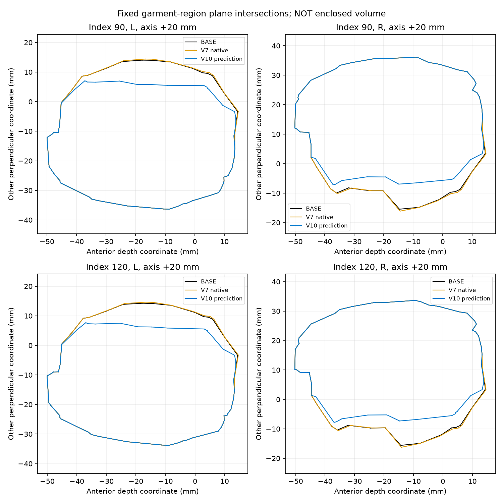
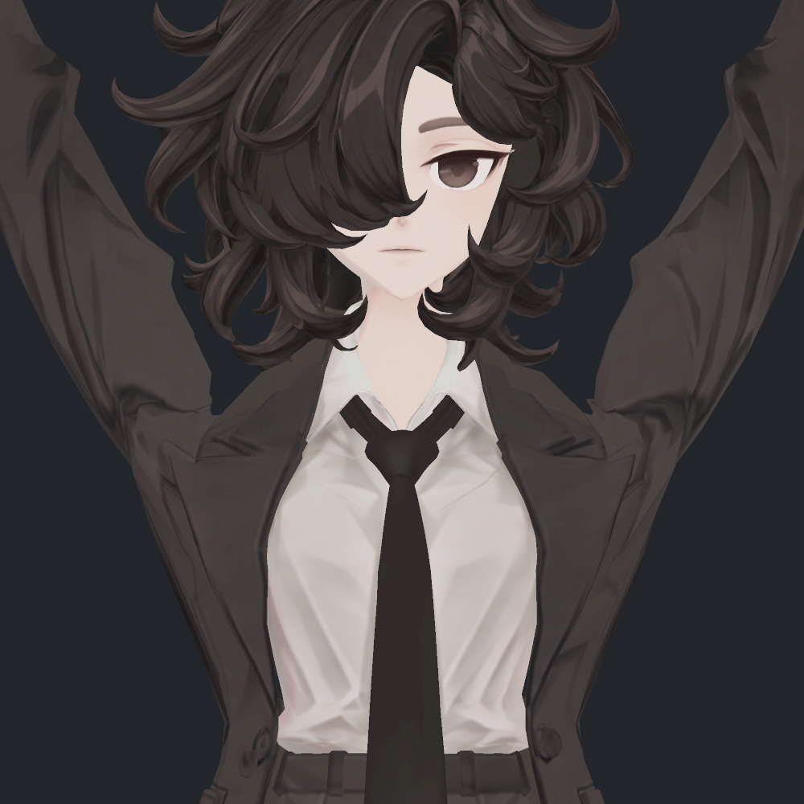
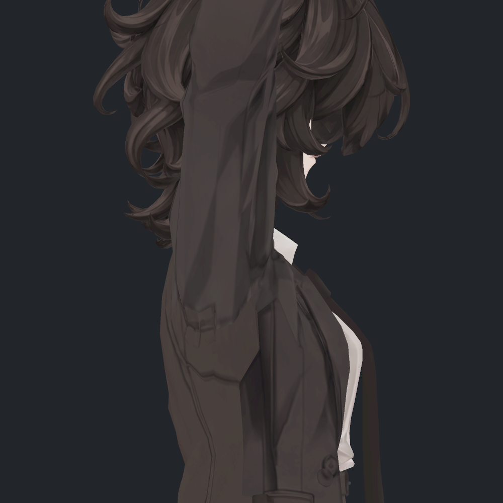

> **기록 시점 안내:** 아래는 해당 단계 당시의 보고서입니다. 후속 결정은 [최신 상태](../../../../STATUS.md)를 기준으로 읽어주세요. 모델·원본 텍스처·검증 원시 데이터는 이 문서 공유본에 포함하지 않습니다.

# v355 어깨 소매 폭·표면적 독립 검토 — V10 및 V11

**V10/V11은 어깨 소매의 안쪽 단면폭을 약14–16% 줄인다. 전신 체적 또는 실제 상완 살집이 그만큼 줄었다는 뜻은 아니다.** 안쪽 천의 한쪽 경계가 팔 쪽으로 이동하면서 원래 불룩한 단면이 평탄해졌다. 정면의 접힌 U 윤곽이 줄어드는 효과와, 소매의 국소 두께·곡률이 줄어드는 변화를 함께 검수해야 한다. 총표면적 +1% 이내만으로 부피보존 합격을 선언할 수 없다.

2026-09-15. 기존 열린 Coat 메시의 동일 삼각형 및 실제 상완축을 사용했다. BASE와 V7은 새 v355 SDK가 저장한 실제 P, V10/V11은 같은 실제 본행렬·기존32키·실제 새키가중치로 계산된 **오프라인 예측 P**다. 신규 V10/V11 prefab 실제 동작 시험과 구분한다. 이번에는 모델/Assets/Unity/Blender를 수정·실행하지 않았다.

## 자세와 측정 정의

- index0 = 팔각90°. index90 = 150.174057°, index120 = 154.9986°. ‘90번’과 ‘90도’를 구분한다.
- 두 실제 BASE/V7 기록의 본 위치가 같은지 대조했다.
- 상완 시작→팔꿈치 축에 수직인 평면을 -10/0/10/20/30/40/60mm에서 자른다. 원래 ipsilateral clavicle/upperarm/support 웨이트 합>.02인 고정된 Coat 영역을 쓴다. variant마다 선택 영역을 바꾸지 않는다.
- 깊이축은 세계앞쪽 z를 상완축 수직평면에 투영한 단위축, 다른 축은 그 외적이다. 여기 ‘폭’은 두 번째 축의 표면 교선 범위다. 전체 옷 너비·체적·피부 두께가 아니다.
- 표면적 비교는 V7과새후보 P 변화범위 합집합에 닿는 고정387삼각형이다. 정점복제로삼각형을중복더한값은아니다.

## 단면 결과

상완 시작에서 +20mm. V10과V11의 이 단면값은 같다.

| 실제 입력 | 쪽 | BASE 폭 mm | V7 폭 mm | V10/V11 폭 mm | BASE 대비 |
|---|---:|---:|---:|---:|---:|
| 150.174° / index90 | L |50.401|50.772|43.434|−13.82%|
| 150.174° / index90 | R |51.582|52.237|43.298|−16.06%|
| 154.999° / index120 | L |48.101|48.452|41.536|−13.65%|
| 154.999° / index120 | R |49.237|49.874|41.437|−15.84%|

index120 오른쪽 같은 단면의 앞뒤 깊이는64.664→64.067mm(−0.92%)다. 옷 전체를 앞으로 부풀린 변화는 아니다. +30mm에서는50.188→48.352mm(약−3.66%), +40mm에서는51.418→51.403mm(약−0.03%), +60mm는변화없음이다. 주된 변화가 어깨에서 가까운 안쪽 면에 집중된다.

90° index0에서는 실제 자동키가0이어서 기존과새후보 폭·면적변화0이다. V10/V11 파일에새SDK중립사진이있다는뜻이아니며, 새키0의예측기하가원형과같다는검사다.

위 그림을 직접 확인했다. 검정 BASE, 주황 실제V7, 파랑V10예측. V11도이평면에서는파랑과같다. 양옆 전체가안으로찌그러진것이아니라 몸중앙/목쪽으로향한 한쪽 옷면이 평평해지면서 단면이 좁아진다. 이곡률차이는 실제이며 지표상실수로발생한폭차가아니다.

## 어느 경계가 바뀌었는가

index120 오른쪽 평면의 e2는 `[.906297,-.422641,0]`이다. 음수방향은 해당 단면에서 몸중앙쪽이다.

| 경계 | BASE | V10/V11 |
|---|---|---|
| 안쪽최솟값 | Coat edge138–140, e2=−15.599mm | edge262–290, e2=−7.798mm |
| 바깥최댓값 | edge878–3664, e2=33.638mm | 같은edge, e2=33.638mm |

단면 극값을 만드는 edge 자체가바뀐다. 그래서15.599→7.798을단일정점변위로해석하면안된다. 각 edge의 보간비율·원래삼각형·world좌표는 V10 경계추적 (공유본 미포함: `V10_CROSS_SECTION_EDGE_ATTRIBUTION.json`) / V11 경계추적 (공유본 미포함: `V11_CROSS_SECTION_EDGE_ATTRIBUTION.json`)에저장했다. 왼쪽도반대바깥경계는유지되고안쪽극값만이동한다.

이는 **옷 안쪽 천의 배치·두께 변화**다. V10/V11은Coat 키만바꾸므로BodyHair의몸자체좌표는변경하지않는다. 같은단면반경100mm 안에서BodyHair의교선을찾았지만 상완피부에해당하는대응면은발견하지못했다. 검출된연결요소는 head/neck/chest가중의 머리–목영역과 head/hair가중의머리카락이다. 이요소들의전역폭을상완살집두께로대신사용하지않았다.

연결요소ID는이번 sourceposition 소수8자리용접으로 새로구한것이다. 과거component10같은번호와혼용하지않는다. 대표2570삼각형요소는head2456.06/neck153.63/chest48.30의웨이트합,12506삼각형요소는head11928.31 및hair본들의웨이트다. 상완피부간격을명확히계측할수없으므로, 피부대비여유/살집보존율 수치는내지않는다.

## 고정 삼각형 면적 분포

index120, BASE의 동일삼각형면적을1로정규화했다.

| 후보 | 전체선택표면적합 | 최소 | 중앙값 | 95백분위 | 최대 | 원래면적 가중으로 .5배미만 | 2배초과 |
|---|---:|---:|---:|---:|---:|---:|---:|
| V7 |약.973|.337|.986|1.191|2.360|.745%|.066%|
| V10 |약1.008|.346|.997|1.886|3.293|1.934%|1.374%|
| V11 |약1.008|.280|1.000|1.886|3.293|2.203%|1.374%|

V11의327점후보는손접촉경계복원으로V10의341점보다작지만, 작은삼각형의최소면적비는더낮아졌다. 전체면적은비슷해도 국소압축/늘어남을분리해봐야한다. 새삼각형이뒤집히지않았다는조건만으로표면품질합격은아니다. 접촉·노멀·탄젠트감사는다른담당결과와합쳐판정한다.

index90에서도V11선택면적합약1.011, 최소.289, 중앙값1.000,95백분위1.867, 최대2.980이다. 가중면적약2.222%가절반미만으로줄고1.580%가두배보다커진다. 이수치는전체천의시각품질점수나전체체적증감이아니다.

## 실제 재질 기하 진단 사진

부모가 만든 `geometry_contact_v11/native_static_v1`의 index120 BASE/V11 정면·오른쪽4장을 직접열었다. **실제Unity카메라로예측P를렌더한정적진단**이며 새후보의실제SDK스키닝촬영이아니다. 임시재계산N이사용돼최종N/T품질검수와도구분한다. V8사진을V10/V11 검증으로사용하지않았다.

정면에서팔안쪽의튀어나온U/턱이줄어들고팔쪽경계가곧게정리된다. 동시에원래그부근천의볼록한여유가줄었다. ‘몸살집을깎은것’으로보이지는않으며, 옷안쪽접힘의형태변경으로읽힌다. 다만기존의곡률을너무평평하게만든것인지최종미관판단은전후사선·뒤·중간각도·연속동작에서확인해야한다.

측면은정면보다차이가작고바깥소매의큰두께는보존되어보인다. 이는앞뒤단면폭이1%미만변한계산과부합한다. 사진4장을본것을모든각도미관합격으로확대하지않는다.

## 최종 판단

V10/V11은과도한전역팽창후보로보이지않는다. 오히려원래얽힌안쪽옷면을팔쪽으로정렬하며국소단면폭을줄인후보다. 따라서‘부피가보존됐다’도‘신체가16%가늘어졌다’도부정확하다. **안쪽천의한쪽곡률·여유가감소했다는실제변화를공개하고, 목적한U접힘완화와함께실제사진으로선택해야한다.** 현자료만으로이변화를숨기거나자동미채택하지않는다.

원자료: V10 측정 (공유본 미포함: `V10_SURFACE_EXTENT.json`), V11 측정 (공유본 미포함: `V11_SURFACE_EXTENT.json`). 재현스크립트 analyze_v10_surface_extent.py / analyze_v11_surface_extent.py, 경계스크립트 trace_v10_section_edges.py / trace_v11_section_edges.py. 선택범위·원래본축·거리단위·예측경계가각JSON에남아있다. 어떤전신부피나닫힌체적값도계산하지않았다.
