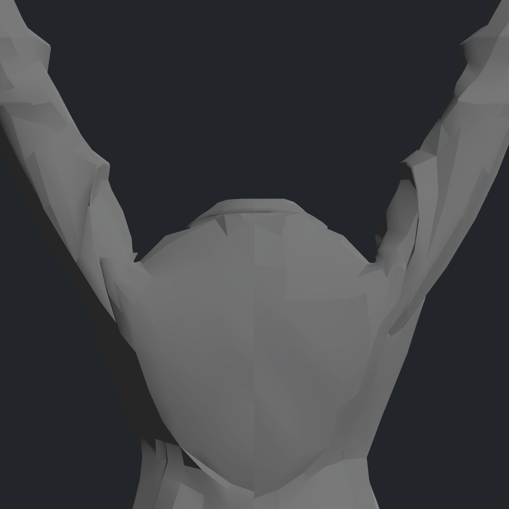
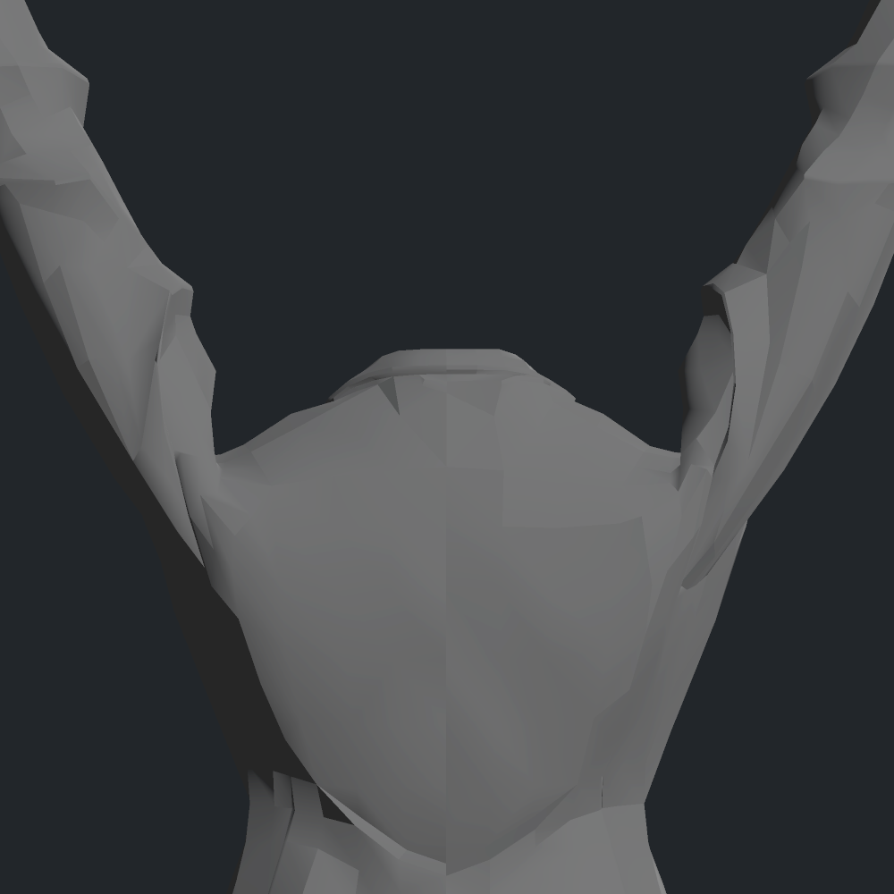

> **기록 시점 안내:** 아래는 해당 단계 당시의 보고서입니다. 후속 결정은 [최신 상태](../../../../STATUS.md)를 기준으로 읽어주세요. 모델·원본 텍스처·검증 원시 데이터는 이 문서 공유본에 포함하지 않습니다.

# v355 어깨 후보 V11 / 폭 분담 V13 독립 검토

**어깨 지지 경로를 개선하는 두 후보를 만들었으며, 둘 모두121표본에서 원형대비 새접촉0을 확인했습니다.** 실제행렬·원래32키의720자세 재구성에서도 큰 면회전/퇴화 관문을 통과했습니다. 최종노멀·탄젠트와 새후보의 실제SDK/재질검수는 부모 작업에서 진행 중이므로 아직 최종완성으로 부르지 않습니다.

## 결과 비교

|항목|원형|현재 모델 V7|solver V11|solver V13|
|---|---:|---:|---:|---:|
|actual120 뒤 함몰(mm)|16.744|9.776|7.310|7.310|
|뒤 연결경로 길이(mm)|49.386|38.856|51.020|51.020|
|앞 함몰(mm)|15.329|10.777|8.790|8.790|
|팔축+20mm 단면 오른폭(mm)|49.237|49.874|41.437|45.123|
|같은단면 왼폭(mm)|48.101|48.452|41.536|44.695|
|원형대비 새접촉(121표본)|—|별도기록|0|0|
|720 최대 위치변위(mm)|—|별도기록|15.444|15.444|
|원래N유지 시 새음수코너 누적(121표본)|—|별도기록|809|1265|

두 후보 모두327개의 기존Unity정점(120공유위치 변수)에 대한 좌우2위치키입니다. 원래32키/기본좌표/UV/본/웨이트/텍스처는 이 작업에서 변경하지 않았습니다. 기존 모델V7 두키에 더하는 것이 아니라 원형32키 위의 새2키로 비교합니다.

V11은 넓은 지지로 생긴 안깃·낮은위팔·손 접촉을 실제분리평면 제약과6개의 대칭 경계위치 복원으로 정리했습니다. V13은 V11의 함몰 경로를 정확히 고정하고 안쪽벽의 팔축직교 이동 일부를 기존 연결면에 분담했습니다. 바깥벽 팽창이나 새메시를 만들지 않았습니다.

## 부피 요청에 대한 판단

고정 단면의 폭 감소는 실제입니다. V11의 오른쪽15.84%/왼쪽13.65% 감소를 전체면적합으로 상쇄하여 합격 처리하지 않습니다. 단면을 직접 확인하면 바깥 경계와 앞뒤두께는 거의 그대로이고 몸쪽 내벽만 팔축 방향으로 옮겨져 좁아졌습니다. 이 원래 모델에는 해당 상완살집 대응면이 없어 신체부피가 줄었다고 단정할 수도 없습니다.

V13은 같은단면 감소를 오른쪽8.36%/왼쪽7.08%로 줄였고 어깨 함몰 경로와 외측 극값을 유지했습니다. 그러나 전체 닫힌옷체적 보존을 계산한 것이 아니며, V13은 최종N처리와 실제미관 비교가 더 필요합니다. V11의 자연스러운실루엣을 보호하기 위해 수치폭100% 복원을 강제하지 않았습니다.

## 실제 사진 검토

아래 V11 사진은 부모가 실제Unity에서 원형재질+임시기하노멀로 촬영한 정적예측입니다. 정면·뒤CLAY·사선을 직접 열어 어깨선 연결 개선이 유지됨을 확인했습니다. 원래 custom N/T를 사용하는 최종렌더가 아닙니다. V13은 이 보고서 작성 시점에 실제사진 미검수입니다.

|원형|V11 정적예측|
|---|---|
|||
|||

U가 완만해지고 소매와 몸판이 이어집니다. 기존 앞쪽 짧은 접힘선·후면의 세로접힘은 남으며 이를 전부새결함으로판정하지 않습니다.

## 검증 경계와 보존

- 독립접촉: V11 결과 (공유본 미포함: `RESULT.json`), V13 결과 (공유본 미포함: `RESULT.json`). 원형key0대비새쌍0입니다. 현재모델V7과비교하면16표본57관찰이 남으므로 두 기준을 혼동하지 않습니다. 원형에 있던 접촉의 선분증가 여부는 별도분석자료를 따릅니다.
-720검사는 실제SDK 기록행렬/키를 사용한 오프라인예측이며 새후보의720 실제SDK 실행이라고 부르지 않습니다. 저장121원형표면과 최대0.000361mm 재현오차.
- V13 최소면적비0.279685, 최소원형법선방향 투영면적비0.24999906, 새90°면회전0. 25%는 자체계산목표로 사용자품질요구와 구분합니다.
- 기존customN를 그대로둔 상태는 아직 부적합합니다. 기하노멀진단사진으로 N/T합격을 대신하지 않습니다. N317에 대해서는 단위길이 endpoint 고정과 실제방향불가능을 구분했습니다. Unity API는노멀delta를입력으로받고 실제lilToon일반forward는fragment에서정규화하지만, normalmap/TBN/중간키반응을포함한실제검수가필요합니다. [Unity AddBlendShapeFrame 문서](https://docs.unity.cn/ja/2022.3/ScriptReference/Mesh.AddBlendShapeFrame.html).
- 셰이더 로컬근거: `unity_vrchat_avatar/Packages/jp.lilxyzw.liltoon/Shader/Includes/lil_pass_forward_normal.hlsl:302`의 `normalize(input.normalWS)`. vertex정규화는조건부이므로모든패스동일로확대하지않습니다.

입력 원형·실패V1–V10·V12·V11·V13·모든 계산코드와 실제사진을 보존합니다. 후보JSON과검증해시는 `CLAVICLE_FINAL_CANDIDATES_MANIFEST.json`을 따릅니다.

기존 접촉 증가에 대한 후속 확인: V13은 새쌍0이지만 frame318의426↔3379 교차선이0.344→0.693mm(+0.349mm), frame402의 같은쌍+0.318mm, frame318의3376↔3379 +0.285mm가 남습니다. 따라서 **기존교차까지 모두무회귀**라고 하지 않습니다. 이값도 관통깊이가 아닌 교차선길이이며 실제국소시각검수와부모판정대상입니다.
