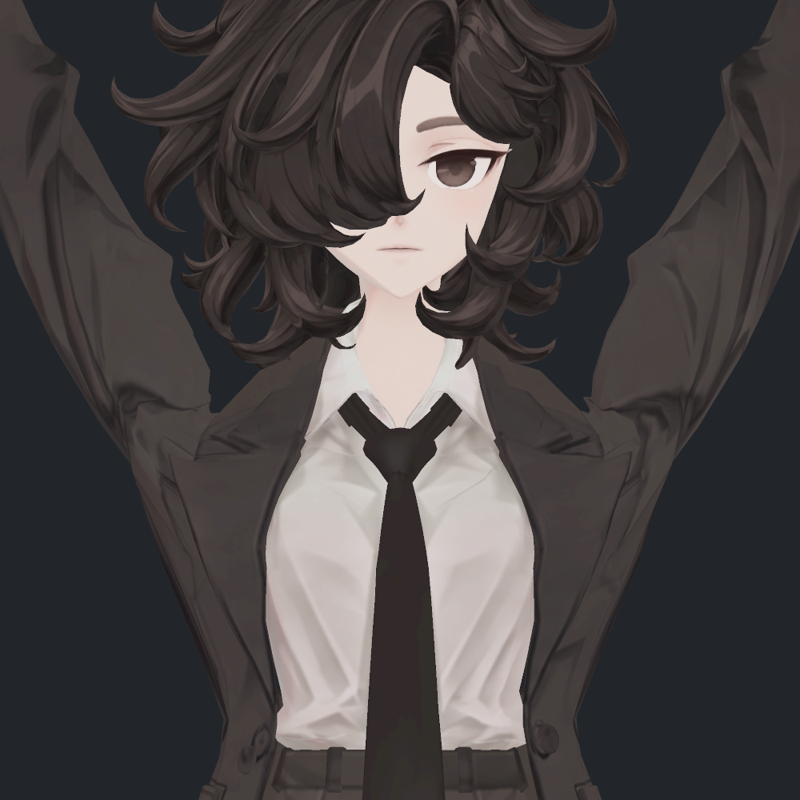
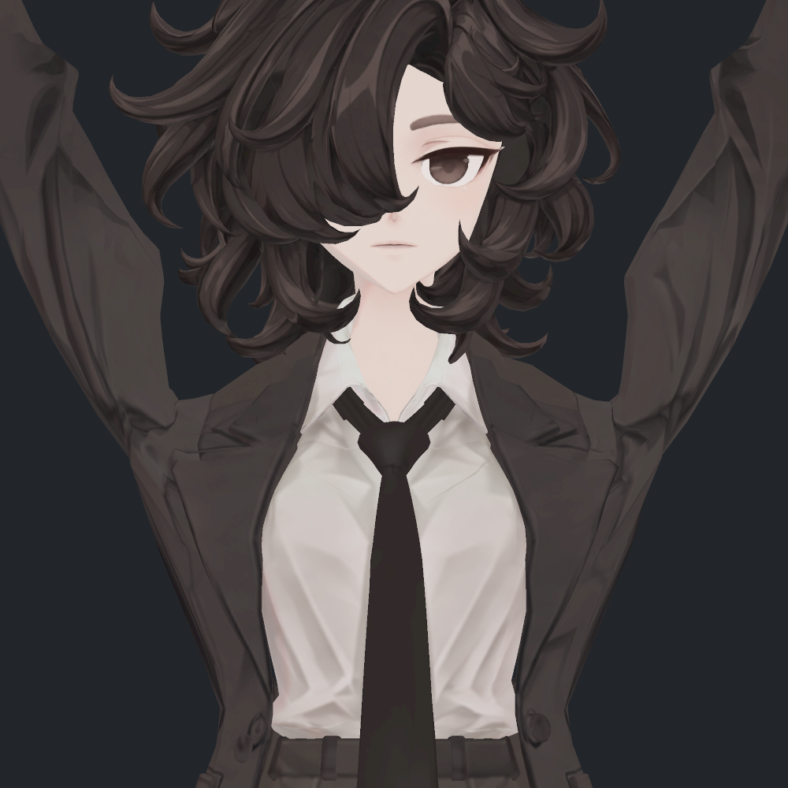
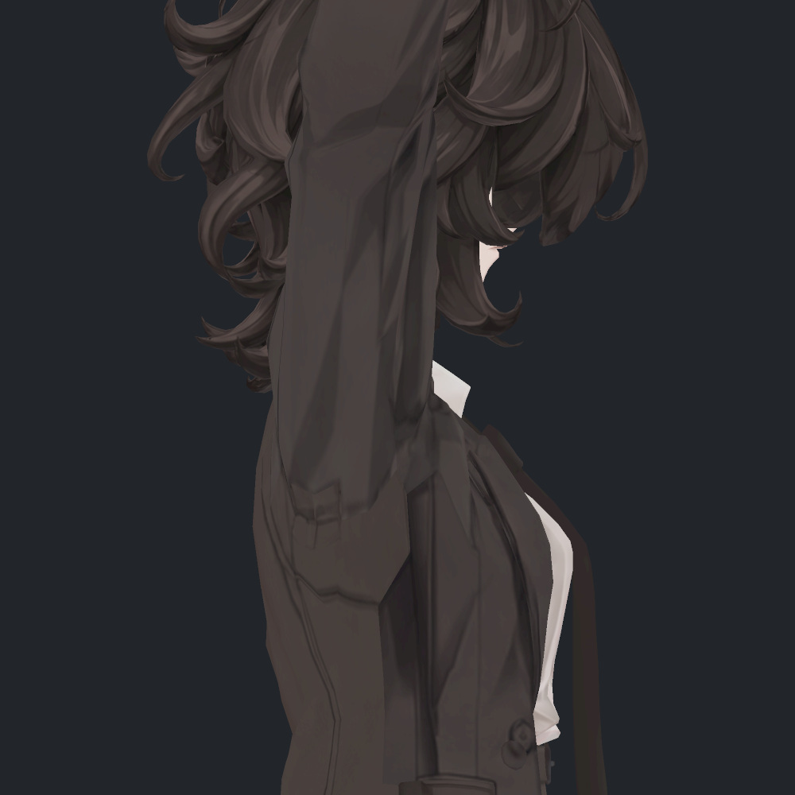
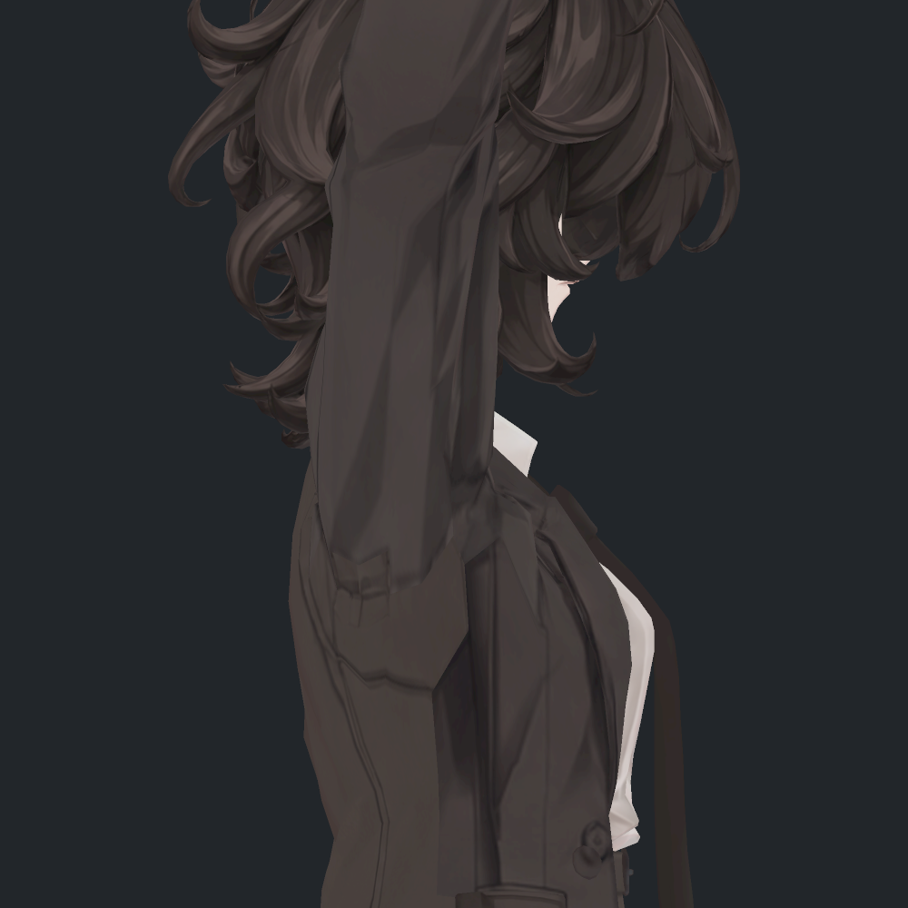

> **기록 시점 안내:** 아래는 해당 단계 당시의 보고서입니다. 후속 결정은 [최신 상태](../../STATUS.md)를 기준으로 읽어주세요. 모델·원본 텍스처·검증 원시 데이터는 이 문서 공유본에 포함하지 않습니다.

# v355 어깨 해결 시도 기록

실험 당시 기록과 최종 판정을 함께 남긴다. 아래 V5/V10의 진행 중 표기는 당시 상태이며 최종 결과는 마지막 절을 따른다. 수치 개선·실제 사진 확인·Unity 자동구동 완료·최종 채택을 구분한다. 현재 기준은 v354 P1(원래 v352 외형+넥타이PAD1)이며 이전 v353 표면 재작업을 다시 사용하지 않는다.

| 시도 | 결과 | 판정/이유 |
|---|---|---|
| 기존 V7 어깨 후보 새 SDK 720×2 | 뒤 함몰16.744→9.776mm, 뒤 경로49.386→38.856mm. 새 손 접촉13표본 | 함몰 잔여·압축 심화로 이번 해결본 미채택 |
| V7 위치만1.1/1.2/1.3배 | 추가 접촉4/7/8표본, 1.3배 새 큰 면 회전2표본. 뒤 처짐은 소폭 더 감소 | 주변 경계 압축이 커져 단순 증폭 미채택 |
| 좁은 영역 가상 지지점5/10/15mm 상향 | 처짐과 뒤 길이 개선 방향이 있지만 경계 큰 면 회전 | 좁은 경계에 이동을 집중하는 방식 미채택 |
| 넓은 연결영역 ARAP + 가상피벗 | 뒤 길이는 보존되지만 U가 남고 앞 처짐 악화 | 목표 형상이 잘못되면 ARAP만으로 해결되지 않음 |
| V7 목표1.25/1.5 + 넓은 ARAP/길이 혼합 | 낮은 강도는효과 감쇠, 강한 목표는 면 회전 또는 경계 압축 | 최종 미채택 |
| 쇄골 지지25/50/75/100% 효과 목표 | 50%에서 뒤 처짐3.862mm/길이47.672mm로 방향은 유효, 57표본 면 회전 | 영구 웨이트는 바꾸지 않은 오프라인 목표. 작은 접힌 면 제약 필요 |
| 불량 면들을 공통 이동으로 계속 묶기 | 면 회전57→1표본, 최대80위치가 묶여 뒤 처짐17.092mm | 큰 덩어리 이동으로 원래 U를 유지하므로 미채택 |
| V5 쇄골50% 목표 + 면적/면 방향 제약 | 뒤6.208mm/48.475mm, 앞7.440mm/52.244mm. 121표본 통과·부모 실제 정적예측 사진상 개선 | 720행렬 검사에서321/322/323/397의tri3370 발견. 보완 중 |

V5 사진은 실제 Unity에서 그린 **저장 스킨 기반 예측 기하**이며 새 SDK로 구동한 최종 후보가 아니다. 공정한 형태 비교를 위해 세 후보 모두 코트만 표시하고 진단용 기하 노멀을 다시 계산했다. 원래 재질/노멀의 최종 품질로 해석하지 않는다.

- 기존 후보 독립 검수 (공유본 미포함: `v355_ACTUAL_ACTIVE_INDEPENDENT_REVIEW.md`)
- 단순 증폭의 제약 위치 (공유본 미포함: `v355_SCALE_FEASIBILITY_REVIEW.md`)
- [참고 모델 실제 비교](reviews/reference/v355_REFERENCE_SHOULDER_REVIEW.md)
- 새 수치 원자료: reviews/shoulder_strategy 및 reviews/weight_role_trials.

## 연속 구간 및 접촉 재검사

- solver V7은 이전 모델의 내부 V7 키와 다른 이번 계산 후보다. 720 실제 본 행렬/실제 SDK 키값으로 재구성한 결과 새 90° 초과 면 회전은 0이었다. 최소 면적비 0.250751, 투영면적비 0.190676이며 자체 보수적인 25% 투영면적 목표 미달 15개는 남았다. 25%는 사용자 요구나 Unity 표준이 아니다.
- 하지만 121 저장 표본의 새 범위 접촉 검사는 **72표본/4,326쌍 관찰**로 실패했다. 팔을 편 자세에서는 셔츠·장식 접촉이, 깊은 팔꿈치 굽힘에서는 어깨와 소매 사이 자기 교차가 늘었다. 최대 교차 선분 7.423mm는 관통 깊이를 뜻하지 않는다. 수치상 처짐 개선을 완료로 판정하지 않는다.
- 새 접촉이 남은 상태에서 N/T 및 전달 파일을 만들지 않고 접촉 원인을 반영한 후속 목표를 수정한다. 원래 기준 모델에 적용한 변경은 없다.

### solver V7의 실제 Unity 정적 비교 사진

아래 사진은 저장된 실제 자세 위에 계산 후보 위치를 적용해 Unity에서 렌더한 진단이다. 코트 노멀은 세 경우 모두 임시로 재계산했으므로 새 후보의 최종 N/T·SDK 구동 증명이 아니다. 원래 재질을 사용했고 모델·재질 파일을 변경하지 않았다. 부모가 3후보×3방향 총9장을 모두 직접 확인했다.

| 기준 | 기존 후보 | 새 계산 후보 — 접촉 실패, 미채택 |
|---|---|---|
|  |  |  |
|  |  |  |

정면의 깊은 U형 꺼짐은 완화되고 측면 소매 외곽은 대체로 유지된다. 하지만 짧은 접힘이 남으며, 이 구도의 겉면 사진에서 잘 보이지 않는 셔츠/복합자세 교차가 검사에서 확인돼 해결본으로 쓰지 않는다.

## V8~V10: 옷 부위별 지지 역할과 접촉 경계 분리

V8은 안깃과 아래 위팔을 원형에 고정해 새 지지의 범위를 1,013→513점으로 줄였다. 121표본에서 새 셔츠·장식 교차는0이지만, 작은 코트 자기교차와 손접촉을 합쳐28표본/182쌍 관찰이 남아 미채택했다. 이 수치는 기준 모델 대비이며 이전 V7 후보 대비226쌍과 혼동하지 않는다. 이전 V7에서만 움직이던 퇴역2점·3삼각형도 추가확인했다.

원인은 팔꿈치 자체를 바꾼 것이 아니라, 어깨 지지 효과가 전완·손이 지나가는 앞쪽 위팔까지 전달된 데 있다. V9/V10에서는 그 영역을 추가로 보호하고 원래 떨어져 있던 두 면의 분리축을 제약으로 사용한다. V10은341점이며 뒤 경로 함몰7.31mm/연결길이51.02mm 수준을 유지한다. 현재 정확한 접촉 재검사 중이고 N/T 및 새 실제 SDK 구동은 아직 완료하지 않았다.

부모는 V8의 새 후보 전체5방향(원래재질3/클레이2), 기준클레이앞뒤2, 기존후보클레이뒤1의8장을 직접 확인했다. 나머지7장을 부모 전체검수로 세지 않는다. 앞 U가 완화되고 뒤 연결길이가 늘어나는 방향은 유지하지만, 오른쪽 뒤의 큰 세로 접힘은 원형에도 있던 형태로 남았다. 이 사진은 최종 노멀이 아닌 임시 기하노멀 진단이다.

- V8 접촉 독립 검토 (공유본 미포함: `v355_BARRIER_V8_CONTACT_REVIEW.md`)
- 실제 Unity 빌더 보존 관문 독립 검토 (공유본 미포함: `v355_SUPPORT_BUILDER_AUDIT.md`)

## V11 최종 검수와 V13 비교

V10은12표본22개 새 손 교차가 남아 미채택했다. V11은 해당6개 공유 위치를 좌우로 원형에 되돌려 새 교차를 제거했다. 위치327점·N/T519점의 새2키를 제작했고 실제 SDK720×2/121표면의 새 교차·면 뒤집힘·음수 노멀 코너0을 확인했다. 기존32키/모든 기본 배열 보존, 마지막 새키0 복귀를 검증했다.

| 후속 시도 | 판정 |
|---|---|
| V11 기존 노멀 그대로 |809개 새 음수 코너가 남아 제외. 새 형상에 맞는 N/T 계산 필요.|
| N/T 단위 노멀 종점 강제 |팬317의 모든 시간 방향 제약을 동시에 만족할 수 없음을 별도 반공간 검사로 확인. 초기화만 반복하는 방법 제외.|
| V11 전용 N/T v3 |두 팬은 비단위 종점 사용. 실제 SDK 방향 반전0, 원래 plain lilToon SkinnedRenderer 근접5시점 확인. 현재 재질 한정 검수본.|
| V12 폭 분담 |새 자기교차17관찰/8표본으로 제외.|
| V13 폭 분담 |고정 단면 폭 개선·오프라인 새 접촉0. 그러나 V11 N/T 재사용 시271표본2615개 새 음수 코너. 별도 실제 음영 미검증이므로 전달본에 합치지 않음.|
| Unity 기본 AddBlendShapeFrame만 사용 |매우 작은 P항이 저장 중 생략되어 입력과 불일치. 원래32키의 직렬화 접두부를 그대로 보존하고 새 희소 P/N/T를 정확히 넣은 후 재로드 검증으로 해결.|
| 패키지 초안의 Reference 문자열 차단 |자체 Humanoid 자산 Bianca_TPoseReference.asset까지 차단해 export 전 중단. 실제 경로/자산유형 검사로 수정하고 자체 자산만 내보냄.|

최종 선택은 SUPPORT_V1=solverV11+N/Tv3이며 완전한 소매 부피 보존·모든 접촉 해결을 뜻하지 않는다. [전후 사진·검증 범위·전달 파일](v355_WORK_REVIEW.md)을 따른다.
