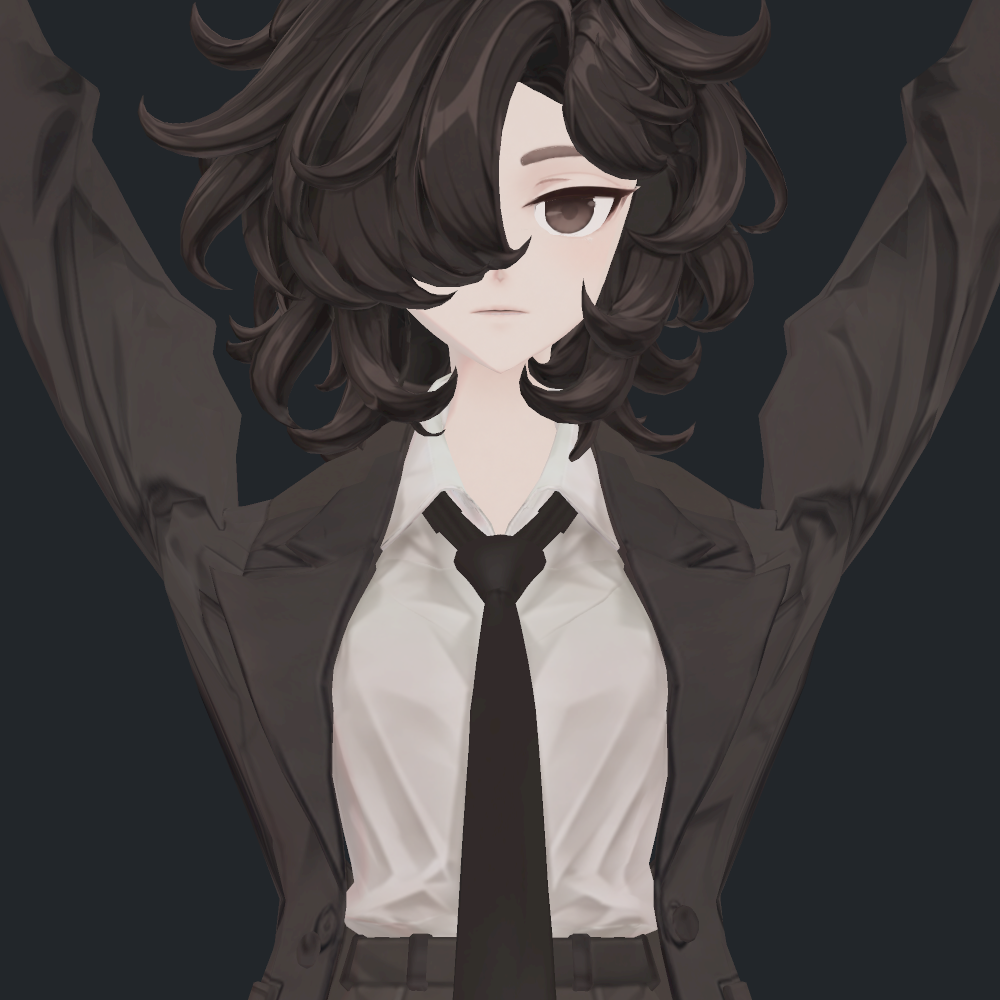
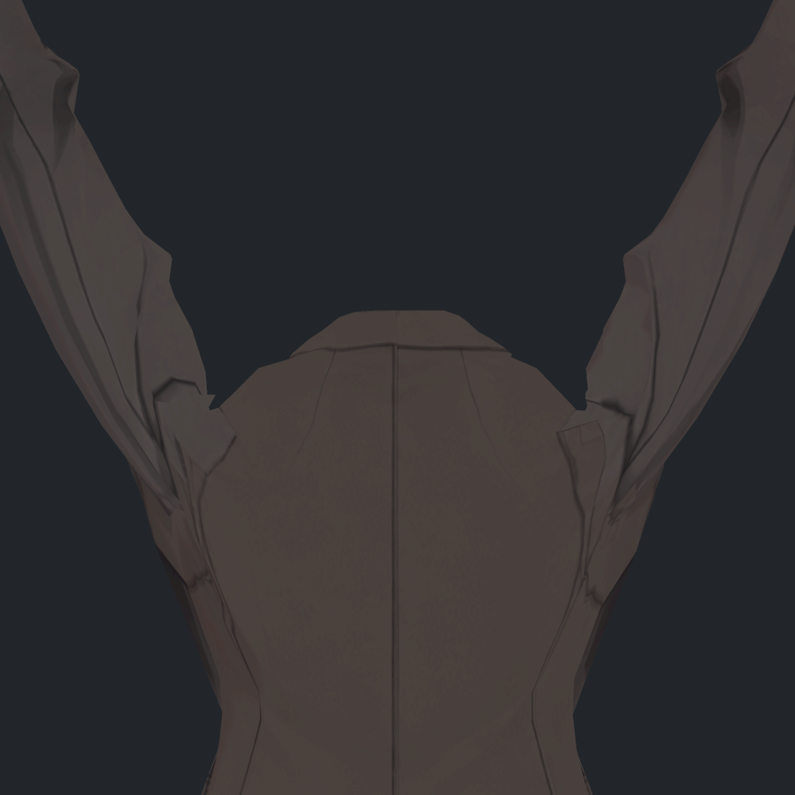
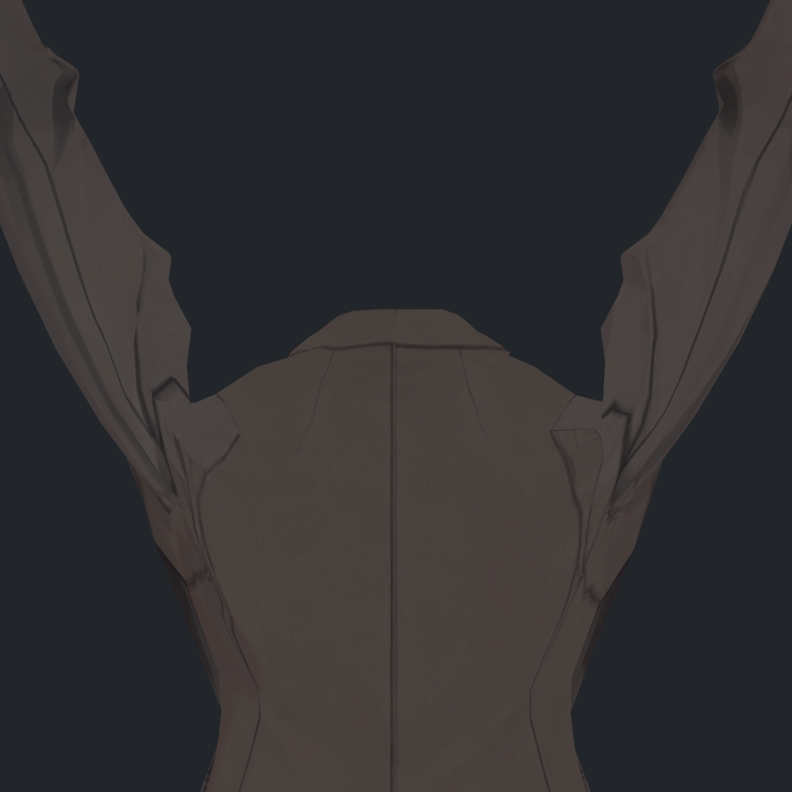
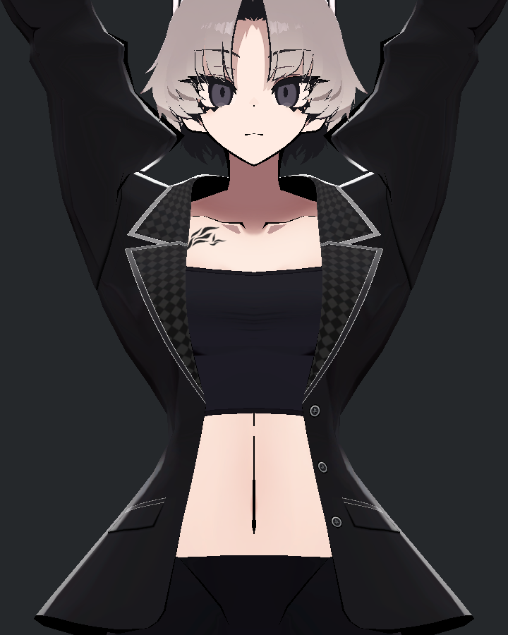
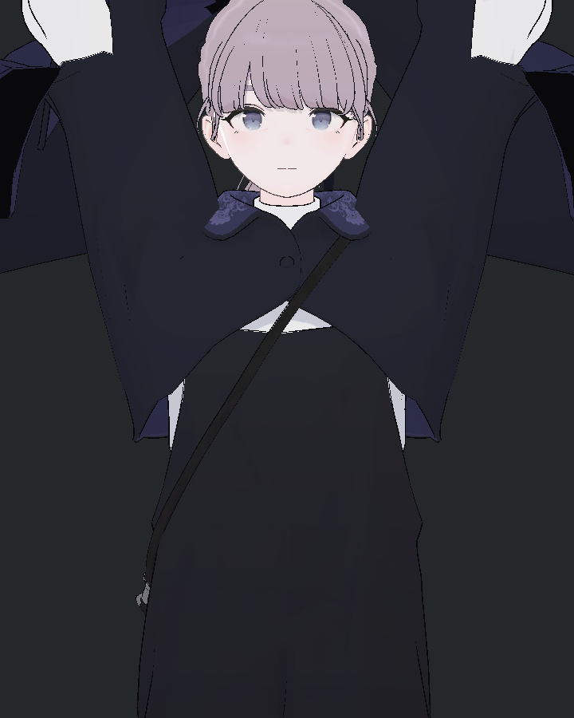
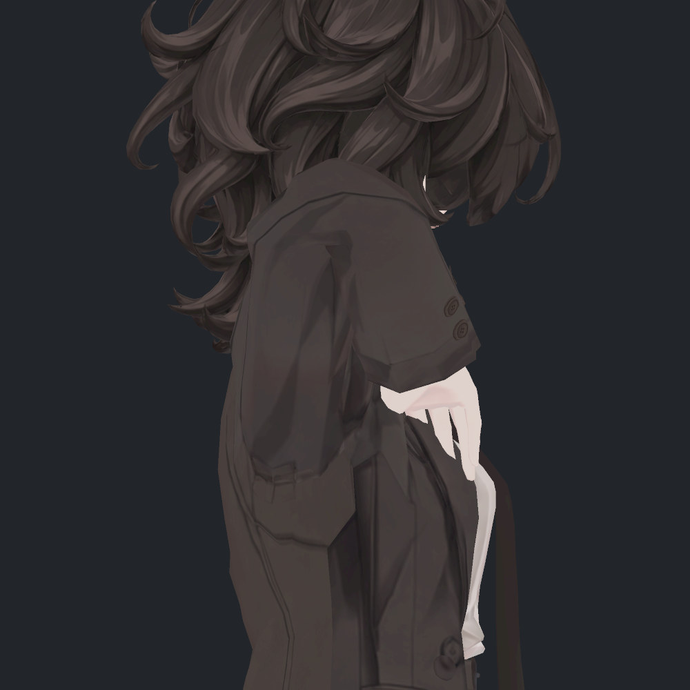

> **기록 시점 안내:** 아래는 해당 단계 당시의 보고서입니다. 후속 결정은 [최신 상태](../../STATUS.md)를 기준으로 읽어주세요. 모델·원본 텍스처·검증 원시 데이터는 이 문서 공유본에 포함하지 않습니다.

# v355 어깨 함몰 수정 — 전후·참고 모델·실제 Unity 검수

어깨의 꺼짐은 텍스처 그림자만의 문제가 아니었다. 팔이 올라갈 때 쇄골 근처의 천과 상완에 묶인 천이 서로 다른 회전 중심을 따라 움직이면서, 안쪽 연결면이 깊게 접히고 일부 구간은 압축되는 것이 확인됐다. 기존 어깨 보정도 실제 동작에서 이 연결 길이를 더 줄이고 있어 해결본으로 채택하지 않았다.

참고 모델의 쇄골·가슴 지지 분담을 바탕으로 **기존 코트에 좌우 어깨 보정키를 만들고 실제 Unity SDK에서 자동 구동을 확인했다.** 깊은 어깨 패임은 완화했으며 기존 텍스처·UV·재질·32개 관절키·129본은 보존했다. 검수 전달본은 `SUPPORT_V1`(위치 solver V11 + 전용 N/T v3)이다. 원형 P1은 그대로 남겨 두었다.

**남는 절충점:** 높이 든 팔의 안쪽 소매 단면 폭 감소, 원래 짙은 주름, 기존 작은 자기 교차가 남는다. 이를 모든 어깨 문제가 완전히 사라진 최종 승인본으로 표시하지 않는다. PC VRChat 클라이언트 테스트는 아직 하지 않았다.

## 바로 보는 전후

실제 SDK에서 기록한 약155° 팔 올림을 원래 SkinnedMeshRenderer와 재질로 다시 그렸다. 임시 기하 노멀을 사용한 이전 진단 사진과 구분한다. 아래 네 사진 모두 직접 확인했다.

| 수정 전 · P1 | 이번 수정 · SUPPORT_V1 |
|---|---|
|  |  |
|  |  |

어깨 위쪽의 깊은 U자 패임이 얕아지고 몸판–소매 연결이 더 완만해졌다. 팔 안쪽의 원래 긴 주름과 고정 명암은 그대로 보인다. 뒤 사진은 머리에 가린 코트 연결부를 확인하기 위해 코트만 표시했다.

**[새 수정 실제 동작 전후 영상](reviews/support_v1/media/v355_SHOULDER_SUPPORT_ACTIVE_BASE_TOP_CANDIDATE_BOTTOM_20fps.mp4)** — 위가 수정 전, 아래가 수정 후. 각 줄은 정면·오른쪽·사선 순서다. 각720프레임 실행에서3프레임마다 촬영한240장을20fps로 묶은12초 영상이며 보간·생성 프레임은 없다. 독립 검수자의 직접 사진 확인과 영상 인코딩/디코딩 검증을 구분한다.

## 기준과 범위

- 기준: v354 P1, 원래 v352 외형과 검수한 넥타이 PAD1. 폐기한 v353 표면은 사용하지 않는다.
- 대상: 팔을 올릴 때의 양쪽 어깨. 무릎·손가락·표정·자켓 물리의 다른 작업은 자동 재개하지 않는다.
- 최종 실행 기준: Unity 게임/PC VRChat. Editor의 실제 SDK 구동과 PC 클라이언트 검증은 구분한다.
- 기존 메시의 보정 키를 추가하는 방식이다. 새 몸이나 소매를 생성·대체하지 않는다.

## 다른 모델에서 확인한 차이

| 모델 | 실제 확인한 구조 | 이번에 참고한 점 |
|---|---|---|
| SiuSiu Kisekae 블레이저 | 어깨에 쇄골·가슴 지지가 넓게 분담된다. 이번 착장에는 어깨 전용 보정 키나 팔 비틀림 제약 구동이 없었다. | 어깨 안쪽 천이 상완 회전만 따라 접히지 않도록 지지 역할을 나눈다. |
| Lapwing 볼레로 | 상완/가슴에 의상 전용 본이 있고 일부 의상 회전은 작은 비율로 분담한다. | 몸의 회전과 옷이 유지할 형태의 역할을 구분한다. 열린 볼레로 형상을 비앙카 재킷에 그대로 적용하지 않는다. |
| 비앙카 기준 | 현재 코트는 기존 shoulder_support 본에 실질적인 웨이트가 없다. 쇄골/상완 분담과 좁은 접힘 구조의 영향을 받는다. | 이름만 있는 보조 본을 돌리는 수정으로 해결됐다고 판단하지 않고 실제 변형되는 면을 다룬다. |

두 참고 모델은 실제 SDK에서 5자세를 각각30프레임 유지해 정면·측면·후면 총30사진을 확인했다. 팔 방향을 맞췄지만 쇄골의 기준 각도, 비틀림, 옷의 비례까지 같은 것은 아니다. SiuSiu에도 뾰족한 접힘이 있고 Lapwing에도 깊은 굽힘의 안감 노출이 있었다. 이를 비앙카의 새 관통을 허용하는 근거로 삼지는 않는다.

| SiuSiu · 동일 팔 방향 | Lapwing · 동일 팔 방향 |
|---|---|
|  |  |

[사진과 구조의 전체 비교](reviews/reference/v355_REFERENCE_SHOULDER_REVIEW.md). Humanoid의 T 포즈 설정은 리타기팅 기준이며 이것만 바꾸는 것을 옷의 웨이트·연결면 문제 해결로 대신하지 않는다. [Unity Humanoid 설정](https://docs.unity3d.com/2022.3/Documentation/Manual/MuscleDefinitions.html), [VRChat 리그 요구사항](https://creators.vrchat.com/avatars/rig-requirements/).

## 기존 후보를 다시 검사한 결과

이번에 기준/기존 후보 각각720프레임을 새로 실제 SDK에서 실행했다. 중단된 v354 기록을 재사용해 완료라고 계산하지 않았다. 일반 팔 올림, 비스듬한 팔 올림, 깊은 팔꿈치 굽힘을 겹친 팔 올림, 중립 복귀를 포함했다. Photos의 숫자120은 프레임 인덱스이며 팔 각도120°를 뜻하지 않는다. 그 프레임은 약155° 팔 올림이다.

| 오른쪽 연결 경로, 실제 프레임120 | 기준 | 기존 어깨 후보 |
|---|---:|---:|
| 뒤쪽 함몰 지표 | 16.744mm | 9.776mm |
| 뒤쪽 천 경로 길이 | 49.386mm | 38.856mm |
| 앞쪽 함몰 지표 | 15.329mm | 10.777mm |

꺼짐의 수치가 줄어도 천이 더 짧게 압축되어 있었고, 기준보다 늘어난 손 접촉도13표본에서 확인됐다. 단순히 기존 보정을1.1–1.3배 키우면 면 압축과 접촉 회귀가 더 커져 제외했다. 함몰 지표는 XY 투영 경로의 양 끝점을 잇는 선과의 최대 세로거리이며 신체 전체 부피나 미관 점수가 아니다.

[기존 후보 실제 동작 전후 영상](reviews/current_candidate/media/v355_PREVIOUS_SHOULDER_ACTIVE_BASE_TOP_CANDIDATE_BOTTOM_20fps.mp4). 위가 기준, 아래가 기존 후보이며 새 수정 완료 영상이 아니다.

## 새 지지 후보에서 해결한 과정

쇄골이 지지하는 효과를 목표로 삼되 원래 웨이트를 영구적으로 재분배하지 않고, 필요한 팔 올림 구간에만 작동하는 위치 보정으로 만들었다. 상완 전체나 옷깃을 함께 움직이지 않도록 역할과 경계를 나눴다.

1. 넓게 천을 펴는 첫 목표에서는 작은 면이 뒤집히고 셔츠·접힌 전완과 새로 겹쳤다.
2. 면 방향과 면적을 제약한 뒤, 안깃/아래 위팔/손이 지나가는 앞쪽 표면을 각각 원형에 유지했다.
3. 겹치는 두 면의 원래 분리 방향을 제약에 넣어, 어깨를 펴면서 다른 표면을 뚫지 않게 조정했다.
4. solver V11은327 Unity 정점에 위치 보정이 있다. 먼저 실제 저장 본 행렬720개를 통한 재구성 검사로 접촉 제약을 정리했고, 이후 새 후보 자체의 실제720프레임 실행과121개 저장 표면을 독립 검사했다. 기준 대비 새 교차·새 면 뒤집힘·새 노멀 방향 반전이 없었다. 검사 범위는 아래에 명시한다.

기존부터 있던 교차 전체가 사라졌다는 뜻은 아니다. 원형의 작은 뒤 소매 접촉선 길이 변화와 이전 미채택 후보에서 제거됐던 접촉의 복귀는 별도로 기록한다. 교차선 길이는 관통 깊이가 아니다.

수정으로 안쪽 천이 정렬되면서 한 고정 단면의 소매 폭이 줄어드는 것도 확인했다. 바깥 경계·앞뒤 두께가 거의 같은 상태에서 안쪽 천이 이동한 결과다. 신체 자체의 두께 감소로 표현하지 않으며, 전체 옷 부피가 보존됐다는 판정도 하지 않는다. 단면과 실제 외형 검수를 함께 진행한다.

## 부피와 접촉의 절충점

| 같은 약155° 자세의 기하 비교 | 원형 P1 | 이번 solver V11 |
|---|---:|---:|
| 오른쪽 뒤 함몰 지표 |16.744mm|7.310mm|
| 오른쪽 앞 함몰 지표 |15.329mm|8.790mm|
| 뒤 연결 경로 길이 |49.386mm|51.020mm|
| 상완 뿌리에서20mm 단면 오른쪽 폭 |49.237mm|41.437mm|
| 같은 단면 왼쪽 폭 |48.101mm|41.536mm|

함몰과 연결 경로는 새 실제 SDK 프레임120 표면에서 직접 측정했다. 단면 폭은 같은 자세의 기하 재구성 측정이며 새 실제 SDK 표면과 재구성의 최대 오차는0.000361mm였다. 함몰 지표는 XY 투영 경로의 양 끝점을 잇는 선과의 최대 세로거리다. 팔이나 코트의 전체 부피·미관 점수가 아니다.

고정 단면 폭은 오른쪽15.84%/왼쪽13.65% 줄었다. 바깥 경계는 유지되고 앞뒤 깊이는 약0.92%만 변했으며 안쪽 천이 이동한 결과다. 상완에서40mm 내려간 단면은 거의 같았다. 몸의 살집 자체가 줄었다고 판정하거나 면적 합이 비슷하다는 이유로 전체 부피 보존이라고 하지 않았다.

폭을 더 남기는 V13도 이번에 시도했다. 폭 감소는8.36%/7.08%로 줄고 오프라인 새 접촉0이지만 V11의 N/T를 그대로 쓰면271개 시간 표본에서 새 음수 노멀 코너가 생겼다. 추가 음영 회귀가 없는 실제 검수본 V11을 전달하며 V13은 계산 비교로만 남겼다. [단면 독립 검토](reviews/reference/v355_SHOULDER_VOLUME_REVIEW.md), [V11/V13 비교와 미채택 이유](reviews/shoulder_strategy/v355_SHOULDER_V11_V13_REVIEW.md).

새 교차0은 기존 교차 전부 해결과 다르다. 뒤 소매의 원래 교차선 길이는 최대0.386→0.700mm(+0.314mm) 늘어난 작은 구간이 남았다. 이 수치는 관통 깊이가 아니다. 깊은 굽힘의 손 접촉도 원래 스트레스 입력 범위가 남는다.

| 복합 굽힘 · 수정 전 | 복합 굽힘 · 수정 후 |
|---|---|
|  |  |

## 실제 Unity 검증

- **새 후보와 기준 각각720프레임:** 일반 팔 올림90–155°, 사선 올림, 깊은 팔꿈치 굽힘을 겹친 팔 올림, 중립 복귀. Contacts/Animator가 새 키를 구동하며 수동 키값 주입은 하지 않았다.
- **저장 표면121쌍 독립 검사:** 새 교차·퇴화·90° 초과 면 방향 변화·새 음수 노멀 코너0. 위치 변화327점에 직접 닿는353삼각형, N/T519점에 닿는546삼각형 및 상대 Coat/BodyHair를 검사했다. 매프레임 전체 아바타 교차 검사는 아니다.
- **보존:** 기본 위치/노멀/탄젠트/UV/삼각형/웨이트/바인드포즈/기존32키 정확 일치. BodyHair 위치 변화0. 마지막 프레임의 새 키·변위0. 별도 실행 본 위치의 미세 부동소수 오차는0.000148mm로 기록했다.
- **새 보정:** 좌우2키, 기존1736개 Blender 편집 정점 중 좌70/우67에 위치 변화. Unity는 UV/노멀 분리 정점 기준327 P/519 PNT다. 기존129본 유지, 측정 Contacts6개·VRC 위치 제약2개·Animator2레이어 추가. 아바타에 사용자 런타임 스크립트를 추가하지 않았다.
- **실제 원시 노멀·근접 조명 검수:** 저장된7자세를5시점/조명으로 재현한70사진. 원래 SkinnedMeshRenderer를 사용했고 재현 위치 최대 오차는0.001mm 미만이다. 새 큰 검은 면이나 흰 빛 폭발은 직접 확인한 사진에서 보이지 않았다.
- **남은 노멀 제약:** 두 국소 팬은 중간 자세의 방향 반전을 막기 위해 비단위 길이의 노멀 델타를 사용한다. 현재 코트의 plain lilToon은 해당 조명 경로에서 노멀을 정규화하며 outline 패스와 bump/반사/MatCap을 사용하지 않는다. 외곽선·노멀맵·다른 셰이더를 켜면 별도 검수가 필요하다. 저장기의 정규화된 NORMAL 배열을 엔진 원시 노멀이 단위 길이라는 증거로 쓰지 않았다.

[실제 SDK 독립 검수](reviews/integration/actual_support_v1/v355_ACTUAL_SUPPORT_INDEPENDENT_REVIEW.md) · [실제 사진·구동 독립 검토](reviews/reference/v355_NATIVE_SUPPORT_REVIEW.md) · [원시 노멀과 실제 셰이더 검토](reviews/reference/v355_NATIVE_RAW_NORMAL_REVIEW.md).

물리는 이번 관절 검사에서 비활성화했다. P1의 넥타이 PAD1 구성은 보존했지만 어깨 수정과 모든 물리의 결합·PC VRChat 클라이언트·미러/스테레오·전체 조명 환경을 이번 결과로 완료 처리하지 않는다.

## 전달 파일과 사용 경계

- Unity 검수본: `Assets/BiancaV355ShoulderSupportV1/Bianca_v355_SHOULDER_SUPPORT_V1.prefab`.
- Unity 패키지 (공유본 미포함: `Bianca_v355_ShoulderSupportReview.unitypackage`): 실제 검사한 프리팹과 자체 의존 자산. SDK/lilToon은 기존 설치를 사용하며 구매 참고 모델은 포함하지 않는다.
- Blender 편집 사본 (공유본 미포함: `bianca_v355_SHOULDER_SUPPORT_REVIEW.blend`): Computer Use로 저장 후 실제 다시 열어 원형·새 위치키를 검증했다. 새 키는0으로 저장했고 수동 편집용이다. **자동 구동 및 새 키 N/T의 최종 기준은 Unity 메시/프리팹**이며 Blender 사본만으로 같은 런타임을 재현하지 않는다.
- 원형 P1·원래 v352 Blender 파일과 사용자의 다른 R&D·Unity 장면을 보존했다. v353 표면 재작업은 계속 폐기 상태다.

이번 판정은 **어깨 함몰 완화 구현·Unity Editor 검수 전달 완료, 사용자 외형 확인 전**이다. 원형 P1을 자동 덮어쓰지 않는다. 남은 국소 폭/주름/접촉과 다른 셰이더 호환 한계를 포함해 검토할 수 있도록 원본 전후와 실패 사례를 함께 남긴다.

[전체 시도·미채택 이유](v355_ATTEMPTS.md) · [작업 계획](v355_WORK_PLAN.md) · 검증 파일 목록 (공유본 미포함: `DELIVERY.json`)

[최종 전달물 독립 감사](reviews/integration/actual_support_v1/v355_DELIVERY_AUDIT.md): 전달 SHA13개·패키지28자산과28메타·문서 상대 링크 확인.
