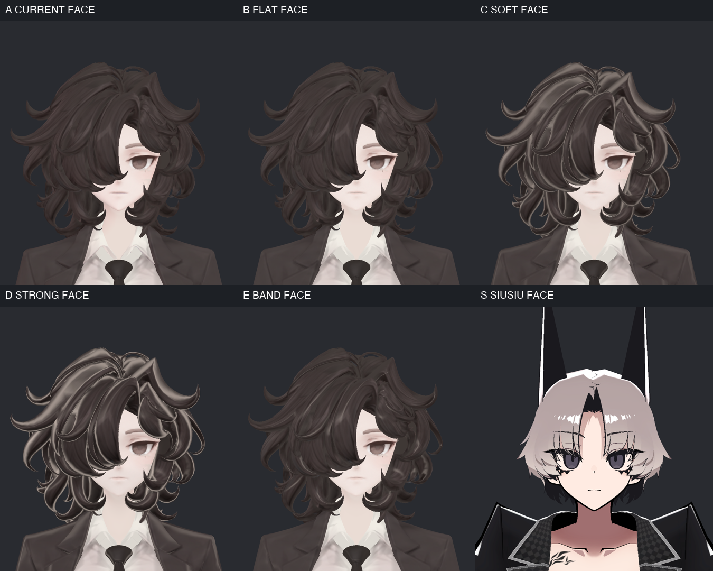
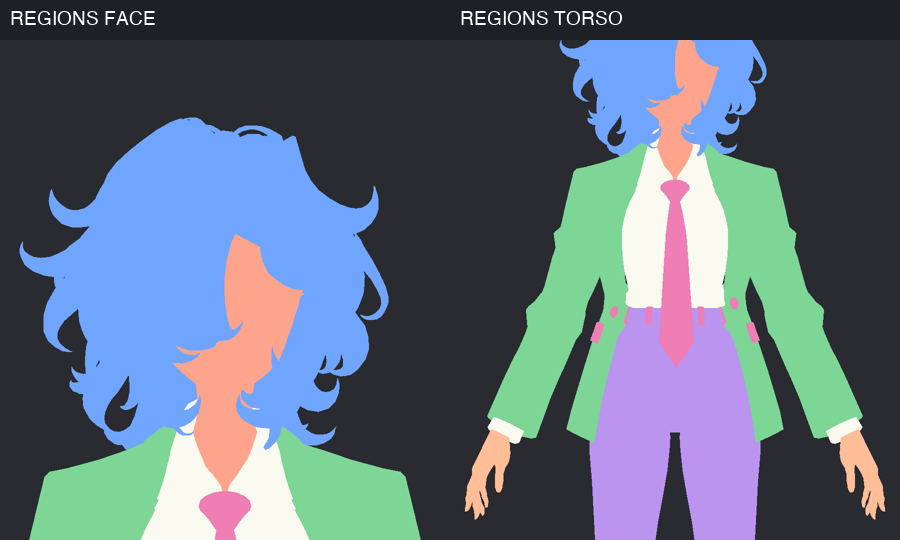
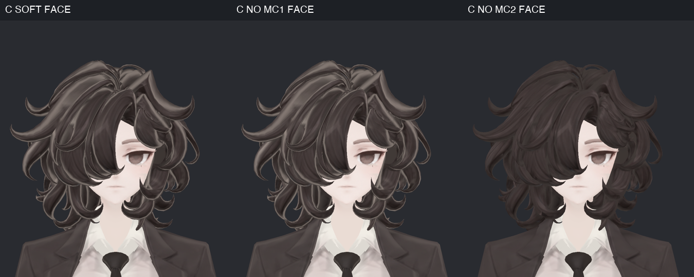
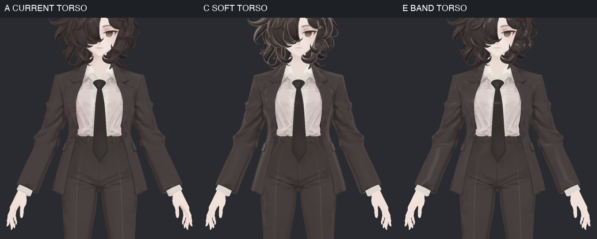
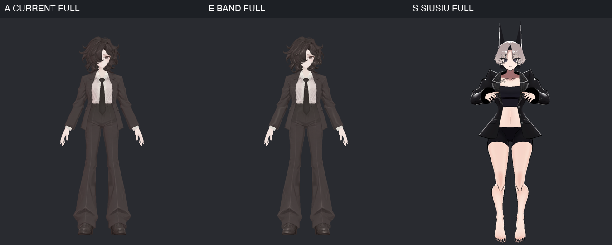
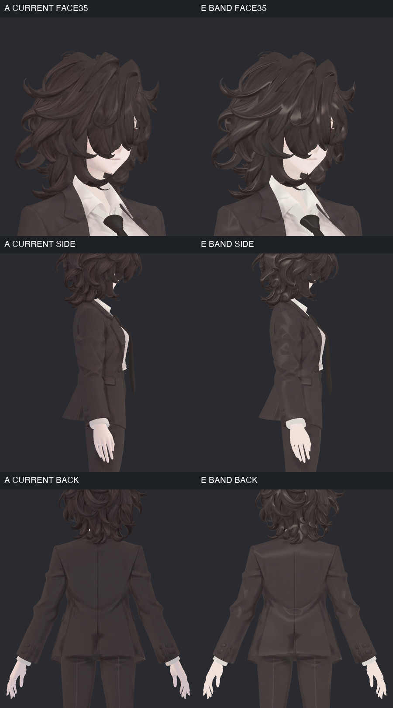
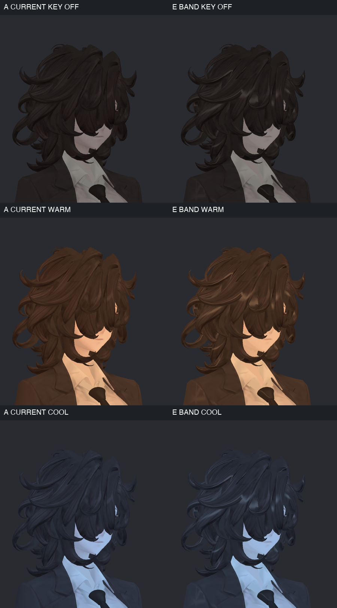

> **기록 시점 안내:** 아래는 해당 단계 당시의 보고서입니다. 후속 결정은 [최신 상태](../../STATUS.md)를 기준으로 읽어주세요. 모델·원본 텍스처·검증 원시 데이터는 이 문서 공유본에 포함하지 않습니다.

# v001 · SiuSiu 느낌을 비앙카에 구현하려면 — 실제 셰이더 시험

2026-09-12 · 사용자 요청에 따라 **`avatar_shader/v001_siusiu_style`**에 만든 별도 작업이다. v001은 셰이더 작업의 독립 버전 번호이며 모델링 v001과 다르다.

**이번 결론:** SiuSiu의 ‘툰 그림자 OFF + 마스크된 MatCap 두 층’을 실제로 적용할 수는 있다. 그러나 비앙카에 테두리 하이라이트를 더하는 것만으로는 SiuSiu의 단순한 색면이 되지 않고, 오히려 머리·주름이 번들거렸다. 테두리를 제거한 E 후보는 과장이 줄었지만 여전히 하이라이트 띠가 여러 머리 조각과 등 주름에 나뉘어 생긴다. **E를 비교 가능한 후속 출발점으로 보존했으며, 최종 미관 채택이나 SiuSiu 스타일 완성으로 판정하지 않는다.**

## 실제로 해 본 다섯 조건

위 왼쪽부터 A 현재/B 그림자 OFF/C 테두리형, 아래 D 강한 테두리/E 좁은 하이라이트/SiuSiu 참고다. B–E는 **같은 비앙카 메시·본·UV·기본색**을 사용했다. SiuSiu는 다른 체형·그림·기본 자세이므로 정량적인 스타일 점수 비교가 아니다.

| 조건 | 실제 설정 | 직접 본 결과와 판정 |
|---|---|---|
| A_CURRENT | v324 현재 재질. 툰 그림자0.5, MatCap OFF | 유지 기준. 원래 머릿결·셔츠·바지 명암이 많음 |
| B_FLAT | 툰 그림자만 OFF | 피부/천의 동적 음영이 줄지만 고정된 그림의 명암은 남음. SiuSiu 스타일 완성 아님 |
| C_SOFT | Shadow OFF, 곱셈 MatCap0.35, 테두리형 가산은 Head0.55/Paint0.4 | 머리 조각마다 밝은 선, 옷깃·넥타이에 광택. ‘SOFT’는 시험 이름이며 실제로 충분히 부드럽다는 판정이 아님. 우선 적용안에서 제외 |
| D_STRONG | 같은 곱셈0.9/가산1.0 | 대비가 더 강해져 금속·플라스틱 같은 인상. SiuSiu 느낌을 내는 해법으로 채택하지 않음 |
| E_BAND | Shadow OFF, 곱셈0.15, 테두리 없는 좁은 가산0.16 | C/D의 강한 윤곽은 감소. 머리 끝/곡면·등/소매에 띠가 남음. 후속 검수용 후보로만 보존 |

수치는 모두 전역 Blend다. 실제 효과는 아래 부위 마스크 값과 MatCap 그림의 색을 다시 곱하므로 모든 표면에 같은 세기로 적용되지 않는다. B–E의 밝기 하한0.2/상한1, AsUnlit0.1은 기존 값으로 고정했다. Rim·Outline·NormalMap·Reflection·Emission·스텐실을 새로 켜지 않았다.

SiuSiu에서 실제 확인한 얼굴/피부는 곱셈+곱셈이고, 머리/옷은 곱셈+가산이다. 이번 비앙카는 기존 Head 아틀라스를 유지하기 위해 **한 재질의 두 층을 마스크로 나눠 쓰는 첫 근사**다. 얼굴에 SiuSiu의 두 곱셈 층까지 완전히 재현한 것은 아니다. 이전 [v332 원본 조사](../../avatar_modeling/v332_shader_research/v332_SHADER_REVIEW.md)와 구분한다.

## 구현은 이렇게 분리했다

새 shader 코드를 갈아 끼우는 대신 **기존 lilToon 2.3.4에서 재질·마스크·MatCap을 작성**했다. Unity2022.3.22f1/Linear/Windows 빌드 대상이며, SiuSiu 텍스처나 재질 파일은 복사하지 않았다.

1. 비앙카 v324의 UV 삼각형31,363개와 기존 부위 분류를 읽었다.
2. 원래 Head/Paint UV 위치에 효과 마스크를 만들었다. 원본 마스크는2048², 빈 영역으로12픽셀 패딩, 경계에0.5픽셀 필터를 사용했다. 얼굴/손 내부의 가산 마스크는0으로 다시 보호했다.
3. 수식으로256² MatCap 세 장을 만들었다. 완만한 곱셈 음영, 밝은 테두리+띠, 테두리 없는 좁은 띠다.
4. 기존 재질4개를 각 조건별 사본으로 저장하고, 기존 프리팹에 사본만 연결했다. Renderer2개/슬롯4개 유지. Coat의 Head 슬롯은 원래부터0삼각형이다.
5. 실제 Unity 미리보기에서 같은 카메라·광원·자세로 비교했다. 기능 OFF와 표시용 부위 색을 함께 확인했다.

MatCap은 카메라 방향에 따라 표면 노멀을 이용해 음영/광택을 배치하며, 마스크·합성 방식·조명 반영으로 결과가 달라진다. 이 기능 의미는 [lilToon 공식 MatCap 문서](https://lilxyzw.github.io/lilToon/ja_JP/reflections/matcap.html)와 설치된 셰이더 코드를 대조했다. 새 강도 마스크는 선형/sRGB OFF, 색을 담은 MatCap은 sRGB ON으로 만들었다. [Unity 선형 텍스처 문서](https://docs.unity3d.com/2022.3/Documentation/Manual/LinearRendering-LinearTextures.html)

### 부위 마스크

머리 파랑, 얼굴/손 살구색, 셔츠 흰색, 코트 초록, 바지 보라, 넥타이·장식 분홍이다. 이 사진은 표시용 영역 텍스처를 잠시 연결한 진단이며 실제 후보의 기본색은 바꾸지 않았다. 넥타이와 다른 장식이 같은 분류에 포함된다는 것도 이번 마스크의 한계다.

| 부위 | 곱셈 마스크 값 | 가산 마스크 값 | 의미 |
|---|---:|---:|---|
| 머리 | 0.65 | 0.8 | 하이라이트 중심 부위 |
| 얼굴·손 | 0.15 | 0 | 옷/머리의 광택이 피부로 새지 않게 보호 |
| 셔츠 | 0.15 | 0.025 | 밝은 원래 그림을 보호 |
| 코트 | 0.65 | 0.2 | 천의 과도한 광택 제한 |
| 바지 | 0.55 | 0.08 | 주름의 흰 띠 제한 |
| 신발 | 0.7 | 0.8 | 상대적으로 강한 광택 허용 |
| 넥타이·장식 | 0.55 | 0.35 | 첫 분류의 공통값. 후속에서 넥타이와 금속을 나눠야 함 |

2048² 마스크의 부위 간 점유 중복은 이번 래스터 검사에서0이었다. 이것은 전체 UV 수학적 교차 합격이나 모든 축소 단계의 번짐 없음 판정이 아니다. 얼굴/머리와 소매/손 경계는 위 진단 사진으로 함께 확인했다.

## 왜 테두리 방식은 잘 맞지 않았나

왼쪽 C, 가운데 곱셈만 OFF, 오른쪽 가산만 OFF다. 가산을 끄면 머리를 따라 생긴 밝은 테두리가 크게 줄어든다. 따라서 이번 강한 광택은 단순한 텍스처 변화가 아니라 새 가산 층의 기여임을 확인했다.

비앙카 머리는 큰 한 장의 면처럼 읽히는 SiuSiu 헤어보다 곡면 조각과 기존 머릿결 그림이 많다. 같은 카메라 기반 하이라이트가 각각의 곡면에 반복돼, 머리 전체를 한 덩어리로 정리하기보다 조각 경계를 강조했다. 이 해석은 비교 사진과 현재 표면을 바탕으로 한 원인 추정이며, 이번에 노멀이나 형상을 변경해 인과를 추가 분리하지는 않았다.

**후속의 핵심은 MatCap을 더 세게 넣는 것이 아니라 하이라이트를 보여 줄 머리 묶음과 위치를 고르는 것**이다. 머리 전체 마스크0.8이라는 이번 첫 분류만으로는 충분하지 않았다.

## 정장·전신에서의 결과

C에서는 옷깃과 넥타이 매듭이 반짝여 천 재질이 달라 보인다. E는 이를 줄였지만 소매/허리/매듭 부근의 원래 명암과 새 반응이 여전히 겹친다. 셔츠·바지 디테일이 남은 것은 원래 MainTex를 보존했기 때문이다. 이 결과를 텍스처를 새로 잘 그린 결과라고 표현하지 않는다.

전신에서 E의 변화는 비교적 작다. SiuSiu의 선명함은 단순한 기본색, 의상 색 대비, 장식선, 머리 하이라이트 설계와 체형·형상이 함께 만드는 결과다. **이번 E가 SiuSiu와 동일한 인상에 도달했다고 보지 않는다.** 반면 원형을 유지한 채 필요한 부위에만 반응을 더하는 기술적인 연결은 만들었다.

## 사선·측면·뒤와 다른 빛

각 행의 왼쪽은 현재, 오른쪽은 E다. 사선은 실제35°, 측면90°, 뒤180°다. E의 후면 머리 끝과 등 주름에 밝은 띠가 남으며, 측면 소매의 면 경계도 더 눈에 띄는 곳이 있다. 정면 한 장만으로 채택하면 놓치는 부분이다. 파일의 초기 FACE45 표기는 실제35° 입력에 맞춰 FACE35로 정정했다. 카메라 자체를 수정한 것은 아니다.

두 후보 모두 빛의 색과 밝기에 반응한다. 주광 OFF에서도 머리만 지나치게 밝게 떠 있는 결과는 이번 사진에서 두드러지지 않지만, 서로 다른 실제 월드·거울·양안 VR 검증은 아직이다. 따뜻한 빛과 차가운 빛에서 얼굴 색은 크게 바뀌며, 이것을 별도 개선한 후보는 아니다.

촬영은900×1000 정사영·별도 Preview Scene·후처리 없음·Directional 강도1, 캐스트 그림자 OFF다. KEY_OFF는 주광만0이고 완전 암실이 아니다. 따뜻한 빛 RGB(1,0.72,0.47), 차가운 빛(0.5,0.72,1)을 사용했다. 후보는 같은 비앙카 기본 자세, 참고 SiuSiu만 블레이저 표시 클립을 샘플했다. Animator/Behaviour를 임시 미리보기에서 비활성화했으며 **저장한 프리팹의 원래 컴포넌트 활성 상태를 끈 것은 아니다.**

## 더 SiuSiu답게 만들려면 다음은 무엇인가

이번 시험을 바탕으로 권하는 다음 순서는 다음과 같다. 아래 항목은 **아직 적용하지 않은 후속 제안**이다.

| 순서 | 구체적으로 할 일 | 필요한 이유와 확인 조건 |
|---|---|---|
| 1. 색면 목표 고정 | 현재/E/SiuSiu 사진 옆에서 비앙카의 머리·코트에 남길 큰 명암과 작은 디테일을 구분 | 전체를 평탄화해 v324의 신발·옷·머릿결 복원을 잃지 않기 위해 |
| 2. 헤어 마스크를 묶음별로 | 앞머리/옆머리/뒷머리·끝부분을 나누고, 상부 몇 묶음에만 좁은 하이라이트 허용 | 곱슬 조각마다 반복되는 띠를 줄이기 위해. 기존 UV 안의 마스크 작업부터 |
| 3. 넥타이·천·장식 분리 | 이번 details 마스크를 넥타이와 장식으로 나누고 천/매듭의 가산을 더 낮춤 | 매듭이 금속처럼 보이는 문제와 등/소매 밝은 줄을 줄이기 위해 |
| 4. 기본색의 큰 음영만 별도 사본에서 정리 | 헤어의 큰 검은 음영·천의 큰 명암 중 새 효과와 겹치는 부분만 선택적으로 비교 | Shadow OFF에서도 남는 그림의 명암은 셰이더 세기만으로 제거되지 않음. 봉제선·신발 장식·눈선 유지 |
| 5. 얼굴 표현 | 기존 눈 가림·형상 유지, 코/입 고정 음영과 얼굴용 곱셈 층을 따로 비교 | 머리와 얼굴이 공유하는 두 MatCap 층의 한계가 실제로 생길 때만 기존 면의 재질 분할 검토 |
| 6. 시선 이동과 사용 검수 | 카메라 좌우 회전·거리1/3/5m·팔 굽힘, cast shadow/Light Probe, PC VRChat 거울·양안 | 하이라이트 움직임·축소 마스크·동작 중 면 경계·실제 조명 차이 확인 |

MatCap은 카메라 기준이므로 ‘그림에 그려 넣은 일정한 머리 띠’와 같은 안정성을 자동으로 보장하지 않는다. 시점 변화가 너무 크면 UV에 고정한 별도 하이라이트 층과 카메라 반응을 약하게 섞는 방법도 비교할 수 있다. 새 UV 채널·재질 슬롯·노멀 변경은 이번에 하지 않았고 기본 전제로 삼지 않는다.

SiuSiu 얼굴/몸/머리/옷의 재질 수를 그대로 복사하거나, 가려진 눈을 보이게 하는 스텐실을 자동 추가하지 않는다. 우선 기존 비앙카의 얼굴 인상과 구조를 유지한 마스크/그림 설계로 접근한다.

## 저장·검증·성능 범위

- B–E의4개 프리팹을 저장 후 다시 읽었다. 모두 원본과 **같은 Mesh 자산·MainTex 참조·모든 로컬 변환·재질 슬롯 수**를 사용한다. 저장본 Missing Script0. 루트 표시 이름의 Clone 표기는 변형과 구분했다.
- 원래 UV·노멀·웨이트·보정키·본을 새로 쓰지 않았다. 원본/참고 자산·Blender 기준본·기존 ProjectSettings 변경 등441파일의 해시가 유지됐다.
- 작성/렌더 후 사용자 장면 경로·dirty·루트 목록이 동일했다. 실제 Blender 사용자 장면을 열거나 변경하지 않았다.
- 최종60개 렌더 중28개 서로 다른 뷰를 위7개 비교 그림, 총29칸으로 직접 확인했다. 전체 포즈/거울/VRChat/성능 검수 완료가 아니다.
- E에 추가되는 고유 텍스처는 마스크4장(사용1024²)+MatCap2장(256²). Windows용 BC7·mipmap을 설정했다. 준비한 Shadow 마스크2장과 표시용 Regions2장은 E 의존성이 아니다.
- 2048² 무압축 마스크에서1024²/BC7로 바꾼 뒤 E 정면 얼굴/상체 두 뷰의8비트 채널 차이는 최대1이었다. 이 두 사진에서 큰 변화는 없었지만 모든 거리/축소 단계의 무손실 판정은 아니다.
- 새 활성6텍스처의 Unity native 메모리 조회 합계는 약11.00MiB였다. CPU 사본·엔진 오버헤드를 포함할 수 있어 GPU VRAM 실측이나 FPS로 해석하지 않는다. 추가 비용을0이라고 하지 않는다.

**전달:** E 검수 프리팹과 필요한 비앙카 자산22개를 포함한 `Bianca_Shader_v001_E_BandReview.unitypackage`를 만들었다. 패키지 pathname 검사에서 구매 레퍼런스 자산0을 확인했다. 셰이더/SDK 패키지는 외부 의존성으로 유지한다. 다른 빈 Unity 프로젝트로 재수입하거나 VRChat에서 실행한 검증은 아직이다. C/D 실패 후보와 제작 소스도 작업 폴더에 보존한다.

현재 단계는 **SiuSiu 방식의 실제 재질 시험과 한계 조사 완료**다. E도 미완성 검수본이며 기존 모델·리그 후보의 채택 상태를 변경하지 않는다. 이후 셰이더 작업은 계속 `avatar_shader`에서 관리한다.
