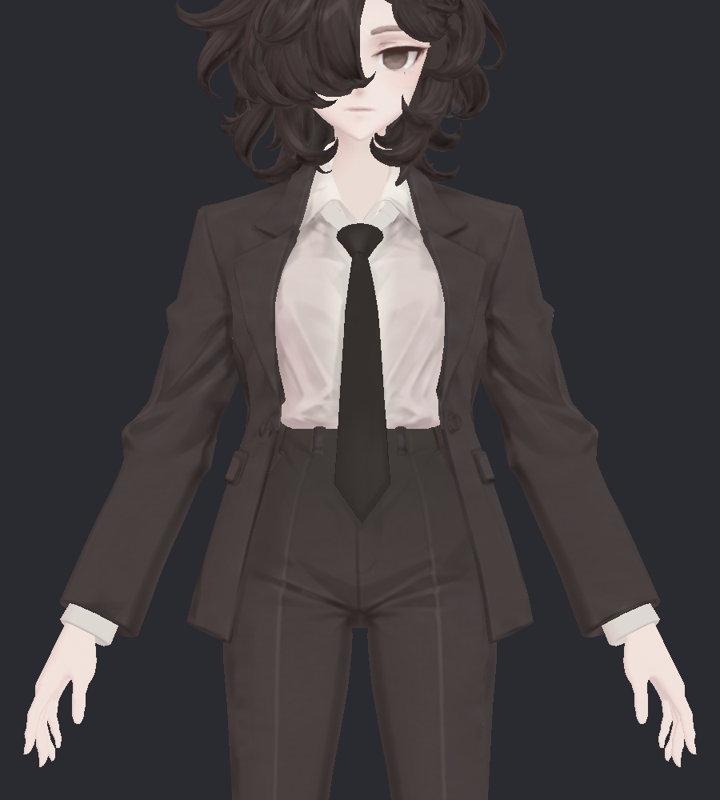
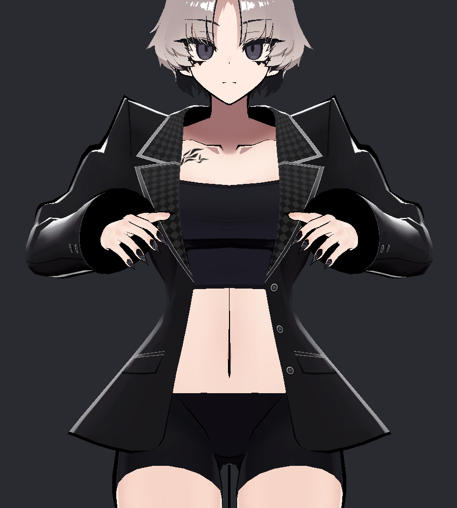
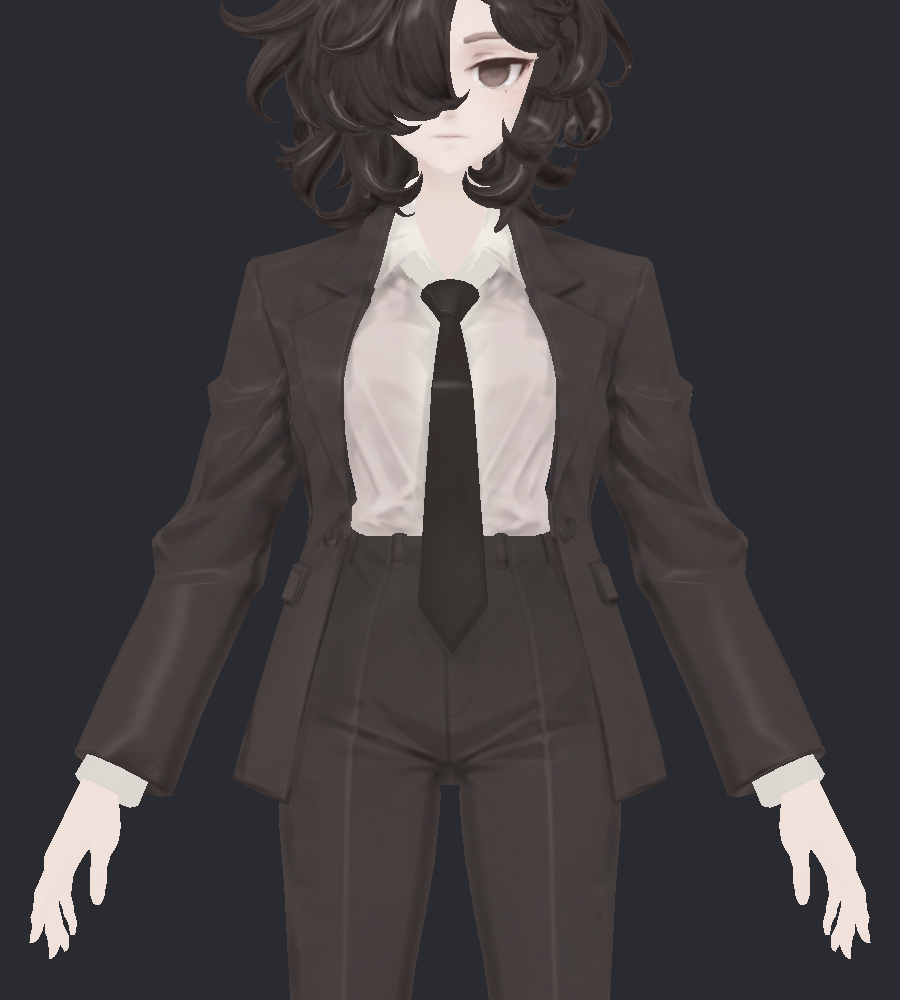

> **기록 시점 안내:** 아래는 해당 단계 당시의 보고서입니다. 후속 결정은 [최신 상태](../../STATUS.md)를 기준으로 읽어주세요. 모델·원본 텍스처·검증 원시 데이터는 이 문서 공유본에 포함하지 않습니다.

# v002 · SiuSiu의 질감 표현을 비앙카 소재에 맞춰 적용하려면

**사용자 방향:** SiuSiu의 질감 표현이 마음에 들지만 두 의상의 소재가 다르므로 그 차이를 고려한다. v001의 테두리·하이라이트 띠 중심 접근을 정정한다. E를 자동 후속 기준으로 채택하지 않는다.

이번에는 기존 Unity 렌더 4개와 비앙카 디자인 레퍼런스를 직접 다시 보며 **소재별 대응과 구현 순서를 재정리**했다. 아래 사진은 이전 촬영분이며 새 재질·텍스처 시험을 완료한 결과가 아니다.

## 같은 정장 계열로 보여도 반응을 그대로 옮기면 안 된다

비앙카는 재킷의 어깨·옷깃·팔 접힘, 셔츠의 밝은 주름, 바지의 선과 허리 명암이 이미 그려져 있다. 어두운 재킷과 넥타이도 같은 물건처럼 처리할 수 없다. 디자인 레퍼런스에서는 재킷·바지가 한 벌로 읽히고, 셔츠·넥타이·신발은 형태와 표면 표현이 나뉜다. 소재 해석은 이 디자인을 우선한다.

이번에 확인한 SiuSiu 블레이저는 어두운 넓은 면, 광택이 강한 어깨·소매, 체크무늬 옷깃과 선 장식이 함께 보인다. 이 관찰은 현재 Kisekae 블레이저 표시 상태에 한정된다. SiuSiu의 다른 의상 전체가 같은 질감이라는 판단은 아니다.

**실제 섬유 조성은 확인하지 않았다.** 두 옷을 울·면·가죽·합성섬유 등으로 확정하지 않는다. 아래의 ‘천처럼’, ‘가죽처럼’은 그림에서 읽히는 표면 특성과 작업상 구분이다. SiuSiu 재킷을 실제 가죽이라고 전제해서도 안 된다.

두 모델은 자세·색·형태·노멀·그려진 명암이 달라 사진 밝기를 그대로 맞추거나 반사 세기 비율을 복사할 수 없다. 참고할 것은 소재마다 필요한 표현을 구분하는 설계이고, 최종 색과 광택의 기준은 비앙카다.

## 소재별로 무엇을 남기고 무엇을 다르게 설계할까

| 비앙카 대상 | 현재 디자인에서 유지할 것 | SiuSiu에서 참고할 표현 | 비앙카에서 따로 정할 반응 |
|---|---|---|---|
| 재킷·바지 | 한 벌로 읽히는 색 관계, 옷깃·봉제선·주름 | 넓은 면과 작은 디테일이 분리되어 읽히는 방식 | 천처럼 읽히는 넓고 낮은 대비의 음영부터 비교. SiuSiu의 강한 반사 폭·색을 복사하지 않음 |
| 셔츠 | 밝은 기본색, 주름·깃과 소매 끝 구분 | 밝은 소재에서도 선과 면이 구분되는 정도 | 재킷과 다른 음영 대비. 밝은 면이 뭉개지거나 실크 같은 광택이 임의로 생기지 않도록 검수 |
| 넥타이 | 긴 천 조각과 매듭으로 읽히는 형태·색 | 작은 부위도 독립적으로 정돈되는 표현 | 장식 마스크에서 분리. 매듭과 평면의 반응을 따로 확인하고 광택 유무는 디자인과 비교 |
| 신발 | 갑피·솔·장식의 구분과 v324 복원 디테일 | 면과 세부 장식이 동시에 읽히는 정도 | 가죽처럼 읽히는 갑피와 솔을 구분해 검토. 전체를 같은 강도의 반짝이는 표면으로 처리하지 않음 |
| 단추·버클 등 | 기존 색과 작은 형태 | 작은 부위의 명료함 | 금속 여부가 확인되지 않은 부품은 자동으로 금속 광택을 주지 않음 |
| 머리·피부 | 머릿결·얼굴 인상·앞머리 가림 | 각 표면에 맞는 명암의 정돈 | 의상 조사와 분리. 의상용 마스크나 반사 세기를 피부·머리의 기본 해법으로 확대하지 않음 |

이 표는 소재별 시험 방향이다. 사용자가 무광·유광이나 특정 원단을 최종 선택했다는 뜻은 아니다. 레퍼런스에 뚜렷하지 않은 섬유 노이즈·직조 무늬를 ‘질감 추가’라는 이유로 만들지 않는다.

## v001에서 먼저 고쳐야 하는 구분

E에서는 소매·넥타이와 머리에 가로 방향의 밝은 반응이 생긴다. 강한 테두리를 줄였다고 해서 소재별 표현 문제가 해결된 것은 아니다. 이 사진의 넥타이 밝은 줄을 목표 질감으로 채택하지 않는다.

v001 제작 소스를 다시 확인했다. `coat`, `pants`, `shirt`, `shoes`는 별도 마스크 값이 있지만 **넥타이와 여러 장식은 `details` 한 분류에 묶였다.** 또 같은 MatCap 그림을 여러 소재가 공유하며 마스크 세기만 달리한다. 따라서 천과 신발의 반사 모양까지 독립적으로 설계한 상태는 아니다.

특히 `shoes`가 높은 마스크 값이라는 사실은 신발 갑피·솔·장식이 제대로 구분됐다는 검증이 아니다. 다음 소재 작업에서는 의미별 영역부터 확인해야 한다. 넥타이 전체·매듭, 재킷 천·단추, 신발 갑피·솔을 구분한 마스크 진단을 먼저 검수한다. 이 새 분류는 아직 작성하지 않았다.

## 기본색에 그린 표현과 재질 효과를 나눠 본다

위 왼쪽 원본, 위 오른쪽 첫 MatCap OFF, 아래 왼쪽 두 번째 OFF, 아래 오른쪽 둘 다 OFF다. 두 번째를 끄면 강한 어깨·소매 반응이 줄지만 체크무늬 옷깃과 일부 선은 남는다. ‘마음에 드는 질감’을 하나의 광택 효과로 환원하지 않아야 하는 근거다. 이 비교는 기존 촬영 시 모든 활성 재질의 해당 기능을 함께 끈 것이며, 옷의 특정 소재만 분리한 실험은 아니다.

MatCap은 마스크로 적용 부위를 정하고 합성 방식과 조명 반영을 설정할 수 있다. 소재별 비교에 사용할 수 있는 수단이지만, 한 장의 반사 그림과 세기 조절만으로 모든 소재를 완성한다고 보지 않는다. 기능 의미는 이번에 다시 확인한 [lilToon 공식 문서](https://lilxyzw.github.io/lilToon/ja_JP/reflections/matcap.html)를 따른다.

## 다음 구현의 순서와 통과 조건

1. **기준은 기존 A와 비앙카 디자인.** E는 실패 원인 비교용으로만 둔다. 재킷·바지, 셔츠, 넥타이, 신발·부품의 의미별 영역과 마스크 경계부터 확인한다. 기존 메시·UV·기본색·본은 유지한다.
2. **재킷·바지부터 한 벌로 비교.** v001의 가산 광택을 출발 조건으로 삼지 않는다. A의 현재 음영을 기준으로 넓은 음영의 대비·부드러움 한 요소씩 바꾼다. 툰 그림자 OFF도 미리 정답으로 고정하지 않는다. 봉제선과 원래 접힘이 남고, 소매가 젖은 재질처럼 바뀌지 않는지 본다.
3. **셔츠·넥타이를 별도로 비교.** 같은 조명에서 밝은 주름과 매듭이 읽히는지 확인한다. 장식용 반사가 천으로 번지지 않아야 한다. 재킷에 좋은 값이 셔츠에도 맞는다고 가정하지 않는다.
4. **신발과 작은 부품은 그 다음.** 갑피·솔·장식이 구분되는지 먼저 보고 필요한 곳에만 반사를 비교한다. 머리·피부는 독립 단계로 둔다.
5. **기본색 수정은 원인 확인 후 국소 사본에서.** 셰이더를 꺼도 남는 큰 명암이 방해하는지 비교한 뒤에만 다룬다. 전체 평탄화나 v324 디테일 제거는 해법으로 정하지 않는다.
6. **같은 비앙카끼리 판정.** 같은 자세·노출·조명으로 정면/측면/뒤, 카메라 이동과 광원 이동을 따로 비교한다. 전신 거리에서도 소재 구분이 유지되는지 확인한다. SiuSiu와 픽셀 밝기가 같아졌다는 이유로 합격시키지 않는다.

새 재질 슬롯이 필요하다고 미리 정하지 않는다. 기존 슬롯과 의미별 마스크로 가능한 범위를 먼저 확인하고, 서로 다른 반사 모양이 실제로 필요한 경우에만 분리 방법을 비교한다.

**이번 완료 범위:** 사용자 정정 반영, 디자인 및 실제 렌더 재검토, 기존 마스크 구분의 한계 확인, 소재별 구현 순서 작성. 모델·기본색·마스크·재질 변경 0, 새 렌더 0. 새 검수 프리팹·패키지를 만든 단계가 아니며, 질감 구현·VRChat 검증 완료로 표현하지 않는다. 이후 작업은 계속 `avatar_shader`에서 관리한다.
