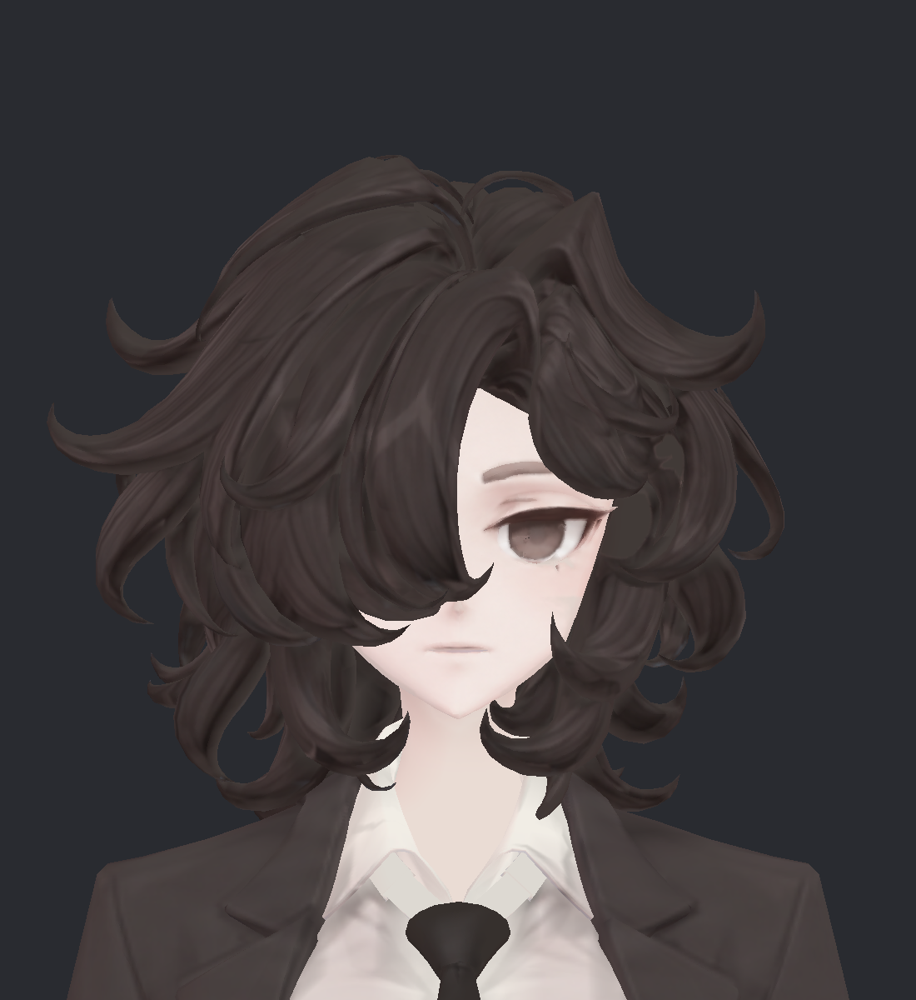
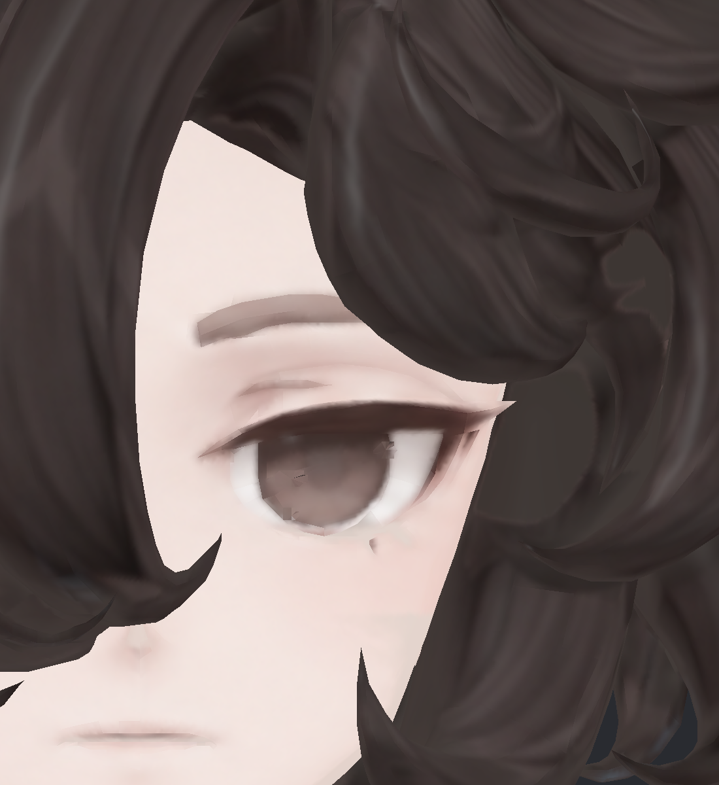
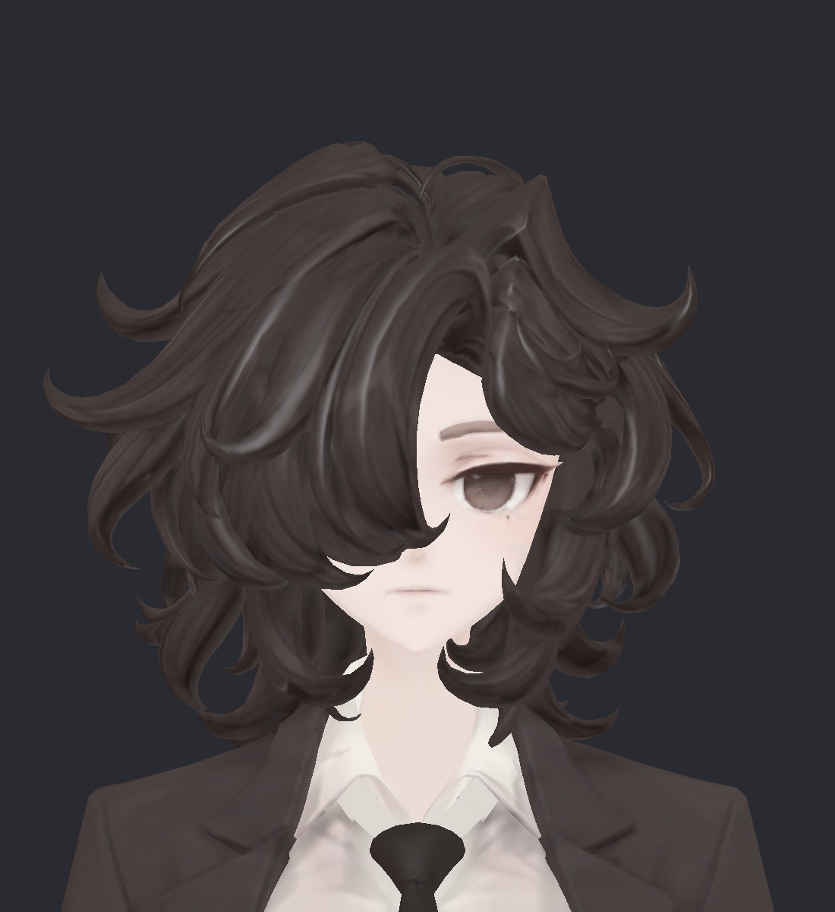
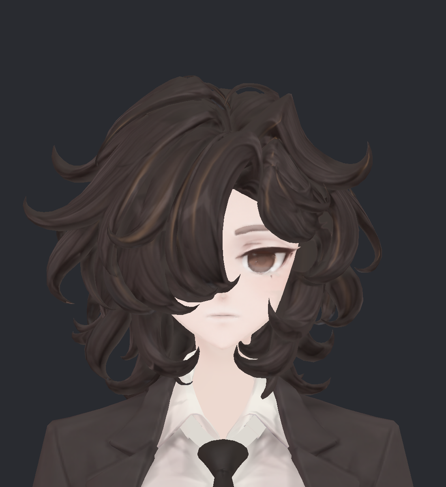
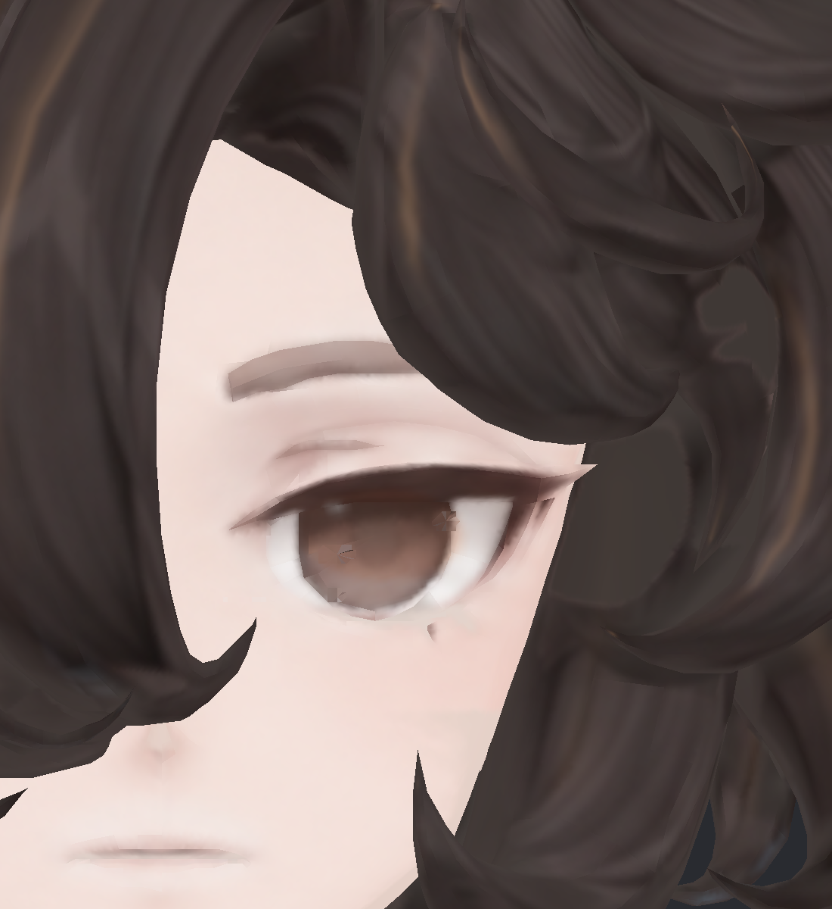
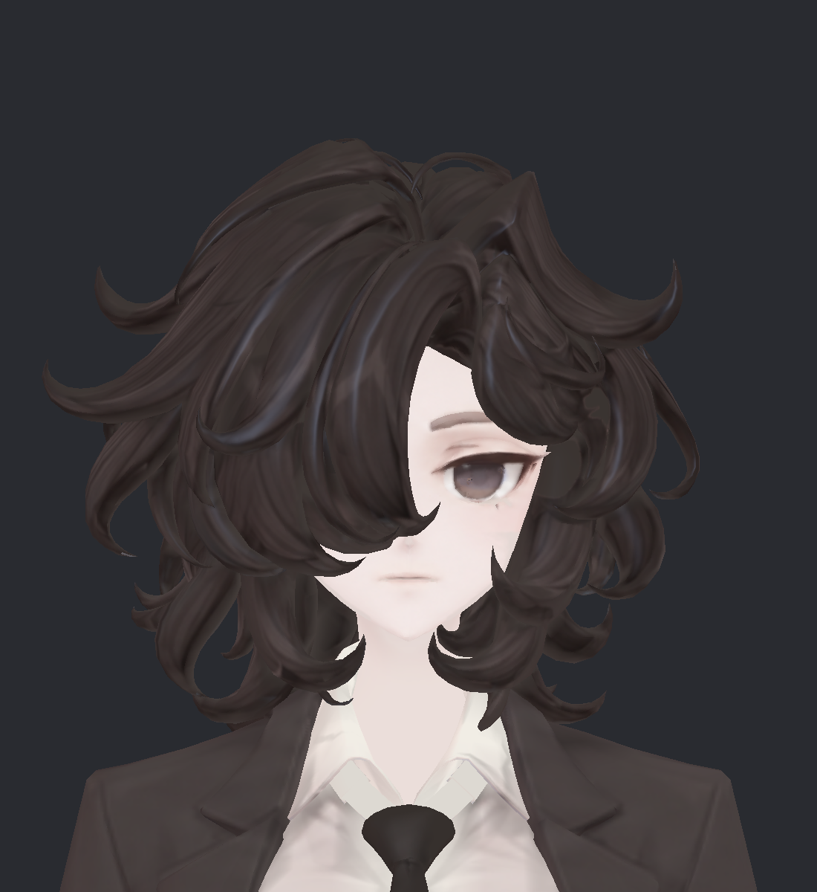

> **기록 시점 안내:** 아래는 해당 단계 당시의 보고서입니다. 후속 결정은 [최신 상태](../../STATUS.md)를 기준으로 읽어주세요. 모델·원본 텍스처·검증 원시 데이터는 이 문서 공유본에 포함하지 않습니다.

# v003 · 후보별 큰 얼굴·눈 사진

[비교표와 선택 안내](v003_SURFACE_REVIEW.md) · [조명·각도와 남은 문제](v003_VALIDATION.md)

모두 같은 비앙카와 백색 조명이다. 아래는 실제 Unity 캡처이며 색 보정이나 생성 이미지 덧칠을 하지 않았다. 머리·피부·눈을 각각 다른 후보에서 고를 수 있다.

## A · 현재 기준

## B · 부드러운 질감

## C · 윤기와 눈 반짝임

## D · 따뜻한 색감

## E · 차분하고 맑은 색감

