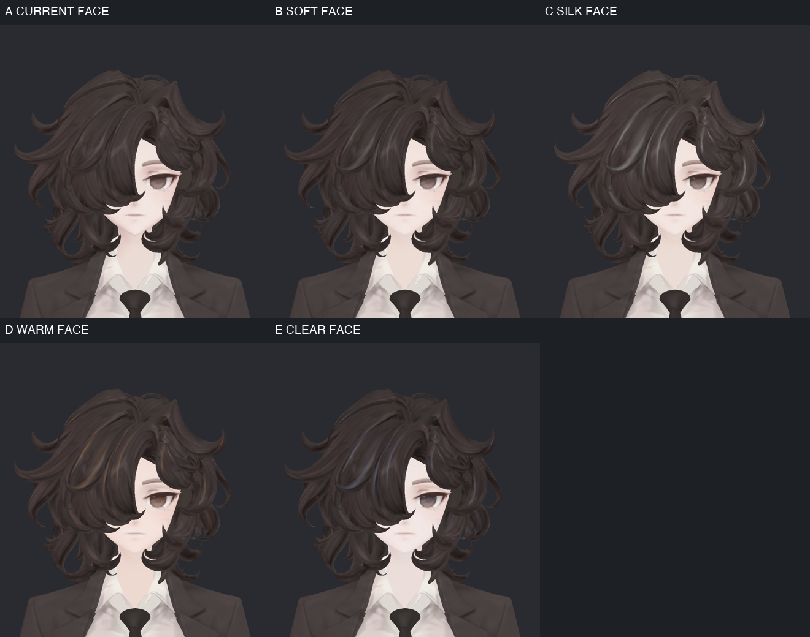
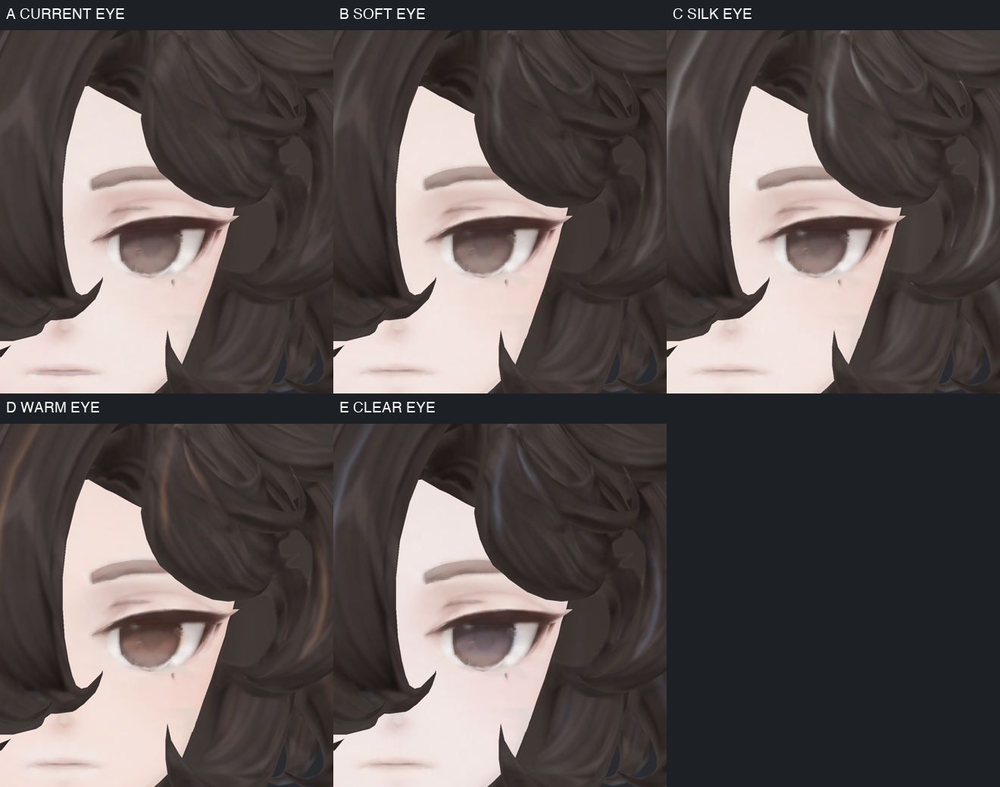
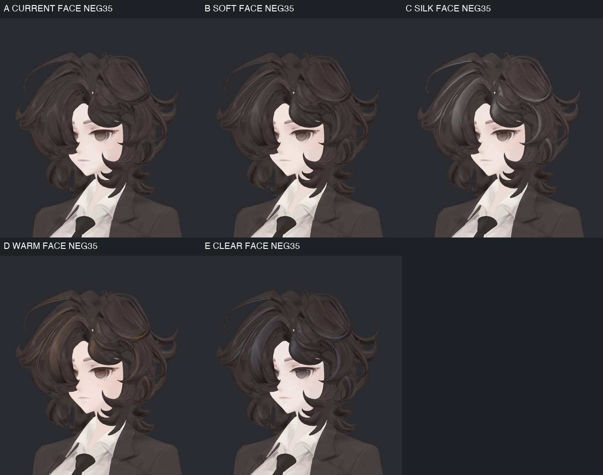
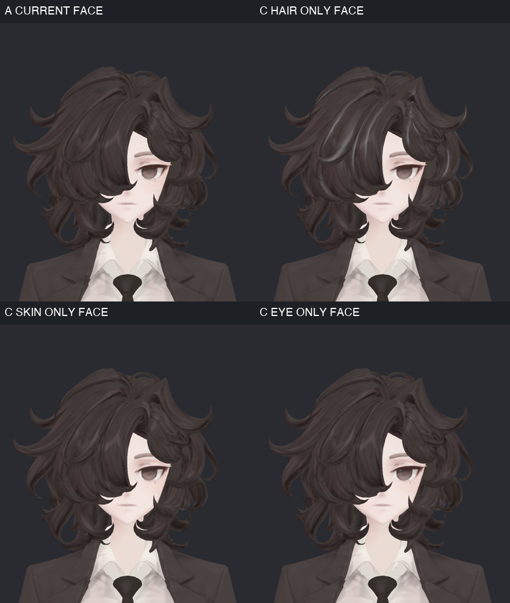
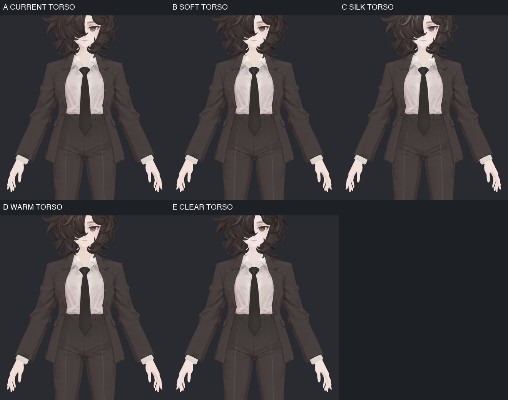
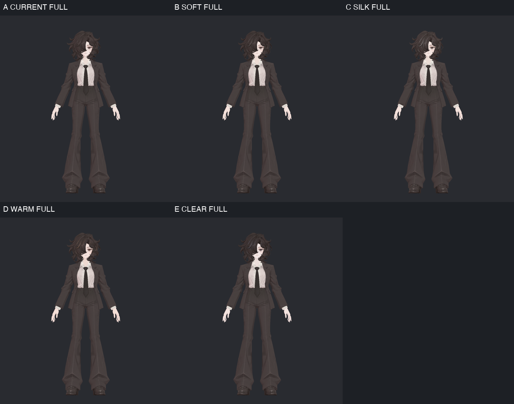

> **기록 시점 안내:** 아래는 해당 단계 당시의 보고서입니다. 후속 결정은 [최신 상태](../../STATUS.md)를 기준으로 읽어주세요. 모델·원본 텍스처·검증 원시 데이터는 이 문서 공유본에 포함하지 않습니다.

# v003 · 머리카락·피부·눈 질감 후보 4개

사용자 요청에 따라 **실제 Unity 재질 후보 B·C·D·E**를 만들었다. A는 현재 비앙카다. 이번 v003의 문자 이름은 이전 v001 후보와 별개이며, 네 후보 모두 선택을 위한 검수본이다.

**[후보별 큰 얼굴·눈 사진](v003_CANDIDATE_GALLERY.md)** · [각도·조명·검증과 남은 문제](v003_VALIDATION.md) · [프리팹·패키지 안내](README.md)

## 먼저 고를 수 있는 네 방향

| 후보 | 머리카락 | 피부 | 눈 | 사진에서 보인 차이 |
|---|---|---|---|---|
| **B · SOFT** | 낮은 윤기, 기존 머릿결 중심 | 약한 피부색 층과 완만한 동적 음영 | 원래 회갈색 중심, 작은 반짝임 | 현재 인상에서 변화가 가장 작은 쪽. 전신에서는 차이가 작음 |
| **C · SILK** | 네 후보 중 윤기가 가장 강함 | 피부색 보정은 가장 약하게 | 홍채 대비와 반짝임을 더 강조 | 머리 묶음과 눈이 선명해지지만 사선·측면에서 일부 머리가 반짝이는 덩어리처럼 보일 수 있음 |
| **D · WARM** | 따뜻한 갈색 계열 윤기 | 옅은 복숭아색 방향 | 따뜻한 갈색 홍채 | 얼굴·눈·머리의 따뜻한 인상이 함께 드러남. 일부 머리 반사가 구리색처럼 보일 수 있음 |
| **E · CLEAR** | 푸른 회색 계열의 절제된 윤기 | 옅고 차분한 색감 | 차가운 회갈색 방향 | D보다 차분한 인상. 차가운 조명에서는 피부의 푸른 기가 커짐 |

SOFT/SILK/WARM/CLEAR는 비교용 이름이다. 실제 비단 섬유·피부 투과·각막 재질을 물리적으로 재현했다는 뜻은 아니다. **‘머리는 C, 피부는 B, 눈은 D’처럼 부위별로 선택해도 된다.** 현재 전달물은 위 네 조합이며, 서로 섞은 추가 조합은 아직 저장하지 않았다.

## 눈과 피부는 가까이서 비교

B는 눈의 원래 색을 많이 유지하고, C는 작은 반짝임이 더 눈에 띈다. D/E에서는 홍채의 따뜻함과 차가움이 구분된다. 피부는 유분 광택을 크게 더하지 않고 색층과 동적 음영을 조절했다. 피부 차이는 머리 윤기보다 작으며, 피부결 자체를 새로 그리거나 모공을 추가한 작업은 아니다.

눈에는 **홍채 내부 색 조절 + 국소 광택 + 작은 고정 반짝임**을 따로 넣었다. 속눈썹·눈썹·입에는 피부색 층이 덮이지 않도록 마스크를 분리했다. 눈 크기·위치·눈선·앞머리 가림·원래 얼굴 형상은 바꾸지 않았다.

원본 A에도 확대하면 작은 삼각형과 이음 흔적이 보인다. 이번 후보는 이를 포함한 원래 메시·UV·기본색을 그대로 쓰므로 눈 표면의 모든 흔적을 해결한 완성본은 아니다. 홍채 마스크도 처음보다 범위를 좁혔지만 작은 영역과 경계의 추가 정리가 남아 있다.

## 얼굴이 보이는 사선과 부위별 효과

정면만 보면 작았던 차이가 사선에서는 더 드러난다. C는 머리 윤기가 크게 이동하고, D는 따뜻한 반사, E는 차가운 반사색이 보인다. 특정 각도의 넓고 밝은 머리 반사는 취향을 확인할 부분이다. 원형의 곱슬 구조를 바꾸지 않은 상태에서 비교했다.

위 왼쪽 A, 위 오른쪽 C의 머리 색·윤기만, 아래 왼쪽 피부색 층만, 아래 오른쪽 눈 효과만 켰다. 이 분리 사진은 **A의 원래 그림자 설정을 유지**한다. 전체 C에 들어간 공통 그림자 마스크 보정은 제외했으므로 네 사진을 단순 합산해 전체 C와 같다고 해석하지 않는다.

## 의상 소재는 유지했다

비앙카 정장에 SiuSiu 블레이저의 광택을 옮기지 않았다. 재킷·바지·셔츠·넥타이·신발에 이번 머리/홍채 효과가 적용되도록 설계하지 않았으며, 손에는 얼굴과 연관된 약한 피부색 층만 적용했다. 한 상체 뷰의 셔츠·넥타이·재킷·바지 내부 네 고정 영역에서 A 대비 8비트 채널 차이는 최대1이었다. 모든 경계·자세·거리의 무변화 검증으로 확대하지 않는다.

전신 거리에서는 피부·눈 차이가 작다. 주로 머리의 색과 윤기 차이가 남으며, 얼굴 근접 취향과 전신에서의 자연스러움을 함께 고르는 용도다. v324는 이번 재질 비교 입력이고, 최신 관절 후보에 이 셰이더를 통합하거나 모델링 채택 상태를 바꾼 것은 아니다.

## 실제 저장한 결과

- 원래 재질 사본16개, 후보 프리팹4개, 네 후보를 담은 `Bianca_Shader_v003_SurfaceCandidates.unitypackage`.
- 실제 Unity 최종69렌더. 이 문서와 검증 문서의14비교 그림에서66개 서로 다른 뷰/67칸을 직접 확인했다. 갤러리는 같은 얼굴·눈의 큰 원본 캡처다.
- 저장 후 재조회에서 원래 Mesh 자산·MainTex·모든 로컬 변환·슬롯 수 동일, Missing Script0. 원본441파일 해시와 사용자 장면 상태 유지.
- 의상 소재의 별도 완성, 모든 표정·눈 움직임, VRChat 거울/양안·클라이언트·성능 검증은 아직이다. **네 후보를 공유하는 단계까지 완료했으며 최종 채택은 하지 않았다.**
