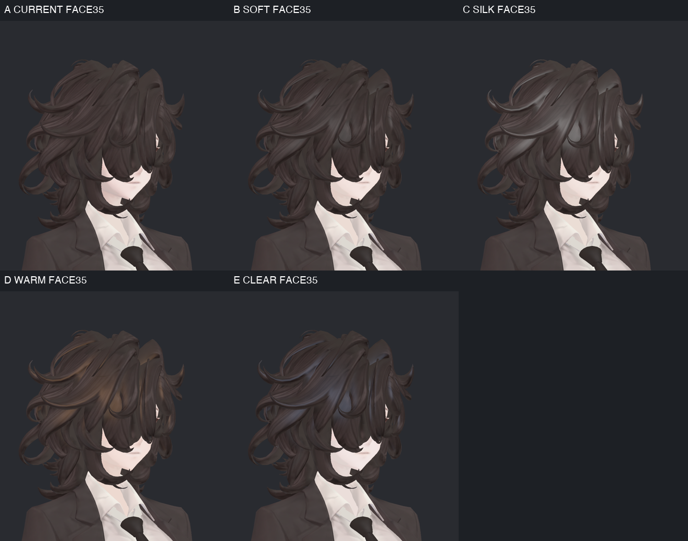
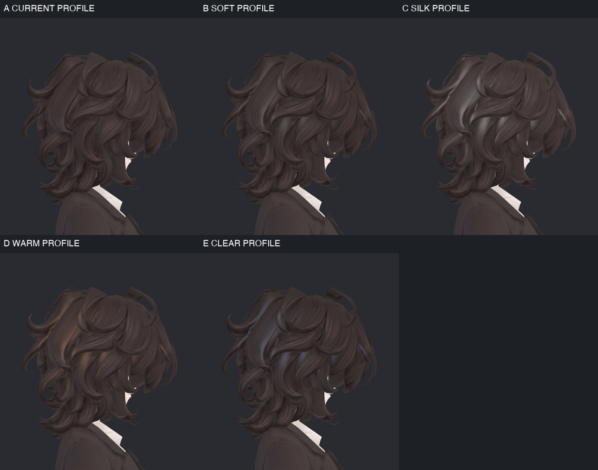
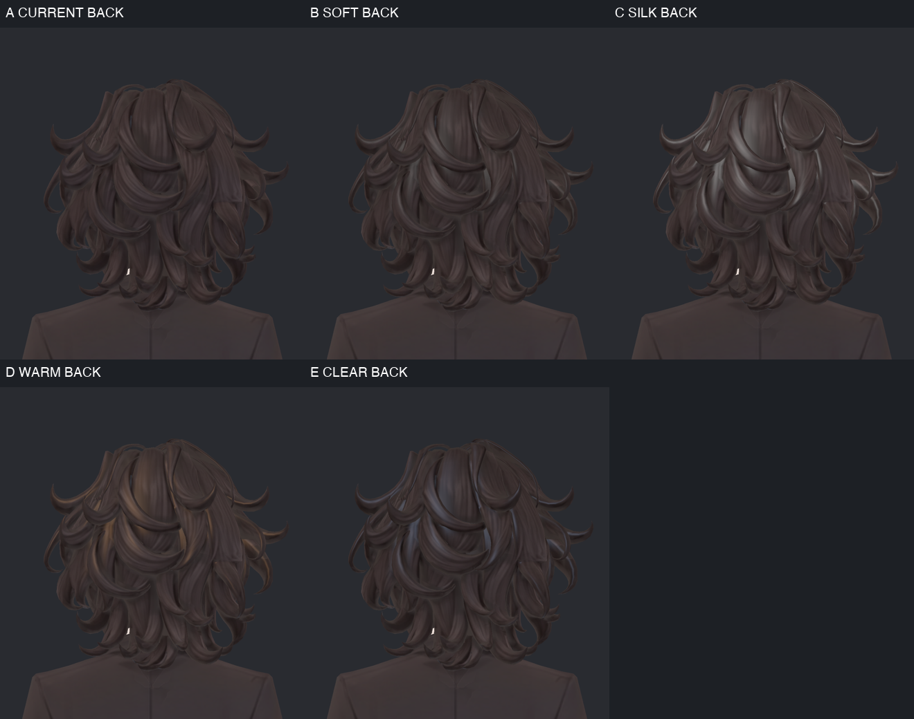
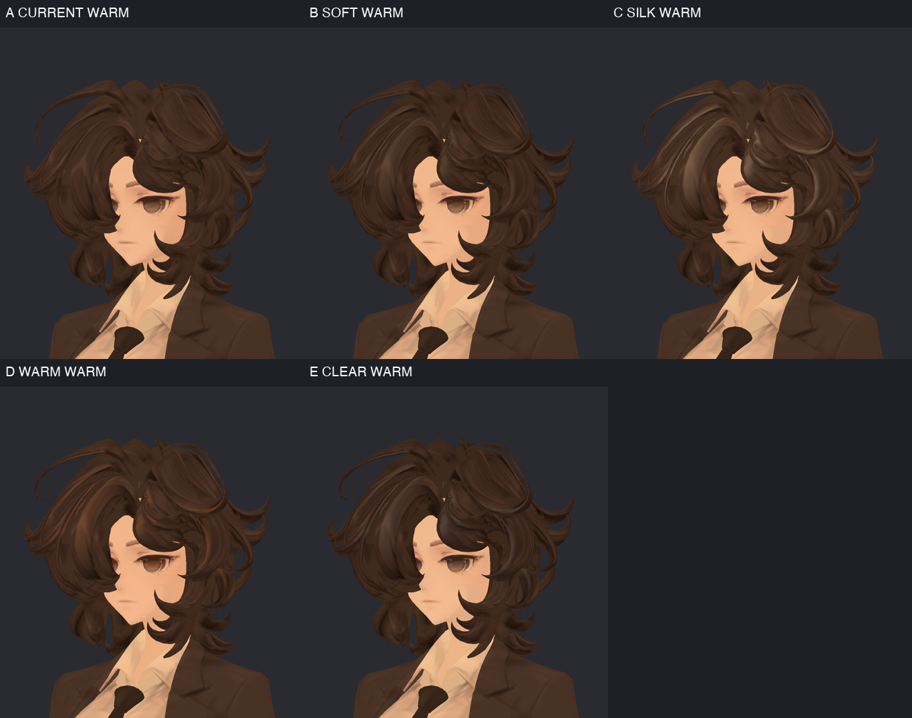
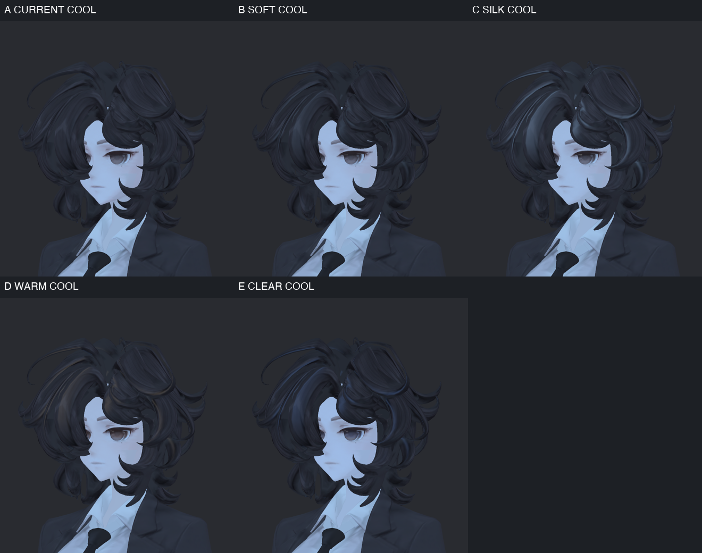
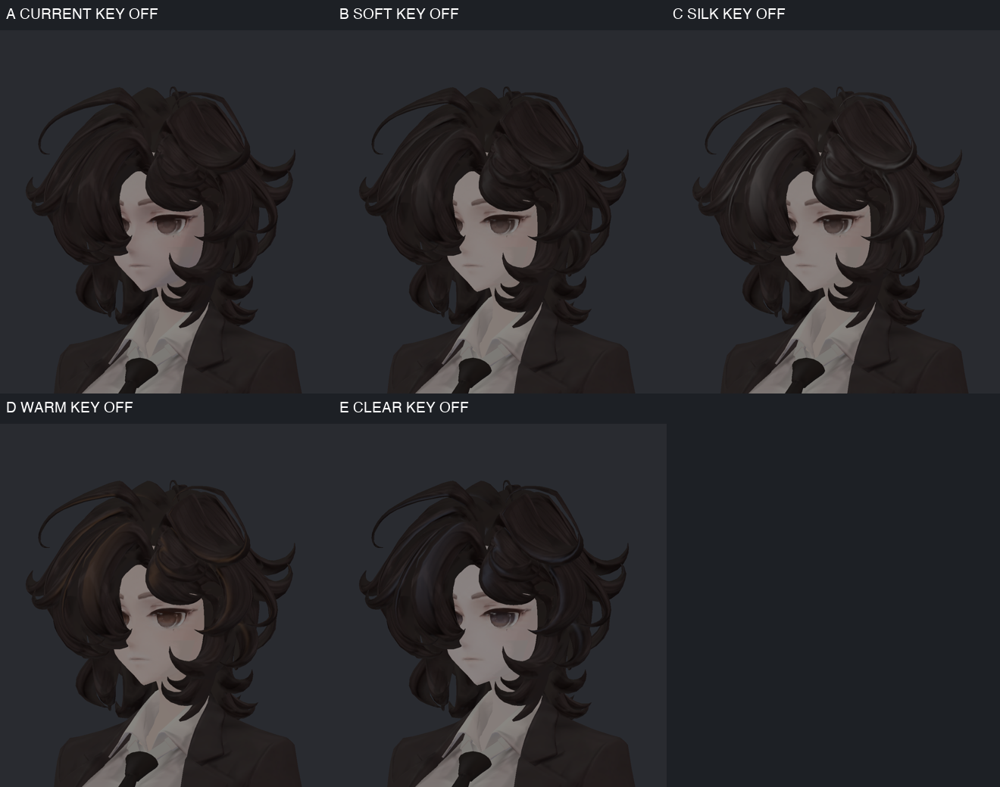
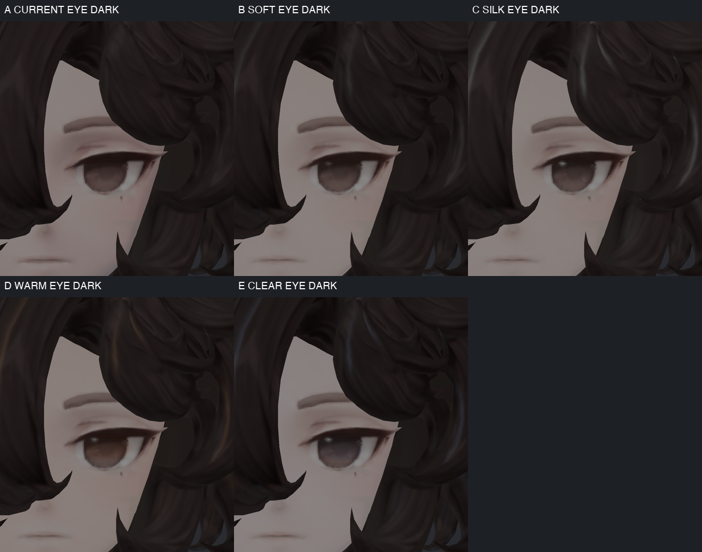
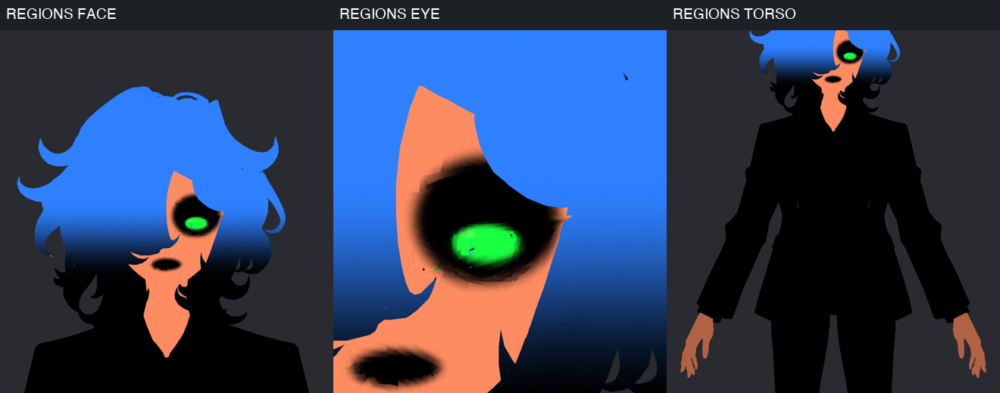

> **기록 시점 안내:** 아래는 해당 단계 당시의 보고서입니다. 후속 결정은 [최신 상태](../../STATUS.md)를 기준으로 읽어주세요. 모델·원본 텍스처·검증 원시 데이터는 이 문서 공유본에 포함하지 않습니다.

# v003 · 질감 후보 검증과 남은 문제

[후보 선택 문서](v003_SURFACE_REVIEW.md) · [큰 얼굴·눈 사진](v003_CANDIDATE_GALLERY.md)

## 다른 각도에서 머리 확인

카메라 +35°에서는 앞머리 때문에 눈이 가려진다. 머리 윤기 위치를 확인하는 사진이며, 이 시점만으로 눈의 품질을 판단하지 않았다. C의 넓고 밝은 반사, D의 갈색 반사, E의 푸른 회색 반사가 눈에 띈다.

측면90°에서도 C의 머리 묶음이 강하게 강조된다. B는 변화가 작다. 네 후보의 머리 형상은 같고, 이 비교를 형상 개선으로 표현하지 않는다.

뒤에서도 윤기 차이가 반복된다. 머리 아래쪽은 마스크로 약화했지만 모든 곱슬 묶음의 반사를 개별 수작업으로 정돈한 상태는 아니다. C/D/E의 반사색과 넓이에 취향 확인이 필요하다.

## 조명 변화와 눈 반짝임

같은 광원의 색만 각각 RGB(1,0.72,0.47), (0.5,0.72,1)로 바꿨다. 모든 후보에서 피부와 의상 색이 크게 바뀐다. 피부색 보정이 월드 조명색을 항상 상쇄하는 기능은 아니다.

주광 OFF에서 C 등의 작은 눈 반짝임이 남는다. 고정 반짝임은 UV에 붙은 국소 Emission으로 만든 것으로 실제 주변 환경을 반사한 점광원이 아니다. 발광하는 눈 전체를 만들지는 않았지만, 어두운 월드에서 이 점이 취향에 맞는지는 후속 검수 대상이다. MatCap 광택은 별도로 조명 밝기를 반영한다.

처음 조명 사진은 +35°라 앞머리가 눈을 가렸다. 최종 조명 사진은 **눈이 보이는 -35°**로 다시 촬영하고, 정면 눈 확대의 주광 OFF도 추가했다. 이전 가려진 사진은 로컬 Trials에 보존하며 눈 조명 검증으로 쓰지 않는다. KEY_OFF는 Directional 강도0이며 완전 암실/실제 월드 광도 재현이 아니다.

## 효과 영역과 제작 방법

파랑은 머리 효과, 주황은 피부색 층, 초록은 홍채 효과, 검정은 제외 영역이다. 눈선·눈썹·입 주변을 피부색 층에서 제외했고 머리 끝은 약화했다. 작은 점·삼각형과 경계 흔적이 남아 있으므로 모든 UV 경계가 완벽히 분리됐다는 판정은 아니다. 이 그림은 표시용 합성 마스크의1024² 미리보기다. 실제 홍채/반짝임은2048²와2px 패딩, 나머지 효과 원본은12px 패딩이므로 표시용 경계와 실제 효과의 샘플링이 완전히 같지는 않다.

- 원래 UV 삼각형의 위치를 보간해 머리·피부·홍채 마스크를 만들었다. 홍채는 원형 눈 그림 내부의 제한된 타원이며 별도 안구 메시가 아니다. 원본 MainTex를 다시 그리거나 구매 SiuSiu 원본을 이식하지 않았다.
- 피부는 마스크된 Main2nd 색층, 눈은 Main3rd 곱셈 색층·MatCap·작은 반짝임, 머리는 마스크된 감마와 넓은 MatCap으로 표현했다. 실제 SSS·각막 굴절·물리 기반 섬유 산란은 구현하지 않았다.
- 얼굴 쪽 동적 그림자 세기를 마스크로 낮추고, 머리와 얼굴의 세기를 구분했다. Rim·Outline·NormalMap을 추가하지 않았다. 눈선의 원래 기본색은 보존하되 조명 반응까지 A와 같다는 뜻은 아니다.
- [lilToon 색층 문서](https://lilxyzw.github.io/lilToon/ja_JP/color/maincolor_layer.html), [MatCap 문서](https://lilxyzw.github.io/lilToon/ja_JP/reflections/matcap.html), [그림자 문서](https://lilxyzw.github.io/lilToon/ja_JP/color/shadow.html)를 확인하고 설치된 셰이더 코드와 합성 방식을 대조했다.

| 실제 전역 값 | B SOFT | C SILK | D WARM | E CLEAR |
|---|---:|---:|---:|---:|
| 머리 MatCap Screen Blend | 0.13 | 0.38 | 0.26 | 0.22 |
| 피부 색층 Alpha | 0.08 | 0.055 | 0.12 | 0.12 |
| 홍채 MatCap Add Blend | 0.10 | 0.40 | 0.24 | 0.28 |
| 홍채 Multiply 색층 Alpha | 0.16 | 0.22 | 0.36 | 0.32 |
| 작은 반짝임 Emission RGB | 0.045 | 0.16 | 0.10 | 0.14 |

값은 마스크·텍스처·합성색과 함께 작용하며 피부의 실제 광택이나 물리적 반사율 수치가 아니다. B–E 전체에는 같은 얼굴/머리 그림자 강도 마스크를 쓰고 Blur는 B/C/D0.7, E0.45다. 원래 재질의 전체 Shadow Strength0.5는 유지한다.

## 검증 범위

Unity2022.3.22f1, lilToon2.3.4, Linear, Windows 빌드 대상. 별도 Preview Scene, 정사영1100×1200, 후처리 없음, 흰 Directional 강도1/캐스트 그림자 OFF, 같은 기본 자세다. Animator/Behaviour는 렌더용 임시 객체에서만 껐고 저장한 프리팹의 원래 활성 상태는 보존했다.

재조회4후보의 Mesh 자산·MainTex 참조·모든 로컬 변환·슬롯 수 동일, Missing Script0. 원본/참고 자산·기준 Blender·기존 ProjectSettings 변경을 포함한441파일의 해시 동일. Build/Render 전후 사용자 장면 path·dirty·루트 목록 동일. 실행 초기에 다른 재생 작업 중이라 Build가 중단된 한 번은 자산 편집 전에 종료했으며 재생을 강제로 끄지 않고 비재생 상태에서 실행했다.

새 활성 텍스처는 공통8장이다. 홍채/반짝임2장은2048², 머리/피부/그림자/손 마스크4장은1024², MatCap2장은256²이며 Windows BC7와 mipmap을 사용한다. Unity native 메모리 조회 합계는 약32.34MiB다. CPU 사본·오버헤드를 포함할 수 있어 GPU VRAM이나 FPS 실측으로 해석하지 않는다. 준비한 미사용 Paint 마스크와 표시용 Regions는 전달 프리팹의 활성 의존성이 아니다.

패키지는 후보4프리팹 및 의존 자산39개다. pathname 검사에서 구매 레퍼런스0. lilToon/VRChat SDK는 외부 의존성이다. 빈 프로젝트 재수입·빌드·VRChat 로그인/업로드/거울/양안 검증은 하지 않았다. 표정·시선·거리 변화와 광택의 움직임도 아직 연속 검수하지 않았다.
