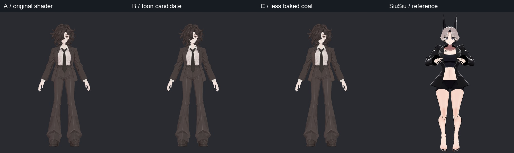
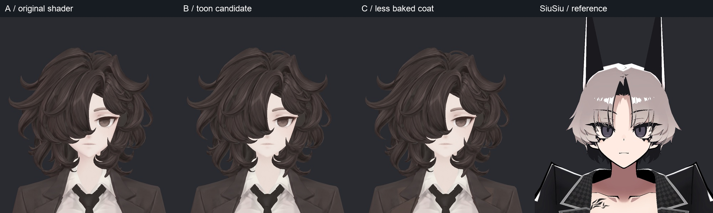
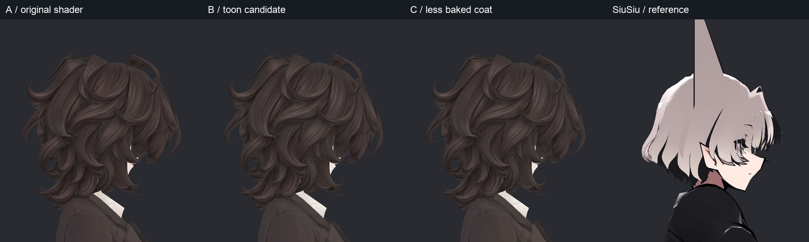
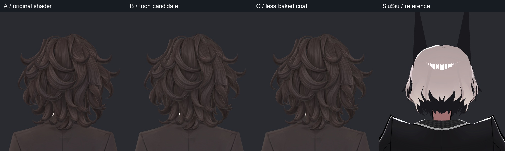
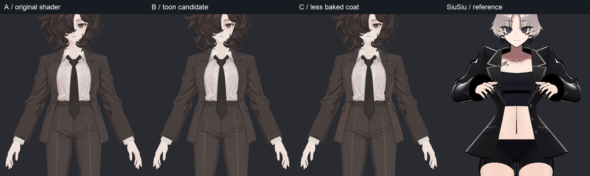
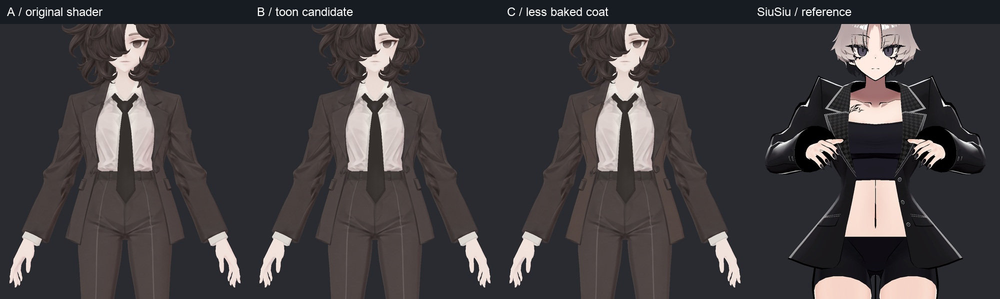
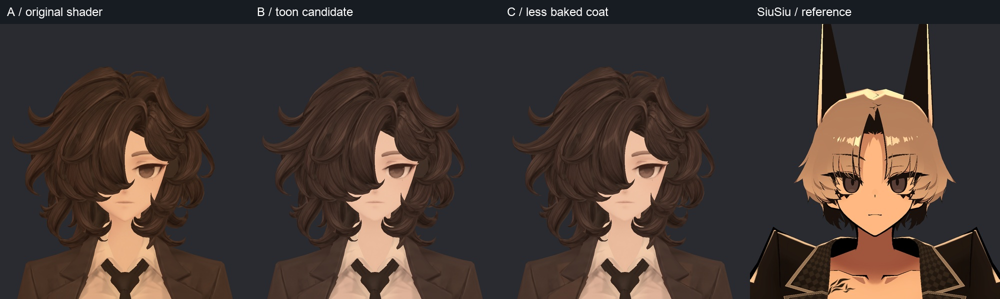
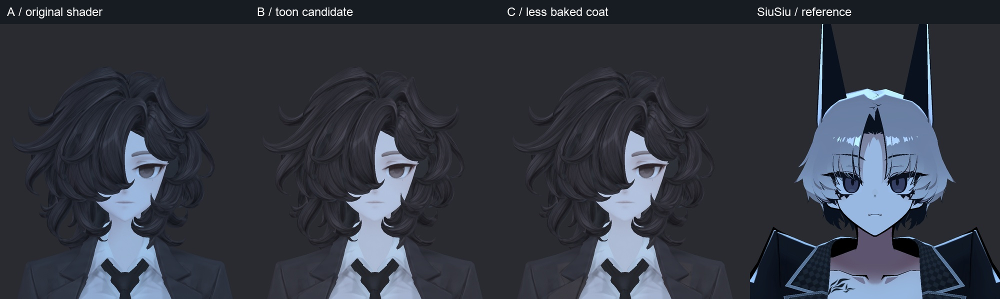
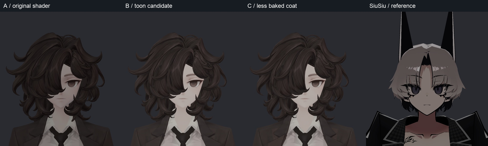
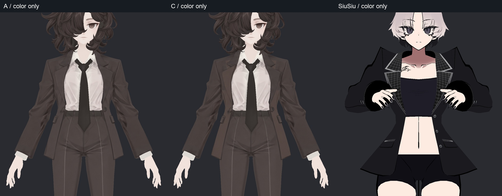

> **기록 시점 안내:** 아래는 해당 단계 당시의 보고서입니다. 후속 결정은 [최신 상태](../../STATUS.md)를 기준으로 읽어주세요. 모델·원본 텍스처·검증 원시 데이터는 이 문서 공유본에 포함하지 않습니다.

# v004 셰이더 비교 전체 사진

[작업 보고서](v004_WORK_REVIEW.md). 왼쪽부터 A 기존 / B 툰 / C 고정 명암 감소 / SiuSiu 참고. 모두 실제 Unity 렌더.

## FULL

## FACE

## PROFILE

## BACK

## TORSO

## TORSO_LIGHT_RIGHT

## WARM

## COOL

## KEY_OFF

## 색 레이어 진단

추가 색 레이어도 끈 상태이므로 SiuSiu 원래 헤어 색과 다르다.

