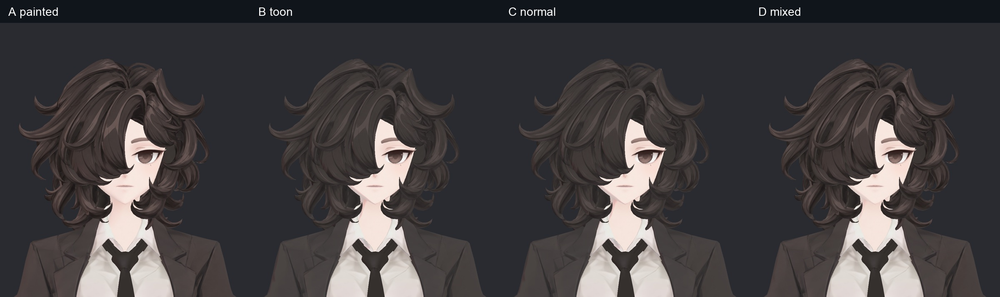
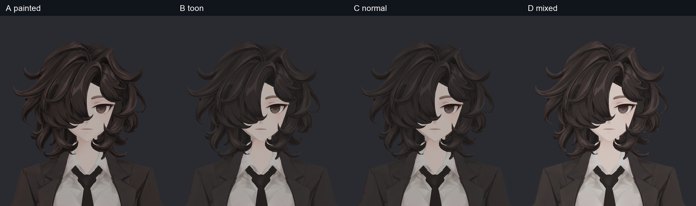
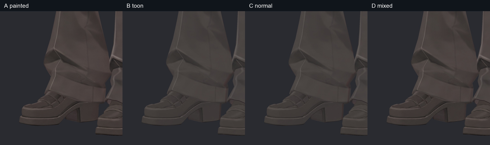
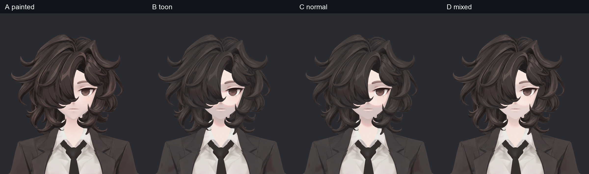
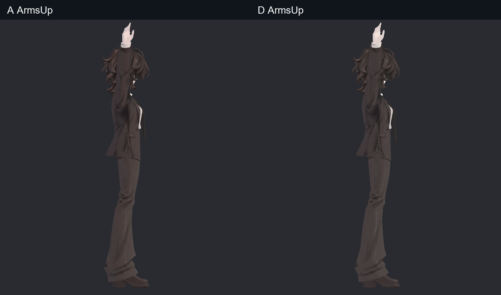
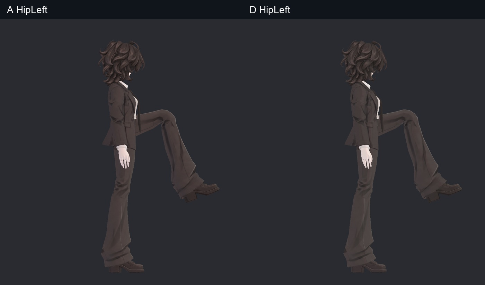
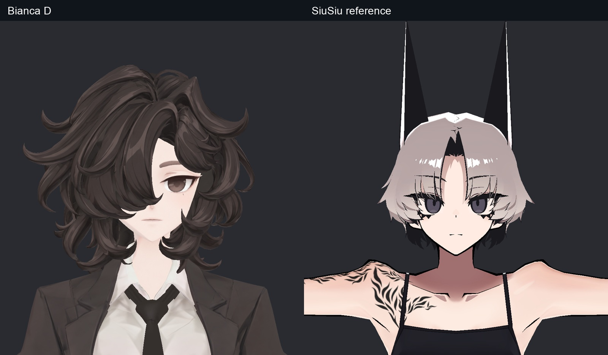

> **기록 시점 안내:** 아래는 해당 단계 당시의 보고서입니다. 후속 결정은 [최신 상태](../../STATUS.md)를 기준으로 읽어주세요. 모델·원본 텍스처·검증 원시 데이터는 이 문서 공유본에 포함하지 않습니다.

# v005 NPR 명암·노멀 A/B/C/D 비교

같은 v346 텍스처·형상에서 네 가지 재질을 실제로 만들고, 좌/우/상단 광원·낮은 밝기·높은 밝기와 팔 올리기/앞으로 모으기/숙임/좌우 고관절 굽힘을 비교했다. **D를 통합 후보로 선택했다.** A의 디테일을 유지하면서 어두운 환경에서 머리·옷·신발이 덜 묻혔다. 노멀맵의 추가 자체가 선택 이유는 아니다.

## 텍스처에 그림자를 그려도 되는가

NPR에서는 고정된 선·접촉 명암·디자인용 하이라이트를 채색으로 남기고, 광원에 따른 큰 밝기 변화는 셰이더로 분담할 수 있다. lilToon은 그림자 색·경계·강도를 따로 제어하며 MToon도 조명에 따른 음영과 채색된 음영색을 함께 다룬다. 따라서 그림자가 기본색에 있다는 사실만으로 잘못된 방식은 아니다. 다만 광원을 바꿔도 그 그림자가 고정되고 동적 그림자와 겹칠 수 있다. [lilToon 공식 그림자 문서](https://lilxyzw.github.io/lilToon/ja_JP/color/shadow.html), [MToon 공식 문서](https://vrm.dev/en/univrm/shaders/shader_mtoon/).

이번 비교는 이 분담을 실제 모델에서 시험했다. 색의 어두움을 곧바로 높이로 바꾸면 머리색·그려진 그림자까지 움푹한 요철로 오인하므로 채택하지 않았다. 노멀 시험은 기존 형상의 얕은 모서리를 베이크한 것이며, 그려진 모든 주름을 실제 요철로 복원한 결과가 아니다.

| 후보 | 실제 시험 | 판정 |
|---|---|---|
| A | 기존 명암·재질 그대로 | 디테일 기준. 어두운 조명에서 가닥/소매/신발이 묻히는 경향 |
| B | 의복·헤어·신발의 고정 명암 대비를 줄이고 더 선명한 툰 그림자 | 어두운 조건에서 가독성 저하, 상단 광원 얼굴의 회색/분홍 띠. 미채택 |
| C | B + 기존 형상 bevel tangent normal, 강도 0.35 | 독립적인 시각 이득이 작고 B의 단점을 해결하지 못함. 미채택 |
| D | 고정 명암은 약하게만 조절, 선/접촉 명암 유지, 동적 그림자와 최소 밝기 조절. 신발에만 제한된 normal 0.15 | 광원 변화에서 색층·디테일이 안정적이라 다음 통합 기준으로 선택 |

얼굴·셔츠·손·단추 색은 B/D의 고정 명암 조절 마스크에서 제외했다. D 신발 노멀은 원시 베이크의 비정상적으로 기운 438텍셀(역방향365개·양수 고경사73개)을 중립화하고 기울기를 8도로 제한했다. D의 핵심 이득은 조명 안정성이며 미세 노멀의 독립 이득이 크다고 주장하지 않는다. 186장 실제 렌더로 비교했다.

## SiuSiu와 비교

SiuSiu의 실제 프리팹을 같은 촬영 조건에 놓았다. SiuSiu는 기본 탱크톱/반바지 상태이며 Bianca와 같은 코트의 주름 비교가 아니다. 얼굴·헤어의 단순한 밝기 단계와 선의 가독성을 참고했다. Bianca는 원래 컬과 그려진 의상 주름이 더 많으므로 SiuSiu 재질 값을 그대로 복사해 같은 결과가 된다고 보지 않았다.

## 실패한 검사와 검증 범위

첫 Editor 포즈 적용은 중립 자세로 남아 실제 굽힘 비교로 사용할 수 없었다. 해당 결과는 폐기하고 이전 SDK에서 실제 굽힌 메시 좌표/노멀을 같은 카메라에 재현했다. 최신 ArmsUp/Hip/ArmsForward가 실제로 굽혀졌음을 독립 시각 검토자가 확인했다. 이것은 재질 비교용 재현이며 최종 리그의 새 검사는 [v348](../../avatar_modeling/v348_final_npr_review/v348_WORK_REVIEW.md)에서 별도로 실행했다.

최종 Unity 재질 후보는 `Bianca_v005_D.prefab`이다. A/B/C와 원시 베이크도 비교 사본으로 보존했다. 사진에서 새 필수 텍스처 수정은 확정하지 않았지만 얼굴 셸 내부 미세 경계와 바짓단의 작은 밝은 면은 [v346 잔여 기록](../../avatar_modeling/v346_npr_texture/v346_WORK_REVIEW.md)에 남겼다. PC VRChat 클라이언트·거울·스테레오 실행은 이번 Unity 렌더로 대체하지 않는다.
