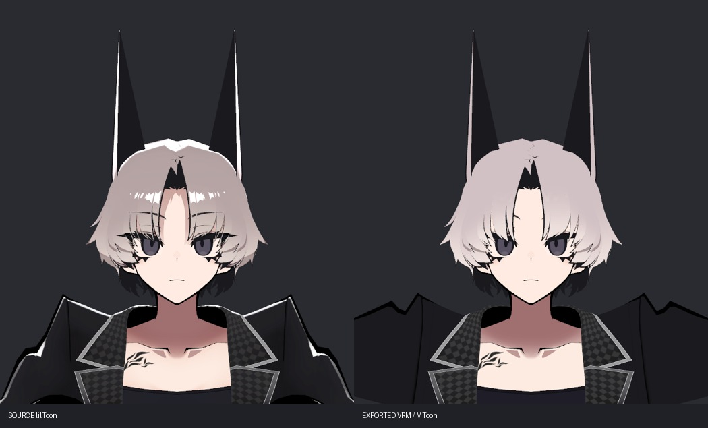
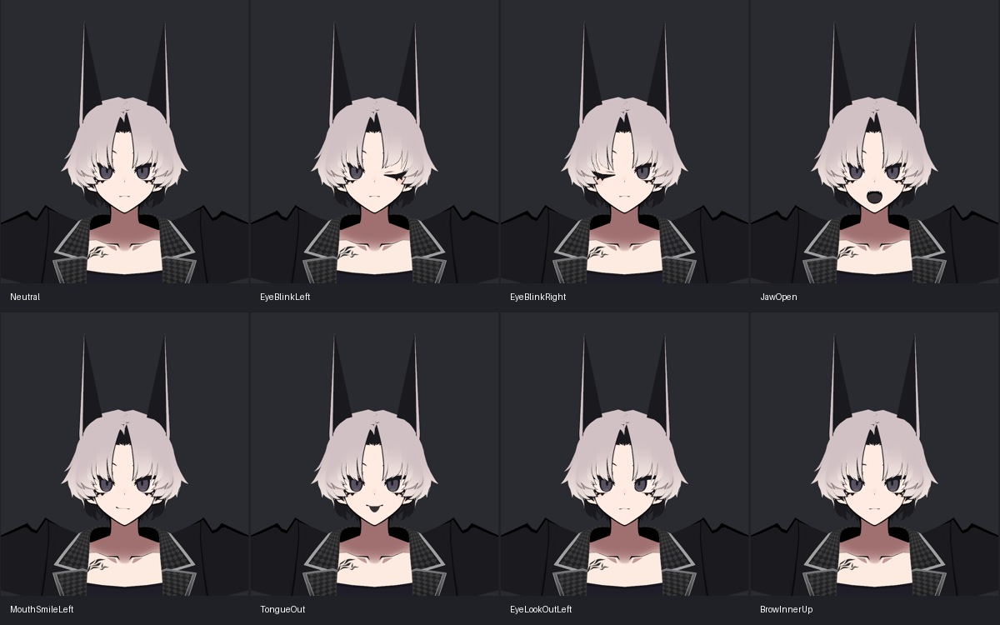
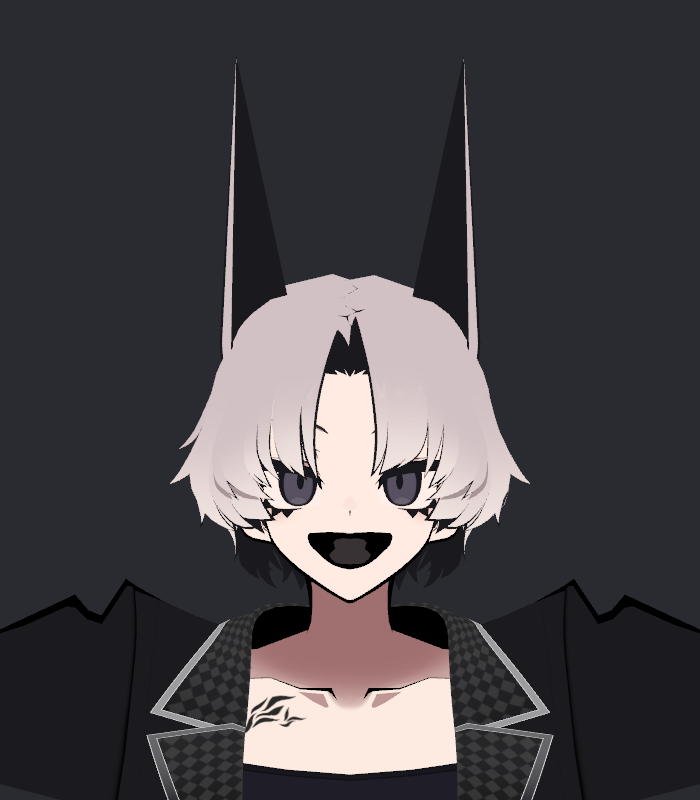
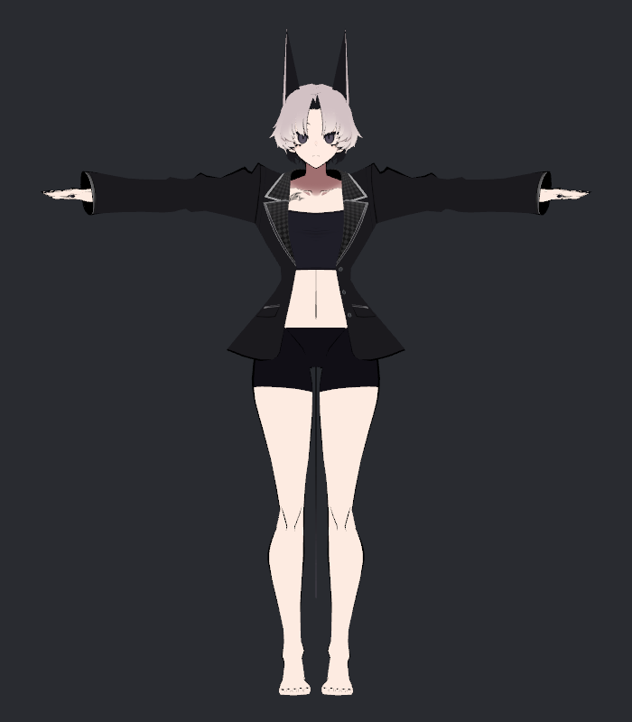

# v001 SiuSiu — iPhone / VMagicMirror용 VRM 검수본

**전달 파일:** [SiuSiu_iPhone_VMagicMirror_v001.vrm](https://github.com/notdevblue/astra-blender-test/blob/main/avatar_vrm/v001_siusiu/SiuSiu_iPhone_VMagicMirror_v001.vrm) · [Windows 연결 안내](v001_SETUP_KO.md) · [표정 매핑](v001_MAPPING.md)

사용자가 지정한 Windows + iPhone 11 + iFacialMocap + VMagicMirror 조합을 위한 **VRM 0.x 검수본**이다. SiuSiu v1.0.2의 최근 참고 비교와 같은 블레이저 차림을 사용했다. 원본 모델 제작자는 ADPX다. 구매 모델과 이 VRM은 개인 전달/비공개 작업 저장소에만 보관한다.

## 실제 결과

Unity 2022.3.22f1 + 공식 UniVRM 0.131.2로 내보내고, 출력 파일 자체를 UniVRM 런타임 로더로 다시 읽었다. 제작 프리팹의 미리보기만으로 성공을 판단하지 않았다.

- ARKit 52클립 중 실제 변형 31개, 의도적으로 빈 21개. 52종 완전 대응이 아니다.
- 좌우 눈 감기/눈꺼풀, 8방향 눈 본 회전, 눈썹, 입 벌리기·웃음·슬픔·늘림·오므림·혀를 연결했다. 기존 좌우 통합 입 키는 가운데 10mm 구간을 부드럽게 나눠 좌우에 배정한 근사다.
- VRC/vrc 더미 키는 사용하지 않았다. 실제 `mouth_a/i/u/e/o`, 눈/눈썹 키를 사용했다.
- VRM 기본 모음/깜빡임/감정 프리셋을 함께 제공한다. 파일에 65클립, 재수입 시 UniVRM 기본 시선 프리셋 4개가 더해져 69개로 확인된다. 기본 시선 프리셋은 비어 있으며 iPhone 시선은 ARKit 채널 8개를 사용한다.
- 원본 메시 사본에 표정 델타를 구성하고 의상 조절 상태를 기본형상에 구웠다. VRM 내보내기 과정에서 T포즈/본 좌표계를 정규화했다. 원래 PhysBone·VRChat 컨트롤러·Contacts는 이 파일에서 실행되지 않는다.
- 뒤/옆머리의 원래 본 4체인에 보수적 SpringBone을 설정했다. 원본 PhysBone 전체 변환이나 충돌/연속동작 검증 완료를 의미하지 않는다.

## 셰이더 전후

왼쪽 원본 lilToon, 오른쪽 내보낸 VRM을 재수입한 MToon이다. 얼굴은 같은 카메라·조명이며 어깨 차이는 VRM T포즈 정규화의 영향도 포함한다.

기본색 PNG와 UV를 유지했다. lilToon을 표준 VRM의 MToon으로 변경했고, 원본이 Shadow OFF인 점을 고려해 ShadeColor를 흰색으로 맞췄다. 초기 회색 ShadeColor에서 생긴 원치 않는 얼굴 명암은 최종에서 제거했다.

**남는 차이:** 머리와 옷의 강한 반사/외곽 밝기가 줄고, 앞머리 뒤 눈썹 표시가 가려진다. SiuSiu의 곱셈 MatCap·두 번째 MatCap·스텐실을 표준 MToon으로 동일 재현하지 못했다. 셰이더 동일성/원래 외형 완전 보존으로 채택한 파일이 아니다. 특수 셰이더를 포함하는 VSFAvatar를 VMagicMirror용 VRM의 대체물로 전달하지 않았다.

[VRM Converter for VRChat](https://github.com/esperecyan/VRMConverterForVRChat)은 VRChat→VRM 변환 도구이며 UniVRM에 의존한다. 이번 실제 출력은 UniVRM으로 수행했다. 로컬 lilToon 공식 `Editor/lilInspector/lilMaterialConvertUtility.cs`의 MToon 변환도 곱셈 모드(MatCapBlendMode 3)를 SphereAdd로 보내지 않는다. 따라서 자동 변환 패키지 사용만으로 이 효과가 유지되지는 않는다.

## 표정 직접 검수

좌우 윙크·입 벌리기·시선·미소·혀가 실제 재수입한 파일에서 움직였다. 웃음은 원형 얼굴을 유지하는 작은 변화다. 혀는 원본의 어두운 도형 형태이며 사실적인 혀가 아니다. 턱 벌리기+양쪽 미소+혀를 모두 100%로 주면 입 모양이 과장된다. VRC 원본의 상태별 표정 선택 로직을 ARKit의 가산식에 완전히 재현한 것은 아니다.

## 검증 근거와 한계

- 재수입 Humanoid `isHuman=true`, Avatar `isValid=true`.
- 69클립을 각각 100% 적용, 실제 바인딩이 있는 43클립 모두 얼굴 정점 변화 확인. 비유한 좌표 없음. 기본/ARKit 중복을 독립 표정 수로 합산하지 않는다.
- 전부 0으로 복귀한 얼굴 정점 최대 차이 0. 4종 복합 입력도 유한성 확인 및 렌더. 모든 가능한 조합의 자기교차 검사는 아니다.
- 재수입 69개 단독 표정+복귀+사선2+복합4+전신의 최종 사진을 생성했다. 전체 단독 표정 접촉시트 5장과 주요 원본 크기 사진을 직접 검수했다.
- Khronos glTF Validator: **오류 0, 경고 2**. 경고는 VRM 확장 이름의 일반 glTF 명명 규칙과 이미지1의 부가 색공간 정보다. 이 검사기는 VRM 확장 자체를 검증하지 않으므로 실제 UniVRM 재수입 결과와 구분한다.
- 원본 SiuSiu 420파일 SHA-256 동일. 내보내기가 PNG 가져오기 설정 7개의 압축 값을 바꾼 것을 발견하고 사전 해시와 정확히 같은 바이트로 복구했다. 재현 스크립트에는 meta 자동 백업/복구를 추가했다.
- 사용자 Unity 장면 path 빈값/dirty=false 유지. 비앙카 v334/v324 및 UV·텍스처 작업 채택 상태 변경 없음.
- **실제 Windows VMagicMirror 실행, iPhone 11 송수신/캘리브레이션은 미검증**이다. 현재 작업 컴퓨터는 macOS다. [연결 안내](v001_SETUP_KO.md)로 Windows에서 첫 실행 검수를 진행한다.

근거: `BUILD_REPORT.json`, `IMPORT_VERIFY.json`, `SiuSiu_iPhone_VMagicMirror_v001_GLTF_VALIDATION.json`, `SOURCE_PRESERVATION.json`, `SCENE_PRESERVATION.json`.

## 재현과 보관

`source/install_project.py`로 보관된 공식 UniVRM 패키지와 Editor 도구를 기존 Unity 프로젝트에 설치한다. SiuSiu 원본 가져오기와 lilToon은 기존 프로젝트에 있어야 한다. 컴파일 후 `MacSiuVrmBuild.Build`, 이어서 `MacSiuVrmBuild.Verify`를 호출한다. 내보내기 전 임시 렌더는 스키닝 갱신과 컴포넌트 제거 시점의 영향을 받을 수 있어 최종 근거는 `v001_IMPORTED_*` 사진이다. 초기 진단 미리보기는 `trials/preexport_previews/`에 보존했다.

VMagicMirror의 [Perfect Sync 명명 규칙](https://malaybaku.github.io/VMagicMirror/en/tips/perfect_sync/)과 [iFacialMocap 연결 안내](https://malaybaku.github.io/VMagicMirror/en/docs/external_tracker_ifacialmocap/)를 확인했다. 원본 [SiuSiu 제품 페이지](https://adpx.booth.pm/items/8426340).

원본 모델·변환 VRM·Unity 패키지·코드·원시검증은 이 문서 저장소에 포함하지 않습니다. VRM 링크는 권한이 있는 비공개 작업 저장소에서만 열립니다.
