# v002 추가 표정 사진 검수

최종 VRM 재수입 사진이다. 새 21개는 원본 전용 데이터가 아닌 근사이며, 모든 정적 입력의 미관 합격은 아니다. MouthClose 단독 강입력은 실패가 보이는 검수 사진이다.

## 100% 입력

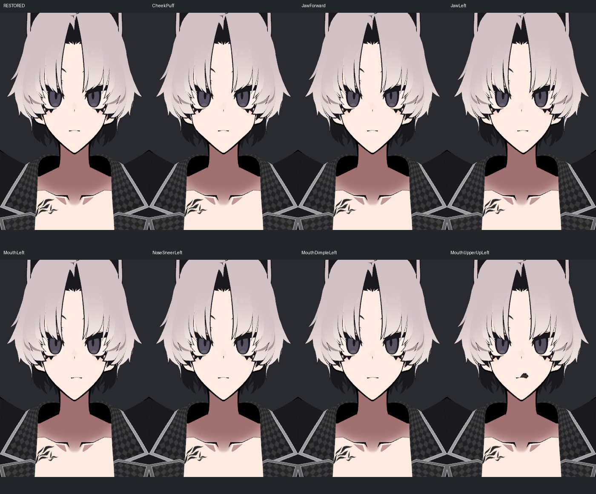

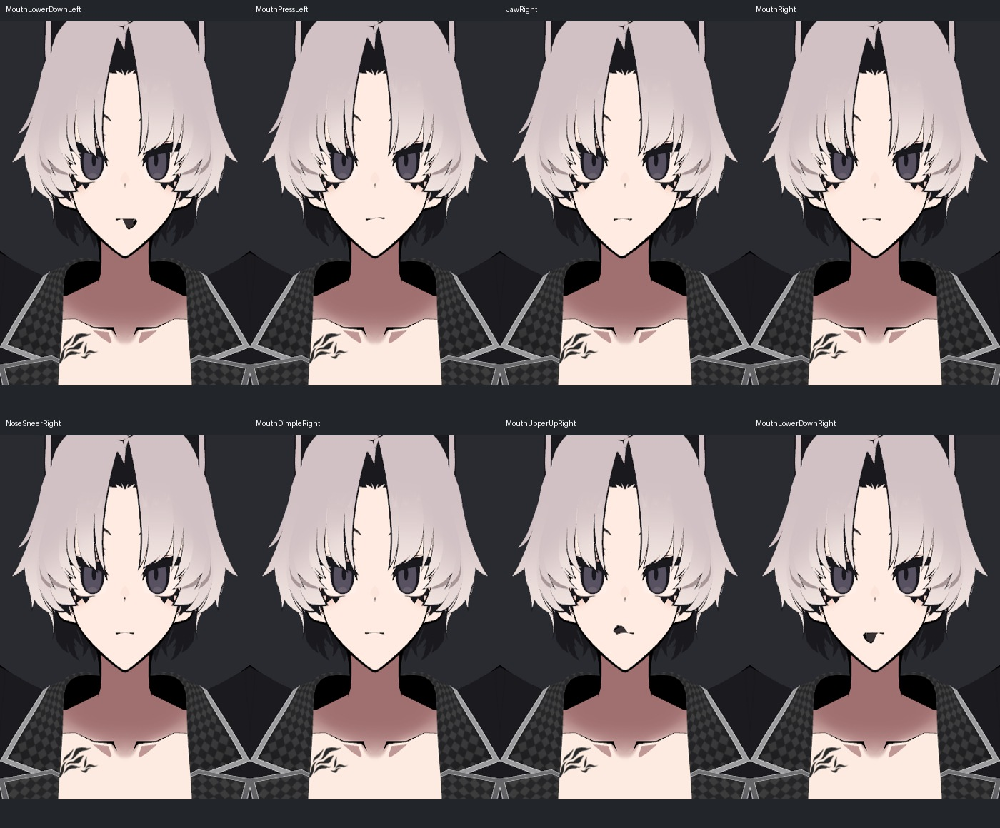

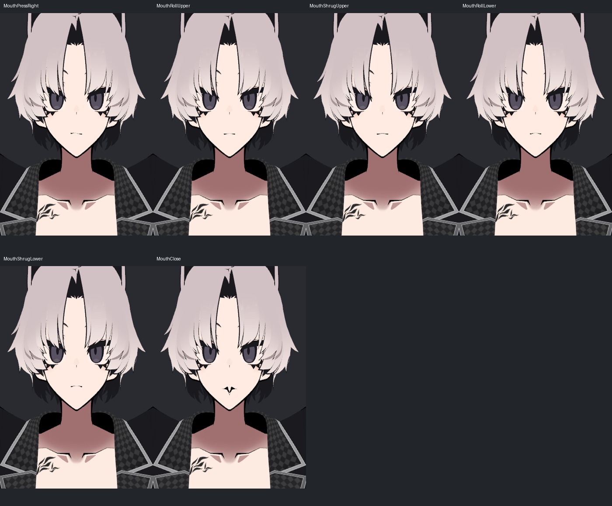

## 50% 입력

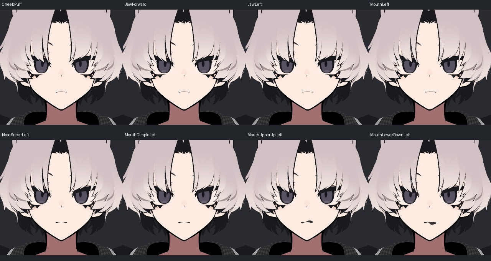

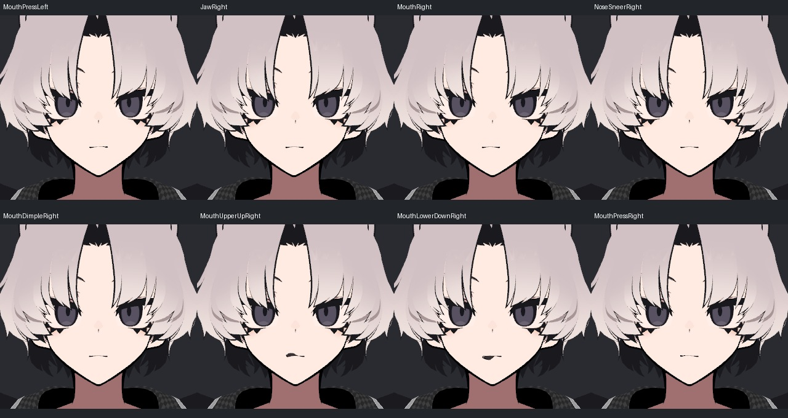

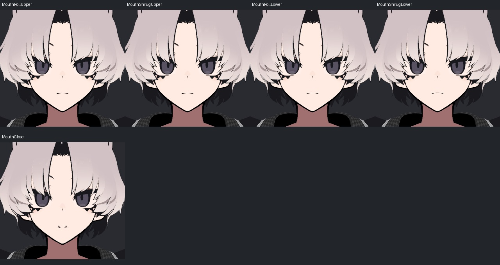

## 사선 100% 입력

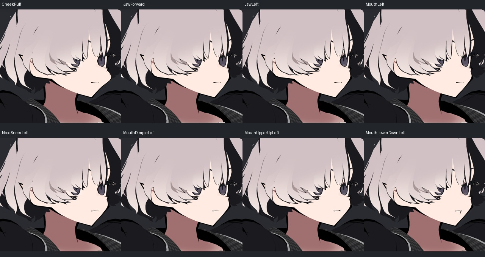

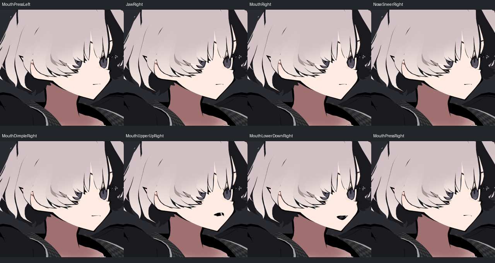

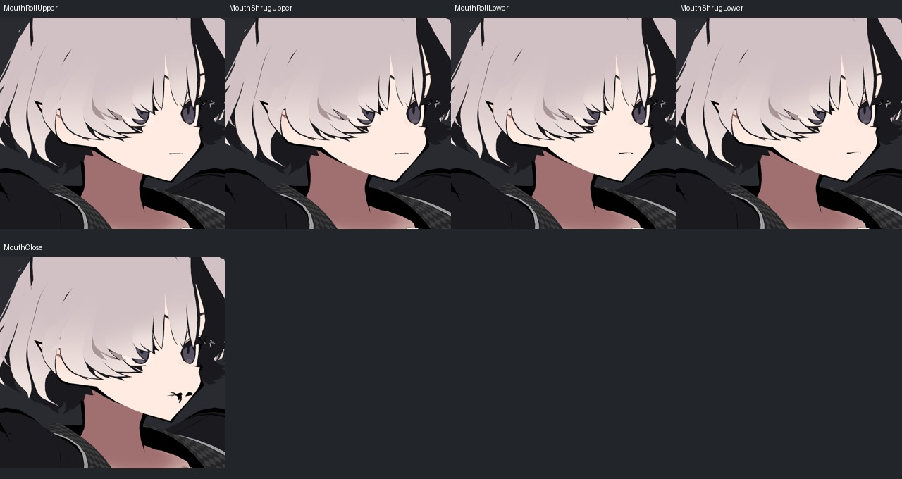

## 방향과 복합 입력

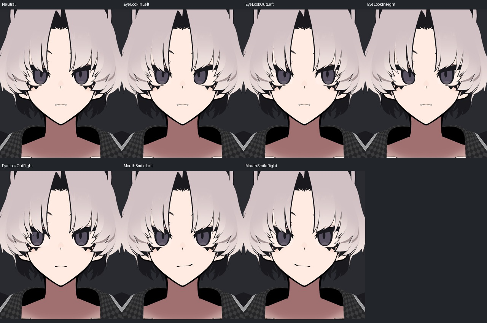

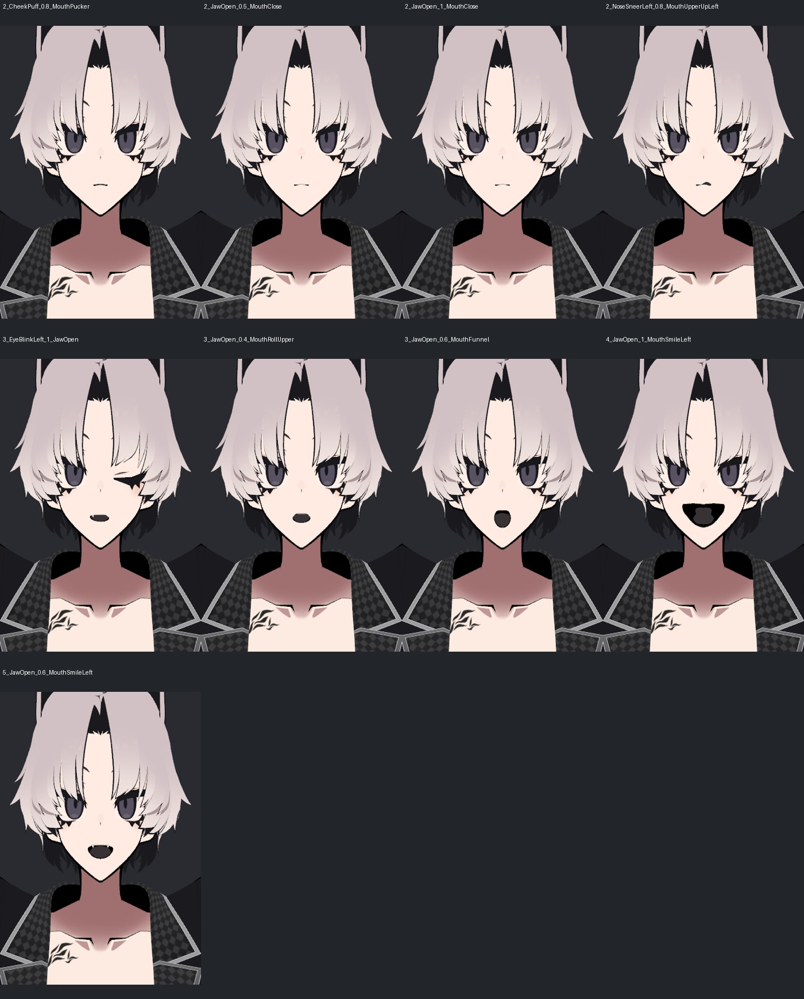

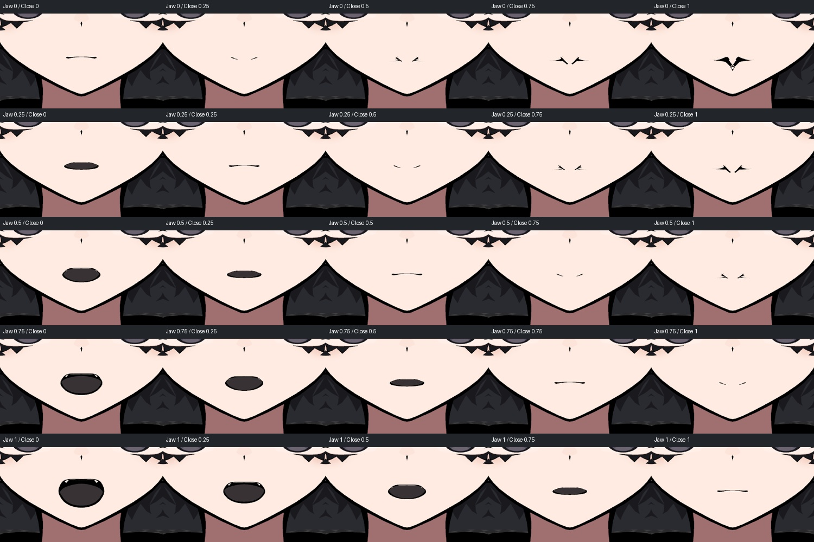

[전후 사진과 판단 근거](v002_PERFECT_SYNC_REVIEW.md)
