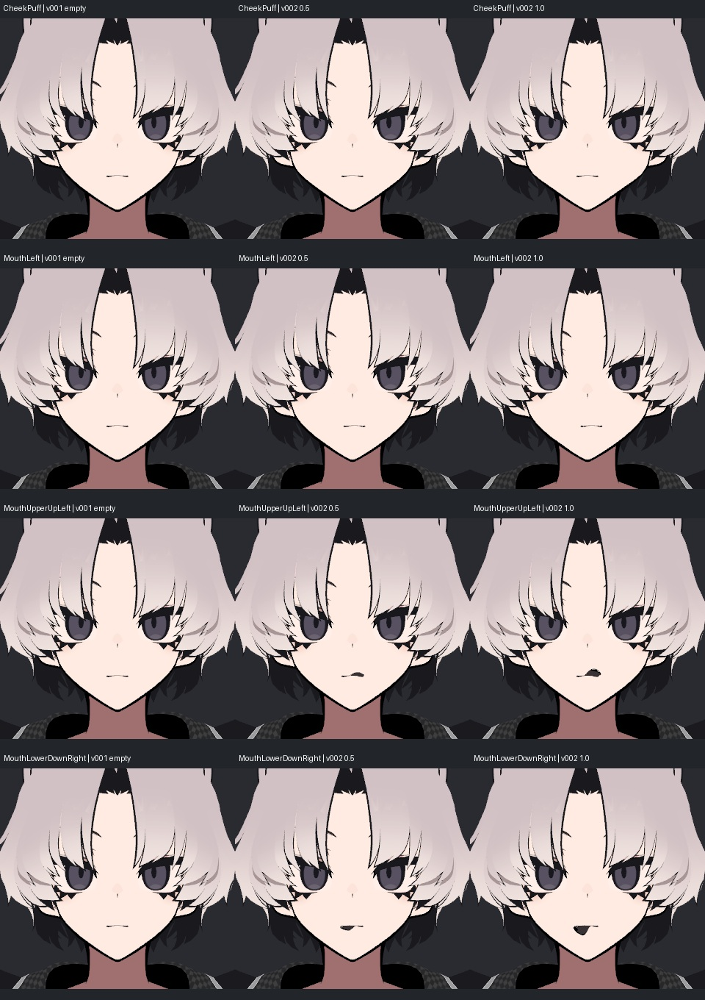

# v002 SiuSiu — 누락 21개 표정 추가 / Perfect Sync 검수본

2026-09-13 · 대상: Windows + iPhone 11 + iFacialMocap + VMagicMirror.

v001에서 비어 있던 21개를 기존 얼굴 메시의 변형으로 추가했다. **이제 ARKit 52개 모두 실제 바인딩과 움직임이 있다.** 원본 제작자가 제공한 52종 전용 페이셜 데이터를 구입·이식한 것이 아니라, 원래 표정과 기존 정점을 이용해 만든 근사다. **MouthClose 과입력의 입선 뒤집힘이 남아 최종 품질 합격·실기 검증 완료는 아니다.**

사용자는 “제가 미지원이라고 설명한 항목들”의 보완을 요청했다. 특정 iPhone 연결 장애가 확인된 것은 아니며, 이번 작업을 통신 장애 해결로 해석하지 않는다. 비앙카 작업과 채택 상태는 그대로다.

## 전후 사진

왼쪽은 v001의 빈 채널에 100% 입력, 가운데/오른쪽은 v002의 50%/100%다. 볼 부풀림·입 전체 이동은 작게, 위아래 입술 열림은 뚜렷하게 변한다. 같은 재수입 렌더 조건이다.

볼 부풀림은 뺨 윤곽과 앞쪽 부피를 조금 늘린다. 코 찡그림·입꼬리 뒤 당김·입술 말기는 이 작은 코와 얇은 입술, 단순 MToon 조명에서 변화가 미세하다. 연결되었다는 사실과 모든 표정이 크게 드러난다는 평가는 구분한다.

## 추가한 21개

| 채널 | 실제 작업 |
|---|---|
| CheekPuff | 양 볼을 바깥/앞으로 부풀림 |
| NoseSneerLeft / Right | 코 옆과 인접 윗볼을 위로 당김 |
| JawForward / Left / Right | 턱·아랫입 주변의 전방/좌우 이동 |
| MouthLeft / Right | 양 입술과 입 안을 함께 좌우 이동 |
| MouthRollUpper / Lower | 윗입술/아랫입술을 안쪽으로 말기, 치아 제외 |
| MouthShrugUpper / Lower | 윗입술/아랫입술을 앞으로 내밀고 올림 |
| MouthDimpleLeft / Right | 해당 입꼬리를 뒤로 당김 |
| MouthUpperUpLeft / Right | 원래 A 표정에서 윗입술 움직임을 분리 |
| MouthLowerDownLeft / Right | 원래 A 표정에서 아랫입술 움직임을 분리 |
| MouthPressLeft / Right | 해당 아랫입술을 위로 압축 |
| MouthClose | JawOpen과 함께 사용하는 입술 닫힘 보정 |

원래 7,159개 얼굴 정점을 사용했다. 새 정점·면·UV·본·웨이트는 만들지 않았다. 추가 변형의 노멀 변화량은 원래 노멀에 더하는 방식이며 중립 노멀은 보존했다. [전체 사진 검수](v002_EXPRESSION_GALLERY.md)에서 추가 21개 각각의 최대/절반/사선 사진을 볼 수 있다.

## 좌우 방향 수정

실제 Humanoid의 LeftEye는 원본 좌표 -X, RightEye는 +X였다. v001의 좌우 입 표정 분리 마스크와 눈의 In/Out 회전 부호가 이 기준과 반대였다. v002에서 마스크와 수평 회전 부호를 고쳤다. 눈 회전축 자체는 원래 Head 축과 일치해 변경하지 않았다. 아래 Left/Right는 캐릭터 기준이며 정면 사진의 화면 좌우와 반대다.

## 남은 문제: MouthClose 입력 조합

입 다물기는 턱 벌림을 상쇄하는 보정이다. JawOpen과 MouthClose에 같은 값을 입력하면 입술이 닫히는 것을 확인했다. 하지만 **MouthClose가 JawOpen보다 커지면 입선이 겹치거나 뾰족하게 뒤집힌다.** 이 조건을 합격으로 처리하지 않았다. 표준 VRM의 독립적인 가산 표정만으로 두 입력의 비율을 자동 제한하지는 않았다. 실제 기기의 계수와 입술 모양에 맞춘 후속 조정이 필요하다.

아래는 행=JawOpen, 열=MouthClose, 각각 0 / 0.25 / 0.5 / 0.75 / 1이다. 대각선은 닫힘, 오른쪽 위는 과보정 실패 영역이다.

웃음·턱 벌림·혀를 모두 최대로 올리면 기존 v001처럼 입이 크게 과장된다. 분리한 위아래 입술도 높은 입력에서는 입꼬리가 삼각형처럼 보인다. 실사 입술의 해부학적 형태와 동일한 52종 리그는 아니다.

## 최종 파일 검사

- UniVRM 0.131.2로 VRM 0.x 출력 후 최종 파일 재수입. Humanoid / Avatar 유효.
- VMagicMirror 공식 코드의 52개 이름과 정확히 대조, 누락 0·빈 사용자 채널 0. 각 채널에 실제 메시 바인딩 1개, 연속 입력.
- 재수입 총 69클립 중 실제 바인딩 64개 모두 정점 변화 > 0, 유한성 통과. 중립 복귀 최대 오차 0. 기본 Neutral과 일반 LookAt 프리셋 4개는 빈 상태이며 Perfect Sync 시선은 EyeLook 8개로 처리한다.
- 52개 절반 입력 사진, 69개 최대 입력 사진, 복합 9조건, 상세 56뷰, 입 닫힘 25조합을 생성. 직접 본 선별 사진/실패 조건은 갤러리와 검수 기록에 구분했다. 사진 생성 수를 전부 직접 검수한 수로 계산하지 않는다.
- 최종 glTF 검증 오류 0 / 경고 2. 일반 검증기가 VRM 확장 이름을 경고하고 PNG 하나의 색상 메타데이터를 경고한다. glTF 검증 자체는 VRM 확장을 검증하지 않으므로 실제 UniVRM 재수입을 별도로 실행했다.
- 초기 출력은 매우 작은 부동소수점 경계의 `ACCESSOR_MIN/MAX_MISMATCH`가 있었다. 실제 저장된 sparse 배열에서 min/max를 다시 계산해 메타데이터만 정정했다. 바이너리 메시/텍스처 데이터는 그대로다. 초기 출력은 trials에 보존했다.
- v001과 최종 VRM의 중립 위치·노멀·UV·웨이트·인덱스 배열, 노드, 재질 값 동일. 동일 조건 중립 사진도 픽셀 차이 0.
- 원본 참고 파일 420개와 v001 파일 122개, 총 542개 SHA-256 동일. 사용자 Unity 장면 경로/dirty 상태 보존.
- Windows VMagicMirror 실행, VRM0→VRM1 앱 내부 변환, 실제 iPhone 송수신은 이 Mac에서 시험하지 않았다. 모든 표정 조합의 자기 교차·연속 추적 품질 검증도 아니다.

## 셰이더와 전달

v001의 MToon을 그대로 유지했다. 원본 기본색 텍스처는 같지만 lilToon의 곱셈/추가 MatCap과 스텐실은 복원하지 않았다. 머리·옷 반사와 앞머리 위 눈썹 표시의 차이가 남는다. [v001 셰이더 전후 사진](https://github.com/notdevblue/astra-avatar-docs/blob/main/avatar_vrm/v001_siusiu/v001_VRM_REVIEW.md)을 참고한다.

전달 파일은 `SiuSiu_iPhone_VMagicMirror_v002.vrm`과 같은 이름의 ZIP이다. Unity 편집용 `SiuSiu_VRM_v002.unitypackage`, 재현 소스와 입력은 비공개 작업 저장소에 보관한다. 공개 문서 저장소에는 설명과 선별 렌더 사진만 올린다. [Windows 설정 안내](v002_SETUP_KO.md).

## 근거

[VMagicMirror 공식 Perfect Sync](https://malaybaku.github.io/VMagicMirror/en/tips/perfect_sync/)의 52개 이름과 연결 방식, [Apple ARKit 표정 정의](https://developer.apple.com/documentation/arkit/arfaceanchor/blendshapelocation)를 기준으로 했다. VMagicMirror 소스의 채널 목록·입 추적 설정도 검토했다: [ExternalTrackerPerfectSync.cs](https://github.com/malaybaku/VMagicMirror/blob/8c979820d529ac970411fc568a9d74b36efdb659/VMagicMirror/Assets/Baku/VMagicMirror/Scripts/AvatarControl/ExternalTracker/ExternalTrackerPerfectSync.cs). 이 코드 대조는 해당 앱을 실제 실행한 결과와 구분한다.
