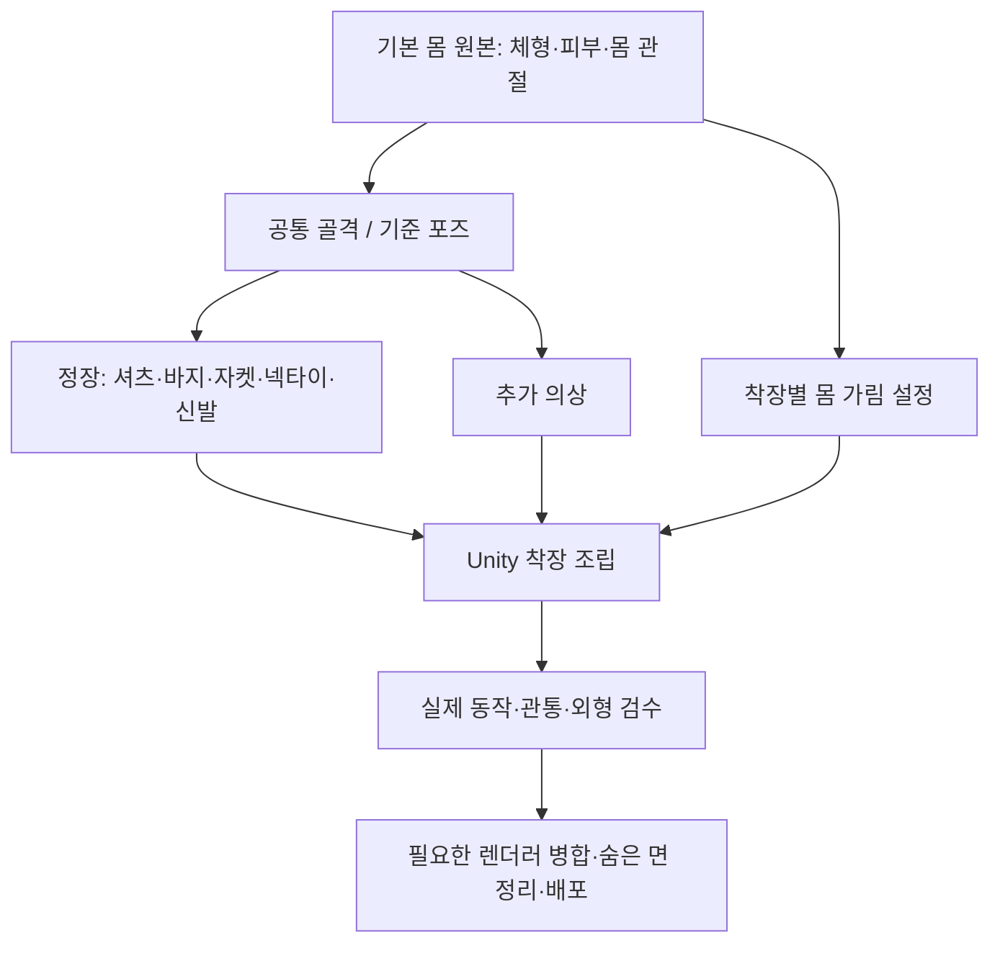

# v001 · 비앙카를 기본 몸 + 독립 의상으로 만들면 더 쉬워질까?

2026-09-15 · 별도 R&D / 자료 조사 및 저장 파일 확인 / 모델 전환 미실행

**앞으로 옷을 바꾸거나 여러 벌 만들 계획이라면, 의상 없이도 쓸 수 있는 기본 몸과 독립 의상으로 제작하는 방향을 추천한다.** 몸의 체형·관절을 공통 기반으로 관리하고, 옷마다 형태·UV·웨이트·물리를 따로 다루기 쉬워진다. 다만 **지금 정장 한 벌을 완성하는 작업이 즉시 훨씬 쉬워진다고 보기는 어렵다.** 기존 옷 아래의 몸이 완성되어 있지 않다면 몸 제작과 새 관통 검사가 추가된다. 단순 분리만으로 소매 각짐·자켓 허리 꺾임·텍스처 번짐이 해결되는 것도 아니다.

비앙카에는 **기존 외형을 보존한 채 독립 의상 작업 구조를 단계적으로 만들고, 재사용 가능한 몸의 완성도를 먼저 확인하는 전환**이 적절하다. 전신을 새로 만든 뒤 지금까지의 작업을 한꺼번에 교체하는 방식은 권하지 않는다. 아래 권장안은 조사 결론이며 제작 지시나 채택 기록이 아니다.

## 1. 현재 비앙카에서 먼저 구분할 점

사용자가 말한 “몸과 옷을 함께 모델링한 상태”와 Unity의 “메시 오브젝트 하나”는 같은 뜻이 아니다. 최신 인계가 기준으로 지정한 **v352 Final.prefab**을 이번에 직접 읽었다. v353 텍스처 재작업은 폐기 상태이며 조사 기준으로 채택하지 않았다.

| 실제 저장 구조 | 이번 확인 | 의미 |
|---|---|---|
| `Bianca_BodyHair` | 재질 슬롯 7개: details, face, hair, hands, pants, shirt, shoes | 몸 관련 부위와 여러 옷·부품이 같은 렌더러 안에 있다 |
| `Bianca_Coat` | 코트 재질 슬롯 1개, 별도 메시 | 코트는 이미 오브젝트 수준에서 분리되어 있다 |
| v352 원본 Blend / Final.prefab | 전달 기록의 SHA-256과 두 파일 모두 일치 | 보존된 기준 파일을 조사했다 |
| 옷 아래의 완전한 몸 | 이번 조사에서 확인하지 못함 | 의상을 숨기면 바로 완전한 몸이 나온다고 가정할 수 없다 |

확인 근거: [로컬 구조·해시 기록](v001_VERIFICATION.md). 재질 이름과 슬롯은 실제 파일의 참조를 해석한 결과다. **슬롯 분리는 편집 출발점이 될 수 있지만, 피부와 옷의 모든 경계가 이미 떨어져 있거나 별도 파츠로 즉시 추출 가능하다는 증거는 아니다.** `BodyHair`라는 이름도 완전한 피부 몸을 보장하지 않는다.

따라서 이번 전환의 핵심은 “메시를 1개에서 여러 개로”가 아니라 **독립적으로 검수할 기본 몸을 확보하고, 의상별 편집·구동 책임을 나누는 것**이다. 몸통·위팔·허벅지 등 가려진 표면의 존재, 연결, 피부 UV, 웨이트는 후속 사본에서 확인해야 한다. 부족한 몸의 양을 측정하지 않았으므로 소요 일수나 절감률은 제시하지 않는다.

## 2. SiuSiu와 Lapwing은 어떻게 되어 있나?

### 로컬 저장 구조와 제작자 설명을 함께 확인

v335 조사 당시 저장된 렌더러 목록을 다시 읽고, 해당 SiuSiu·Lapwing의 프리팹과 메시 원본 5파일을 현재 파일과 해시 비교했다. **5파일 모두 당시와 일치**했다. 이번에는 새 Unity 장면이나 Play를 실행하지 않았다. 아래 활성 상태·수량은 v335 당시 선택 착장 기준이고, 제품의 모든 버전·착장에 대한 수치가 아니다.

| 모델 | 로컬 구조 확인 | 제작자 공개 자료 | 비앙카에 주는 의미 |
|---|---|---|---|
| SiuSiu | `Body`, `Body_Base`와 `Costume_Cloth2_Blazer`, Shirt, Cardigan, Shoes 등 개별 렌더러. 선택 착장 활성 10개 / 전체 목록 25개 | 기본 몸 셰이프키 112개, Kisekae 착장 프리팹·의상 전환 메뉴를 명시 | 몸과 의상 변형을 별도 자산으로 관리하는 실제 사례 |
| Lapwing | `Body`, `Body2NoInsideMesh`, `LapBolero`, `LapOveralls`, 신발·양말·가방이 별도. 선택 착장 활성 8개 | 기본 착장과 속옷 상태의 기본 몸을 구분해 제공. 기본 착장 오브젝트 8개, 기본 몸 5개를 명시 | 편집용 몸과 착장용 구성을 나누는 실제 사례 |
| 비앙카 v352 | BodyHair 7슬롯 + Coat 1슬롯, 렌더러 2개 | 자체 작업 파일 확인 | 부품 단위 재질 구분은 있으나 독립 기본 몸의 완성도는 미확인 |

출처: [SiuSiu 제작자](https://adpx.booth.pm/items/8426340), [Lapwing 제작자](https://kujishift.booth.pm/items/4993931), [로컬 기록](v001_VERIFICATION.md). SiuSiu 제작자의 일반판 8 SkinnedMeshes와 로컬 Kisekae 선택 착장의 활성 10개는 서로 다른 구성이다. 서로 대체하지 않는다. Lapwing의 `Body2NoInsideMesh`라는 이름만으로 삭제 영역을 단정하지 않는다.

### 사진으로 확인한 의상 차이

아래는 **2026-09-12 v335 원래 재질 비교 사진을 그대로 재사용**한 것이다. 이번에 세 장 모두 직접 열어 확인했다. 비앙카 사진은 당시 v334/v324 외형이며 최신 v352의 결과 사진이 아니다. 포즈·핏도 다르므로 구조 분리의 전후나 품질 순위로 사용하지 않는다.

| 비앙카 · 기존 정장 | SiuSiu · 선택 블레이저 착장 | Lapwing · 기본 착장 |
|---|---|---|
|  |  |  |

비앙카는 셔츠·넥타이·허리·긴 자켓이 겹친다. SiuSiu는 몸 앞쪽 노출이 넓고 안쪽 상의와 블레이저가 구분된다. Lapwing은 넓은 볼레로와 오버올의 겹침 구조다. 이 차이 때문에 참고 모델의 옷 웨이트나 물리 수치가 비앙카 정장에 그대로 맞는다고 볼 수 없다. 사진은 착장 구조를 이해하는 보조 자료이며, 옷 아래 숨은 몸의 완전성을 증명하지 않는다.

### 분리형 모델도 관통 문제는 남는다

SiuSiu 제작자는 2026-08-28 업데이트에 셔츠 어깨 토폴로지 수정과 특정 포즈의 겨드랑이 몸 관통 수정을 기록했다. Lapwing 제작자는 팔꿈치 굽힘에서 소매 슬릿이 팔을 일부 관통할 수 있다고 명시한다. 즉, **분리형은 문제를 나눠 다루기 좋은 구조지만 관통 없는 결과를 자동으로 만드는 구조는 아니다.** [SiuSiu 변경 기록](https://adpx.booth.pm/items/8426340), [Lapwing 주의사항](https://kujishift.booth.pm/items/4993931).

이 사례는 비앙카의 큰 함몰이나 벌어짐을 허용하는 근거가 아니다. 서로 다른 모델의 구체적 증상을 같은 결함으로 판정하지 않는다.

## 3. 무엇이 쉬워지고 무엇은 그대로 남나?

다음 평가는 공식 워크플로와 비앙카 구조를 바탕으로 한 **설계 판단**이다. 실제 시간 비교 실험 결과는 아니다.

| 작업 | 분리 후 기대 이점 | 여전히 필요한 일 |
|---|---|---|
| 두 번째·세 번째 의상 제작 | 체형·골격·피부를 공통 기반으로 재사용 | 새 옷의 핏, 면 흐름, UV, 웨이트와 관통 검수 |
| 옷만 재채색·UV 편집 | 피부·얼굴을 건드리지 않고 대상 부위 작업 가능 | 기존 디테일 보존, 전사·여백·밉 검사. 오브젝트 분리만으로 UV 조각이 정리되지는 않음 |
| 몸의 관절 검수 | 옷을 숨기고 몸 자체의 굽힘을 판단 가능 | 옷의 굽힘은 따로 맞춰야 함. 몸 웨이트가 정답이어도 소매가 예쁜 것은 아님 |
| 옷의 웨이트 작업 | 몸 웨이트를 초기값으로 전사할 수 있음 | 넓은 소매·치마·자켓 자락에는 별도 분담과 옷 전용 본이 필요할 수 있음 |
| 물리 문제 조사 | 자켓/넥타이/몸을 따로 숨겨 원인 분리 용이 | 본 배치·웨이트·PhysBone·콜라이더·초기화·복귀 검수 |
| 의상 전환 | 프리팹/메뉴 단위로 조합 가능 | 몸 가림, 체형 키 동기화, 다중 의상 충돌·조합 관리 |
| 성능 | 배포 시 숨은 몸과 불필요한 부품을 정리할 여지 | 분리한 렌더러·재질·몸 표면을 전부 남기면 비용이 오를 수 있음 |

웨이트 전사는 제작 시작을 돕는 도구다. Blender Data Transfer는 정점 그룹 등 데이터를 메시 사이에 옮기지만, 의상의 실루엣이나 주름 품질을 자동 설계하지 않는다. 비앙카의 기존 정장에는 이미 조정된 웨이트가 있으므로 새 몸에서 전역 재전사하기보다 기존 값을 먼저 보존하고 필요한 구간만 비교하는 편이 합리적이다. [Blender 공식 Data Transfer 문서](https://docs.blender.org/manual/en/4.3/modeling/modifiers/modify/data_transfer.html).

## 4. 권장 제작 구조

이 도식은 **제안하는 자산 구성**이며 비앙카에 구현된 상태가 아니다.

기본 몸은 의상을 제거해도 검수할 수 있는 원본으로 보관한다. 몸과 옷은 별도 메시로 편집하되 **같은 골격·바인드 기준**을 사용한다. 독립 파츠라고 해서 서로 다른 신체 골격으로 움직여야 하는 것은 아니다. 옷 고유의 움직임에는 필요한 보조 본만 추가한다. 현재 A 포즈를 유지해도 이 구조는 가능하며 T 포즈 전환은 선행 조건이 아니다.

Unity에서는 대상 몸에 맞게 제작한 의상 프리팹을 조립할 수 있다. Modular Avatar의 Merge Armature는 의상 본과 Skinned Mesh 참조를 연결한다. **본 연결 도구가 다른 체형의 옷을 자동으로 완전히 맞춰 주는 것은 아니다.** [Merge Armature 공식 문서](https://modular-avatar.nadena.dev/docs/reference/merge-armature).

체형 변경을 지원하려면 몸과 옷 양쪽에 대응하는 셰이프키를 만들고 값을 동기화한다. Blendshape Sync는 이미 있는 키의 값을 맞추며, 없는 옷 변형을 생성하지 않는다. Animator로 구동되는 런타임 키를 지원하고 내장 eye look/viseme에는 제한이 있어 향후 얼굴 작업과 혼동하지 않는다. [Blendshape Sync 공식 문서](https://modular-avatar.nadena.dev/docs/reference/blendshape-sync).

### 옷 아래 몸은 항상 전부 그려야 하나?

그럴 필요는 없다. **편집용 원본에는 몸을 보존하고, 착장별로 보이지 않는 영역을 처리**하는 방식이 적절하다. 옷을 벗거나 다른 옷으로 바꿀 수 있는 구성이라면 그 상태에 필요한 몸은 남겨야 한다. 자켓을 열거나 팔을 들 때 보이는 겨드랑이·목·손목 주변을 중립 자세만 보고 제거하면 안 된다.

Modular Avatar는 의상에 맞춰 몸의 숨김/축소 키를 적용하는 구성을 안내한다. Avatar Optimizer의 Remove Mesh By Mask는 지정 영역의 면을 제거할 수 있다. 고정 착장의 빌드에서 제거한 면은 실행 중 옷을 꺼도 돌아오지 않으므로 전환 가능한 모든 착장에서 계속 가려지는 범위만 제거해야 한다. [의상 제작자 안내](https://modular-avatar.nadena.dev/docs/distributing-prefabs/for-outfit-creators), [Remove Mesh By Mask](https://vpm.anatawa12.com/avatar-optimizer/en/docs/reference/remove-mesh-by-mask/).

### 분리하면 옷이 몸과 자동으로 충돌하나?

아니다. 메시 분리와 물리 시뮬레이션은 별개다. PhysBone은 Transform/본 체인을 움직이고 정해진 충돌 구성을 사용한다. 기본 몸을 추가했다고 옷의 모든 삼각형이 몸 표면을 감지하는 것은 아니다. 비앙카 자켓에는 어깨·몸판의 스키닝 지지와 자락의 물리 반응을 함께 설계해야 한다. 전체 옷에 Cloth를 켜는 것을 기본 해법으로 삼지 않는다. [VRChat PhysBones](https://creators.vrchat.com/common-components/physbones/), [VRChat 최적화 가이드](https://creators.vrchat.com/avatars/avatar-optimizing-tips/).

## 5. 비앙카 전환 비용과 재사용 범위

| 선택 | 초기 비용 판단 | 장기 이점 | 이번 권장 |
|---|---|---|---|
| 현재 구조 유지, 정장 마무리 | 상대적으로 낮음 | 현재 한 벌에 집중 | 당장 한 벌의 완성이 목표일 때 유리 |
| 기존 면을 부위별 편집 파츠로 정리 | 중간. 경계·키·바인드·노멀·애니메이션 경로 확인 필요 | 옷별 독립 수정·검수 편의 개선 | 단계적 전환의 첫 후보 |
| 완성 기본 몸 + 독립 의상 체계 | 높고 아직 미산정. 부족한 몸 표면의 양에 좌우 | 추가 의상과 체형 관리에서 가장 큰 이점 | 여러 의상을 계속 만들 계획이면 목표로 추천 |

**재사용 가능성이 높은 것:** 기존 얼굴·헤어 외형, 정장 디자인과 디테일 텍스처, 이미 검수한 옷 형상, 골격 이름과 기준 포즈, 기존 웨이트, 검수용 자세·사진·검사 절차. 실제 재사용 여부는 분리 사본과 원본의 비교로 판단한다.

**다시 연결하거나 검수할 것:** 메시 분리로 바뀐 정점 대응과 셰이프키, 렌더러/오브젝트 경로를 가리키는 애니메이션, 경계 노멀과 UV, 몸 숨김 설정, 의상 전환, 새 몸과 옷의 접촉. 기존 자세 보정은 옷 표면을 위해 만든 값이므로 새 기본 몸에 그대로 적용할 수 있다고 보지 않는다.

**새 작업일 수 있는 것:** 옷 아래 존재하지 않는 몸통·팔·다리의 표면, 그 피부 UV/텍스처·웨이트·체형 키. 현재 자켓·바지 표면을 안쪽으로 줄이는 것만으로 해부학적으로 타당하고 잘 구부러지는 몸이 얻어진다고 가정하지 않는다. 사용자 허용 수준을 넘는 전신 재생성이나 원형 실루엣 변경을 자동으로 포함하지 않는다.

분리의 경제성은 “한 번의 전환 비용 + 의상별 후속 작업”으로 판단해야 한다. 두 번째 의상부터 몸과 골격을 얼마나 재사용할 수 있는지가 핵심이다. **몇 배 빨라진다거나 며칠이면 전환된다는 수치는 현재 근거가 없다.**

## 6. 실행한다면 이 순서가 적절하다

1. **몸 존재 여부부터 확인한다.** v352 사본에서 의상 면을 숨기고 피부로 사용할 표면, 실제 경계 연결, 빠진 부위를 도식으로 기록한다. 원래 얼굴·손·체형 실루엣과 골격을 보존 기준으로 고정한다.
2. **정장 한 부분의 분리만 비교한다.** 이미 독립된 Coat는 비교 대상으로 보존하고, BodyHair 안의 셔츠/바지 등 한 범위를 검토한다. 추출 전후 중립·팔 올림·굽힘에서 위치/키/노멀/텍스처와 구동이 유지되는지 확인한다. 연결된 경계의 복제·절단이 필요한지도 이때 결정한다.
3. **기본 몸 보완 범위를 산정한다.** 기존 면 재사용과 새 표면 제작이 필요한 부분을 구분한다. 완전한 기본 몸이 목표라면 이 단계의 비용을 별도로 잡는다. 이번 R&D 요청은 새 몸 제작 승인이 아니며, 기존 메시만 수정한다는 제작 제약도 그대로다.
4. **몸과 옷을 따로, 이어서 함께 검수한다.** 몸의 어깨/고관절/무릎과 옷의 소매/허리/자락을 구분한다. 기존 수용된 무릎·손가락을 자동 재수정하지 않는다. 넓은 옷은 기존 옷 웨이트를 우선 보존한다.
5. **Unity에서 착장 하나를 완성한다.** 동일 골격 연결, 필요할 때 체형 키 동기화, 몸 가림, PhysBone/콜라이더를 설정한다. 머리·피부·의상 재질은 현재 기준을 보호한다.
6. **검증된 착장으로 배포 비용을 확인한다.** 걷기·팔 모으기·숙임·비틀림·정지 복귀, 의상 전환, 근접/일상 거리에서 새 틈·관통·경계 명암을 확인한다. SDK/빌드/PC VRChat 확인은 별도로 기록한다.

첫 분리 사본에서 외형이나 기존 보정이 깨지면 원인과 복구 비용부터 판단한다. 기본 몸이 대부분 없으면 단순 정리 작업이 아니라 별도 몸 제작 단계로 범위를 재분류해야 한다.

## 7. 분리 편집과 최종 성능은 함께 설계해야 한다

VRChat 공식 가이드는 Skinned Mesh Renderer 수를 줄이도록 권한다. 그렇다고 제작 중 모든 파츠를 한 덩어리로 고정해야 하는 것은 아니다. Avatar Optimizer는 여러 렌더러의 병합을 제공하므로 **편집용 파츠 구성과 배포 결과의 렌더러 구성은 다르게 가져갈 수 있다.** [VRChat 최적화 가이드](https://creators.vrchat.com/avatars/avatar-optimizing-tips/), [Merge Skinned Mesh](https://vpm.anatawa12.com/avatar-optimizer/en/docs/reference/merge-skinned-mesh/).

병합 시 개별 메시의 켜기/끄기 애니메이션, 블렌드셰이프와 렌더러 설정에는 주의가 필요하다. 아무 파츠나 모두 합치면 의상 전환 목적을 잃을 수 있다. 또한 렌더러를 합쳐도 서로 다른 재질이 자동으로 하나가 되지는 않는다. 최종 SDK 통계·실행을 봐야 하며 “분리했으니 느리다” 또는 “병합했으니 최적화 완료”로 단정하지 않는다.

## 8. 이번 조사 결과와 한계

- 확인: 최신 인계와 v352 파일 기준, 실제 렌더러 2개/재질 슬롯 8개, 원본 Blend·Prefab 전달 해시 일치, 참고 모델 프리팹/메시 5파일의 과거 조사 원본 해시 일치, 기존 사진 3장 직접 재검수, 제작자 2곳과 공식 제작·배포 도구 자료.
- 미실행: 의상 제거/분리 모델 제작, 기본 몸 전체의 표면 검사, 새 웨이트·UV·텍스처·물리 작업, 새 Blender/Unity/VRChat 테스트, 실제 생산성 시간 비교.
- 판단: **장기적인 의상 제작 기반으로는 분리형을 추천한다. 지금 비앙카에는 ‘기본 몸의 실제 상태 확인 → 기존 의상 한 부분의 보존 분리 시험’이 가장 유용한 다음 단계다.**

세부 출처와 각 자료가 증명하는 범위는 [v001 출처 문서](v001_SOURCES.md)에 정리했다.
