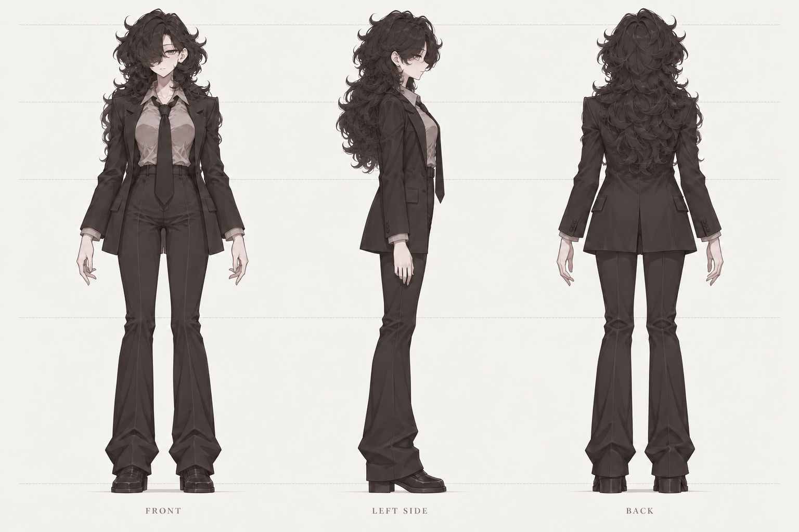

# v002 · 원화 기준 비앙카 삼면도

2026-09-15 · 별도 R&D용 생성 참고안 · 정면 / 왼쪽 측면 / 후면

사용자 첨부 원화를 기준으로 긴 웨이브 헤어, 한쪽 눈을 덮는 앞머리, 밝은 셔츠와 긴 넥타이, 열린 정장 자켓, 하이웨이스트 바지와 구두를 반영했다. 원화의 비대칭 선 자세는 방향별 비교가 쉬운 중립 자세로 바꾸었다. 옷을 입은 전신 삼면도이며, 옷 없는 기본 몸의 설계도는 아니다.

첫 생성에서 측면 얼굴이 사선으로 돌아가 있어 가운데 그림만 오른쪽을 향하는 측면으로 수정했다. 최종 결과를 직접 열어 세 방향, 전신과 신발 포함, 방향별 높이, 헤어·정장 표현을 확인했다. 실제 출력은 **1536 × 1024 PNG**다.

원화에 없는 측면 두께, 뒤쪽 헤어, 뒤판 봉제선·트임은 추정 디자인이다. 생성 이미지이므로 세 방향의 치수·주름·투영이 수학적으로 일치한다고 보장하지 않으며, 정확한 메시 제작 전 실루엣과 비율 정합이 필요하다. 기존 비앙카 모델 변경이나 이 디자인의 최종 채택은 하지 않았다.

생성 도구: 내장 ImageGen. 프롬프트 요약: “첨부 원화의 인상·헤어·정장을 보존하고 동일 비율의 정면·정확한 측면·후면을 중립 자세로 배치한 모델링 참고 시트.” 최종 지시는 가운데 인물만 정확한 측면으로 바꾸고 나머지 두 방향과 스타일을 유지하는 것이었다.

원본 입력과 전체 프롬프트는 작업 저장소의 이 버전 폴더에 보존한다. 공유 문서에는 생성된 삼면도와 이 설명만 게시한다.
