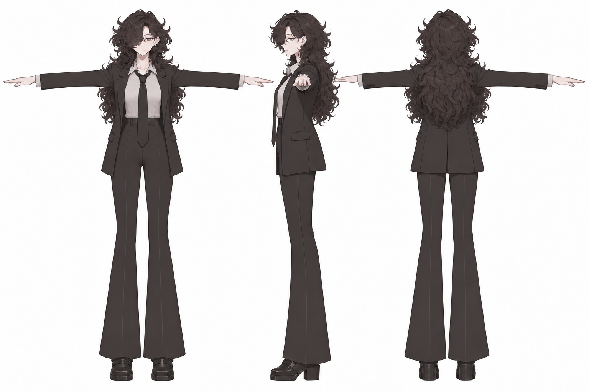
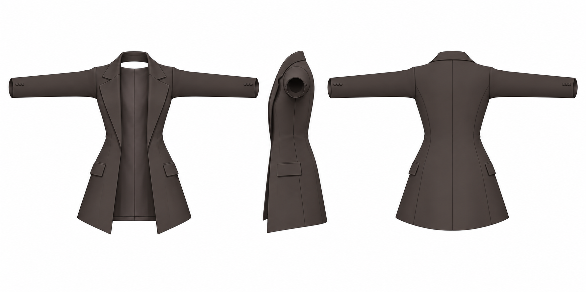
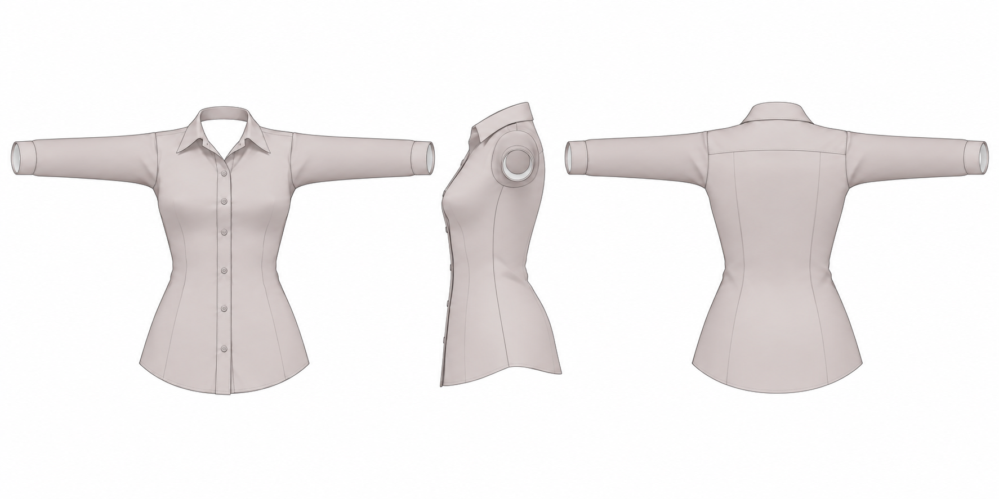
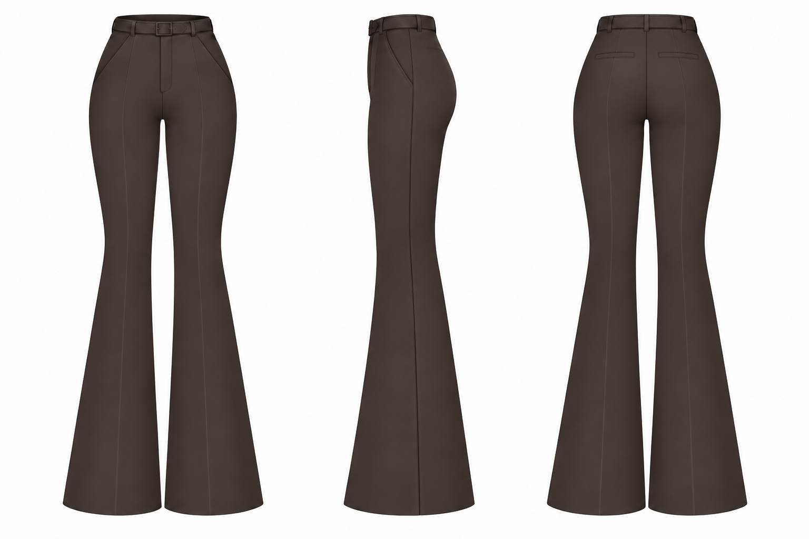

# v004 · 옷주름 없는 T 포즈 삼면도

2026-09-15 · 생성 이미지 비교안 · 기존 모델 수정 없음

**기본 주름이 있는 옷도 자연스러울 수 있다. 다만 v003처럼 허리·팔꿈치·무릎·밑단의 접힘을 강하게 고정하면, 실제로 팔다리를 폈을 때도 구겨진 인상이 남을 가능성이 있다.** 아래는 주름을 제거한 출발점의 외형을 비교하기 위한 그림이다. 자연스러움의 최종 판정은 실제 모델의 중립 자세와 굽힘을 함께 보고 해야 한다.

[삼면도 PNG 4장 ZIP](v004_THREE_VIEW_SHEETS.zip) · [이전 주름 있는 4방향](../v003_tripo_modular/README.md)

이번 요청의 삼면도는 **정면 / 왼쪽 측면 / 후면** 순서다. 몸과 상의는 T 포즈를 유지한다. 아래 이미지는 각각 세 방향을 한 장에 담은 검토용 시트이며, 기존 v003의 Tripo 방향별 PNG 입력 묶음을 교체하지 않는다.

## 전체 착장

원화의 얼굴·긴 곱슬머리·정장 조합을 참고해 옷을 입힌 비교안. 옷의 주름을 정리하고 머리카락 결은 유지하도록 생성했다. 의상 분리 제작을 대신하는 통합 메시가 아니다.

## 자켓

소매와 허리의 구김 명암을 제거했다. 카라·라펠·포켓·단추·봉제선·열린 앞판과 안쪽 뒤판은 디자인 요소로 유지한다.

## 셔츠

가슴에서 방사형으로 뻗는 주름과 허리의 조밀한 구김을 제거했다. 카라·단추 여밈·재단선과 넓은 입체 명암은 유지한다.

## 바지

무릎의 접힘·가랑이 압축 주름·발목에 쌓이는 천을 제거하고 매끈한 플레어 밑단으로 정리했다. 허리벨트·고리·포켓·여밈·봉제 디테일을 남겼다.

## 이전 주름 표현과 비교

아래는 v003의 실제 정면 입력이다. 위 삼면도와 비교하면 셔츠 허리의 조밀한 명암과 바지 무릎·밑단의 구김이 줄어든 점을 확인할 수 있다. 재생성 이미지라 정확한 같은 구도의 픽셀 전후 비교는 아니다.

| 이전 자켓 | 이전 셔츠 | 이전 바지 |
|---|---|---|
|  |  |  |

## 실제 모델에서 자연스러울까

| 표현 방식 | 판단할 점 |
|---|---|
| 메시 자체에 새긴 주름 | 실루엣과 실제 굴곡에 영향을 준다. 중립에서 깊은 압축 주름을 많이 넣으면 다른 포즈에서도 그 형태가 따라갈 수 있다. |
| 기본색에 그린 주름 명암 | 조명이나 포즈에 맞춰 새로 계산되는 그림자가 아니다. 강하게 그린 부분이 실제 음영과 겹쳐 얼룩처럼 보이는지 확인한다. |
| 노멀맵의 잔주름 | 표면 노멀을 바꿔 입체감을 표현한다. 미세 디테일에 쓸 수 있지만, 그것만으로 자세에 맞춰 주름이 새로 생기는 것은 아니다. |

노멀맵의 표면 노멀 변환은 [Blender 공식 문서](https://docs.blender.org/manual/en/3.0/render/shader_nodes/vector/normal_map.html)를 참고했다. 자세에 따른 주름의 변화는 [Real-Time Dynamic Wrinkling of Coarse Animated Cloth](https://www.cs.ubc.ca/labs/imager/tr/2015/CoarseClothWrinkle/gillette_2015_CoarseClothWrinkle.pdf)의 접근처럼 별도 처리할 수 있다. 이를 현재 비앙카에 구현했다는 뜻은 아니다.

**이번 작업에 대한 제안:** 매끈한 큰 형태를 먼저 맞추고, 실제 모델에서 천 두께·여유분·관절 굽힘을 확인한 뒤 필요한 주름만 얕게 추가하는 편이 조절하기 좋겠다. 완전히 무주름인 최종 옷은 단단한 재질처럼 보일 수도 있다. 이 제안은 그림을 보고 내린 작업 판단이며, Tripo가 각 주름을 기하/텍스처 중 어디에 반영할지는 실제 생성 전 확정할 수 없다.

## 생성·확인 범위

- 내장 ImageGen 사용. v003의 자켓·셔츠·바지 정면과 사용자 원화·기본 몸 T 포즈를 참조했다. 주름선·압축된 윤곽·잘게 갈라진 명암을 제거하되 의상 구조를 유지하는 프롬프트를 사용했다. 전체 프롬프트는 작업 저장소의 `prompts/`에 보존한다.
- 생성된 네 시트를 직접 확인했다. 초기 전체 착장에 남은 셔츠/밑단 구김을 추가 수정하고, 바지 삼면도에서 빠진 뒤 포켓을 보완했다.
- 픽셀 단위 편집이나 기존 3D 표면의 주름 삭제가 아니다. 생성 과정에서 실루엣·재단선·명암의 미세한 차이가 생기며, 보이지 않던 측면·뒷면 구조는 추정안이다. 같은 좌표계의 정밀 직교 렌더로 간주하지 않는다.
- Tripo 생성·Blender/Unity 수정·관절 검증은 이번에 실행하지 않았다. 기존 제작본과 v003 이미지는 보존했다. 별도 R&D 그림이며 기존 모델 작업 중단 상태를 변경하지 않는다.

실제 출력 크기: images/jacket.png 1774×887, images/shirt.png 1774×887, images/trousers.png 1536×1024, images/outfit.png 1536×1024. 최종 PNG 원본 바이트 복사와 ZIP 내부 파일 일치를 확인했다.
