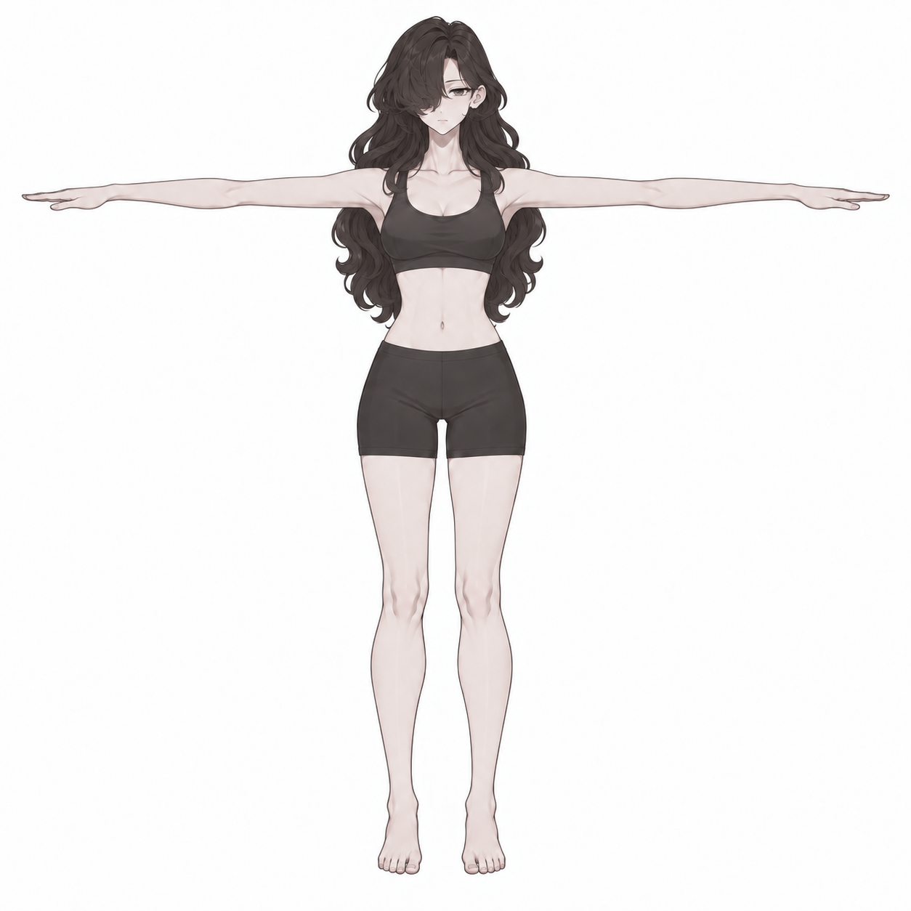
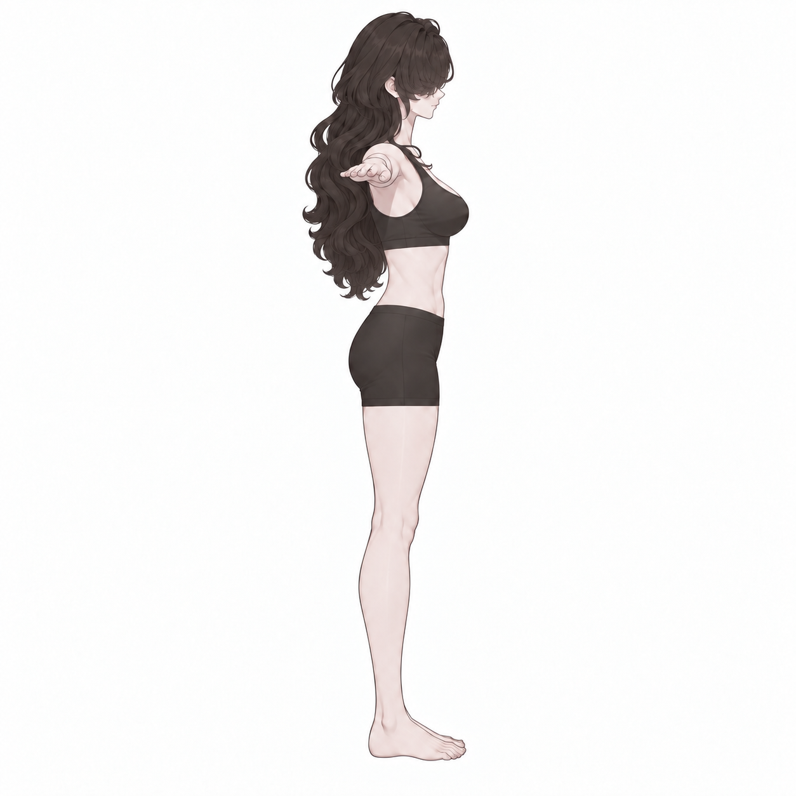
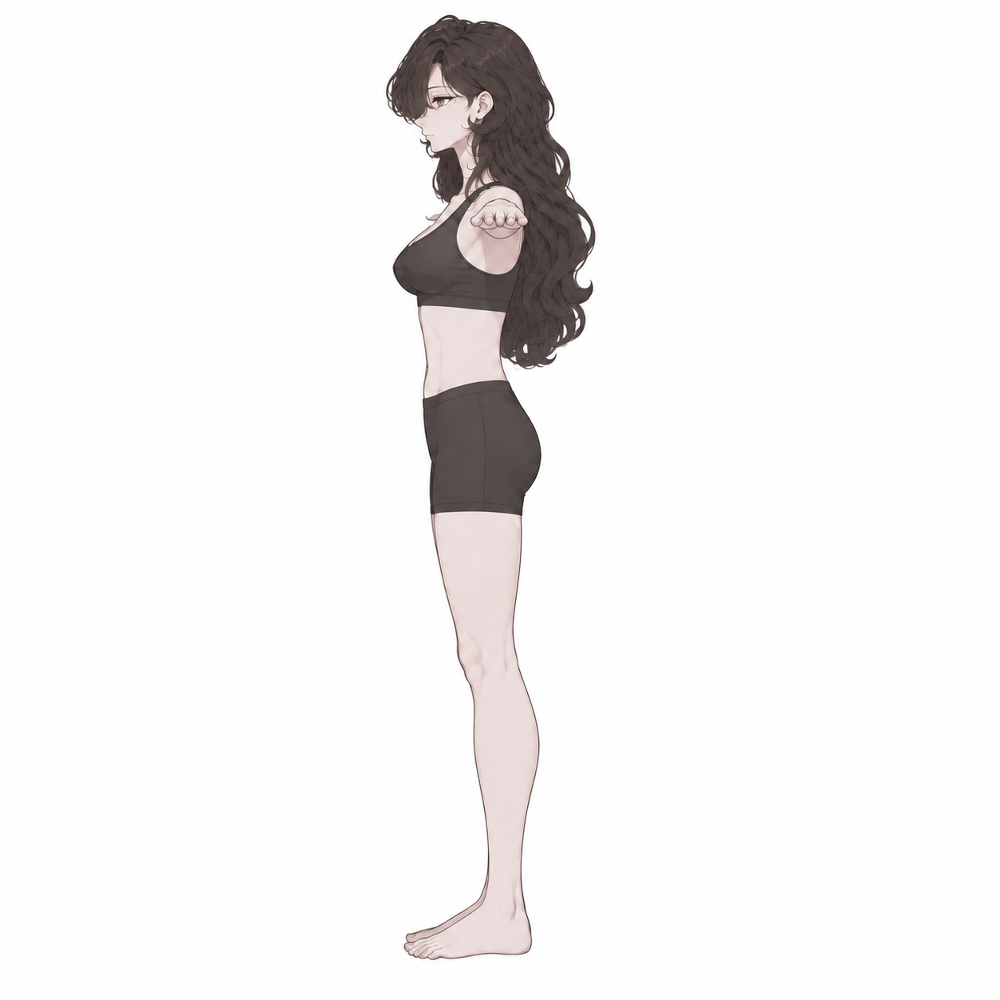
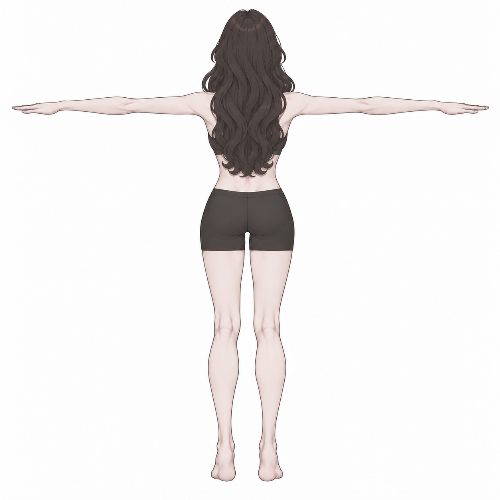
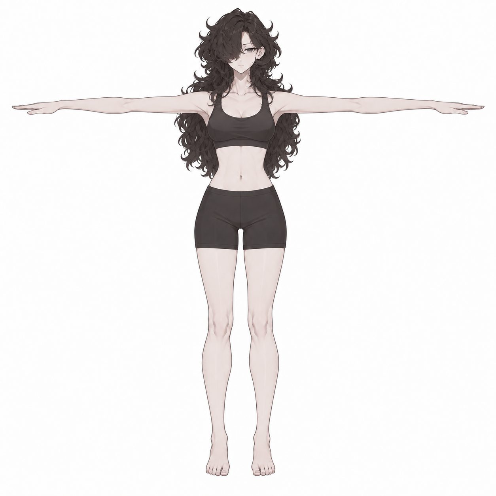
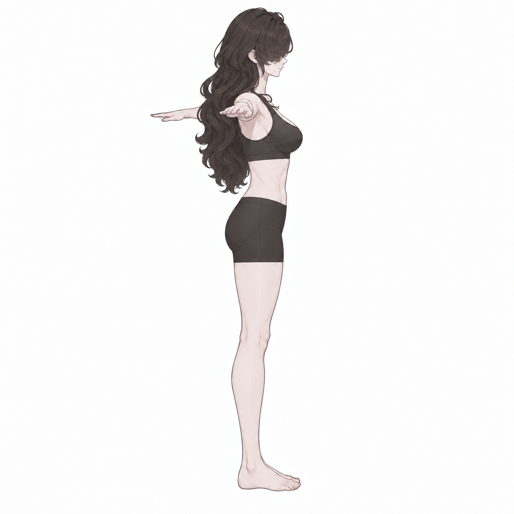
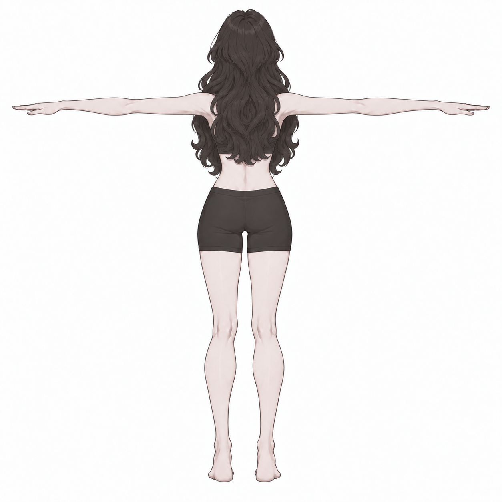

# v005 · 헤어를 정돈한 속옷형 T 포즈 4방향

2026-09-15 · 생성 이미지 비교안

속옷형 기본 몸의 정면·오른쪽·왼쪽·뒤를 개별 PNG로 만들었다. 기존의 불투명 스포츠 브라·피트 쇼츠·맨발과 T 포즈를 기준으로, 긴 웨이브 헤어의 난잡한 외곽과 잔머리를 정리했다.

**[4방향 PNG ZIP 다운로드](v005_FOUR_VIEW_INPUTS.zip)**

| 정면 | 오른쪽 | 왼쪽 | 뒤 |
|---|---|---|---|
|  |  |  |  |

각 이미지 링크에서 개별 PNG를 열 수 있다. ZIP에는 `front.png`, `right.png`, `left.png`, `back.png` 네 파일이 들어 있다. 오른쪽/왼쪽은 캐릭터 본인의 방향이다. 오른쪽 측면은 얼굴·발끝이 화면 오른쪽, 왼쪽 측면은 화면 왼쪽을 향한다. T 포즈의 측면은 팔이 카메라 쪽으로 뻗어 손이 어깨 높이에 짧게 겹쳐 보인다.

## 헤어 정리 전후

| 이전 v003 | 이번 v005 |
|---|---|
|  |  |

- 한쪽 눈을 덮는 비대칭 앞머리, 어두운 갈색, 긴 웨이브라는 인상을 유지하도록 작업했다.
- 정수리에서 튀어나오는 잔머리와 사방으로 뻗은 작은 갈고리 모양 컬을 줄였다.
- 잘게 흩어진 컬을 큰 S자 웨이브로 묶고, 아래로 흐르는 결과 둥글게 정돈한 끝부분을 만들었다.
- 머리를 자르거나 묶는 대신 외곽과 잔머리를 정리하는 방향이다. 최종 모양은 사용자 검토 전 비교안이다.

## 사용자 지적 후 오른쪽·후면 재검토

초기 오른쪽에는 반대편 팔·손이 등 뒤에서 화면 옆으로 뻗는 오류가 있었다. 해당 손을 제거했다. 후면은 앞쪽의 짧은 머리 덩어리와 옆 컬을 따로 붙인 듯한 형태가 남아, 첫 수정 결과를 제외하고 정면을 기준으로 다시 생성했다. 새 후면은 정수리부터 등으로 이어지는 흐름과 하나로 모인 끝선으로 정리했다.

| 뷰 | 초기 오류본 · 입력 제외 | 수정본 |
|---|---|---|
| 오른쪽 |  |  |
| 뒤 |  |  |

오른쪽의 불필요한 손 제거와 후면 재구성은 이미지에서 확인했다. 후면 재생성으로 몸 윤곽·팔/다리 음영에도 일부 차이가 생겼다. 네 이미지가 같은 3D 모델의 정확한 회전 결과라는 뜻은 아니며, 실제 Tripo 결과의 팔·헤어 정합은 아직 검증하지 않았다. ZIP에는 수정본만 포함한다.

## 제작·검증 범위

내장 ImageGen으로 v003 정면을 먼저 수정해 새 헤어 기준을 만들고, 그 정면과 기존 방향별 몸 이미지를 참조하여 나머지 세 방향을 생성했다. 네 방향을 직접 확인했다. 생성 프롬프트 전체는 작업 저장소의 `prompts/`에 보존한다.

프롬프트 요약: “성인 캐릭터의 얼굴·몸·속옷·T 포즈와 긴 웨이브 인상을 유지하고, 뻗친 잔머리와 작은 무작위 컬을 줄여 큰 흐름과 정돈한 외곽으로 만든다. 같은 헤어를 정면·오른쪽·왼쪽·뒤에 일관되게 적용하며 흰 배경의 개별 전신 이미지를 출력한다.”

이미지 재생성이므로 얼굴·몸·속옷·머리 길이의 픽셀 단위 동일성이나 네 방향의 정밀 기하 정합을 보장하지 않는다. 양측면과 뒤 헤어 구조는 생성 추정안이다. 몸에는 속옷과 헤어가 포함되므로 이것만으로 피부·의상·머리가 분리된 3D 메시가 만들어졌다는 뜻은 아니다. 실제 Tripo 생성·모델 피팅·Blender/Unity 편집은 실행하지 않았고, 기존 v003/v004와 제작 모델은 보존했다.

출력: 개별 PNG 4장, 각 1254×1254. 원본 생성 파일의 바이트 복사 및 ZIP 내용 일치를 확인했다.
